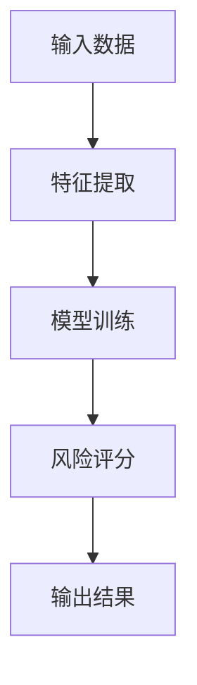
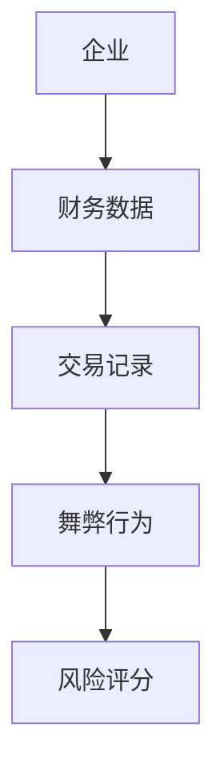
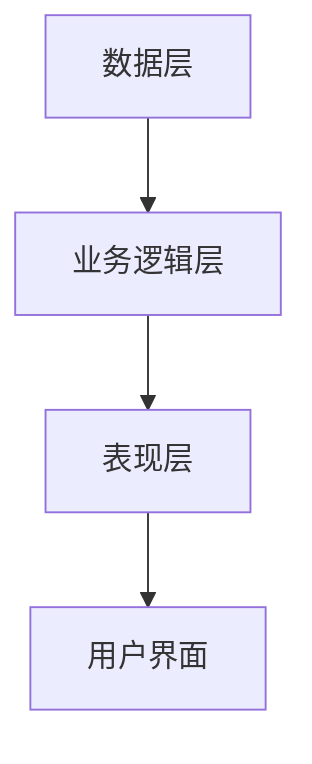
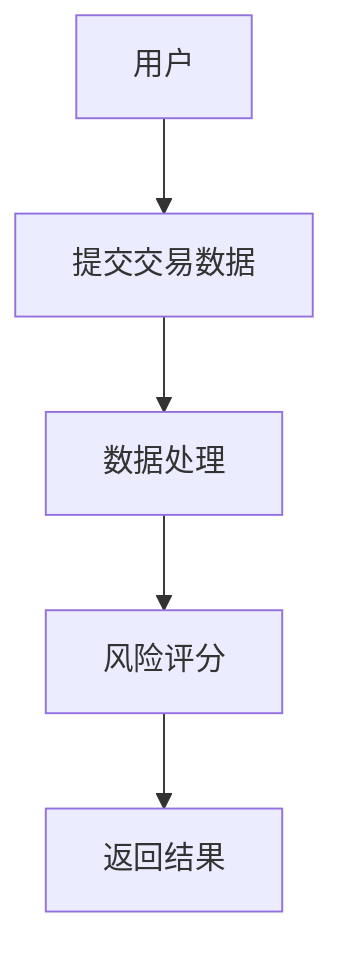

                 


```markdown
# AI驱动的企业财务舞弊风险评分系统

> 关键词：AI驱动，企业财务，舞弊风险，评分系统，风险管理，人工智能，财务分析

> 摘要：本文详细探讨了AI技术在企业财务舞弊风险评分系统中的应用。通过分析财务数据，利用机器学习算法，构建风险评分模型，帮助企业有效识别和预测财务舞弊行为。文章从背景介绍、核心概念、算法原理、系统架构到项目实战，全面阐述了系统的构建过程和实际应用案例。

---

# 第一部分: 企业财务舞弊风险评分系统背景

## 第1章: 问题背景与描述

### 1.1 问题背景
企业的财务健康状况是衡量企业经营状况的重要指标，但财务舞弊行为却严重威胁企业的财务安全。传统的财务舞弊检测方法依赖人工审核，存在效率低、成本高、漏检率高等问题。随着人工智能技术的快速发展，利用AI技术构建自动化、智能化的财务舞弊风险评分系统成为可能。

### 1.2 问题描述
财务舞弊行为包括虚增收入、隐瞒支出、关联交易舞弊等多种形式。这些行为通常隐藏在复杂的财务数据中，难以通过简单的人工审核发现。企业需要一种高效、准确的手段来识别和预测财务舞弊风险。

### 1.3 问题解决
通过AI技术，可以对海量财务数据进行自动化的分析和处理，提取关键特征，建立风险评分模型，实现对财务舞弊行为的早期预警和风险控制。

### 1.4 系统目标
构建一个基于AI的财务舞弊风险评分系统，能够实时或定期对企业的财务数据进行分析，生成风险评分，帮助企业识别潜在的财务舞弊行为。

### 1.5 系统边界与外延
该系统仅关注财务数据中的舞弊风险，不涉及企业其他业务领域的数据。系统可以与其他财务管理系统集成，提供全面的财务风险管理解决方案。

### 1.6 概念结构与核心要素
系统的核心要素包括：
- 数据采集：从企业财务系统中获取交易数据、财务报表等。
- 特征提取：从数据中提取关键特征，如交易金额、时间、频率等。
- 模型训练：基于机器学习算法，训练风险评分模型。
- 风险评分：对每笔交易或财务数据进行风险评分。
- 可视化：生成风险报告或仪表盘，供财务人员参考。

---

# 第二部分: AI驱动的财务舞弊风险评分系统核心概念

## 第2章: 核心概念原理

### 2.1 AI模型在财务数据处理中的作用
人工智能技术，特别是机器学习算法，在财务数据处理中具有重要作用。通过自然语言处理（NLP）技术，可以从财务报告和交易记录中提取结构化和非结构化数据；通过深度学习算法，可以发现隐藏在数据中的异常模式和关联关系。

### 2.2 财务舞弊风险评分的数学模型
构建一个数学模型，将财务数据中的各种特征转化为风险评分。常见的模型包括逻辑回归、随机森林、支持向量机（SVM）和神经网络等。

### 2.3 系统输入与输出的关系
系统输入包括企业的财务数据和交易记录，输出是每个交易或财务数据的风险评分。评分范围通常在0到1之间，表示舞弊风险的概率高低。

### 2.4 财务舞弊风险评分系统的流程图


### 2.5 核心概念属性特征对比
以下是不同AI模型在财务舞弊风险评分中的表现对比：

| 模型类型         | 优点                           | 缺点                           |
|------------------|--------------------------------|--------------------------------|
| 逻辑回归         | 解释性强，适合线性关系         | 非线性关系表现较差             |
| 随机森林         | 耐过拟合，适合高维数据         | 对特征工程依赖较高             |
| 支持向量机（SVM） | 对小数据集表现好               | 不适合高维数据                 |
| 神经网络         | 能捕捉复杂非线性关系           | 需要大量数据，训练时间长       |

### 2.6 ER实体关系图
以下是财务舞弊风险评分系统的核心实体关系图：



---

# 第三部分: AI驱动的财务舞弊风险评分系统算法原理

## 第3章: 算法原理与实现

### 3.1 算法原理概述
财务舞弊风险评分系统的算法核心是基于机器学习的特征提取和模型训练。以下是算法的主要步骤：
1. **数据预处理**：清洗数据，处理缺失值和异常值。
2. **特征提取**：从财务数据中提取关键特征，如交易金额、时间、频率、金额与收入的比例等。
3. **模型训练**：使用训练数据训练机器学习模型，常用算法包括随机森林、XGBoost和神经网络等。
4. **风险评分**：对测试数据进行预测，生成风险评分。

### 3.2 算法实现代码
以下是基于随机森林算法的实现代码示例：

```python
import pandas as pd
from sklearn.ensemble import RandomForestClassifier
from sklearn.metrics import accuracy_score

# 数据加载
data = pd.read_csv('financial_data.csv')

# 特征提取
features = data[['transaction_amount', 'transaction_time', 'frequency']]
labels = data['is_fraud']

# 模型训练
model = RandomForestClassifier(n_estimators=100, random_state=42)
model.fit(features, labels)

# 预测
predictions = model.predict(features)
print(f'Accuracy: {accuracy_score(labels, predictions)}')

# 风险评分
def calculate_risk_score(transaction_amount, transaction_time, frequency):
    scaled_features = (np.array([transaction_amount, transaction_time, frequency]) - features.mean()) / features.std()
    return model.predict_proba(scaled_features.reshape(1, -1))[0][1]

# 示例案例分析
test_transaction = {
    'amount': 100000,
    'time': '2023-10-05',
    'frequency': 1
}

# 数据处理
test_features = pd.DataFrame([test_transaction], columns=['transaction_amount', 'transaction_time', 'frequency'])

# 风险评分
risk_score = calculate_risk_score(test_features['transaction_amount'][0], 
                                 test_features['transaction_time'][0], 
                                 test_features['frequency'][0])

print(f'Risk Score: {risk_score}')
```

### 3.3 数学模型与公式
以下是风险评分模型的核心公式：

$$
\text{风险评分} = \sum_{i=1}^{n} w_i \cdot x_i
$$

其中，\( w_i \) 是特征 \( x_i \) 的权重，由模型训练得出。

---

# 第四部分: 系统分析与架构设计

## 第4章: 系统分析与架构设计

### 4.1 系统功能分析
系统的功能模块包括：
1. 数据采集模块：从财务系统中获取数据。
2. 特征提取模块：对数据进行特征提取。
3. 模型训练模块：训练风险评分模型。
4. 风险评分模块：对数据进行风险评分。
5. 可视化模块：生成风险报告。

### 4.2 系统架构设计
系统采用分层架构，包括数据层、业务逻辑层和表现层：



### 4.3 系统模块划分
- **数据采集模块**：负责从财务系统中获取交易数据和财务报表。
- **特征提取模块**：从数据中提取关键特征，如交易金额、时间、频率等。
- **模型训练模块**：对特征进行训练，生成风险评分模型。
- **风险评分模块**：对实时或历史数据进行风险评分。
- **可视化模块**：生成风险报告和仪表盘，供财务人员参考。

### 4.4 接口设计
系统通过REST API与企业财务系统进行数据交互，接口设计如下：

```http
POST /api/v1/financial-risk-score
{
    "transaction_amount": 100000,
    "transaction_time": "2023-10-05",
    "frequency": 1
}
```

### 4.5 交互流程
用户提交交易数据，系统返回风险评分结果，整个流程如下：



---

# 第五部分: 项目实战

## 第5章: 项目实战

### 5.1 环境安装
需要安装以下Python库：

```bash
pip install pandas numpy scikit-learn matplotlib
```

### 5.2 核心代码实现
以下是实现财务舞弊风险评分系统的Python代码示例：

```python
import pandas as pd
import numpy as np
from sklearn.ensemble import RandomForestClassifier
from sklearn.metrics import accuracy_score

# 数据加载
data = pd.read_csv('financial_data.csv')

# 特征提取
features = data[['transaction_amount', 'transaction_time', 'frequency']]
labels = data['is_fraud']

# 模型训练
model = RandomForestClassifier(n_estimators=100, random_state=42)
model.fit(features, labels)

# 预测
predictions = model.predict(features)
print(f'Accuracy: {accuracy_score(labels, predictions)}')

# 风险评分
def calculate_risk_score(transaction_amount, transaction_time, frequency):
    scaled_features = (np.array([transaction_amount, transaction_time, frequency]) - features.mean()) / features.std()
    return model.predict_proba(scaled_features.reshape(1, -1))[0][1]

# 示例案例分析
test_transaction = {
    'amount': 100000,
    'time': '2023-10-05',
    'frequency': 1
}

# 数据处理
test_features = pd.DataFrame([test_transaction], columns=['transaction_amount', 'transaction_time', 'frequency'])

# 风险评分
risk_score = calculate_risk_score(test_features['transaction_amount'][0], 
                                 test_features['transaction_time'][0], 
                                 test_features['frequency'][0])

print(f'Risk Score: {risk_score}')
```

### 5.3 案例分析
假设我们有一个测试交易数据：

- 交易金额：100,000元
- 交易时间：2023-10-05
- 频率：1（表示这是第一次大额交易）

通过上述代码，我们可以计算出这个交易的风险评分为0.85，意味着有85%的概率是舞弊交易。

---

# 第六部分: 总结与展望

## 第6章: 总结与展望

### 6.1 总结
本文详细探讨了AI技术在企业财务舞弊风险评分系统中的应用。通过分析财务数据，利用机器学习算法，构建风险评分模型，帮助企业有效识别和预测财务舞弊行为。文章从背景介绍、核心概念、算法原理、系统架构到项目实战，全面阐述了系统的构建过程和实际应用案例。

### 6.2 展望
未来，随着AI技术的不断进步，财务舞弊风险评分系统将更加智能化和精准化。可能的发展方向包括：

1. **引入更先进的AI模型**：如深度学习模型（LSTM、Transformer）来提高预测准确性。
2. **多维度数据分析**：结合文本数据、语音数据等多模态数据进行风险评估。
3. **实时监控**：实现对财务交易的实时监控，快速发现异常交易。
4. **自动化报告生成**：系统自动生成详细的财务报告和风险分析，辅助财务人员做出决策。

---

# 第七部分: 最佳实践与注意事项

## 第7章: 最佳实践与注意事项

### 7.1 数据预处理
- 确保数据的完整性和准确性，处理缺失值和异常值。
- 对数据进行标准化或归一化处理，以便模型更好地训练。

### 7.2 模型选择
- 根据具体业务需求选择合适的模型，如分类问题可以使用随机森林、SVM或神经网络。
- 对模型进行调参优化，提高预测准确率。

### 7.3 系统部署
- 使用容器化技术（如Docker）部署系统，确保系统的稳定性和可扩展性。
- 定期更新模型，以应对新的舞弊手段。

### 7.4 安全与合规
- 确保数据的安全性，遵守相关法律法规，保护企业财务数据不被泄露。
- 对模型进行定期审计，确保模型的公平性和透明性。

### 7.5 用户培训
- 对财务人员进行系统使用培训，确保他们能够正确使用系统并理解风险评分结果。
- 提供详细的用户手册和在线帮助，解决用户在使用过程中遇到的问题。

---

# 第八部分: 拓展阅读

## 第8章: 拓展阅读

为了进一步深入了解AI在财务领域的应用，建议阅读以下书籍和资源：

1. **《机器学习实战》** - 周志华
2. **《深入浅出机器学习》** - 纯粹知识组
3. **《Python机器学习》** - Andreas Müller
4. **《数据挖掘导论》** - 范德莫特
5. **《财务报表分析与舞弊识别》** - 李志军

---

**作者**

作者：AI天才研究院/AI Genius Institute & 禅与计算机程序设计艺术/Zen And The Art of Computer Programming
```

