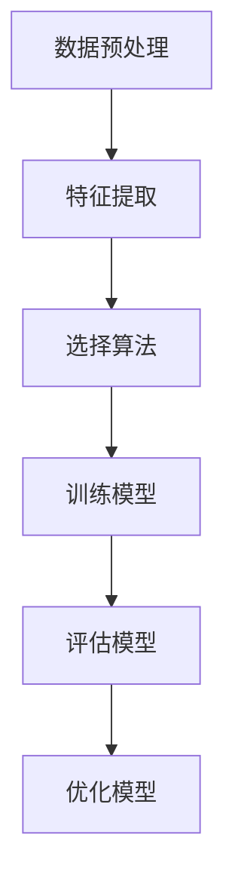
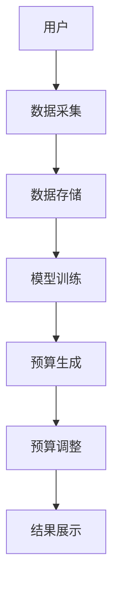
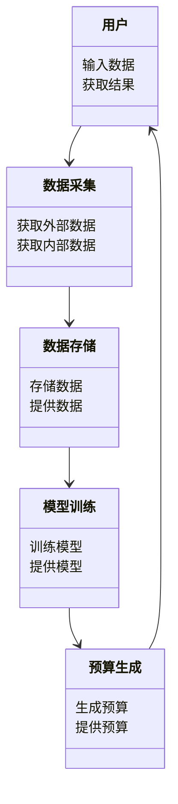

                 


# AI驱动的企业财务预算编制与调整系统

> 关键词：AI, 财务预算, 机器学习, 系统架构, 数学模型

> 摘要：本文深入探讨了AI技术在企业财务预算编制与调整系统中的应用，从核心概念、算法原理、系统架构到项目实战，全面解析了如何利用AI技术提升财务预算的准确性和效率。通过详细的数学模型、系统设计和实际案例分析，本文为读者提供了从理论到实践的完整指南。

---

# 第一部分: AI驱动的企业财务预算编制与调整系统概述

## 第1章: AI驱动的财务预算编制与调整的背景与意义

### 1.1 传统财务预算编制的挑战

#### 1.1.1 传统预算编制的复杂性
- 传统财务预算编制依赖人工分析，涉及大量历史数据和复杂假设。
- 数据量大，难以快速响应市场变化。
- 预算调整过程繁琐，容易受到主观因素影响。

#### 1.1.2 传统预算调整的局限性
- 预算调整依赖人工判断，效率低下。
- 面对复杂市场变化，调整不够及时。
- 数据分析缺乏深度，难以捕捉潜在趋势。

#### 1.1.3 传统预算管理的痛点
- 缺乏实时数据支持，预算执行监控困难。
- 数据孤岛问题严重，难以实现跨部门协作。
- 缺乏智能化工具，难以提高预算编制的准确性和效率。

### 1.2 AI技术在财务预算中的应用前景

#### 1.2.1 AI技术的基本概念
- 人工智能（AI）：模拟人类智能的计算机系统，包括学习、推理和自适应能力。
- 机器学习：通过数据训练模型，实现对数据的预测和分类。
- 深度学习：基于人工神经网络的机器学习方法，能够处理复杂数据。

#### 1.2.2 AI在财务领域的应用现状
- 财务预测：利用AI进行收入预测、成本分析。
- 财务自动化：AI驱动的自动化记账、报账系统。
- 风险管理：通过AI进行财务风险评估和预警。

#### 1.2.3 AI驱动财务预算的潜力与优势
- 提高预算编制的准确性和效率。
- 实现动态调整，快速响应市场变化。
- 提供数据驱动的决策支持，降低人为误差。

---

## 第2章: 企业财务预算编制与调整的核心概念

### 2.1 财务预算的核心要素

#### 2.1.1 收入预测
- 基于历史销售数据和市场趋势，预测未来收入。
- 使用时间序列分析和回归模型进行预测。

#### 2.1.2 成本控制
- 分析历史成本数据，预测未来成本。
- 通过成本分解模型优化成本结构。

#### 2.1.3 资金分配
- 根据预算目标分配资金，确保资源合理利用。
- 使用线性规划模型进行资源优化。

#### 2.1.4 风险评估
- 通过AI模型识别潜在风险因素。
- 使用蒙特卡洛模拟评估风险影响。

### 2.2 AI驱动的财务预算模型

#### 2.2.1 数据驱动的预算预测
- 基于历史数据和外部数据，构建预测模型。
- 使用机器学习算法（如随机森林、神经网络）进行预测。

#### 2.2.2 自动化调整机制
- 通过实时数据反馈，自动调整预算。
- 使用强化学习算法优化调整策略。

#### 2.2.3 智能化预算优化
- 基于AI的预算优化模型，提供最优预算方案。
- 使用遗传算法进行预算调整。

### 2.3 核心概念与联系

#### 2.3.1 核心概念原理
- 数据预处理：清洗、特征提取。
- 模型训练：选择算法、训练模型。
- 预测与调整：基于模型结果进行预算调整。

#### 2.3.2 核心概念属性对比表格

| 核心概念 | 描述 | 输入 | 输出 |
|----------|------|------|------|
| 收入预测 | 预测未来收入 | 历史销售数据、市场趋势 | 收入预测值 |
| 成本控制 | 优化成本结构 | 历史成本数据 | 成本优化方案 |
| 资金分配 | 分配资金资源 | 预算目标 | 资金分配计划 |
| 风险评估 | 识别潜在风险 | 历史数据、市场数据 | 风险评估报告 |

#### 2.3.3 ER实体关系图（Mermaid）

```mermaid
erDiagram
    actor 用户
    actor 系统
    actor 数据源
    system 数据库
    system 模型训练
    system 预测结果
    用户 --> 数据源: 提供数据
    数据源 --> 数据库: 数据存储
    数据库 --> 模型训练: 训练模型
    模型训练 --> 预测结果: 生成预测
    系统 --> 用户: 提供结果
```

---

# 第二部分: AI驱动的财务预算编制与调整算法原理

## 第3章: 机器学习算法在财务预算中的应用

### 3.1 常见机器学习算法概述

#### 3.1.1 线性回归
- 简单线性回归：用于预测单一变量。
- 多元线性回归：用于多个变量的预测。

#### 3.1.2 随机森林
- 集成学习算法，通过构建多个决策树进行投票。
- 适用于分类和回归问题。

#### 3.1.3 神经网络
- 多层感知机（MLP）：用于复杂非线性关系的预测。
- 长短期记忆网络（LSTM）：用于时间序列预测。

### 3.2 算法原理与流程

#### 3.2.1 数据预处理
- 数据清洗：处理缺失值、异常值。
- 特征提取：选择相关特征，进行特征工程。

#### 3.2.2 模型训练
- 训练数据集：用于模型训练。
- 测试数据集：用于模型验证。

#### 3.2.3 模型评估
- 使用均方误差（MSE）、R²系数等指标评估模型性能。
- 交叉验证：防止过拟合。

#### 3.2.4 模型优化
- 调参：调整模型参数，优化性能。
- 集成学习：通过集成多个模型提高准确性。

### 3.3 算法流程图（Mermaid）



### 3.4 算法实现的Python代码示例

```python
import pandas as pd
from sklearn.ensemble import RandomForestRegressor
from sklearn.metrics import mean_squared_error

# 数据加载
data = pd.read_csv('budget_data.csv')

# 特征工程
features = data[['revenue', 'cost', 'market_trend']]
target = data['budget_prediction']

# 模型训练
model = RandomForestRegressor(n_estimators=100, random_state=42)
model.fit(features, target)

# 模型预测
predicted = model.predict(features)
print(mean_squared_error(target, predicted))
```

---

## 第4章: 数学模型与公式

### 4.1 回归模型

#### 4.1.1 简单线性回归
$$ y = \beta_0 + \beta_1 x + \epsilon $$

#### 4.1.2 多元线性回归
$$ y = \beta_0 + \beta_1 x_1 + \beta_2 x_2 + \dots + \beta_n x_n + \epsilon $$

### 4.2 分类模型

#### 4.2.1 逻辑回归
$$ P(y=1|x) = \frac{e^{\beta_0 + \beta_1 x}}{1 + e^{\beta_0 + \beta_1 x}} $$

### 4.3 神经网络模型

#### 4.3.1 多层感知机（MLP）
$$ a^{(l)} = \sigma(w^{(l)} a^{(l-1)} + b^{(l)}) $$

#### 4.3.2 长短期记忆网络（LSTM）
$$ c_t = \text{cell}(c_{t-1}, h_{t-1}) $$
$$ f_t = \text{forget gate}(c_{t-1}, h_{t-1}) $$
$$ i_t = \text{input gate}(c_{t-1}, h_{t-1}) $$
$$ o_t = \text{output gate}(c_t, h_{t-1}) $$
$$ h_t = o_t \cdot \text{tanh}(c_t) $$

---

## 第5章: 系统分析与架构设计方案

### 5.1 系统功能设计

#### 5.1.1 预算编制模块
- 数据输入：用户输入历史数据和目标。
- 模型训练：基于输入数据训练预测模型。
- 预算生成：输出预测预算方案。

#### 5.1.2 预算调整模块
- 实时数据获取：获取实际数据。
- 模型调整：根据实际数据调整预算。
- 调整结果输出：输出调整后的预算方案。

### 5.2 系统架构设计

#### 5.2.1 总体架构图（Mermaid）



#### 5.2.2 详细架构图（Mermaid）



---

## 第6章: 项目实战

### 6.1 环境安装

#### 6.1.1 安装Python
```bash
python --version
pip install --upgrade pip
```

#### 6.1.2 安装依赖
```bash
pip install pandas scikit-learn matplotlib
```

### 6.2 核心代码实现

#### 6.2.1 数据预处理
```python
import pandas as pd

data = pd.read_csv('budget.csv')
data = data.dropna()
```

#### 6.2.2 模型训练
```python
from sklearn.ensemble import RandomForestRegressor

model = RandomForestRegressor(n_estimators=100)
model.fit(X_train, y_train)
```

#### 6.2.3 模型评估
```python
from sklearn.metrics import mean_absolute_error

y_pred = model.predict(X_test)
print(mean_absolute_error(y_test, y_pred))
```

### 6.3 实际案例分析

#### 6.3.1 案例背景
- 某企业过去三年的销售数据和成本数据。

#### 6.3.2 数据分析
- 使用线性回归模型预测未来三年的收入。
- 使用随机森林模型优化成本控制。

#### 6.3.3 模型优化
- 调整模型参数，提高预测准确性。
- 使用交叉验证评估模型性能。

---

## 第7章: 最佳实践与小结

### 7.1 小结

- AI技术能够显著提高财务预算的准确性和效率。
- 通过机器学习算法和数学模型，企业可以实现更智能的预算管理。
- 系统架构设计和项目实战是实现AI驱动财务预算的关键步骤。

### 7.2 注意事项

- 数据质量是模型性能的基础，需重视数据清洗和特征工程。
- 模型调优需要结合业务场景，避免过度优化。
- 系统部署需考虑性能和安全性，确保数据隐私。

### 7.3 拓展阅读

- 《机器学习实战》
- 《深度学习入门》
- 《财务预算管理》

---

# 作者：AI天才研究院/AI Genius Institute & 禅与计算机程序设计艺术 /Zen And The Art of Computer Programming

---

这篇文章详细介绍了AI驱动的企业财务预算编制与调整系统的各个方面，从背景介绍到系统设计，再到项目实战，为读者提供了全面的指导。通过理论与实践相结合，帮助读者理解如何利用AI技术优化财务预算管理。

