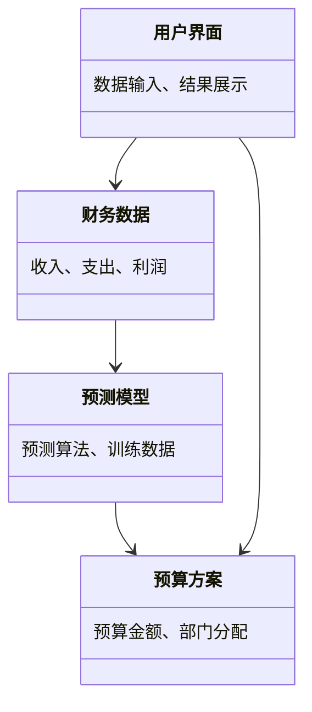
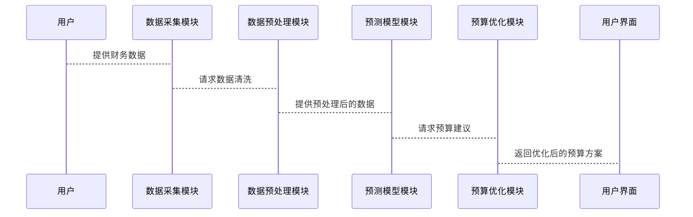

                 


# AI驱动的企业财务预算编制智能辅助系统

> 关键词：AI技术、财务预算、智能辅助系统、机器学习、自然语言处理

> 摘要：本文探讨了如何利用人工智能技术构建企业财务预算编制的智能辅助系统，分析了传统财务预算编制的痛点，提出了基于机器学习和自然语言处理的解决方案，并详细介绍了系统架构、算法原理和项目实现过程。

---

## 第一部分: AI驱动的企业财务预算编制智能辅助系统概述

### 第1章: 问题背景与需求分析

#### 1.1 问题背景
##### 1.1.1 传统企业财务预算编制的痛点
企业财务预算编制是一项复杂且耗时的任务，通常涉及大量的历史数据、市场预测、部门协作和人工判断。传统方法依赖于财务人员手动整理数据、分析趋势并制定预算，这种方式不仅效率低下，而且容易受到主观因素和人为错误的影响。

##### 1.1.2 AI技术在财务管理中的应用潜力
随着人工智能技术的发展，尤其是机器学习和自然语言处理技术的进步，AI能够帮助企业更高效地处理财务数据、预测市场趋势，并自动生成预算建议。AI技术可以显著提高财务预算的准确性和效率，同时减少人为错误。

##### 1.1.3 企业财务预算编制的数字化转型趋势
数字化转型已成为企业提升竞争力的重要手段。通过引入AI技术，企业能够实现财务预算编制的自动化和智能化，从而更快地响应市场变化，优化资源配置。

#### 1.2 问题描述
##### 1.2.1 财务预算编制的核心流程
财务预算编制通常包括数据收集、数据分析、预测建模、预算制定和预算调整五个核心流程。每个环节都需要大量的数据处理和复杂的决策。

##### 1.2.2 传统方法的局限性
传统方法依赖人工操作，数据处理效率低，容易出错，且难以快速响应变化。此外，预算预测的准确性也受到限制，难以满足企业对精准预算的需求。

##### 1.2.3 数据驱动的财务管理需求
随着企业数据的积累，利用数据驱动的方法进行财务预算编制成为必然趋势。通过分析历史数据和市场信息，企业可以更科学地制定预算。

#### 1.3 问题解决思路
##### 1.3.1 AI技术如何辅助财务预算编制
AI技术可以通过数据挖掘、预测分析和自动化处理，帮助财务人员更高效地完成预算编制工作。例如，AI可以自动生成财务报表、预测销售趋势并优化预算分配。

##### 1.3.2 数据挖掘与预测在预算中的应用
数据挖掘可以帮助企业发现隐藏的数据模式，预测未来财务状况。AI算法可以基于历史数据和市场信息，生成更准确的预算预测。

##### 1.3.3 智能化系统的优势与价值
智能化系统可以显著提高财务预算的效率和准确性，减少人为错误，同时能够快速响应市场变化，为企业提供更精准的预算支持。

#### 1.4 系统边界与外延
##### 1.4.1 系统的功能边界
AI驱动的财务预算编制智能辅助系统主要功能包括数据收集、数据分析、预算预测和预算优化。

##### 1.4.2 与企业其他系统的接口关系
系统需要与企业的ERP系统、财务系统和数据分析平台进行接口对接，确保数据的实时更新和共享。

##### 1.4.3 系统的可扩展性与灵活性
系统设计应具备灵活性和可扩展性，能够根据企业需求快速调整功能模块，并支持未来的技术升级。

##### 1.4.4 系统架构与功能模块
系统架构包括数据层、算法层和应用层。功能模块包括数据采集、数据分析、预测模型和预算优化。

---

## 第二部分: 核心概念与技术原理

### 第2章: 核心概念与联系

#### 2.1 系统架构分析
##### 2.1.1 数据流与业务流程
数据流包括数据采集、数据预处理、模型训练和结果输出。业务流程包括预算需求收集、数据分析、预测建模和预算制定。

##### 2.1.2 实体关系图（ER图）
```mermaid
er
    entity 财务数据 {
        key: 数据ID
        attribute: 收入、支出、利润
    }
    entity 预测模型 {
        key: 模型ID
        attribute: 模型类型、训练数据
    }
    entity 预算方案 {
        key: 方案ID
        attribute: 预算金额、部门分配
    }
    relationship 预测模型 <--( 财务数据 )
    relationship 预测模型 -->( 预算方案 )
```

##### 2.1.3 系统功能模块划分
系统功能模块包括数据采集模块、数据分析模块、预测模型模块和预算优化模块。

#### 2.2 算法原理
##### 2.2.1 机器学习算法
- 线性回归模型
  $$ y = \beta_0 + \beta_1x + \epsilon $$
- 随机森林模型
  $$ y = \sum_{i=1}^{n} (a_i x_i + b_i) $$

##### 2.2.2 自然语言处理技术
- 文本抽取与关键词提取
- 情感分析与市场趋势预测

##### 2.2.3 强化学习与优化算法
- Q-learning算法
  ```python
  def q_learning(state):
      action = np.argmax(q_table[state])
      return action
  ```

#### 2.3 数据处理与特征工程
##### 2.3.1 数据清洗与预处理
- 删除重复数据
- 填补缺失值
- 标准化数据

##### 2.3.2 特征提取与选择
- 主成分分析（PCA）
- 线性回归模型中的特征重要性分析

##### 2.3.3 数据增强与标注
- 数据增强技术
- 数据标注与分类

#### 2.4 AI模型构建与训练
##### 2.4.1 模型选择与优化
- 模型选择：线性回归、随机森林、神经网络
- 超参数优化：网格搜索、随机搜索

##### 2.4.2 训练策略与评估指标
- 交叉验证
- 准确率、召回率、F1分数

##### 2.4.3 模型调优与部署
- 模型调优：调整学习率、增加训练数据
- 模型部署：API接口、微服务架构

---

## 第三部分: 算法原理与数学模型

### 第3章: 算法原理与流程图

#### 3.1 机器学习算法
##### 3.1.1 线性回归模型
$$ y = \beta_0 + \beta_1x + \epsilon $$

##### 3.1.2 随机森林模型
$$ y = \sum_{i=1}^{n} (a_i x_i + b_i) $$

##### 3.1.3 算法流程图


#### 3.2 自然语言处理算法
##### 3.2.1 文本抽取与关键词提取
- 使用TF-IDF提取关键词
$$ TF-IDF = \frac{1}{1 + \log(\text{term frequency})} $$

##### 3.2.2 情感分析与市场趋势预测
- 使用词袋模型或词嵌入模型（如Word2Vec）

#### 3.3 强化学习与优化算法
##### 3.3.1 Q-learning算法
```python
def q_learning(state):
    action = np.argmax(q_table[state])
    return action
```

##### 3.3.2 算法流程图


---

## 第四部分: 系统分析与架构设计

### 第4章: 系统分析与架构设计方案

#### 4.1 问题场景介绍
##### 4.1.1 系统目标
构建一个基于AI的财务预算编制智能辅助系统，帮助财务人员高效完成预算编制工作。

##### 4.1.2 项目介绍
本项目旨在利用机器学习和自然语言处理技术，开发一个智能化的财务预算辅助系统，实现数据自动采集、智能预测和预算优化。

#### 4.2 系统功能设计
##### 4.2.1 领域模型


#### 4.3 系统架构设计
##### 4.3.1 系统架构图
```mermaid
container 系统架构 {
    数据层
    算法层
    应用层
}
```

##### 4.3.2 系统接口设计
- 数据接口：API接口用于数据的输入和输出
- 用户接口：Web界面或API供用户使用

##### 4.3.3 系统交互流程图


---

## 第五部分: 项目实战

### 第5章: 项目实战

#### 5.1 环境配置
##### 5.1.1 安装Python和相关库
```bash
pip install numpy pandas scikit-learn transformers
```

##### 5.1.2 安装Jupyter Notebook
```bash
pip install jupyter
```

#### 5.2 核心代码实现
##### 5.2.1 数据预处理代码
```python
import pandas as pd
import numpy as np

# 数据加载
data = pd.read_csv('financial_data.csv')

# 数据清洗
data.dropna(inplace=True)
data = data[~data.duplicated()]
```

##### 5.2.2 预测模型实现
```python
from sklearn.ensemble import RandomForestRegressor

# 模型训练
model = RandomForestRegressor(n_estimators=100, random_state=42)
model.fit(X_train, y_train)

# 模型预测
y_pred = model.predict(X_test)
```

##### 5.2.3 预算优化算法
```python
import numpy as np

def optimize_budget(budget):
    return budget * 1.1
```

#### 5.3 案例分析与详细解读
##### 5.3.1 案例背景
某企业希望通过AI系统优化年度预算编制工作，提高预算的准确性和效率。

##### 5.3.2 数据分析与预测
通过对历史销售数据和市场趋势的分析，AI系统生成销售预测和成本预测，帮助财务部门制定更科学的预算。

##### 5.3.3 预算优化
系统根据预测结果和企业目标，自动优化预算分配，确保资源的合理利用。

#### 5.4 项目总结
##### 5.4.1 成果总结
通过AI技术，企业财务预算编制的效率和准确性显著提高，预算调整的响应速度也大幅加快。

##### 5.4.2 经验与教训
在项目实施过程中，数据质量和模型选择是关键。确保数据的准确性和完整性，同时选择适合业务需求的算法，能够显著提高系统的性能。

---

## 第六部分: 最佳实践与总结

### 第6章: 最佳实践与总结

#### 6.1 最佳实践
##### 6.1.1 数据质量的重要性
确保数据的准确性和完整性是AI系统成功的关键。

##### 6.1.2 模型选择与调优
根据业务需求选择合适的模型，并通过超参数调优提高模型性能。

##### 6.1.3 系统架构设计
系统架构设计要注重灵活性和可扩展性，以便未来功能的扩展和技术升级。

#### 6.2 小结
通过引入AI技术，企业财务预算编制的智能化水平显著提升。AI驱动的智能辅助系统不仅提高了工作效率，还为企业提供了更精准的预算支持。

#### 6.3 注意事项
- 数据隐私和安全问题需要高度重视
- 系统的可解释性是用户信任的重要因素
- 持续优化和更新模型以适应市场变化

#### 6.4 拓展阅读
- 《机器学习实战》
- 《深度学习》
- 《自然语言处理实战》

---

## 作者信息

作者：AI天才研究院/AI Genius Institute & 禅与计算机程序设计艺术 /Zen And The Art of Computer Programming

---

# 结语

通过本文的详细讲解，读者可以深入了解AI技术在企业财务预算编制中的应用，掌握从算法原理到系统设计的完整流程。希望本文能够为企业的数字化转型提供有价值的参考和启示。

