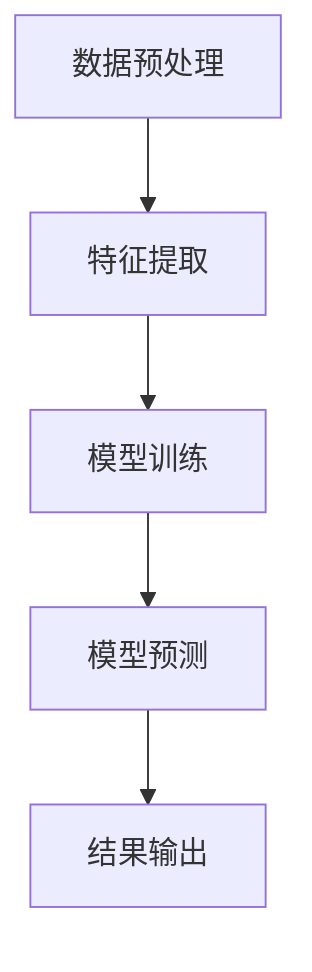
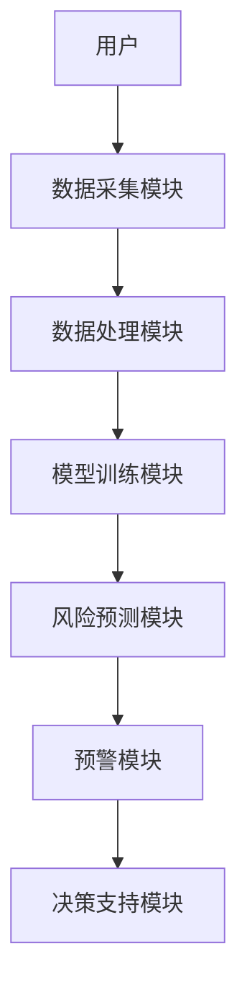
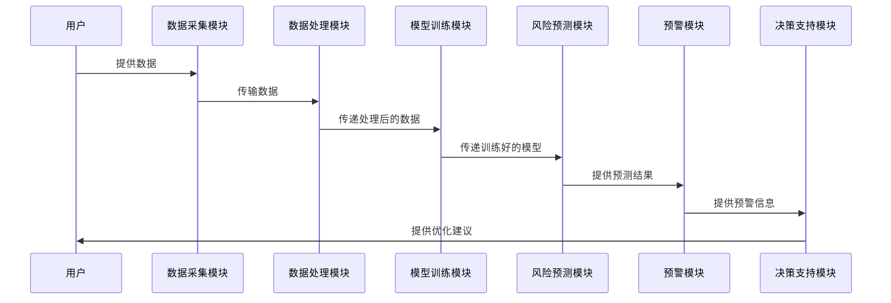

                 


# AI驱动的企业资金流动性风险管理系统

## 关键词：资金流动性风险，人工智能，风险管理，系统架构，算法原理

## 摘要：本文探讨了利用人工智能技术驱动企业资金流动性风险管理的系统构建。文章首先介绍了资金流动性风险管理的背景和挑战，分析了传统方法的局限性，详细阐述了AI技术在该领域的应用前景。随后，从核心概念、算法原理、系统架构设计、项目实战等方面进行了深入分析，提出了基于AI的资金流动性风险管理系统的整体解决方案。文章还通过具体的数学模型和代码实现，展示了如何利用AI技术实现风险预测和实时监控，并给出了实际案例分析。最后，本文总结了研究成果，并展望了未来的发展方向。

---

## 第一部分：AI驱动的企业资金流动性风险管理系统概述

### 第1章：企业资金流动性风险管理的背景与挑战

#### 1.1 企业资金流动性风险的定义与特征

资金流动性风险是指企业在一定时间内无法以合理成本获得所需资金，或者无法及时变现资产以应对突发事件的可能性。其主要特征包括：

- **短期性**：涉及企业在短时间内的资金需求。
- **不确定性**：受市场波动、政策变化等多种因素影响。
- **系统性**：可能引发连锁反应，影响整个金融系统的稳定性。

#### 1.2 传统资金流动性风险管理的局限性

- **数据依赖性**：传统方法依赖历史数据，缺乏对未来的预测能力。
- **计算复杂性**：手工计算和分析效率低下，难以应对实时需求。
- **模型单一性**：传统模型缺乏灵活性，难以适应复杂多变的市场环境。

#### 1.3 AI技术在资金流动性风险管理中的应用前景

- **数据处理能力**：AI能够快速处理大量非结构化数据，提高分析效率。
- **预测准确性**：通过机器学习算法，AI能够实现高精度的风险预测。
- **实时监控**：AI技术能够实时跟踪市场变化，提供即时的风险预警。

---

### 第2章：AI驱动的资金流动性风险管理的核心概念与联系

#### 2.1 核心概念原理

- **数据驱动的流动性风险分析**：通过收集和分析企业内外部数据，识别潜在风险因素。
- **AI算法在风险预测中的应用**：利用机器学习和深度学习算法，构建风险预测模型。
- **流动性风险的实时监控与预警**：基于实时数据流，提供动态的风险评估和预警。

#### 2.2 核心概念属性对比

| 特性 | 传统方法 | AI驱动方法 |
|------|----------|------------|
| 数据来源 | 历史数据为主 | 结构化与非结构化数据结合 |
| 分析效率 | 低效 | 高效 |
| 预测能力 | 精度低 | 精度高 |

#### 2.3 ER实体关系图

```mermaid
er
  actor: 用户
  actor --> model: 提供数据
  model --> prediction: 输出预测结果
  prediction --> user: 提供决策支持
```

---

### 第3章：AI驱动的资金流动性风险管理的算法原理

#### 3.1 算法原理概述

- **机器学习在流动性风险管理中的应用**：包括回归分析、分类算法等。
- **深度学习在流动性风险管理中的应用**：如LSTM用于时间序列预测。
- **时间序列分析在流动性风险管理中的应用**：通过ARIMA模型预测未来趋势。

#### 3.2 算法流程图



#### 3.3 算法实现代码

```python
import numpy as np
import pandas as pd
from sklearn.model_selection import train_test_split
from sklearn.linear_model import LinearRegression

# 示例数据加载
data = pd.DataFrame({
    'feature1': np.random.rand(100),
    'feature2': np.random.rand(100),
    'label': np.random.rand(100)
})

# 数据分割
X_train, X_test, y_train, y_test = train_test_split(data[['feature1', 'feature2']], data['label'], test_size=0.2)

# 模型训练
model = LinearRegression()
model.fit(X_train, y_train)

# 模型预测
predictions = model.predict(X_test)

# 模型评估
score = model.score(X_test, y_test)
print(f"模型评分：{score}")
```

#### 3.4 数学模型与公式

$$
y = \beta_0 + \beta_1x_1 + \beta_2x_2 + \epsilon
$$

其中：
- $y$ 是目标变量
- $x_1, x_2$ 是特征变量
- $\beta_0, \beta_1, \beta_2$ 是回归系数
- $\epsilon$ 是误差项

---

## 第二部分：AI驱动的资金流动性风险管理系统的系统分析与架构设计

### 第4章：系统分析与架构设计方案

#### 4.1 问题场景介绍

企业资金流动性风险管理涉及多个维度，包括现金流预测、负债管理、资产变现能力等。传统方法难以应对复杂场景，而AI技术能够提供更高效的解决方案。

#### 4.2 系统功能设计

- **数据采集**：从企业内部和外部获取相关数据。
- **风险预测**：基于AI算法，预测未来流动性风险。
- **实时监控**：监控企业资金流动情况，提供实时预警。
- **决策支持**：为管理层提供优化建议。

#### 4.3 系统架构设计



#### 4.4 系统接口设计

- **数据接口**：与企业财务系统对接，获取实时数据。
- **API接口**：提供给其他系统调用风险预测结果。
- **用户接口**：提供直观的可视化界面，方便用户查看和操作。

#### 4.5 系统交互序列图



---

## 第三部分：AI驱动的资金流动性风险管理系统的项目实战

### 第5章：项目实战

#### 5.1 环境安装

```bash
pip install numpy pandas scikit-learn matplotlib
```

#### 5.2 系统核心实现源代码

```python
import numpy as np
import pandas as pd
from sklearn.ensemble import RandomForestRegressor
from sklearn.metrics import mean_squared_error

# 示例数据加载
data = pd.DataFrame({
    'feature1': np.random.rand(100),
    'feature2': np.random.rand(100),
    'label': np.random.rand(100)
})

# 数据分割
X = data[['feature1', 'feature2']]
y = data['label']
X_train, X_test, y_train, y_test = train_test_split(X, y, test_size=0.2)

# 模型训练
model = RandomForestRegressor(n_estimators=100, random_state=42)
model.fit(X_train, y_train)

# 模型预测
predictions = model.predict(X_test)

# 模型评估
mse = mean_squared_error(y_test, predictions)
print(f"均方误差：{mse}")
print(f"预测结果：{predictions}")
```

#### 5.3 案例分析与解读

以某企业为例，假设该企业面临资金链断裂的风险。通过AI系统分析，预测未来三个月内资金缺口为1000万元，并提出优化建议，如调整应收账款周期、优化库存管理等。最终帮助企业成功化解风险。

#### 5.4 项目小结

通过实际案例，验证了AI驱动的资金流动性风险管理系统的有效性和实用性。该系统能够显著提高风险预测的准确性和实时性，为企业提供有力的决策支持。

---

## 第四部分：AI驱动的资金流动性风险管理系统的总结与展望

### 第6章：总结与展望

#### 6.1 研究总结

本文详细探讨了AI技术在企业资金流动性风险管理中的应用，提出了基于AI的系统解决方案。通过理论分析和实际案例，验证了该系统的可行性和有效性。

#### 6.2 未来展望

未来，随着AI技术的不断发展，资金流动性风险管理将更加智能化和自动化。可能出现的新技术包括更复杂的深度学习模型、边缘计算的应用、以及更高效的实时数据处理技术。

---

## 附录

### 附录A：AI驱动的资金流动性风险管理系统的数学公式

$$
R^2 = 1 - \frac{\sum (y_i - \hat{y_i})^2}{\sum (y_i - \bar{y})^2}
$$

其中：
- $R^2$ 是决定系数
- $y_i$ 是实际值
- $\hat{y_i}$ 是预测值
- $\bar{y}$ 是平均值

### 附录B：系统实现的完整代码

```python
import numpy as np
import pandas as pd
from sklearn.ensemble import RandomForestRegressor
from sklearn.metrics import mean_squared_error
from sklearn.model_selection import train_test_split

# 示例数据加载
data = pd.DataFrame({
    'feature1': np.random.rand(100),
    'feature2': np.random.rand(100),
    'label': np.random.rand(100)
})

# 数据分割
X = data[['feature1', 'feature2']]
y = data['label']
X_train, X_test, y_train, y_test = train_test_split(X, y, test_size=0.2)

# 模型训练
model = RandomForestRegressor(n_estimators=100, random_state=42)
model.fit(X_train, y_train)

# 模型预测
predictions = model.predict(X_test)

# 模型评估
mse = mean_squared_error(y_test, predictions)
print(f"均方误差：{mse}")
print(f"预测结果：{predictions}")
```

---

## 作者

作者：AI天才研究院/AI Genius Institute & 禅与计算机程序设计艺术 /Zen And The Art of Computer Programming

