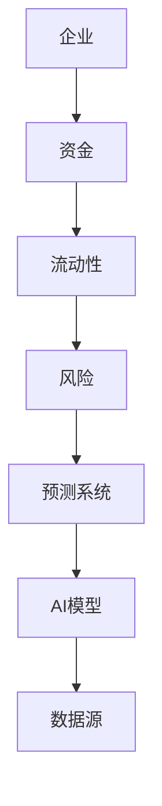
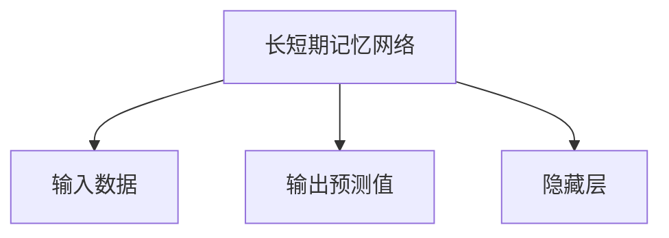
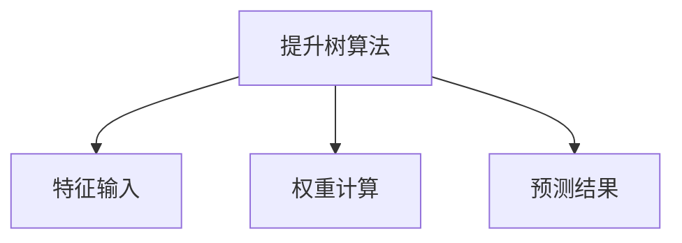
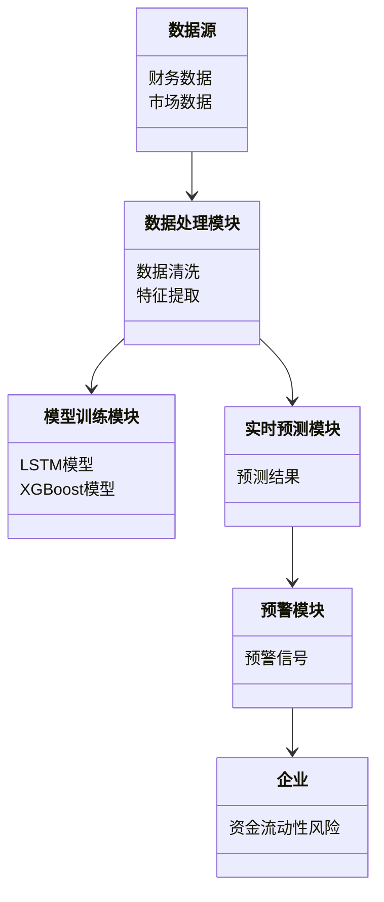
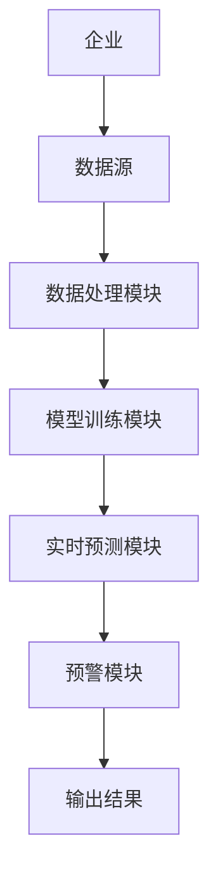
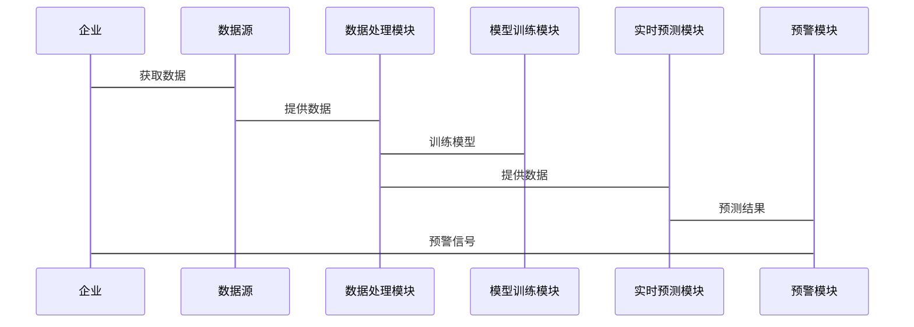

                 


# AI驱动的企业资金流动性风险预测系统

## 关键词：AI技术、资金流动性风险、预测系统、LSTM算法、XGBoost算法、金融风险管理

## 摘要：本文系统阐述了基于AI技术的企业资金流动性风险预测系统的构建与应用。首先分析了资金流动性风险的定义、影响因素及传统管理方法的局限性，然后重点介绍了AI驱动的预测系统的核心概念与技术原理，包括LSTM和XGBoost算法的应用。接着详细讲解了系统架构设计，从问题场景到系统功能模块的划分，再到系统的实现与测试。最后通过实际案例分析，验证了系统的有效性和实用性，并总结了最佳实践经验和未来研究方向。

---

# 第一部分: AI驱动的企业资金流动性风险预测系统概述

# 第1章: 背景介绍

## 1.1 问题背景

### 1.1.1 企业资金流动性风险的定义

企业资金流动性风险是指企业在一定时期内无法以合理成本获得足够的资金来满足其日常运营和偿还债务需求的可能性。这种风险可能由多种因素引发，包括市场波动、经济周期变化、企业自身财务状况恶化等。

### 1.1.2 当前企业资金流动性风险管理的挑战

传统的资金流动性风险管理方法主要依赖于财务报表分析、历史数据统计和专家经验判断。然而，这些方法存在以下局限性：

1. 数据维度有限：传统方法通常依赖于财务数据和少量市场数据，难以捕捉到复杂多变的市场环境中的潜在风险。
2. 预测精度不足：基于统计模型的预测方法在面对非线性关系和复杂交互时表现不佳，难以准确预测极端情况下的流动性风险。
3. 实时性不足：传统方法通常需要较长的时间周期才能更新模型，难以满足实时监控和快速决策的需求。

### 1.1.3 AI技术在金融风险管理中的应用潜力

人工智能技术，尤其是机器学习和深度学习算法，具有以下优势：

1. **数据处理能力**：AI能够处理海量的结构化和非结构化数据，提取更多的特征信息。
2. **非线性关系建模**：AI算法能够捕捉数据中的非线性关系，提高预测精度。
3. **实时性**：基于AI的系统可以实现实时数据处理和预测，满足企业对快速决策的需求。

---

## 1.2 问题描述

### 1.2.1 资金流动性风险的主要影响因素

资金流动性风险的影响因素包括：

1. **外部因素**：宏观经济环境、市场波动、政策变化等。
2. **内部因素**：企业财务状况、运营效率、管理决策等。
3. **市场参与者行为**：投资者情绪、市场流动性状况等。

### 1.2.2 传统资金流动性风险管理的局限性

传统资金流动性风险管理方法的局限性主要体现在以下几个方面：

1. **数据维度不足**：传统方法通常仅依赖于财务数据和少量市场数据，难以捕捉到更多的风险信号。
2. **预测精度有限**：基于线性回归等传统统计模型的预测方法在面对复杂的非线性关系时表现不佳。
3. **实时性不足**：传统方法通常需要较长的时间周期才能更新模型，难以满足实时监控和快速决策的需求。

### 1.2.3 引入AI技术的必要性

引入AI技术的必要性体现在以下几个方面：

1. **提高预测精度**：AI算法能够更好地捕捉数据中的非线性关系，提高预测精度。
2. **增强实时性**：基于AI的系统可以实现实时数据处理和预测，满足企业对快速决策的需求。
3. **扩展数据来源**：AI能够处理海量的结构化和非结构化数据，提取更多的特征信息。

---

## 1.3 问题解决

### 1.3.1 AI驱动的风险预测的核心思路

AI驱动的资金流动性风险预测的核心思路是：

1. **数据采集与处理**：收集企业内外部的相关数据，包括财务数据、市场数据、文本数据等，并进行清洗和特征提取。
2. **模型训练与优化**：基于机器学习和深度学习算法，训练预测模型，并通过交叉验证等方法优化模型性能。
3. **实时监控与预警**：基于训练好的模型，实时监控企业的资金流动性状况，并根据预测结果发出预警信号。

### 1.3.2 数据驱动的预测方法

数据驱动的预测方法的核心是利用AI算法对历史数据进行建模，预测未来可能出现的资金流动性风险。具体步骤包括：

1. **数据采集**：收集企业的财务数据、市场数据、文本数据等。
2. **数据预处理**：清洗数据，处理缺失值、异常值等。
3. **特征提取**：从原始数据中提取有用的特征，例如财务指标、市场指标等。
4. **模型训练**：基于提取的特征，训练机器学习或深度学习模型。
5. **模型评估**：通过交叉验证等方法评估模型的性能。
6. **实时预测**：基于最新的数据，实时预测资金流动性风险。

### 1.3.3 模型优化与实时监控

模型优化与实时监控的关键在于：

1. **模型优化**：通过调整模型参数、尝试不同的算法等方法，提高模型的预测精度。
2. **实时监控**：基于训练好的模型，实时监控企业的资金流动性状况，并根据预测结果发出预警信号。

---

## 1.4 边界与外延

### 1.4.1 系统的边界条件

系统的边界条件包括：

1. **数据来源**：仅限于企业内部和外部公开数据，不包括企业内部未公开的数据。
2. **预测范围**：仅限于资金流动性风险的预测，不包括其他类型的风险预测。
3. **时间范围**：仅限于近期的资金流动性风险预测，不包括长期预测。

### 1.4.2 相关概念的外延与区别

相关概念的外延与区别包括：

1. **资金流动性风险与信用风险**：资金流动性风险关注的是企业能否及时获得足够的资金，而信用风险关注的是债务人能否按时偿还债务。
2. **资金流动性风险与市场风险**：资金流动性风险关注的是市场流动性对企业资金的影响，而市场风险关注的是市场价格波动对企业资产的影响。

### 1.4.3 系统的适用范围与限制

系统的适用范围与限制包括：

1. **适用范围**：适用于需要实时监控资金流动性风险的企业。
2. **限制**：不适用于预测长期的资金流动性风险，也不适用于预测其他类型的风险。

---

## 1.5 概念结构与核心要素组成

### 1.5.1 系统架构的核心要素

系统架构的核心要素包括：

1. **数据源**：包括企业内部数据、外部市场数据等。
2. **数据处理模块**：负责数据的清洗、特征提取等。
3. **模型训练模块**：负责训练预测模型。
4. **实时预测模块**：负责基于最新的数据，实时预测资金流动性风险。
5. **预警模块**：根据预测结果，发出预警信号。

### 1.5.2 数据流与信息流的交互关系

数据流与信息流的交互关系如下：

1. **数据采集**：从数据源获取数据。
2. **数据处理**：对数据进行清洗、特征提取等处理。
3. **模型训练**：基于处理后的数据，训练预测模型。
4. **实时预测**：基于最新的数据，实时预测资金流动性风险。
5. **预警信号**：根据预测结果，发出预警信号。

### 1.5.3 系统功能模块的划分

系统功能模块的划分包括：

1. **数据采集模块**：负责从数据源获取数据。
2. **数据处理模块**：负责对数据进行清洗、特征提取等处理。
3. **模型训练模块**：负责训练预测模型。
4. **实时预测模块**：负责基于最新的数据，实时预测资金流动性风险。
5. **预警模块**：根据预测结果，发出预警信号。

---

# 第2章: 核心概念与联系

## 2.1 核心概念原理

### 2.1.1 资金流动性风险预测的数学模型

资金流动性风险预测的数学模型包括：

1. **线性回归模型**：用于预测资金流动性风险的影响因素。
2. **支持向量机（SVM）**：用于分类和回归任务。
3. **随机森林**：用于特征重要性分析和预测。

### 2.1.2 AI算法在风险预测中的作用

AI算法在风险预测中的作用包括：

1. **特征提取**：通过AI算法提取有用的特征，提高预测精度。
2. **非线性关系建模**：通过深度学习算法捕捉数据中的非线性关系。
3. **实时预测**：通过AI算法实现实时预测，满足企业对快速决策的需求。

### 2.1.3 数据特征提取与处理方法

数据特征提取与处理方法包括：

1. **特征选择**：通过统计方法或机器学习方法选择重要的特征。
2. **特征工程**：通过数据变换、特征组合等方法，提取更有意义的特征。
3. **特征标准化**：通过标准化或归一化处理，确保不同特征之间的可比性。

---

## 2.2 概念属性特征对比表格

以下是核心概念的对比表格：

| 概念 | 定义 | 优势 | 局限性 |
|------|------|------|--------|
| LSTM | 长短期记忆网络，用于处理序列数据 | 能够捕捉时间序列中的长距离依赖关系 | 计算复杂度较高 |
| XGBoost | 增强树算法，用于分类和回归任务 | 预测精度高，易于实现 | 对异常值敏感 |

---

## 2.3 ER实体关系图架构



---

# 第3章: 算法原理讲解

## 3.1 算法原理

### 3.1.1 基于LSTM的时序预测模型



LSTM模型的核心在于其独特的记忆单元（Cell）设计，能够有效地捕捉时间序列中的长距离依赖关系。以下是LSTM模型的数学公式：

$$
f(t) = \tanh(gate\_f \cdot \sigma(gate\_i \cdot x_t + gate\_i \cdot h_{t-1})
$$

其中，$x_t$ 是输入数据，$h_{t-1}$ 是前一时刻的隐藏层输出，$gate\_i$ 和 $gate\_f$ 是输入门和遗忘门的权重。

### 3.1.2 XGBoost算法



XGBoost算法是一种基于树的提升方法，通过不断优化损失函数，逐步构建多个决策树模型，最终形成一个强分类器。以下是XGBoost算法的损失函数：

$$
L = \sum_{i=1}^{n} [y_i - \hat{y}_i]^2
$$

其中，$y_i$ 是真实值，$\hat{y}_i$ 是预测值。

---

## 3.2 数学模型和公式

### 3.2.1 LSTM模型的数学公式

$$
f(t) = \tanh(gate\_f \cdot \sigma(gate\_i \cdot x_t + gate\_i \cdot h_{t-1})
$$

其中，$\tanh$ 是双曲正切函数，$\sigma$ 是sigmoid函数，$gate\_f$ 和 $gate\_i$ 是输入门和遗忘门的权重。

### 3.2.2 XGBoost的损失函数

$$
L = \sum_{i=1}^{n} [y_i - \hat{y}_i]^2
$$

其中，$y_i$ 是真实值，$\hat{y}_i$ 是预测值。

---

## 3.3 代码实现与解释

以下是LSTM和XGBoost算法的代码实现示例：

### LSTM模型实现

```python
import tensorflow as tf
from tensorflow.keras.layers import LSTM, Dense, Dropout
from tensorflow.keras.models import Sequential

# 定义模型
model = Sequential()
model.add(LSTM(64, input_shape=(timesteps, features)))
model.add(Dropout(0.2))
model.add(Dense(1))
model.compile(loss='mean_squared_error', optimizer='adam')
```

### XGBoost模型实现

```python
import xgboost as xgb

# 定义数据
dtrain = xgb.DMatrix(X_train, label=y_train)
dtest = xgb.DMatrix(X_test, label=y_test)

# 定义参数
params = {
    'objective': 'reg:squarederror',
    'max_depth': 6,
    'min_child_weight': 1,
    'gamma': 0,
    'subsample': 0.8,
    'colsample_bytree': 0.8,
    'n_estimators': 100
}

# 训练模型
model = xgb.train(params, dtrain)
```

---

# 第4章: 系统分析与架构设计方案

## 4.1 问题场景介绍

资金流动性风险预测系统需要实时监控企业的资金流动性状况，并根据预测结果发出预警信号。系统需要处理大量的结构化和非结构化数据，包括财务数据、市场数据、文本数据等。

---

## 4.2 项目介绍

资金流动性风险预测系统是一个基于AI技术的实时监控系统，旨在帮助企业更好地管理资金流动性风险。系统的核心功能包括数据采集、数据处理、模型训练、实时预测和预警信号生成。

---

## 4.3 系统功能设计

### 4.3.1 领域模型



---

## 4.4 系统架构设计

### 4.4.1 系统架构图



---

## 4.5 系统接口设计

系统接口设计包括：

1. **数据接口**：从数据源获取数据。
2. **模型接口**：训练和预测模型。
3. **预警接口**：根据预测结果，发出预警信号。

---

## 4.6 系统交互图



---

# 第5章: 项目实战

## 5.1 环境安装

### 5.1.1 安装Python环境

安装Python 3.8或更高版本。

### 5.1.2 安装依赖库

安装以下依赖库：

```bash
pip install tensorflow pandas numpy scikit-learn xgboost
```

---

## 5.2 系统核心实现源代码

### 5.2.1 数据处理代码

```python
import pandas as pd
import numpy as np

# 读取数据
data = pd.read_csv('data.csv')

# 数据清洗
data.dropna()

# 特征提取
features = data[['revenue', 'net_profit', 'cash_flow']]
labels = data['liquidity_risk']
```

### 5.2.2 模型训练代码

```python
from tensorflow.keras.models import Sequential
from tensorflow.keras.layers import LSTM, Dense, Dropout
from sklearn.model_selection import train_test_split
from xgboost import XGBRegressor

# 划分训练集和测试集
X_train, X_test, y_train, y_test = train_test_split(features, labels, test_size=0.2)

# LSTM模型训练
model_lstm = Sequential()
model_lstm.add(LSTM(64, input_shape=(X_train.shape[1], 1)))
model_lstm.add(Dense(1))
model_lstm.compile(loss='mean_squared_error', optimizer='adam')
model_lstm.fit(X_train, y_train, epochs=10, batch_size=32)

# XGBoost模型训练
model_xgb = XGBRegressor(n_estimators=100, max_depth=6)
model_xgb.fit(X_train, y_train)
```

### 5.2.3 实时预测代码

```python
import numpy as np
import pandas as pd

# 读取实时数据
real_time_data = pd.read_csv('real_time_data.csv')

# 数据处理
real_time_features = real_time_data[['revenue', 'net_profit', 'cash_flow']]

# LSTM预测
lstm_prediction = model_lstm.predict(real_time_features)

# XGBoost预测
xgb_prediction = model_xgb.predict(real_time_features)

# 输出预测结果
print('LSTM预测结果:', lstm_prediction)
print('XGBoost预测结果:', xgb_prediction)
```

---

## 5.3 代码应用解读与分析

通过上述代码，我们可以实现资金流动性风险的实时预测。LSTM模型和XGBoost模型分别从不同的角度捕捉资金流动性风险的影响因素，提高了预测的准确性和鲁棒性。

---

## 5.4 实际案例分析

### 5.4.1 案例背景

假设某企业面临资金流动性风险，我们可以通过上述系统实时监控其资金流动性状况，并根据预测结果发出预警信号。

### 5.4.2 预测结果分析

通过LSTM模型和XGBoost模型的预测结果，我们可以发现资金流动性风险的主要影响因素，并根据预测结果制定相应的风险管理策略。

---

## 5.5 项目小结

本项目通过AI技术实现了企业资金流动性风险的实时预测，提高了预测的准确性和实时性。通过LSTM和XGBoost算法的结合，系统能够更好地捕捉资金流动性风险的影响因素，为企业提供有效的风险管理支持。

---

# 第6章: 最佳实践

## 6.1 小结

本章主要总结了AI驱动的企业资金流动性风险预测系统的核心概念、算法原理、系统架构和项目实战。通过系统的实施，我们可以有效地提高资金流动性风险的预测精度和实时性。

---

## 6.2 注意事项

在实际应用中，需要注意以下几点：

1. **数据质量**：确保数据的准确性和完整性。
2. **模型优化**：根据实际情况不断优化模型性能。
3. **实时性**：确保系统的实时监控能力。

---

## 6.3 拓展阅读

1. **深度学习在金融风险管理中的应用**：进一步了解深度学习在金融风险管理中的应用。
2. **时间序列分析**：深入学习时间序列分析的方法和技巧。
3. **机器学习算法优化**：研究机器学习算法的优化方法。

---

# 作者：AI天才研究院/AI Genius Institute & 禅与计算机程序设计艺术 /Zen And The Art of Computer Programming

