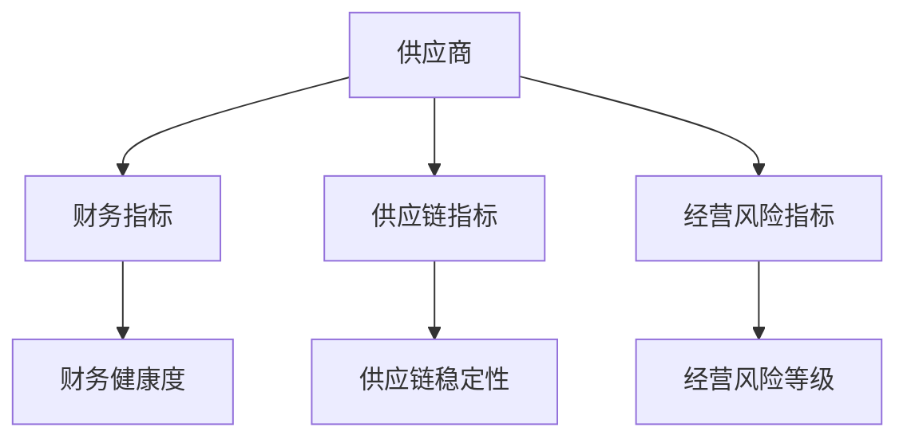
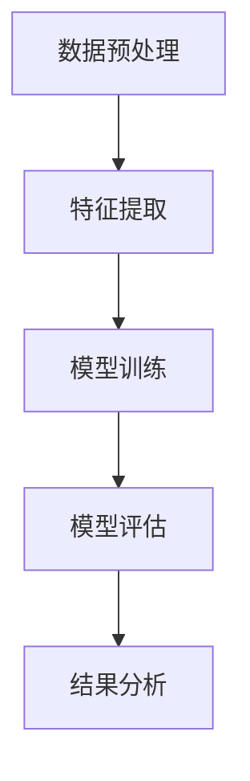

                 


# AI驱动的供应商健康度分析：评估上游风险

> 关键词：AI驱动，供应商健康度，风险管理，供应链，数据驱动，机器学习

> 摘要：随着全球供应链的复杂化和不确定性增加，评估上游供应商的健康度成为企业风险管理的关键环节。本文详细探讨了如何利用人工智能技术，从数据收集、特征提取到模型构建，再到结果分析的全过程，帮助企业在复杂多变的市场环境中，精准识别和评估上游供应商的风险，从而优化供应链管理，提升企业整体竞争力。

---

## 第一部分: AI驱动的供应商健康度分析概述

### 第1章: 供应商健康度分析的背景与意义

#### 1.1 问题背景

供应链是企业运营的核心支柱，供应商的健康状况直接关系到企业的生产效率和成本控制。然而，传统的供应商评估方法依赖于人工审核和经验判断，存在效率低、主观性强、难以量化等问题。近年来，随着全球市场的波动加剧，企业面临的风险更加复杂多样，例如原材料价格波动、物流延迟、政策变化等。这些风险可能迅速传导到供应链的上下游，对企业的稳定运营造成威胁。

#### 1.2 问题描述与解决

传统的供应商评估方法存在以下问题：

1. **数据分散**：供应商的信息分布在不同部门和系统中，难以整合和分析。
2. **主观性强**：评估结果依赖于人工判断，缺乏客观性和可重复性。
3. **滞后性**：由于信息更新不及时，企业难以快速响应潜在风险。

为了解决这些问题，AI技术的应用提供了新的可能性。通过机器学习算法，企业可以实时分析海量数据，识别潜在风险，优化供应商选择和管理策略。

#### 1.3 边界与外延

供应商健康度分析的边界包括：

- 数据范围：仅限于供应商相关的数据，如财务数据、交货记录、合同条款等。
- 时间范围：通常关注过去一段时间内的表现，预测未来风险。
- 分析范围：仅针对供应商层面，不涉及下游客户的分析。

其外延则包括：

- 数据来源的扩展，如引入外部市场数据、行业趋势等。
- 分析维度的扩展，如从单一供应商分析扩展到供应链整体风险评估。

#### 1.4 核心要素

供应商健康度分析的核心要素包括：

1. **财务健康度**：评估供应商的财务状况，如盈利能力、现金流、债务水平等。
2. **供应链稳定性**：分析供应商的生产能力、交货准时率、原材料供应稳定性等。
3. **经营风险**：识别供应商所在行业的风险，如政策变化、市场需求波动等。

---

### 第2章: 核心概念与联系

#### 2.1 核心概念的定义与分类

1. **财务健康度**：通过财务报表数据（如利润表、资产负债表）评估供应商的财务状况。
2. **供应链稳定性**：分析供应商的历史交货记录、生产效率等指标。
3. **经营风险**：评估供应商所在行业的市场风险、政策风险等。

#### 2.2 指标间的依赖关系与影响权重

指标间的依赖关系可以通过权重分配来体现。例如，财务健康度可能对供应商的整体健康度影响较大，而供应链稳定性则受行业特性和供应商规模的影响。

| 指标类别       | 子指标                 | 权重 |
|----------------|----------------------|------|
| 财务健康度     | 净利润                | 0.4   |
|                | 资产负债率            | 0.3   |
| 供应链稳定性     | 交货准时率            | 0.3   |
|                | 原材料供应稳定性      | 0.2   |
| 经营风险       | 行业波动风险          | 0.3   |
|                | 政策风险             | 0.2   |

#### 2.3 指标间的相互影响关系

供应商的财务状况可能影响其供应链稳定性，例如，财务状况不佳的供应商可能难以维持稳定的生产流程。同时，行业风险可能影响多个供应商的健康度，从而影响整个供应链的稳定性。

#### 2.4 ER实体关系图



---

### 第3章: 算法原理讲解

#### 3.1 算法选择与原理

选择合适的算法是供应商健康度分析的关键。常见的算法包括：

1. **线性回归**：用于预测供应商的健康度评分。
2. **随机森林**：用于分类供应商的风险等级。
3. **XGBoost**：用于处理非线性关系和高维数据。

#### 3.2 算法流程图



#### 3.3 算法实现代码示例

以下是基于XGBoost的健康度预测代码示例：

```python
import xgboost as xgb

# 数据加载
data = pd.read_csv('supplier_health.csv')

# 特征选择
features = ['revenue', 'profit_margin', 'inventory_turnover']
target = 'health_score'

# 数据分割
X = data[features]
y = data[target]

# 模型训练
model = xgb.XGBRegressor(n_estimators=100, learning_rate=0.1)
model.fit(X, y)

# 预测
predictions = model.predict(X)
```

#### 3.4 数学公式与模型解释

线性回归模型的数学公式为：

$$ y = \beta_0 + \beta_1x_1 + \beta_2x_2 + \ldots + \beta_nx_n + \epsilon $$

其中，$y$ 是目标变量（供应商健康度评分），$x_i$ 是特征变量，$\beta_i$ 是回归系数，$\epsilon$ 是误差项。

---

### 第4章: 系统架构设计

#### 4.1 系统功能设计

系统功能模块包括：

1. **数据采集模块**：从ERP系统、财务系统等来源获取数据。
2. **数据预处理模块**：清洗数据、填充缺失值、标准化处理。
3. **模型训练模块**：构建并训练机器学习模型。
4. **结果分析模块**：输出供应商健康度评分和风险报告。

#### 4.2 系统架构图


#### 4.3 系统接口设计

系统接口包括：

1. API接口：供其他系统调用供应商健康度评分。
2. 用户界面：供管理人员查看分析结果和报告。

---

### 第5章: 项目实战

#### 5.1 环境安装

需要安装以下库：

- `pandas`：数据处理
- `xgboost`：机器学习模型
- `scikit-learn`：数据预处理和模型评估

#### 5.2 核心实现代码

以下是供应商健康度分析的核心代码：

```python
from sklearn.model_selection import train_test_split
from sklearn.metrics import mean_squared_error

# 数据加载
data = pd.read_csv('supplier_health.csv')

# 特征选择
X = data[['revenue', 'profit_margin', 'inventory_turnover']]
y = data['health_score']

# 数据分割
X_train, X_test, y_train, y_test = train_test_split(X, y, test_size=0.2)

# 模型训练
model = xgb.XGBRegressor()
model.fit(X_train, y_train)

# 模型评估
predictions = model.predict(X_test)
rmse = mean_squared_error(y_test, predictions)
print(f'均方误差: {rmse}')
```

#### 5.3 案例分析

以某制造企业为例，分析其上游供应商的健康度。通过模型预测，识别出高风险供应商，并建议企业采取替代方案或加强监控措施。

---

### 第6章: 最佳实践与总结

#### 6.1 小结

本文详细探讨了AI驱动的供应商健康度分析的背景、核心概念、算法原理、系统架构和项目实战。通过机器学习技术，企业可以更高效、更准确地评估上游供应商的风险，优化供应链管理。

#### 6.2 注意事项

- 数据质量是模型准确性的关键，需确保数据的完整性和一致性。
- 模型需要定期更新，以适应市场环境的变化。
- 在实际应用中，需结合企业的具体情况调整模型参数和指标权重。

#### 6.3 未来展望

随着AI技术的不断发展，供应商健康度分析将更加智能化和自动化。未来的研究方向包括引入自然语言处理技术分析供应商的新闻报道，以及利用图神经网络建模供应链的复杂关系。

---

### 作者信息

作者：AI天才研究院/AI Genius Institute & 禅与计算机程序设计艺术 /Zen And The Art of Computer Programming

---

通过以上结构和内容的详细规划，我们可以系统地撰写一篇深入浅出的技术博客文章，帮助读者全面理解AI驱动的供应商健康度分析的理论与实践。

