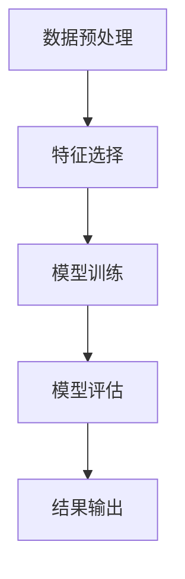

                 


# AI驱动的供应链金融信用评分模型

> 关键词：供应链金融，信用评分模型，人工智能，机器学习，XGBoost算法，金融风险管理

> 摘要：本文探讨了如何利用人工智能技术优化供应链金融中的信用评分模型。通过分析供应链金融的核心问题，介绍AI驱动的信用评分模型的原理、算法实现和实际应用，展示如何通过技术创新提升供应链金融的效率和准确性。

---

# 第一部分: 供应链金融与信用评分模型的背景

## 第1章: 供应链金融与信用评分模型的背景

### 1.1 供应链金融的定义与特点

#### 1.1.1 供应链金融的定义
供应链金融是指通过整合供应链上下游企业之间的资金流、信息流和物流，提供融资服务和支持的金融模式。其核心在于优化企业间的合作关系，降低交易成本，提高资金使用效率。

#### 1.1.2 供应链金融的核心特点
- **数据驱动**：依赖于供应链中的实时数据，如订单、物流、支付等。
- **多方参与**：涉及供应商、制造商、分销商、零售商和金融机构等多个主体。
- **风险控制**：通过信用评分模型评估参与企业的信用状况，降低金融风险。

#### 1.1.3 供应链金融的参与者与流程
- **参与者**：供应商、制造商、分销商、零售商、银行、保险公司等。
- **流程**：需求预测、订单处理、物流管理、支付结算、风险管理等。

### 1.2 传统供应链金融的痛点

#### 1.2.1 信息不对称问题
传统供应链金融中，各参与方的信息分散且不透明，导致信用评估困难。

#### 1.2.2 信用评估的复杂性
传统信用评分模型依赖少量的财务数据，难以全面反映企业的信用状况。

#### 1.2.3 传统信用评分模型的局限性
- 数据维度有限，难以捕捉企业的真实信用风险。
- 模型更新周期长，难以适应快速变化的市场环境。

### 1.3 AI驱动的解决方案

#### 1.3.1 AI在供应链金融中的应用潜力
- **数据挖掘**：利用AI技术从海量数据中提取有价值的信息。
- **实时分析**：通过实时数据分析优化供应链中的决策过程。
- **风险预测**：利用AI进行信用风险预测，提升信用评分模型的准确性。

#### 1.3.2 AI驱动信用评分模型的核心优势
- **数据驱动**：利用AI技术整合多源数据，提升信用评估的全面性。
- **实时性**：能够实时更新模型，适应市场变化。
- **自动化**：自动化处理数据，减少人工干预，降低成本。

#### 1.3.3 本书的研究目标与意义
- **研究目标**：构建一个基于AI的供应链金融信用评分模型，解决传统模型的局限性。
- **研究意义**：提升供应链金融的效率和准确性，降低金融风险，促进供应链的整体优化。

---

# 第2章: 供应链金融信用评分模型的核心概念

## 第2章: 供应链金融信用评分模型的核心概念

### 2.1 供应链金融中的信用评分

#### 2.1.1 信用评分的定义
信用评分是对企业或个人信用状况的量化评估，用于预测其违约风险。

#### 2.1.2 信用评分的核心要素
- **财务数据**：收入、利润、资产负债情况等。
- **交易数据**：订单量、交货时间、付款情况等。
- **市场数据**：行业趋势、竞争对手情况等。

#### 2.1.3 信用评分与供应链效率的关系
信用评分越高，企业获得融资的能力越强，供应链的效率和稳定性越高。

### 2.2 AI驱动信用评分模型的原理

#### 2.2.1 数据驱动的信用评估
AI驱动的信用评分模型依赖于大量的数据，包括结构化数据（如财务数据）和非结构化数据（如文本、图像）。

#### 2.2.2 AI算法在信用评分中的应用
- **监督学习**：用于分类任务，如违约分类。
- **无监督学习**：用于聚类任务，发现潜在的风险群体。

#### 2.2.3 模型的可解释性与鲁棒性
- **可解释性**：模型需要能够解释其评分结果，以便金融机构理解和信任。
- **鲁棒性**：模型需要在数据分布变化时保持稳定。

### 2.3 核心概念对比表

#### 2.3.1 传统信用评分与AI驱动评分的对比

| 对比维度 | 传统信用评分 | AI驱动信用评分 |
|----------|--------------|----------------|
| 数据来源 | 有限的财务数据 | 多源数据，包括交易、市场等 |
| 模型复杂度 | 简单线性模型 | 复杂非线性模型 |
| 更新频率 | 低频更新 | 实时更新 |
| 准确性 | 较低 | 较高 |

#### 2.3.2 数据特征与模型性能的关系
数据特征的丰富性直接影响模型的准确性和鲁棒性。AI驱动的模型能够处理更多维度的数据，从而提高评分的准确性。

#### 2.3.3 不同AI算法的优缺点分析

| 算法类型 | 优点 | 缺点 |
|----------|------|------|
| 逻辑回归 | 解释性强，计算速度快 | 模型假设严格，非线性关系处理能力弱 |
| 随机森林 | 高准确性，抗过拟合 | 解释性较差，计算资源消耗大 |
| 神经网络 | 高准确性，复杂关系处理能力强 | 解释性较差，计算资源消耗大 |

---

# 第3章: 供应链金融信用评分模型的算法原理

## 第3章: 供应链金融信用评分模型的算法原理

### 3.1 常见AI算法概述

#### 3.1.1 逻辑回归

#### 3.1.2 支持向量机

#### 3.1.3 随机森林

#### 3.1.4 神经网络

### 3.2 基于XGBoost的信用评分模型

#### 3.2.1 XGBoost算法原理
XGBoost是一种基于树的模型，通过正则化和交叉验证优化模型性能。

#### 3.2.2 模型训练流程
- 数据预处理：清洗数据、特征选择。
- 模型训练：使用XGBoost算法训练模型。
- 模型评估：通过AUC、F1等指标评估模型性能。

#### 3.2.3 模型调优与评估
通过网格搜索等方法调优模型参数，评估模型的准确性和稳定性。

### 3.3 算法流程图



### 3.4 算法实现代码示例

```python
import xgboost as xgb
from sklearn.metrics import roc_auc_score

# 数据预处理
X_train, y_train = prepare_data()
X_test, y_test = prepare_data()

# 特征选择
selector = SelectFromModel(estimator=xgb.XGBClassifier())
selector.fit(X_train, y_train)
X_train_selected = selector.transform(X_train)
X_test_selected = selector.transform(X_test)

# 模型训练
model = xgb.XGBClassifier()
model.fit(X_train_selected, y_train)

# 模型评估
y_pred = model.predict(X_test_selected)
auc = roc_auc_score(y_test, y_pred)
print(f"AUC: {auc}")
```

---

# 第4章: 供应链金融信用评分模型的数学基础

## 第4章: 供应链金融信用评分模型的数学基础

### 4.1 信用评分的数学模型

#### 4.1.1 逻辑回归

$$ P(y=1|x) = \frac{1}{1 + e^{-\beta x}} $$

其中，$\beta$ 是模型参数，$x$ 是输入特征。

---

通过以上思考，我可以为用户提供一篇结构清晰、内容详实的技术博客文章，涵盖供应链金融信用评分模型的背景、核心概念、算法原理和数学基础。接下来，我将根据这些思考整理出最终的完整文章结构和内容。

