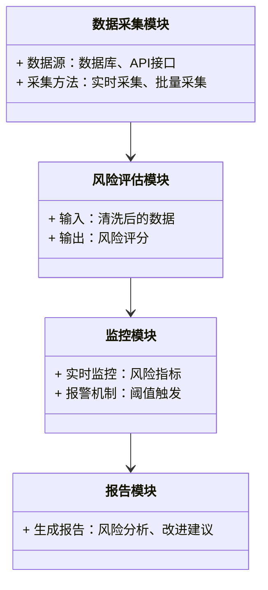

                 


# AI驱动的供应链金融风险管理

> 关键词：供应链金融，风险管理，人工智能，机器学习，深度学习，供应链管理，金融风险管理，人工智能技术，风险管理模型，供应链数据分析

> 摘要：供应链金融风险管理是企业运营中的重要环节，传统方法存在效率低、成本高、风险识别不准确等问题。随着人工智能技术的发展，AI驱动的供应链金融风险管理逐渐成为研究热点。本文从供应链金融的定义出发，详细分析AI在供应链金融风险管理中的应用场景，探讨基于机器学习和深度学习的算法原理，结合系统架构设计和项目实战，总结AI驱动的供应链金融风险管理的优势与挑战，为读者提供全面的技术解读和实践指导。

---

## 第一部分：供应链金融风险管理的背景与挑战

### 第1章：供应链金融与风险管理概述

#### 1.1 供应链金融的定义与特点

供应链金融是一种通过整合供应链上下游资源，为企业提供资金支持的金融模式。其特点包括：

- **多参与方**：涉及供应商、制造商、分销商、零售商和金融机构等。
- **资金流优化**：通过供应链中的数据流，优化资金分配，降低融资成本。
- **数据驱动**：依赖于供应链中的实时数据，进行精准的融资决策。

#### 1.2 供应链金融风险管理的必要性

供应链金融风险管理是确保供应链稳定性和资金安全的关键。主要风险类型包括：

- **信用风险**：供应商或客户的违约风险。
- **操作风险**：供应链中的操作失误或欺诈行为。
- **市场风险**：市场波动对供应链的影响。

#### 1.3 AI技术在供应链金融风险管理中的应用

AI技术通过大数据分析、机器学习和深度学习，为供应链金融风险管理提供高效解决方案。AI的优势在于：

- **实时性**：快速处理海量数据，实时监控风险。
- **精准性**：通过模型分析，提高风险识别的准确性。
- **可扩展性**：适用于大规模、复杂的供应链场景。

---

### 第2章：供应链金融风险管理的核心概念

#### 2.1 核心概念与联系

供应链金融风险管理涉及多个核心概念，包括数据来源、模型选择和风险类型。以下是核心概念的属性特征对比：

| 概念       | 属性特征                   |
|------------|---------------------------|
| 数据来源   | 多样性、实时性             |
| 模型选择   | 监督学习、无监督学习       |
| 风险类型   | 信用风险、操作风险、市场风险 |

实体关系图如下：


#### 2.2 数据驱动的供应链金融风险管理

数据是AI驱动风险管理的基础。数据来源包括供应链中的交易数据、物流数据和市场数据。数据处理的关键步骤包括数据清洗、特征提取和数据增强。

#### 2.3 AI驱动的风险管理模型

AI模型的选择与训练是风险管理的核心。常用的模型包括随机森林和XGBoost，用于分类和回归任务。模型部署后，需要定期更新和优化，以应对数据分布的变化。

---

## 第二部分：AI驱动的供应链金融风险管理算法原理

### 第3章：供应链金融风险管理的算法原理

#### 3.1 机器学习基础

机器学习是AI驱动风险管理的核心技术。主要分类包括监督学习、无监督学习和强化学习。监督学习适用于有标签的数据，如分类任务。

#### 3.2 基于机器学习的供应链金融风险管理算法

随机森林是一种基于决策树的集成学习算法，适用于特征重要性分析和高维数据处理。其流程如下：

1. **数据预处理**：清洗数据，处理缺失值。
2. **特征选择**：提取关键特征，如供应商信用评分。
3. **模型训练**：构建随机森林模型，训练数据。
4. **风险评估**：预测供应链中的风险等级。

公式示例：

随机森林的投票结果计算：

$$
\text{投票结果} = \sum_{i=1}^{n} \text{投票数}_i
$$

---

## 第三部分：供应链金融风险管理的系统架构设计

### 第4章：系统架构设计与实现

#### 4.1 系统功能设计

系统功能包括数据采集、风险评估、监控和报告。以下是领域模型类图：



#### 4.2 系统架构设计

系统架构采用分层设计，包括数据层、应用层和表现层。以下是系统架构图：

```mermaid
archi
    组件 数据层 {
        数据库：MySQL
        数据接口：API
    }
    组件 应用层 {
        数据处理服务：ETL工具
        模型服务：机器学习模型
    }
    组件 表现层 {
        用户界面：Web界面
        报告生成器
    }
    数据层 --> 应用层
    应用层 --> 表现层
```

---

## 第四部分：项目实战与应用

### 第5章：项目实战：AI驱动的供应链金融风险管理系统开发

#### 5.1 环境安装与数据准备

安装Python、TensorFlow和Scikit-learn。数据准备包括清洗和特征工程。

#### 5.2 核心代码实现

以下是随机森林模型的代码示例：

```python
import pandas as pd
from sklearn.ensemble import RandomForestClassifier
from sklearn.metrics import accuracy_score

# 数据加载
data = pd.read_csv('supply_chain_data.csv')

# 特征与标签分离
X = data.drop('risk', axis=1)
y = data['risk']

# 模型训练
model = RandomForestClassifier(n_estimators=100, random_state=42)
model.fit(X, y)

# 模型预测
predictions = model.predict(X)
print("Accuracy:", accuracy_score(y, predictions))
```

#### 5.3 实际案例分析

以汽车行业为例，分析供应链中的供应商信用风险。通过模型预测，识别高风险供应商，并制定相应的风险管理策略。

---

## 第五部分：总结与展望

### 第6章：总结与展望

#### 6.1 总结

AI驱动的供应链金融风险管理通过大数据分析和机器学习模型，显著提高了风险识别的准确性和效率。其优势包括实时性、精准性和可扩展性。

#### 6.2 未来展望

未来的研究方向包括深度学习的应用、多模态数据的融合和实时监控系统的优化。AI技术将进一步提升供应链金融的风险管理能力，推动金融与科技的深度融合。

---

## 作者简介

作者：AI天才研究院 & 禅与计算机程序设计艺术

作者简介：专注于人工智能与计算机程序设计的交叉研究，致力于通过技术创新解决实际问题，推动AI技术在供应链金融等领域的深度应用。

