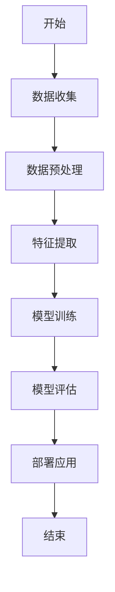
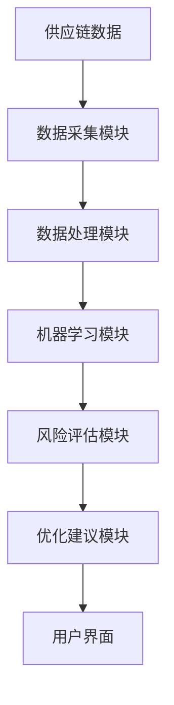

                 


# AI驱动的供应链韧性分析：评估公司长期竞争力

## 关键词：AI, 供应链韧性, 供应链分析, 供应链管理, 企业竞争力

## 摘要：供应链韧性是企业在复杂多变的市场环境中维持稳定运营的关键能力。本文通过AI技术驱动的供应链韧性分析，探讨如何评估和提升企业的长期竞争力。文章详细介绍了供应链韧性的核心概念、AI算法的实现原理、系统架构设计以及实际应用案例，为读者提供全面的理论与实践指导。

---

## 第一部分：供应链韧性分析的背景与概念

### 第1章：供应链韧性分析的背景与问题背景

#### 1.1 供应链韧性的概念与重要性

供应链韧性是指在面对 disruptions时，企业能够维持或恢复供应链稳定性的能力。在当今全球化和数字化的商业环境中，供应链韧性直接关系到企业的生存和长期发展。随着市场波动加剧和全球供应链的复杂性增加，企业必须具备快速响应和适应变化的能力，这正是供应链韧性所关注的核心。

供应链韧性的重要性体现在以下几个方面：
- **稳定性**：确保在突发事件（如自然灾害、疫情）下，供应链仍能保持运作。
- **响应能力**：快速识别和应对供应链中的潜在风险。
- **恢复能力**：在中断后迅速恢复正常运作。

#### 1.2 问题背景与问题描述

当前，全球供应链面临诸多挑战：
- **全球化带来的复杂性**：跨国供应链涉及更多环节和风险点。
- **不确定性增加**：地缘政治冲突、疫情、经济波动等因素频发，导致供应链中断风险上升。
- **传统供应链管理的局限性**：依赖人工经验，缺乏数据驱动的预测和决策能力。

供应链中断对企业的影响是多方面的：
- **成本增加**：库存积压或短缺导致生产中断和成本上升。
- **客户满意度下降**：交货延迟影响客户信任和品牌声誉。
- **竞争优势丧失**：无法及时响应市场需求，错失商业机会。

#### 1.3 问题解决思路

引入AI技术驱动供应链韧性分析，能够显著提升企业的应对能力：
- **数据驱动的预测**：利用历史数据和实时信息，预测潜在风险。
- **智能决策支持**：通过机器学习模型，优化供应链布局和库存管理。
- **实时监控与反馈**：建立智能监控系统，快速响应突发事件。

AI技术的优势在于其强大的数据处理能力和学习能力，能够帮助企业在复杂环境中做出更明智的决策。

#### 1.4 供应链韧性分析的边界与外延

供应链韧性分析的范围界定：
- **分析对象**：从原材料采购到产品交付的整个供应链流程。
- **关键节点**：供应商、制造商、物流商、零售商等。
- **时间范围**：涵盖日常运营中的潜在风险和长期规划。

外延部分包括：
- **上游供应链**：原材料供应商的稳定性。
- **下游供应链**：客户需求的变化和市场波动。
- **外部因素**：如政策变化、自然灾害等不可控因素。

通过明确边界和外延，可以更精准地聚焦于关键问题，确保分析的有效性。

#### 1.5 核心概念与核心要素

供应链韧性分析的核心要素包括：
- **稳定性**：供应链在正常情况下的运作能力。
- **响应能力**：快速适应变化的能力。
- **恢复能力**：从中断中恢复的能力。

核心概念的结构化展示：
- 供应链韧性是一个多维度的系统，各要素相互关联，共同影响整体表现。

---

## 第二部分：供应链韧性分析的核心概念与联系

### 第2章：供应链韧性分析的核心概念

#### 2.1 核心概念的原理

供应链韧性分析的原理基于以下几个方面：
- **系统性**：供应链是一个复杂的系统，各部分相互依赖。
- **动态性**：供应链在不断变化的环境中运作，需要灵活应对。
- **数据驱动**：利用大数据分析，识别潜在风险并制定应对策略。

#### 2.2 核心概念的属性特征对比

以下是弹性、恢复力和冗余的对比分析：

| 特性 | 弹性 | 恢复力 | 冗余 |
|------|------|--------|------|
| 定义 | 应对变化的能力 | 恢复到正常状态的能力 | 备用资源或系统的存在 |
| 作用 | 减轻冲击 | 缩短恢复时间 | 提供备用方案 |
| 优势 | 灵活性高 | 快速恢复 | 增强可靠性 |
| 局限 | 可能增加成本 | 可能依赖外部资源 | 可能增加复杂性 |

#### 2.3 ER实体关系图架构

以下是供应链韧性分析的ER图：

```mermaid
erd
    supplier(SupplierID, Name, Location)
    product(ProductID, ProductName, Category)
    order(OrderID, OrderDate, TotalAmount)
    inventory(InventoryID, Quantity, Location)
    shipment(ShipmentID, ShipmentDate, TrackingNumber)
    risk(RiskID, RiskType, ImpactLevel)
    resilience(ResilienceID, ResilienceScore, Timestamp)
    -- 实体之间的关系：
    supplier --> product: 提供
    product --> order: 订单包含
    order --> inventory: 存货准备
    inventory --> shipment: 发货处理
    shipment --> risk: 风险评估
    risk --> resilience: 影响韧性评分
```

---

## 第三部分：AI驱动的供应链韧性分析算法原理

### 第3章：AI驱动的供应链韧性分析算法

#### 3.1 算法原理概述

AI在供应链韧性分析中的应用主要体现在以下几个方面：
- **预测模型**：利用历史数据预测潜在风险。
- **分类模型**：识别高风险供应商或环节。
- **优化模型**：优化供应链布局，降低风险影响。

算法的实现步骤如下：
1. 数据收集：整合供应链各环节的数据。
2. 数据预处理：清洗和特征提取。
3. 模型训练：训练机器学习模型。
4. 模型评估：验证模型的准确性。
5. 部署应用：实时监控和风险预警。

#### 3.2 算法流程图

以下是算法流程图：



#### 3.3 数学模型与公式

供应链韧性指数的计算公式如下：

$$
R = \sum_{i=1}^{n} w_i \times f_i
$$

其中，\( R \) 表示供应链韧性指数，\( w_i \) 表示第 \( i \) 个因素的权重，\( f_i \) 表示第 \( i \) 个因素的评估值。

例如，供应商稳定性评估：

$$
S = \frac{\sum_{j=1}^{m} s_j}{m}
$$

其中，\( S \) 表示供应商稳定性，\( s_j \) 表示第 \( j \) 个供应商的评分，\( m \) 表示供应商总数。

---

## 第四部分：系统分析与架构设计

### 第4章：系统分析与架构设计

#### 4.1 问题场景介绍

系统将分析一个典型的供应链中断场景，例如自然灾害导致的原材料供应中断。系统需要快速识别受影响环节，评估风险，并提出优化建议。

#### 4.2 系统功能设计

系统功能模块包括：
- **数据采集模块**：收集供应链各环节的数据。
- **风险评估模块**：识别潜在风险并评估影响。
- **优化建议模块**：提供调整供应链布局的建议。

#### 4.3 系统架构设计

以下是系统架构图：



---

## 第五部分：项目实战

### 第5章：项目实战

#### 5.1 环境安装

安装Python和相关库：

```bash
pip install numpy pandas scikit-learn
```

#### 5.2 核心代码实现

以下是核心代码：

```python
import numpy as np
import pandas as pd
from sklearn.model_selection import train_test_split
from sklearn.linear_model import LinearRegression

# 数据加载
data = pd.read_csv('supply_chain.csv')

# 特征与目标变量分离
X = data.drop('resilience_score', axis=1)
y = data['resilience_score']

# 数据分割
X_train, X_test, y_train, y_test = train_test_split(X, y, test_size=0.2)

# 模型训练
model = LinearRegression()
model.fit(X_train, y_train)

# 模型评估
score = model.score(X_test, y_test)
print(f'模型评分：{score}')
```

#### 5.3 代码解读与分析

该代码实现了一个线性回归模型，用于预测供应链韧性评分。数据加载、特征提取、模型训练和评估是关键步骤。

#### 5.4 案例分析

通过分析实际案例，验证模型的有效性。例如，假设某公司供应链中断，模型能够预测其韧性评分，并提出优化建议。

#### 5.5 项目总结

项目通过AI技术实现了供应链韧性分析，为企业提供了数据驱动的决策支持，显著提升了企业的应对能力。

---

## 第六部分：最佳实践

### 第6章：最佳实践

#### 6.1 小结

供应链韧性分析是企业在数字化转型中必须掌握的关键技能。通过AI技术的应用，企业能够更有效地应对供应链中断的风险，提升长期竞争力。

#### 6.2 注意事项

- 数据质量是模型准确性的重要保障，需确保数据的完整性和准确性。
- 模型的可解释性是实际应用中的关键因素，需选择适合业务需求的模型。
- 持续监控和优化是维持供应链韧性的长期任务。

#### 6.3 拓展阅读

推荐书籍和资源：
- 《供应链管理：战略、规划与运营》
- 《机器学习实战》
- Coursera上的供应链管理在线课程

---

## 作者：AI天才研究院 & 禅与计算机程序设计艺术

通过本文，读者可以系统地了解AI驱动的供应链韧性分析，并掌握实际应用的方法。希望本文能为企业的供应链管理提供有价值的参考，帮助企业提升竞争力。

