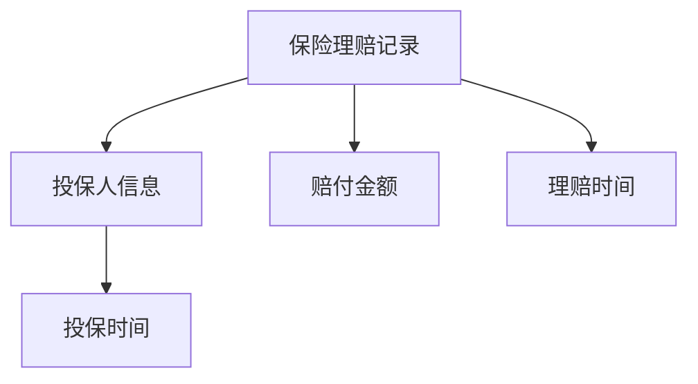

                 

# AI驱动的保险理赔欺诈模式识别

> 关键词：保险欺诈、AI技术、模式识别、机器学习、保险理赔

> 摘要：本文探讨了利用人工智能技术识别保险理赔欺诈模式的方法。从保险欺诈的基本概念到AI技术在保险行业的应用现状，再到欺诈模式识别的核心概念与联系、算法原理、系统分析与架构设计、项目实战以及总结与展望，全面解析了AI在保险欺诈识别中的应用。通过实际案例分析和代码实现，展示了如何利用AI技术有效识别和防范保险理赔中的欺诈行为。

---

## 第一部分: AI驱动的保险理赔欺诈模式识别基础

## 第1章: 保险理赔欺诈模式识别的背景与基础

### 1.1 保险欺诈的基本概念

#### 1.1.1 保险欺诈的定义与分类

保险欺诈是指故意提供虚假信息、隐瞒事实或虚构保险事故，以获得不正当利益的行为。根据欺诈主体和行为特征的不同，保险欺诈可以分为以下几类：

1. **投保人欺诈**：投保人故意隐瞒健康状况、职业风险等重要信息，或虚构保险事故。
2. **被保险人欺诈**：被保险人故意制造保险事故或夸大损失程度，以骗取赔偿。
3. **受益人欺诈**：受益人故意编造保险事故或提供虚假身份信息，以获取不当利益。
4. **保险从业人员欺诈**：保险销售或理赔人员利用职务之便，协助投保人或被保险人进行欺诈活动。

#### 1.1.2 保险欺诈的常见模式

1. **虚报损失**：夸大损失金额或损失范围，以获取更多赔偿。
2. **虚构保险事故**：编造不存在的保险事故，如交通事故、疾病等。
3. **重复理赔**：同一保险事故在多家保险公司重复申请理赔。
4. **恶意退保**：投保人故意制造保险事故后退保，骗取保险金。

#### 1.1.3 保险欺诈的经济损失与社会影响

保险欺诈不仅造成了保险公司的经济损失，还增加了保险产品的成本，最终转嫁给消费者。此外，保险欺诈行为破坏了保险市场的公平性，损害了诚信投保人的利益，影响了保险行业的健康发展。

---

### 1.2 AI技术在保险行业的应用现状

#### 1.2.1 AI技术的基本概念与特点

人工智能（AI）是指模拟人类智能的计算机系统，具备学习、推理、识别和语言处理等能力。AI技术在保险行业的应用主要体现在以下几个方面：

1. **自动化理赔**：利用AI技术自动处理理赔申请，减少人工干预。
2. **风险评估**：通过机器学习模型分析客户数据，评估投保风险。
3. **欺诈检测**：利用AI技术识别异常行为和模式，发现潜在的欺诈行为。

#### 1.2.2 AI在保险行业的典型应用领域

1. **客户画像构建**：通过大数据分析和机器学习，构建客户的三维画像，用于精准营销和风险评估。
2. **智能客服**：利用自然语言处理技术，提供智能客服服务，解答客户疑问。
3. **理赔自动化**：通过图像识别技术自动识别理赔材料，简化理赔流程。

#### 1.2.3 AI驱动保险欺诈识别的优势与挑战

**优势**：
1. **高效性**：AI技术能够快速处理大量数据，提高欺诈识别的效率。
2. **准确性**：通过机器学习模型，能够发现隐藏在数据中的异常模式，提高欺诈识别的准确性。
3. **实时性**：AI技术能够实时监控理赔行为，及时发现潜在的欺诈行为。

**挑战**：
1. **数据隐私问题**：保险数据涉及客户隐私，如何在保护隐私的前提下进行数据分析是一个重要挑战。
2. **模型解释性**：复杂的机器学习模型往往缺乏可解释性，影响了在实际应用中的信任度。
3. **数据质量**：保险数据的准确性和完整性对模型的性能有直接影响，数据质量差可能影响欺诈识别的效果。

---

### 1.3 保险理赔流程与欺诈识别的关键环节

#### 1.3.1 保险理赔的基本流程

保险理赔的基本流程包括以下几个步骤：

1. **报案**：投保人或被保险人发生保险事故后，向保险公司报案。
2. **立案**：保险公司根据报案信息进行立案，并分配理赔人员。
3. **审核**：理赔人员审核理赔申请，包括资料的完整性、真实性等。
4. **调查**：对于复杂的理赔案件，保险公司会进行现场调查。
5. **赔付**：审核通过后，保险公司向受益人支付赔款。

#### 1.3.2 欺诈理赔的主要特征与识别难点

**主要特征**：
1. **理赔金额异常**：理赔金额远高于保额或与实际损失不符。
2. **理赔时间集中**：短时间内集中申请理赔。
3. **理赔地点异常**：理赔地点集中在某些特定区域。
4. **客户行为异常**：投保人或被保险人行为异常，如频繁变更保单信息。

**识别难点**：
1. **数据不足**：部分案件缺乏足够的数据支持，难以进行准确判断。
2. **模型泛化能力**：机器学习模型的泛化能力不足，难以应对复杂多变的欺诈模式。
3. **人为干扰**：保险从业人员的道德风险可能干扰欺诈识别的结果。

#### 1.3.3 智能化欺诈识别的需求与趋势

随着保险行业的不断发展，保险欺诈手段也在不断升级。传统的基于规则的欺诈识别方法已经难以应对复杂的欺诈模式。因此，智能化的欺诈识别需求日益迫切。未来，随着AI技术的不断进步，保险欺诈识别将更加智能化、精准化和实时化。

---

## 第2章: 欺诈模式识别的核心概念与联系

### 2.1 核心概念原理

#### 2.1.1 数据特征提取的基本原理

数据特征提取是欺诈模式识别的基础，通过对理赔数据的特征提取，可以发现隐藏在数据中的异常模式。常见的数据特征包括：

1. **时间特征**：理赔申请的时间、报案时间、赔付时间等。
2. **金额特征**：理赔金额、保额、历史赔付记录等。
3. **行为特征**：投保人的行为模式、理赔地点、理赔频率等。
4. **身份特征**：投保人、被保险人和受益人的身份信息。

#### 2.1.2 模式识别的数学基础

模式识别主要依赖于统计学习和机器学习技术。常用的数学工具包括：

1. **统计学方法**：如贝叶斯定理、马尔可夫链等。
2. **线性代数**：如矩阵运算、特征分解等。
3. **概率论**：如条件概率、似然函数等。

#### 2.1.3 欺诈行为的统计与概率模型

常用的统计与概率模型包括：

1. **贝叶斯网络**：用于建模变量之间的依赖关系，可用于欺诈风险评估。
2. **马尔可夫链**：用于建模序列数据，可用于分析理赔行为的时间序列特征。
3. **聚类分析**：用于将理赔案件分为不同的类别，识别异常类别。

---

### 2.2 核心概念属性特征对比表

| 特征类型 | 正常理赔 | 欺诈理赔 |
|----------|----------|----------|
| 申请时间 | 分散均匀 | 集中异常 |
| 赔付金额 | 符合保额 | 远超保额 |
| 受保人年龄 | 合理范围 | 偏好特定年龄段 |
| 理赔地点 | 真实地址 | 虚假或偏远地址 |

---

### 2.3 ER实体关系图

---

## 总结

本文从保险欺诈的基本概念出发，介绍了AI技术在保险行业的应用现状，详细讲解了欺诈模式识别的核心概念与联系。通过对保险理赔流程的分析，探讨了欺诈识别的关键环节和难点。未来，随着AI技术的不断发展，保险欺诈识别将更加智能化和精准化，为保险行业的发展提供有力支持。

---

**作者：AI天才研究院/AI Genius Institute & 禅与计算机程序设计艺术 /Zen And The Art of Computer Programming**

