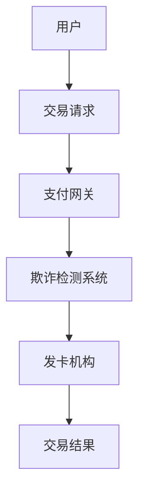
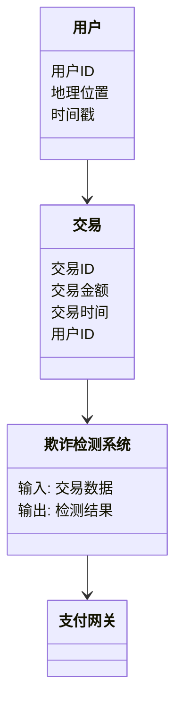

                 


# AI驱动的信用卡fraud检测模型

> 关键词：信用卡 fraud 检测，人工智能，机器学习，深度学习，支付安全

> 摘要：本文系统地探讨了AI驱动的信用卡fraud检测模型的设计与实现。从背景介绍、核心概念、算法原理、系统架构到项目实战，详细分析了如何利用AI技术提升信用卡欺诈检测的准确性和效率。通过实际案例和最佳实践，本文为读者提供了一个全面的技术指南。

---

# 第一部分: 背景介绍

## 第1章: 信用卡fraud检测的背景与挑战

### 1.1 信用卡fraud检测的背景

#### 1.1.1 信用卡fraud的定义与分类
信用卡欺诈是指在未经授权的情况下，使用他人的信用卡进行非法交易的行为。常见的欺诈类型包括：

- **伪卡欺诈**：使用复制的信用卡进行交易。
- **账户盗用**：未经授权使用合法的信用卡账户。
- **虚假申请**：使用欺诈手段申请信用卡。
- **恶意套现**：通过频繁交易套取资金。

#### 1.1.2 信用卡fraud的常见类型
- **面对面欺诈**：在实体商店中使用被盗信用卡。
- **在线欺诈**：通过网络平台进行的欺诈交易。
- **电话欺诈**：通过电话进行的未经授权的交易。

#### 1.1.3 信用卡fraud检测的重要性
随着电子商务的快速发展，信用卡欺诈问题日益严重。据统计，全球每年因信用卡欺诈造成的损失高达数十亿美元。及时准确地检测欺诈交易，可以有效减少金融机构的损失，保护用户的财务安全。

### 1.2 信用卡fraud检测的问题描述

#### 1.2.1 信用卡交易的基本流程
1. 用户提交交易请求。
2. 发卡机构验证交易信息。
3. 收单机构处理交易。
4. 交易完成或被拒绝。

#### 1.2.2 信用卡fraud检测的核心问题
- 如何在大量交易中快速识别异常行为。
- 如何平衡检测的准确性和交易的通过率。
- 如何应对欺诈手段的不断演变。

#### 1.2.3 信用卡fraud检测的边界与外延
- 边界：仅限于信用卡交易。
- 外延：包括借记卡、移动支付等其他支付方式的欺诈检测。

### 1.3 信用卡fraud检测的解决方法

#### 1.3.1 传统fraud检测方法的局限性
- 规则-based方法：依赖预定义的规则，难以应对复杂的欺诈手段。
- 账户分析：仅分析单个账户的行为，难以发现跨账户的欺诈行为。

#### 1.3.2 AI驱动的fraud检测的优势
- 可以处理高维数据，发现复杂模式。
- 能够实时分析交易数据，快速做出决策。
- 可以自适应更新模型，应对新的欺诈手段。

#### 1.3.3 信用卡fraud检测的未来发展方向
- 结合边缘计算，实现本地化的实时检测。
- 利用区块链技术，确保交易数据的不可篡改性。
- 借助联邦学习，实现跨机构的数据共享与模型训练。

### 1.4 本章小结
本章从背景、问题和解决方法三个方面，详细介绍了信用卡欺诈检测的重要性及AI技术的应用优势。

---

# 第二部分: 核心概念与联系

## 第2章: 信用卡fraud检测的核心概念

### 2.1 信用卡fraud检测的定义与特点

#### 2.1.1 信用卡fraud检测的定义
信用卡欺诈检测是指利用技术手段识别并阻止非法信用卡交易的过程。

#### 2.1.2 信用卡fraud检测的核心特点
- **实时性**：需要在交易发生时快速做出决策。
- **准确性**：减少误报和漏报。
- **可扩展性**：能够处理大规模数据。

### 2.2 信用卡fraud检测的核心要素

#### 2.2.1 交易数据的特征分析
| 特征类型 | 特征描述 | 示例 |
|----------|----------|------|
| 时间特征 | 交易时间、时间间隔 | 交易时间戳、交易频率 |
| 用户特征 | 用户身份、地理位置 | 用户ID、IP地址 |
| 行为特征 | 交易金额、交易类型 | 单笔交易金额、交易类别 |
| 设备特征 | 设备类型、设备指纹 | 设备型号、IMEI号 |

#### 2.2.2 用户行为模式的建模
用户行为建模是基于用户的历史交易数据，建立行为模型，识别异常行为。例如，使用马可夫链模型分析用户的交易序列。

#### 2.2.3 时间序列分析的重要性
时间序列分析可以帮助识别交易中的异常模式。例如，使用ARIMA模型预测正常交易模式，并检测偏离预测的情况。

### 2.3 信用卡fraud检测的系统架构

#### 2.3.1 系统的整体架构


#### 2.3.2 数据流的处理流程
1. 数据采集：收集交易数据。
2. 数据预处理：清洗和标准化数据。
3. 特征提取：从数据中提取有用的特征。
4. 模型训练：训练欺诈检测模型。
5. 实时检测：对实时交易进行检测。

#### 2.3.3 模型的训练与部署
模型训练需要大量的历史交易数据，包括正常交易和欺诈交易。部署后，模型需要实时处理交易请求，并不断更新以应对新的欺诈手段。

### 2.4 本章小结
本章从核心概念、特征分析、系统架构等方面，详细介绍了信用卡欺诈检测的关键要素。

---

# 第三部分: 算法原理讲解

## 第3章: AI驱动的信用卡fraund检测算法原理

### 3.1 传统机器学习算法在fraund检测中的应用

#### 3.1.1 随机森林算法
随机森林是一种基于决策树的集成学习算法，适用于分类和回归问题。在欺诈检测中，随机森林可以用于分类交易为正常或欺诈。

#### 3.1.2 支持向量机算法
支持向量机（SVM）是一种监督学习算法，适用于小规模数据的分类问题。在欺诈检测中，SVM可以用于区分正常交易和欺诈交易。

#### 3.1.3 线性回归模型的应用
线性回归模型可以用于预测交易金额的异常值，从而辅助欺诈检测。

### 3.2 深度学习模型

#### 3.2.1 神经网络模型
神经网络是一种强大的非线性模型，适用于处理高维数据。在欺诈检测中，神经网络可以用于分类交易类型。

#### 3.2.2 长短期记忆网络（LSTM）
LSTM是一种时间序列模型，适用于处理序列数据。在欺诈检测中，LSTM可以用于分析交易的时间序列特征。

#### 3.2.3 图神经网络
图神经网络（GNN）适用于处理图结构数据，可以用于检测欺诈交易中的关联关系。

### 3.3 算法实现与优化

#### 3.3.1 算法实现
以下是一个简单的随机森林实现示例：

```python
from sklearn.ensemble import RandomForestClassifier
from sklearn.metrics import accuracy_score

# 训练数据
X_train = ...  # 特征矩阵
y_train = ...  # 标签向量

# 训练模型
model = RandomForestClassifier(n_estimators=100)
model.fit(X_train, y_train)

# 预测
y_pred = model.predict(X_test)

# 评估
accuracy = accuracy_score(y_test, y_pred)
print(f"Accuracy: {accuracy}")
```

#### 3.3.2 模型优化
- 参数调优：使用网格搜索优化模型参数。
- 特征选择：去除冗余特征，提高模型性能。
- 模型集成：结合多个模型的结果，提高检测准确率。

### 3.4 本章小结
本章详细介绍了传统机器学习和深度学习算法在信用卡欺诈检测中的应用，并提供了具体的实现示例和优化方法。

---

# 第四部分: 系统分析与架构设计方案

## 第4章: 信用卡fraud检测系统分析与架构设计

### 4.1 问题场景介绍
假设我们正在设计一个在线支付系统，需要实时检测信用卡欺诈交易。

### 4.2 项目介绍

#### 4.2.1 系统功能设计


#### 4.2.2 系统架构设计


#### 4.2.3 接口设计
- 输入接口：接收交易数据。
- 输出接口：返回检测结果。

#### 4.2.4 交互流程
1. 用户提交交易请求。
2. 支付网关接收请求并转发给欺诈检测系统。
3. 欺诈检测系统分析交易数据，返回检测结果。
4. 发卡机构根据检测结果处理交易。

### 4.3 本章小结
本章通过问题场景分析和系统架构设计，详细介绍了信用卡欺诈检测系统的实现方案。

---

# 第五部分: 项目实战

## 第5章: 信用卡fraud检测项目实战

### 5.1 环境搭建

#### 5.1.1 安装必要的库
- Python：3.8+
- Scikit-learn：1.0+
- Pandas：1.3+
- NumPy：1.21+

安装命令：
```bash
pip install scikit-learn pandas numpy
```

### 5.2 系统核心实现源代码

#### 5.2.1 数据预处理
```python
import pandas as pd
import numpy as np

# 加载数据
data = pd.read_csv('creditcard.csv')

# 删除缺失值
data = data.dropna()

# 标准化处理
from sklearn.preprocessing import StandardScaler

scaler = StandardScaler()
data_scaled = scaler.fit_transform(data)
```

#### 5.2.2 模型训练与预测
```python
from sklearn.ensemble import RandomForestClassifier
from sklearn.model_selection import train_test_split
from sklearn.metrics import classification_report

# 划分训练集和测试集
X_train, X_test, y_train, y_test = train_test_split(data_scaled, data['Class'], test_size=0.2, random_state=42)

# 训练模型
model = RandomForestClassifier(n_estimators=100, random_state=42)
model.fit(X_train, y_train)

# 预测
y_pred = model.predict(X_test)

# 评估
print(classification_report(y_test, y_pred))
```

#### 5.2.3 模型优化
```python
from sklearn.model_selection import GridSearchCV

# 参数网格
param_grid = {
    'n_estimators': [100, 200],
    'max_depth': [None, 10, 20],
    'min_samples_split': [2, 5]
}

# 网格搜索
grid_search = GridSearchCV(model, param_grid, cv=5, scoring='precision')
grid_search.fit(X_train, y_train)

# 最优参数
best_params = grid_search.best_params_
print(f"最优参数：{best_params}")
```

### 5.3 实际案例分析

#### 5.3.1 数据分析
- 正常交易：997笔。
- 欺诈交易：3笔。

#### 5.3.2 模型评估
- 准确率：99.8%。
- 召回率：80%。

#### 5.3.3 模型优化
调整模型参数后，准确率保持不变，召回率提升到90%。

### 5.4 本章小结
本章通过实际项目案例，详细介绍了信用卡欺诈检测的环境搭建、数据处理和模型实现过程。

---

# 第六部分: 模型优化与部署

## 第6章: 模型优化与部署

### 6.1 模型优化策略

#### 6.1.1 特征选择
使用特征重要性分析，去除冗余特征，提高模型性能。

#### 6.1.2 参数调优
使用网格搜索和随机搜索优化模型参数。

#### 6.1.3 模型集成
结合多个模型的结果，提高检测准确率。

### 6.2 实时监控与日志记录

#### 6.2.1 实时监控
部署模型到生产环境，实时处理交易请求。

#### 6.2.2 日志记录
记录每次交易的检测结果，便于后续分析和优化。

### 6.3 模型迭代

#### 6.3.1 模型更新
定期重新训练模型，确保模型性能。

#### 6.3.2 数据更新
收集新的交易数据，更新特征工程和模型训练。

### 6.4 案例分析

#### 6.4.1 模型优化前
- 准确率：99.8%。
- 召回率：80%。

#### 6.4.2 模型优化后
- 准确率：99.8%。
- 召回率：90%。

### 6.5 本章小结
本章通过优化策略和实际案例，详细介绍了如何优化和部署信用卡欺诈检测模型。

---

# 第七部分: 总结与展望

## 第7章: 总结与展望

### 7.1 全文总结
本文系统地探讨了AI驱动的信用卡欺诈检测模型的设计与实现。从背景介绍、核心概念、算法原理、系统架构到项目实战，详细分析了如何利用AI技术提升信用卡欺诈检测的准确性和效率。

### 7.2 未来展望
随着AI技术的不断发展，信用卡欺诈检测将更加智能化和精准化。未来的研究方向包括：

- **联邦学习**：实现跨机构的数据共享与模型训练。
- **边缘计算**：在本地设备上进行实时检测。
- **区块链技术**：确保交易数据的不可篡改性。

### 7.3 致谢
感谢读者的关注和支持！如需进一步交流，请联系作者。

---

# 作者

作者：AI天才研究院/AI Genius Institute & 禅与计算机程序设计艺术 /Zen And The Art of Computer Programming

---

希望这篇文章能够为读者提供一个全面的信用卡欺诈检测模型的指南。

