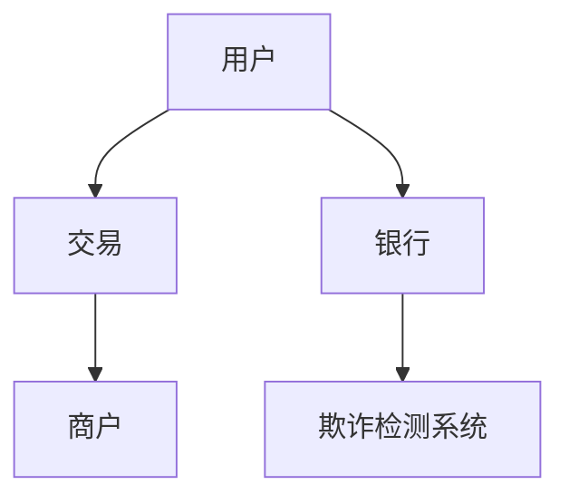
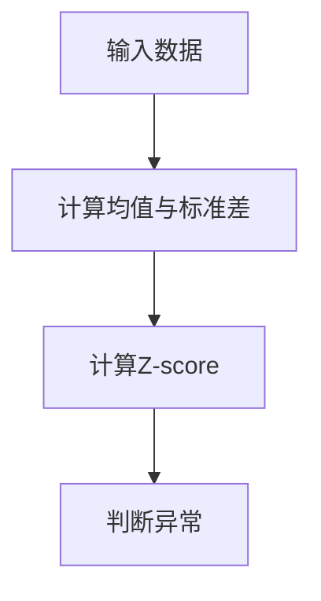
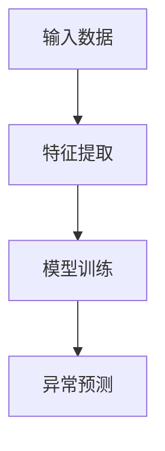
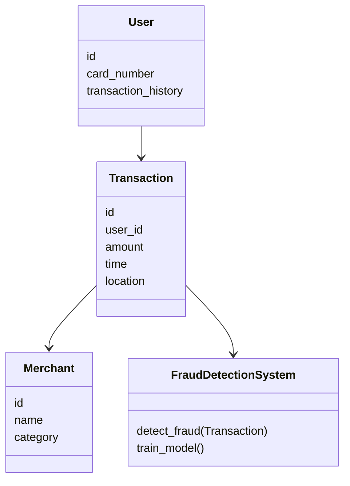
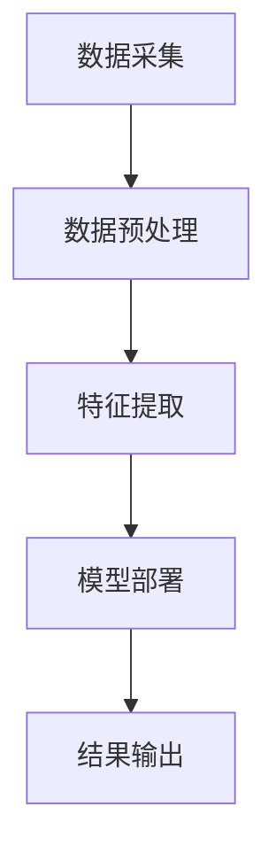

                 


# AI驱动的信用卡异常交易实时检测

> 关键词：信用卡异常交易，实时检测，人工智能，机器学习，欺诈检测

> 摘要：本文深入探讨了利用人工智能技术实现信用卡异常交易实时检测的方法，从问题背景、核心概念、算法原理到系统架构，再到项目实战，全面分析了该领域的关键技术和实际应用。通过结合具体案例和代码实现，为读者提供了从理论到实践的完整指南。

---

## 第一部分: 信用卡异常交易实时检测的背景与挑战

### 第1章: 异常交易检测的背景与问题定义

#### 1.1 信用卡交易的基本概念

- **1.1.1 信用卡交易的定义与特点**
  - 信用卡交易是指用户通过信用卡进行消费、转账等操作的过程。
  - 其特点包括：实时性、多参与者（用户、商家、银行等）、数据量大等。

- **1.1.2 信用卡交易的参与者与流程**
  - 参与者包括：持卡人、商户、发卡银行、收单机构、支付网关。
  - 流程包括：交易发起、支付授权、交易清算、资金结算。

- **1.1.3 信用卡交易中的风险类型**
  - 常见风险包括：欺诈交易、虚假交易、恶意套现等。

#### 1.2 异常交易检测的必要性

- **1.2.1 信用卡欺诈的现状与趋势**
  - 随着电子商务的发展，信用卡欺诈案件逐年增加。
  - 欺诈手段多样化，如身份盗用、恶意交易、薅羊毛等。

- **1.2.2 异常交易检测的重要性**
  - 及时发现并阻止异常交易，可以减少持卡人损失。
  - 保护金融机构的声誉和财务安全。
  - 提高用户体验，降低误拒率。

- **1.2.3 异常交易检测的边界与外延**
  - 边界：仅关注信用卡交易，不涉及借记卡或其他支付方式。
  - 外延：包括交易金额、时间、地点、用户行为等多个维度。

#### 1.3 问题描述与目标设定

- **1.3.1 异常交易检测的核心问题**
  - 如何从海量交易数据中快速识别出异常交易。
  - 如何在实时场景下实现高效的异常检测。

- **1.3.2 检测目标的明确化**
  - 实时性：必须在交易发生时立即检测。
  - 准确性：尽可能减少误报和漏报。
  - 可扩展性：支持高并发和大规模数据。

- **1.3.3 检测系统的性能指标**
  - 响应时间：小于等于1秒。
  - 准确率：高于95%。
  - 处理能力：每秒处理数万笔交易。

---

## 第二部分: AI驱动的异常交易检测核心概念与联系

### 第2章: 异常交易检测的核心概念

#### 2.1 AI在异常交易检测中的作用

- **2.1.1 机器学习在交易分析中的应用**
  - 常见算法：随机森林、XGBoost、逻辑回归。
  - 应用场景：交易行为分析、欺诈检测。

- **2.1.2 深度学习在交易模式识别中的优势**
  - 常见模型：LSTM、Transformer。
  - 优势：可以捕捉复杂的时间序列特征。

- **2.1.3 AI驱动的实时检测特点**
  - 数据驱动：基于历史数据训练模型。
  - 实时性：在线学习与推理。
  - 可解释性：模型需要可解释。

#### 2.2 核心概念的属性对比

- **2.2.1 异常交易与正常交易的特征对比**

| 特征      | 正常交易                | 异常交易                |
|-----------|------------------------|------------------------|
| 交易金额  | 小额、符合消费习惯      | 大额、超出消费能力      |
| 交易时间  | 符合用户习惯            | 集中在非工作时间        |
| 交易地点  | 多次在同一家商店消费     | 频繁在不同地区消费      |
| 用户行为   | 符合用户历史行为模式     | 行为突变（如短时间内多次交易） |

- **2.2.2 不同检测方法的优缺点对比**

| 方法         | 优点                     | 缺点                     |
|--------------|--------------------------|--------------------------|
| 基于统计     | 简单、计算速度快          | 易受数据分布影响          |
| 机器学习     | 可处理非线性关系          | 需要大量样本数据          |
| 深度学习     | 能捕捉复杂模式            | 训练时间长、计算资源消耗大 |

- **2.2.3 检测模型的性能指标对比**

| 指标         | 随机森林               | XGBoost                | LSTM                 |
|--------------|-------------------------|-------------------------|----------------------|
| 准确率       | 高                     | 高                     | 较高                 |
| 实时性       | 一般                   | 较好                   | 较低                 |
| 计算复杂度   | 较低                   | 较高                   | 高                   |

#### 2.3 实体关系图（ER图）



---

## 第三部分: 异常交易检测的算法原理与数学模型

### 第3章: 常见的异常检测算法

#### 3.1 基于统计的方法

- **3.1.1 Z-score方法**

$$ Z = \frac{X - \mu}{\sigma} $$

其中，\( X \) 是观测值，\( \mu \) 是均值，\( \sigma \) 是标准差。通常，当 \( |Z| > 3 \) 时，认为观测值是异常值。

- **3.1.2 算法流程图**



#### 3.2 基于机器学习的方法

- **3.2.1 随机森林异常检测**

```python
import pandas as pd
from sklearn.ensemble import RandomForestClassifier

# 数据加载与预处理
data = pd.read_csv('transactions.csv')
X = data.drop(columns=['label'])
y = data['label']

# 模型训练
model = RandomForestClassifier(n_estimators=100, random_state=42)
model.fit(X, y)

# 预测异常
def predict_fraud(transaction):
    prediction = model.predict(transaction.reshape(1, -1))
    return '异常' if prediction[0] == 1 else '正常'
```

- **3.2.2 XGBoost异常检测**

```python
import xgboost as xgb

# 数据转换为DMatrix格式
dtrain = xgb.DMatrix(X, label=y)

# 模型训练
params = {
    'objective': 'binary:logistic',
    'max_depth': 6,
    'learning_rate': 0.3
}
model = xgb.train(params, dtrain)

# 预测异常
def predict_fraud(transaction):
    prediction = model.predict(xgb.DMatrix(transaction.reshape(1, -1)))
    return '异常' if prediction[0] > 0.5 else '正常'
```

- **3.2.3 算法流程图**



#### 3.3 基于深度学习的方法

- **3.3.1 卷积神经网络（CNN）**

```python
import torch
import torch.nn as nn

# 定义模型
class FraudDetector(nn.Module):
    def __init__(self):
        super(FraudDetector, self).__init__()
        self.conv1 = nn.Conv1d(in_channels=1, out_channels=32, kernel_size=3)
        self.conv2 = nn.Conv1d(in_channels=32, out_channels=64, kernel_size=3)
        self.fc1 = nn.Linear(64, 128)
        self.fc2 = nn.Linear(128, 2)

    def forward(self, x):
        x = x.unsqueeze(1)  # 增加一个维度
        x = self.conv1(x)
        x = self.conv2(x)
        x = x.view(-1, 64)
        x = self.fc1(x)
        x = self.fc2(x)
        return x

# 初始化模型
model = FraudDetector()
criterion = nn.CrossEntropyLoss()
optimizer = torch.optim.Adam(model.parameters(), lr=0.001)
```

- **3.3.2 算法流程图**


---

## 第四部分: 信用卡异常交易实时检测的系统分析与架构设计

### 第4章: 系统分析与架构设计

#### 4.1 问题场景介绍

- 系统需要实时处理海量信用卡交易数据。
- 每秒需要处理数万笔交易，要求检测时间小于等于1秒。

#### 4.2 领域模型设计



#### 4.3 系统架构设计



---

## 第五部分: 项目实战

### 第5章: 项目实战与经验分享

#### 5.1 环境安装

```bash
pip install numpy pandas scikit-learn xgboost pytorch
```

#### 5.2 核心代码实现

```python
import pandas as pd
from sklearn.ensemble import RandomForestClassifier
from sklearn.metrics import accuracy_score

# 数据加载
data = pd.read_csv('transactions.csv')

# 特征工程
X = data.drop(columns=['label'])
y = data['label']

# 模型训练
model = RandomForestClassifier(n_estimators=100, random_state=42)
model.fit(X, y)

# 模型评估
y_pred = model.predict(X)
print(f'Accuracy: {accuracy_score(y, y_pred)}')
```

#### 5.3 实际案例分析

- **案例1**：某用户在短时间内连续在不同地区进行大额交易，系统标记为异常。
- **案例2**：某用户的交易金额突然从每月100元增加到10000元，系统标记为异常。

---

## 第六部分: 总结与展望

### 第6章: 总结与展望

#### 6.1 最佳实践

- 数据预处理是关键，尤其是缺失值和异常值的处理。
- 选择合适的模型，结合业务场景进行调整。
- 定期更新模型，应对新的欺诈手段。

#### 6.2 小结

- AI驱动的信用卡异常交易实时检测是一项复杂的系统工程。
- 需要结合机器学习、深度学习等多种技术，构建高效的检测系统。

#### 6.3 注意事项

- 检测系统的实时性与准确性需要平衡。
- 需要保护用户隐私，避免数据泄露。

#### 6.4 拓展阅读

- 《Python机器学习实战》
- 《深度学习：方法与应用》

---

## 作者：AI天才研究院/AI Genius Institute & 禅与计算机程序设计艺术 /Zen And The Art of Computer Programming

