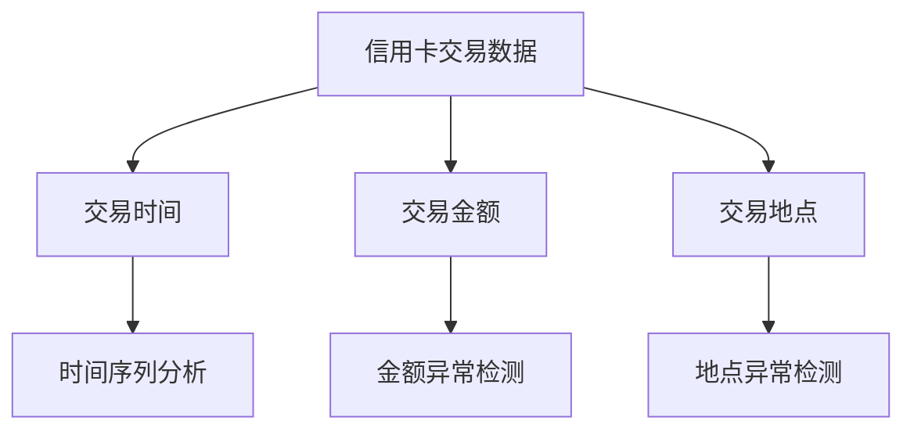
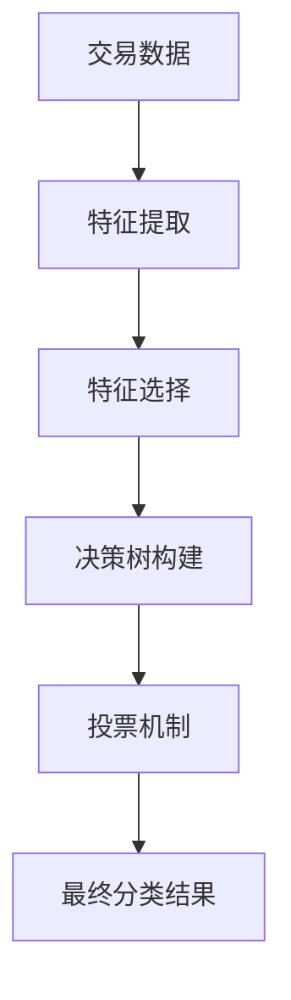
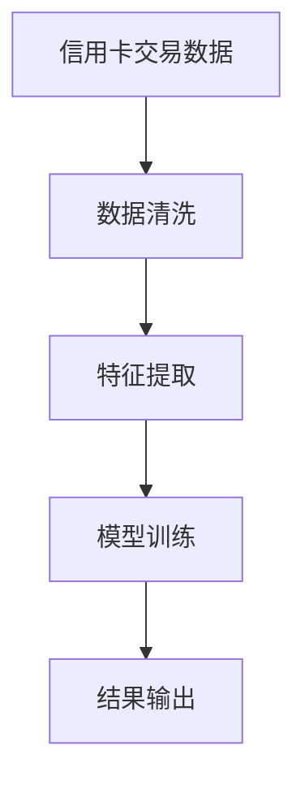
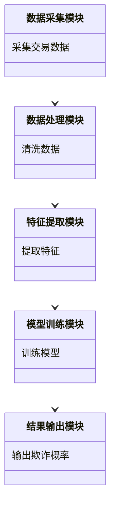
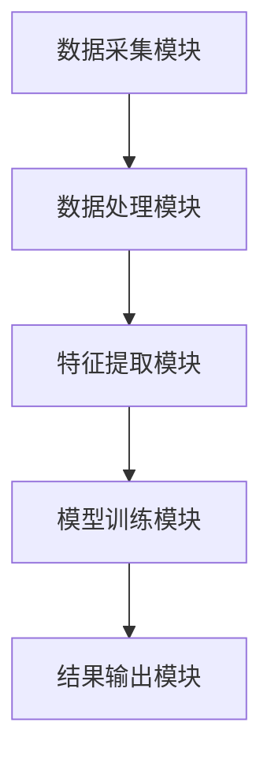

                 


# AI驱动的信用卡欺诈模式识别

## 关键词：
- 人工智能、信用卡欺诈、模式识别、机器学习、深度学习

## 摘要：
随着信用卡的广泛使用，欺诈问题日益严重，传统的欺诈检测方法已难以应对复杂多变的欺诈模式。本文将深入探讨如何利用人工智能技术，特别是机器学习和深度学习，来识别信用卡欺诈模式。通过分析欺诈交易的特征，构建有效的数学模型，并结合实际案例，展示如何利用AI技术提升欺诈检测的准确性和效率。

---

# 第1章: 信用卡欺诈模式识别的背景与挑战

## 1.1 问题背景

### 1.1.1 信用卡欺诈的现状与趋势
信用卡欺诈是指在未经授权的情况下，他人利用信用卡进行非法交易的行为。近年来，随着信用卡的普及和技术的进步，欺诈手段也日益多样化和复杂化。根据相关统计，全球每年因信用卡欺诈造成的损失高达数百亿美元。欺诈行为不仅给金融机构带来巨大的经济损失，也对用户的信用记录和财务安全造成严重威胁。

### 1.1.2 信用卡欺诈带来的经济损失
信用卡欺诈的经济损失主要体现在以下几个方面：
- **直接损失**：持卡人因欺诈交易而遭受的经济损失。
- **间接损失**：金融机构因处理欺诈交易而产生的成本，包括调查费用、法律诉讼费用等。
- **信用损失**：欺诈行为可能影响金融机构的信用评级和声誉。

### 1.1.3 传统欺诈检测方法的局限性
传统的欺诈检测方法主要包括基于规则的检测和统计分析。然而，这些方法在面对复杂欺诈模式时往往显得力不从心：
- **规则不足**：欺诈手段多样化，基于规则的方法难以覆盖所有可能的欺诈场景。
- **误报率高**：传统方法容易将正常交易误认为欺诈交易，导致用户体验下降。
- **难以实时检测**：传统方法通常需要大量历史数据支持，难以实现实时检测。

## 1.2 问题描述

### 1.2.1 信用卡交易的基本流程
信用卡交易的基本流程包括以下步骤：
1. 持卡人发起交易请求。
2. 收单机构验证交易信息。
3. 发卡机构授权交易。
4. 交易完成，资金结算。

### 1.2.2 欺诈交易的定义与分类
欺诈交易的定义是指未经授权的持卡人使用信用卡进行的非法交易。根据欺诈手段的不同，可以将欺诈交易分为以下几类：
- **伪卡欺诈**：使用盗取的信用卡信息制作伪卡进行交易。
- **网络欺诈**：通过网络攻击手段窃取信用卡信息进行交易。
- **账单周期性欺诈**：利用信用卡的账单周期，在持卡人未察觉的情况下进行多次小额欺诈。

### 1.2.3 欺诈交易的特征与模式
欺诈交易通常具有以下特征：
- **交易时间异常**：短时间内多次交易，或在非正常时间段进行交易。
- **交易地点异常**：交易地点分布广泛，或与持卡人常去的地点不符。
- **交易金额异常**：交易金额突然增加或远超持卡人的消费习惯。

## 1.3 问题解决与边界

### 1.3.1 AI技术在欺诈检测中的应用优势
人工智能技术在欺诈检测中的应用优势主要体现在以下几个方面：
- **高准确性**：通过机器学习和深度学习技术，可以识别复杂多变的欺诈模式。
- **实时性**：AI技术可以实现实时检测，快速响应欺诈行为。
- **自适应性**：AI模型可以不断学习新的欺诈模式，适应不断变化的欺诈手段。

### 1.3.2 欺诈检测的边界与外延
欺诈检测的边界主要体现在以下几个方面：
- **数据范围**：仅限于信用卡交易数据，不涉及其他类型的交易。
- **时间范围**：仅关注最近一段时间内的交易数据。
- **检测范围**：仅针对明确的欺诈行为，不考虑其他类型的风险。

### 1.3.3 核心概念与系统架构的初步探讨
在初步探讨系统架构时，我们需要明确以下几点：
- **数据输入**：信用卡交易数据，包括交易时间、金额、地点等。
- **模型训练**：利用机器学习和深度学习算法，训练欺诈检测模型。
- **结果输出**：模型输出欺诈概率，辅助决策是否标记为欺诈交易。

---

# 第2章: AI驱动的信用卡欺诈模式识别的核心概念

## 2.1 核心概念与原理

### 2.1.1 机器学习在欺诈检测中的应用
机器学习在欺诈检测中的应用主要体现在以下几个方面：
- **分类任务**：通过监督学习算法，将交易分为正常交易和欺诈交易。
- **聚类任务**：通过无监督学习算法，识别异常交易模式。

### 2.1.2 深度学习在欺诈模式识别中的优势
深度学习在欺诈模式识别中的优势主要体现在以下几个方面：
- **特征提取**：深度学习模型可以自动提取交易数据中的深层特征。
- **非线性关系**：深度学习模型能够捕捉复杂的非线性关系，提高检测准确率。

### 2.1.3 时间序列分析在信用卡交易中的作用
时间序列分析在信用卡交易中的作用主要体现在以下几个方面：
- **异常检测**：通过分析交易时间序列的异常变化，识别欺诈行为。
- **趋势预测**：通过预测交易趋势，提前发现潜在的欺诈风险。

## 2.2 核心概念对比与联系

### 2.2.1 不同AI技术的特征对比（表格形式）
| 技术类型       | 监督学习 | 无监督学习 | 半监督学习 |
|----------------|----------|------------|------------|
| 数据要求       | 需要标签 | 不需要标签 | 少量标签    |
| 适用场景       | 分类任务 | 聚类任务   | 混合任务    |
| 检测准确率     | 较高     | 较低       | 较高        |

### 2.2.2 ER实体关系图（Mermaid流程图）


---

# 第3章: 常用算法原理与实现

## 3.1 监督学习算法

### 3.1.1 随机森林算法原理（Mermaid流程图）


### 3.1.2 算法实现代码示例（Python）
```python
from sklearn.ensemble import RandomForestClassifier
from sklearn.model_selection import train_test_split
import pandas as pd

# 加载数据
data = pd.read_csv('credit_card.csv')

# 特征提取
X = data.drop('is_fraud', axis=1)
y = data['is_fraud']

# 数据分割
X_train, X_test, y_train, y_test = train_test_split(X, y, test_size=0.2)

# 模型训练
model = RandomForestClassifier(n_estimators=100)
model.fit(X_train, y_train)

# 模型预测
y_pred = model.predict(X_test)
```

### 3.1.3 特征重要性分析（数学公式）
随机森林模型的特征重要性可以通过以下公式计算：
$$
\text{特征重要性} = \sum_{i=1}^{n} ( \text{特征在树中的贡献} )
$$

## 3.2 深度学习算法

### 3.2.1 卷积神经网络（CNN）在时间序列分析中的应用
卷积神经网络在时间序列分析中的应用主要体现在以下几个方面：
- **特征提取**：通过卷积操作提取时间序列中的局部特征。
- **池化操作**：通过池化操作降低计算复杂度，提取全局特征。

### 3.2.2 循环神经网络（RNN）与长短时记忆网络（LSTM）的对比
循环神经网络（RNN）与长短时记忆网络（LSTM）的对比如下：
- **RNN**：适用于短序列数据，容易出现梯度消失问题。
- **LSTM**：适用于长序列数据，能够有效捕捉时间序列中的长期依赖关系。

### 3.2.3 神经网络模型训练的数学公式
神经网络模型的训练过程可以表示为以下公式：
$$
\text{损失函数} = \sum_{i=1}^{n} ( y_i - \hat{y_i} )^2
$$
$$
\text{优化过程} = \text{梯度下降}(\text{损失函数}, \text{学习率})
$$

---

# 第4章: 数学模型与公式详解

## 4.1 随机森林模型

### 4.1.1 基于决策树的特征选择（数学公式）
决策树的特征选择可以通过以下公式计算：
$$
\text{特征重要性} = \sum_{i=1}^{n} ( \text{特征在树中的贡献} )
$$

### 4.1.2 随机森林的投票机制（数学公式）
随机森林的投票机制可以表示为以下公式：
$$
\text{最终分类结果} = \text{多数投票}(\text{各树的预测结果})
$$

## 4.2 LSTM模型

### 4.2.1 LSTM单元的遗忘门、输入门与输出门（数学公式）
LSTM单元的遗忘门、输入门和输出门的计算公式如下：
$$
\text{遗忘门} = \sigma(W_f \cdot [h_{t-1}, x_t] + b_f)
$$
$$
\text{输入门} = \sigma(W_i \cdot [h_{t-1}, x_t] + b_i)
$$
$$
\text{输出门} = \sigma(W_o \cdot [h_{t-1}, x_t] + b_o)
$$

### 4.2.2 损失函数计算（数学公式）
LSTM模型的损失函数可以表示为以下公式：
$$
\text{损失函数} = \sum_{i=1}^{n} ( y_i - \hat{y_i} )^2
$$

---

# 第5章: 系统分析与架构设计

## 5.1 问题场景介绍

### 5.1.1 信用卡交易欺诈检测的场景描述
信用卡交易欺诈检测的场景描述包括以下几点：
- **数据来源**：信用卡交易数据，包括交易时间、金额、地点等。
- **数据处理**：对交易数据进行清洗和预处理，提取特征。
- **模型训练**：利用机器学习和深度学习算法，训练欺诈检测模型。
- **结果输出**：模型输出欺诈概率，辅助决策是否标记为欺诈交易。

### 5.1.2 系统目标与功能需求
系统目标与功能需求包括以下几点：
- **目标**：实现信用卡交易欺诈的实时检测。
- **功能需求**：包括数据采集、特征提取、模型训练、结果输出等。

### 5.1.3 系统边界与数据流图（Mermaid流程图）


## 5.2 系统架构设计

### 5.2.1 系统功能模块设计（Mermaid类图）


### 5.2.2 系统架构设计（Mermaid架构图）


---

# 第6章: 项目实战

## 6.1 环境安装

### 6.1.1 安装Python与相关库
安装Python和相关库，例如：
```bash
pip install numpy
pip install pandas
pip install scikit-learn
pip install keras
pip install tensorflow
```

## 6.2 系统核心实现源代码

### 6.2.1 数据清洗与特征提取
```python
import pandas as pd
import numpy as np

# 加载数据
data = pd.read_csv('credit_card.csv')

# 数据清洗
data = data.dropna()

# 特征提取
X = data.drop('is_fraud', axis=1)
y = data['is_fraud']
```

### 6.2.2 模型训练与预测
```python
from sklearn.ensemble import RandomForestClassifier
from sklearn.model_selection import train_test_split

# 数据分割
X_train, X_test, y_train, y_test = train_test_split(X, y, test_size=0.2)

# 模型训练
model = RandomForestClassifier(n_estimators=100)
model.fit(X_train, y_train)

# 模型预测
y_pred = model.predict(X_test)
```

## 6.3 代码应用解读与分析

### 6.3.1 数据清洗与特征提取
数据清洗的主要目的是去除缺失值和异常值，确保数据的完整性和准确性。特征提取则是为了从原始数据中提取有用的特征，为模型训练提供高质量的数据。

### 6.3.2 模型训练与预测
模型训练是利用机器学习算法，对数据进行训练，得到一个能够识别欺诈交易的模型。模型预测则是利用训练好的模型，对新的交易数据进行预测，判断是否为欺诈交易。

## 6.4 实际案例分析与详细讲解剖析

### 6.4.1 案例背景
假设我们有一个信用卡交易数据集，其中包含交易时间、金额、地点等信息。我们需要利用这些数据，训练一个欺诈检测模型。

### 6.4.2 数据分析
通过分析数据，我们发现欺诈交易通常具有以下特征：
- 交易时间集中在深夜。
- 交易金额远高于持卡人的平均消费金额。
- 交易地点分布广泛，与持卡人的常去地点不符。

### 6.4.3 模型优化
为了提高模型的检测准确率，我们可以尝试以下优化措施：
- **特征工程**：增加一些特征，例如交易时间间隔、交易地点距离等。
- **模型调优**：调整随机森林模型的参数，例如n_estimators、max_depth等。
- **集成学习**：结合多种算法的结果，进一步提高检测准确率。

---

# 第7章: 最佳实践与小结

## 7.1 最佳实践

### 7.1.1 数据预处理
- 确保数据的完整性和准确性。
- 进行特征工程，提取有用的特征。

### 7.1.2 模型选择
- 根据具体场景选择合适的算法。
- 结合多种算法进行集成学习，提高检测准确率。

### 7.1.3 实时检测
- 实现实时数据处理和模型预测。
- 定期更新模型，适应新的欺诈模式。

## 7.2 小结
通过本文的详细讲解，我们了解了如何利用人工智能技术，特别是机器学习和深度学习，来识别信用卡欺诈模式。从数据预处理到模型训练，再到结果输出，每一个步骤都至关重要。只有通过不断优化模型和改进算法，才能有效地应对日益复杂的欺诈手段。

## 7.3 注意事项
- **数据隐私**：在处理信用卡数据时，必须严格遵守数据隐私保护法规。
- **模型实时性**：在实现实时检测时，需要注意模型的计算效率，确保能够快速响应。
- **模型更新**：为了适应不断变化的欺诈手段，需要定期更新模型，引入新的数据进行训练。

## 7.4 拓展阅读
- **《机器学习实战》**：深入讲解机器学习算法的实现与应用。
- **《深度学习入门：基于Python的CNN、RNN、GAN通俗化解读》**：帮助读者更好地理解深度学习的基本原理与应用。

---

# 作者：AI天才研究院/AI Genius Institute & 禅与计算机程序设计艺术 /Zen And The Art of Computer Programming

