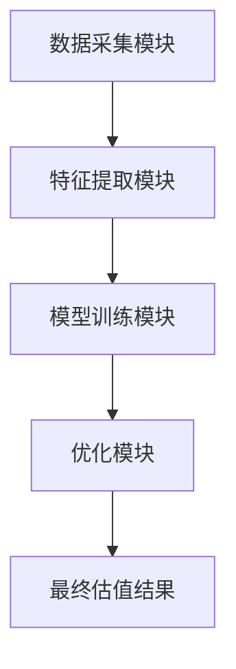

                 


# AI驱动的公司估值：多维度智能体协作评估内在价值

## 关键词：AI估值，多维度智能体，公司估值，智能协作，金融分析

## 摘要：本文探讨了如何利用AI技术，特别是通过多维度智能体的协作，来实现公司内在价值的智能评估。文章从传统估值方法的局限性出发，详细介绍了AI驱动估值的核心概念、算法原理、系统架构设计以及实际应用案例，最后总结了AI驱动估值的优势和未来发展方向。

---

# 第一章：AI驱动的公司估值背景与挑战

## 1.1 传统公司估值方法概述

### 1.1.1 财务指标法
财务指标法通过分析公司的财务报表，如收入、利润、资产等，来评估其价值。常用指标包括市盈率（P/E）、市净率（P/B）和股息率等。然而，这种方法过于依赖财务数据，忽略了市场动态和非财务因素。

### 1.1.2 市盈率法
市盈率法通过将公司的市盈率与行业平均水平进行比较，来判断其估值是否合理。这种方法简单易用，但忽略了公司的基本面和市场情绪。

### 1.1.3 现金流折现法
现金流折现法通过将未来现金流折现到现值来评估公司价值，常用于评估具有稳定现金流的企业。然而，这种方法需要对未来现金流的准确预测，存在较大的主观性和不确定性。

### 1.1.4 企业价值倍数法
企业价值倍数法通过将公司整体价值与EBITDA等指标进行比较，来评估其估值。这种方法适用于不同行业的公司，但同样依赖于准确的财务数据和合理的假设。

## 1.2 传统估值方法的局限性

### 1.2.1 数据依赖性
传统估值方法严重依赖财务数据，忽略了市场情绪、新闻事件和管理层决策等非财务因素。例如，一家公司可能财务状况良好，但由于行业政策变化，其估值可能大幅波动。

### 1.2.2 主观判断偏差
传统估值方法需要大量主观判断，如未来现金流的预测和折现率的选择。不同分析师可能得出不同的结论，导致估值结果的不一致。

### 1.2.3 市场波动影响
市场波动对股价的影响较大，传统估值方法难以捕捉短期市场情绪的变化，导致估值结果可能与实际市场表现出现偏差。

### 1.2.4 高维数据处理困难
随着数据量的增加，传统方法难以处理高维数据，尤其是在大数据时代，如何有效提取和利用非结构化数据（如新闻、社交媒体数据）成为一个挑战。

---

## 1.3 AI驱动的公司估值优势

### 1.3.1 大数据分析能力
AI技术能够处理海量数据，包括财务数据、市场数据、新闻数据等，帮助分析师更全面地评估公司价值。

### 1.3.2 自然语言处理能力
自然语言处理（NLP）技术可以分析新闻、社交媒体和公司公告中的文本数据，提取情感和关键词，帮助评估市场情绪对公司估值的影响。

### 1.3.3 智能预测能力
AI算法（如机器学习和深度学习）能够基于历史数据和实时数据，预测公司未来的财务表现和市场趋势，提高估值的准确性。

---

# 第二章：多维度智能体协作评估模型

## 2.1 多维度智能体协作的概念

### 2.1.1 多智能体系统定义
多智能体系统由多个智能体组成，每个智能体负责不同的任务，通过协作完成整体目标。在公司估值中，智能体可以分别负责数据处理、模型训练和优化。

### 2.1.2 多维度数据来源
多维度智能体协作模型的数据来源包括：
- 财务数据：收入、利润、现金流等。
- 市场数据：股价、成交量、市场指数等。
- 新闻数据：公司公告、行业新闻、社交媒体评论等。

### 2.1.3 协作机制
协作机制包括数据共享、任务分配和结果整合。智能体之间通过共享数据和结果，协调完成整体任务。

---

## 2.2 智能体角色与功能

### 2.2.1 数据智能体
数据智能体负责数据的采集、清洗和预处理。它能够从多个数据源获取数据，并进行特征提取，例如：
- 时间序列分析：分析股价波动趋势。
- 文本挖掘：从新闻中提取关键词和情感分析。

### 2.2.2 模型智能体
模型智能体负责构建和训练预测模型。它可以使用多种算法，如线性回归、随机森林和LSTM网络，来预测公司的财务表现和市场趋势。

### 2.2.3 优化智能体
优化智能体负责模型的优化和调参。它可以通过遗传算法或模拟退火等方法，找到最优的模型参数，提高预测准确性和估值的可靠性。

---

## 2.3 协作流程

### 2.3.1 数据采集
数据智能体从多个数据源采集数据，包括财务数据、市场数据和新闻数据。

### 2.3.2 特征提取
数据智能体对采集的数据进行预处理和特征提取，例如提取股价波动率、新闻关键词等。

### 2.3.3 模型训练
模型智能体使用提取的特征训练预测模型，并生成初步的估值结果。

### 2.3.4 结果优化
优化智能体对模型进行优化，调整参数和算法，提高估值的准确性和可靠性。

---

# 第三章：AI驱动估值的系统架构与实现

## 3.1 系统架构设计

### 3.1.1 模块划分
系统由以下几个模块组成：
- 数据采集模块：负责从数据库和API获取数据。
- 特征提取模块：对数据进行预处理和特征提取。
- 模型训练模块：构建和训练预测模型。
- 优化模块：优化模型参数，提高预测准确性。

### 3.1.2 问题场景介绍
以一家科技公司为例，我们需要评估其内在价值。数据来源包括财务报表、股价数据、新闻公告和社交媒体评论。

### 3.1.3 功能设计
- 数据采集模块：从数据库和API获取财务数据、股价数据和新闻数据。
- 特征提取模块：对数据进行清洗、标准化和特征提取，例如计算股价波动率、提取关键词。
- 模型训练模块：使用随机森林或LSTM网络训练预测模型。
- 优化模块：通过遗传算法优化模型参数，提高预测准确性。

### 3.1.4 系统架构图


---

## 3.2 系统实现

### 3.2.1 环境安装
安装必要的库，例如Python的Pandas、NumPy、Scikit-learn和TensorFlow。

### 3.2.2 核心代码实现

#### 数据采集模块
```python
import pandas as pd
import requests

def get_financial_data(symbol):
    url = f"https://api.example.com/financial_data/{symbol}"
    response = requests.get(url)
    data = response.json()
    return pd.DataFrame(data)
```

#### 特征提取模块
```python
from sklearn.preprocessing import StandardScaler

def preprocess_data(data):
    # 数据清洗
    data = data.dropna()
    # 特征提取
    features = data[['revenue', 'net_profit', 'market_cap']]
    scaler = StandardScaler()
    features_scaled = scaler.fit_transform(features)
    return features_scaled
```

#### 模型训练模块
```python
from sklearn.ensemble import RandomForestRegressor

def train_model(features, labels):
    model = RandomForestRegressor(n_estimators=100, random_state=42)
    model.fit(features, labels)
    return model
```

#### 优化模块
```python
from sklearn.model_selection import GridSearchCV

def optimize_model(features, labels):
    parameters = {'n_estimators': [50, 100, 150], 'max_depth': [None, 10, 20]}
    model = RandomForestRegressor(random_state=42)
    grid_search = GridSearchCV(model, parameters, cv=5)
    grid_search.fit(features, labels)
    best_model = grid_search.best_estimator_
    return best_model
```

---

## 3.3 系统接口设计

### 3.3.1 数据接口
数据采集模块通过API接口获取数据，接口如下：
```json
GET /api/financial_data/{symbol}
```

### 3.3.2 模型接口
模型训练模块通过API接口提供预测服务，接口如下：
```json
POST /api/predict
{
  "data": [...]
}
```

---

## 3.4 项目实战

### 3.4.1 案例分析
以一家科技公司为例，我们首先从数据库中获取其财务数据和股价数据，然后进行特征提取，接着使用随机森林模型进行预测，最后通过网格搜索优化模型参数，提高预测准确性。

### 3.4.2 代码解读
- 数据采集模块从API获取数据。
- 特征提取模块对数据进行标准化处理。
- 模型训练模块使用随机森林模型进行训练。
- 优化模块通过网格搜索找到最佳模型参数。

---

## 3.5 系统小结

通过多维度智能体的协作，我们能够更全面地评估公司的内在价值。数据智能体负责数据处理，模型智能体负责预测建模，优化智能体负责模型调优，三者协同工作，提高了估值的准确性和可靠性。

---

# 第四章：AI驱动估值的优势与应用

## 4.1 AI驱动估值的优势

### 4.1.1 高效性
AI技术能够快速处理海量数据，提高估值效率。

### 4.1.2 准确性
通过多维度数据和智能模型，AI能够提供更准确的估值结果。

### 4.1.3 可扩展性
AI模型能够处理不同类型和规模的数据，适用于各种行业和公司规模。

---

## 4.2 应用案例

### 4.2.1 科技行业
在科技行业中，AI能够通过分析专利数量、研发投入和市场趋势，评估公司的创新能力和市场前景。

### 4.2.2 金融行业
在金融行业中，AI能够通过分析市场数据和新闻情绪，预测股价波动，帮助投资者做出更明智的决策。

---

## 4.3 未来发展方向

### 4.3.1 更复杂的数据分析
随着技术的发展，AI能够处理更复杂的数据，如图像和视频数据，进一步提高估值的准确性。

### 4.3.2 更智能的预测模型
深度学习模型（如Transformer）在自然语言处理和时间序列分析中的应用，将推动估值模型的发展。

---

## 4.4 最佳实践 tips

### 4.4.1 数据质量
确保数据的准确性和完整性，数据质量直接影响估值结果。

### 4.4.2 模型选择
选择合适的模型和算法，根据数据特点和任务需求进行调整。

### 4.4.3 持续优化
定期更新数据和模型，适应市场变化和公司动态。

---

# 第五章：总结与展望

## 5.1 总结
通过多维度智能体的协作，AI技术能够提供更准确、更高效的公司估值。本文详细介绍了AI驱动估值的核心概念、算法原理和系统架构设计，并通过实际案例展示了其应用价值。

## 5.2 展望
随着AI技术的不断发展，未来的公司估值将更加智能化和个性化。通过结合更多维度的数据和更复杂的模型，AI将为金融分析提供更强大的工具和支持。

---

# 作者：AI天才研究院/AI Genius Institute & 禅与计算机程序设计艺术 /Zen And The Art of Computer Programming

