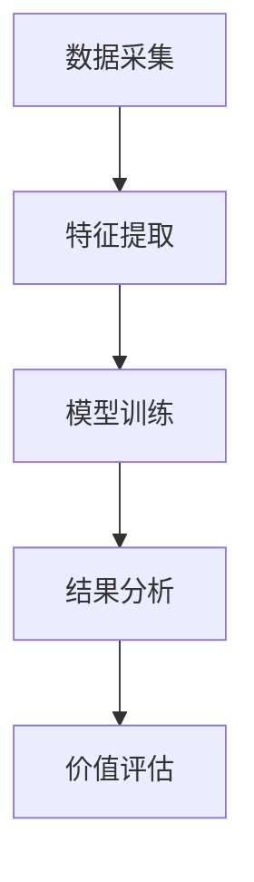
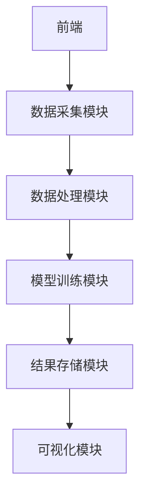
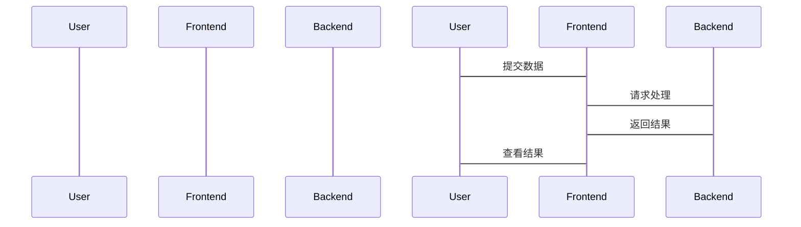

                 


# AI驱动的公司文化量化分析：无形资产估值新方法

> **关键词**：公司文化，无形资产，AI量化，企业估值，文化指标，资产定价，数据驱动

> **摘要**：  
> 本文探讨了如何利用人工智能技术量化分析公司文化，并提出了一种基于AI的无形资产估值新方法。文章首先介绍了公司文化作为无形资产的重要性，分析了传统估值方法的局限性，随后详细阐述了AI驱动的文化量化分析的核心概念、算法原理和系统架构设计。通过实际案例分析和代码实现，展示了如何将AI技术应用于企业文化管理，为企业提供数据驱动的决策支持。最后，总结了该方法的优势及未来研究方向。

---

## 第一部分: AI驱动的公司文化量化分析背景与概念

### 第1章: 公司文化与无形资产概述

#### 1.1 公司文化的基本概念

##### 1.1.1 公司文化的定义与内涵
公司文化是指企业在长期经营过程中形成的，由价值观、信念、行为准则、管理方式等组成的独特的企业精神和企业形象。它是企业的灵魂，影响着企业的战略制定、员工行为和市场表现。

##### 1.1.2 无形资产的定义与分类
无形资产是指企业拥有或控制的没有实物形态的资产，主要包括专利权、商标权、商誉、品牌价值、客户关系等。其中，公司文化是影响企业商誉和品牌价值的重要因素。

##### 1.1.3 公司文化作为无形资产的核心要素
公司文化的核心要素包括企业价值观、企业愿景、企业使命、企业精神、企业道德规范等。这些要素通过影响员工的行为和决策，间接影响企业的市场表现和长期价值。

#### 1.2 无形资产估值的挑战与现状

##### 1.2.1 传统无形资产估值方法的局限性
传统的无形资产估值方法通常基于财务指标和市场表现，难以量化企业文化的软性价值。这种方法往往忽略了企业文化对企业绩效的长期影响。

##### 1.2.2 公司文化量化分析的必要性
随着市场竞争的加剧，企业文化的优劣越来越成为区分企业竞争力的关键因素。量化文化价值可以帮助企业更好地优化内部管理，提升市场估值。

##### 1.2.3 当前企业文化的评估难点
企业文化评估的难点在于其无形性和主观性。如何将抽象的文化特征转化为可量化的指标，是当前研究的热点问题。

---

### 第2章: AI驱动文化量化分析的核心概念

#### 2.1 文化量化分析的基本原理

##### 2.1.1 数据采集与特征提取
通过对企业内部数据（如员工满意度、团队协作效率、绩效考核结果）和外部数据（如市场口碑、品牌价值、客户满意度）的采集，提取文化相关的特征。

##### 2.1.2 文化指标的构建与权重分配
根据企业的实际情况，构建文化指标体系，并通过数据分析确定各指标的权重。例如，可以通过因子分析法确定“团队协作”比“创新意识”更重要。

##### 2.1.3 AI算法在文化分析中的应用
利用机器学习算法（如聚类分析、回归分析、神经网络等）对文化指标进行建模，预测企业文化对企业绩效的影响。

#### 2.2 核心概念与联系

##### 2.2.1 文化特征与AI算法的关系
文化特征是AI算法的输入，算法通过分析这些特征，提取文化价值。例如，使用自然语言处理技术分析员工反馈中的情感倾向。

##### 2.2.2 文化量化指标与企业绩效的关联
通过回归分析等方法，可以量化文化指标与企业绩效之间的相关性。例如，团队协作效率高与企业利润率增长呈正相关。

##### 2.2.3 AI驱动的文化分析模型框架
AI驱动的文化分析模型通常包括数据采集、特征提取、模型训练、结果分析等模块。

#### 2.3 对比分析与流程图

##### 2.3.1 传统文化评估方法与AI驱动方法的对比
| 方法 | 优点 | 缺点 |
|------|------|------|
| 传统估值法 | 操作简单 | 难以量化文化价值 |
| AI驱动法 | 高度量化 | 实施成本高 |

##### 2.3.2 文化量化分析的ER实体关系图
```mermaid
erDiagram
    employee{
        id : int
        name : string
        department : string
        feedback : string
    }
    culture_indicator{
        id : int
        name : string
        weight : float
    }
    employee_culture_indicator{
        employee_id : int
        indicator_id : int
        score : float
    }
```

##### 2.3.3 文化分析流程的mermaid流程图


---

## 第二部分: AI驱动文化量化分析的算法原理

### 第3章: 文化量化分析的数学模型

#### 3.1 文化指标的因子分析模型

##### 3.1.1 因子分析的基本原理
因子分析是一种统计方法，用于将多个变量归类为几个潜在因子。在企业文化分析中，可以用来提取文化指标的共性特征。

##### 3.1.2 文化指标的因子分解公式
$$ F = W \cdot X + \epsilon $$
其中，F为因子得分，W为权重矩阵，X为原始数据，ε为误差项。

#### 3.2 基于机器学习的文化评估模型

##### 3.2.1 机器学习算法在文化分析中的应用
常用的算法包括支持向量机（SVM）、随机森林（Random Forest）和神经网络（Neural Network）等。

##### 3.2.2 文化评估模型的数学表达
以线性回归为例，模型可以表示为：
$$ y = \beta_0 + \beta_1x_1 + \beta_2x_2 + \dots + \beta_nx_n + \epsilon $$
其中，y为文化价值评分，x_i为文化指标，β为系数，ε为误差项。

#### 3.3 算法实现与代码示例

##### 3.3.1 数据预处理
```python
import pandas as pd
import numpy as np

# 假设data为数据集
data = pd.read_csv('culture_data.csv')
data = data.dropna()
```

##### 3.3.2 模型训练
```python
from sklearn.linear_model import LinearRegression

model = LinearRegression()
model.fit(X_train, y_train)
```

##### 3.3.3 结果分析
```python
# 预测值与真实值的对比
y_pred = model.predict(X_test)
print('均方误差:', np.mean((y_pred - y_test) ** 2))
```

---

## 第三部分: 系统分析与架构设计

### 第4章: 系统功能设计与实现

#### 4.1 系统功能模块划分

##### 4.1.1 数据采集模块
负责采集企业内部数据（如员工反馈、绩效数据）和外部数据（如市场口碑）。

##### 4.1.2 模型训练模块
基于采集的数据，训练文化量化分析模型。

##### 4.1.3 评估与优化模块
根据模型输出的结果，评估文化价值，并提出优化建议。

##### 4.1.4 可视化模块
将文化价值评估结果以图表形式展示，便于企业理解和应用。

#### 4.2 系统架构设计

##### 4.2.1 系统架构图


##### 4.2.2 系统交互图


---

## 第四部分: 项目实战

### 第5章: 项目实现与案例分析

#### 5.1 项目环境安装

##### 5.1.1 安装依赖
```bash
pip install pandas numpy scikit-learn matplotlib
```

#### 5.2 核心代码实现

##### 5.2.1 数据预处理
```python
import pandas as pd
import numpy as np

data = pd.read_csv('culture_data.csv')
data = data.dropna()
```

##### 5.2.2 模型训练
```python
from sklearn.model_selection import train_test_split
from sklearn.linear_model import LinearRegression

X = data[['员工满意度', '团队协作效率']]
y = data['文化价值评分']

X_train, X_test, y_train, y_test = train_test_split(X, y, test_size=0.2, random_state=42)
model = LinearRegression()
model.fit(X_train, y_train)
```

##### 5.2.3 结果分析
```python
from sklearn.metrics import mean_squared_error

y_pred = model.predict(X_test)
print(f'均方误差: {mean_squared_error(y_test, y_pred)}')
print(f'回归系数: {model.coef_}')
```

#### 5.3 实际案例分析

##### 5.3.1 案例背景
某科技公司希望通过量化分析企业文化，优化内部管理。数据包括员工满意度、团队协作效率、创新意识等指标。

##### 5.3.2 数据分析结果
通过模型分析发现，员工满意度对文化价值评分的影响最大，其次是团队协作效率。

##### 5.3.3 优化建议
根据分析结果，建议公司加强员工满意度管理，提升团队协作效率。

---

## 第五部分: 总结与展望

### 第6章: 最佳实践与总结

#### 6.1 方法优势与不足

##### 6.1.1 方法优势
- 高度量化企业文化，提供数据支持。
- 可操作性强，便于企业优化管理。

##### 6.1.2 方法不足
- 实施成本较高，需要大量数据支持。
- 模型结果可能受数据质量的影响。

#### 6.2 应用注意事项

##### 6.2.1 数据收集的准确性
确保数据的准确性和完整性，避免偏差。

##### 6.2.2 模型的可解释性
选择可解释性较高的模型，便于企业理解和应用。

#### 6.3 未来研究方向

##### 6.3.1 更复杂模型的探索
探索更复杂的机器学习模型，如深度学习和集成学习，以提高模型的准确性。

##### 6.3.2 多维度文化分析
结合文本挖掘、情感分析等技术，进行多维度的文化分析。

##### 6.3.3 行业化模型的构建
根据不同行业的特点，构建行业化的文化量化分析模型。

---

## 作者

作者：AI天才研究院/AI Genius Institute & 禅与计算机程序设计艺术/Zen And The Art of Computer Programming

---

感谢您的阅读！希望本文能为您提供关于AI驱动的公司文化量化分析的深入见解，并为企业文化管理提供新的思路。

