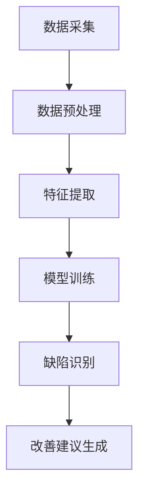

                 


```markdown
# AI驱动的公司治理缺陷识别与改善建议

> 关键词：公司治理，AI驱动，缺陷识别，改善建议，自然语言处理，系统架构，项目实战

> 摘要：本文探讨了AI技术在公司治理中的应用，特别是如何利用AI驱动的方法识别公司治理中的缺陷，并提出相应的改善建议。通过系统分析和案例研究，文章详细介绍了基于自然语言处理和异常检测算法的缺陷识别原理，以及如何设计和实现一个完整的AI驱动公司治理缺陷识别系统。文章还提供了实际项目实战的代码示例和系统架构设计，帮助读者深入理解AI在公司治理中的实际应用。

---

## 第1章：公司治理与AI驱动技术的背景介绍

### 1.1 公司治理的基本概念

#### 1.1.1 公司治理的核心要素
公司治理是确保公司有效运作和长期发展的基础，其核心要素包括：
- **股权结构**：股东之间的权利分配。
- **董事会结构**：董事会的组成和职责。
- **高管团队**：公司高层的职责和权限。
- **治理机制**：包括决策机制、监督机制和利益相关者保护机制。

#### 1.1.2 公司治理的主要目标
公司治理的主要目标是：
- **最大化股东价值**：通过有效管理实现股东利益最大化。
- **保护利益相关者**：确保员工、客户和债权人的权益。
- **合规性**：确保公司运营符合法律法规。
- **透明性**：提高公司运营的透明度，增强信任。

#### 1.1.3 公司治理的现状与挑战
公司治理面临的主要挑战包括：
- **信息不对称**：股东和管理层之间的信息不透明。
- **代理问题**：管理层可能追求自身利益而非股东利益。
- **合规风险**：公司可能因不合规而面临法律风险。
- **全球化挑战**：跨国公司需要应对不同国家的法律法规。

### 1.2 AI驱动技术在公司治理中的应用背景

#### 1.2.1 AI技术的发展与公司治理的结合
AI技术的发展为公司治理提供了新的工具和方法，特别是在数据处理、模式识别和决策支持方面。

#### 1.2.2 公司治理缺陷识别的必要性
公司治理缺陷可能导致严重的后果，包括财务损失、声誉损害和法律风险。AI驱动的方法可以有效识别这些缺陷。

#### 1.2.3 AI驱动技术的优势与局限性
- **优势**：
  - 高效性：AI可以在短时间内处理大量数据。
  - 准确性：通过机器学习算法提高识别准确率。
  - 可扩展性：AI系统可以扩展到大规模数据。
- **局限性**：
  - 数据依赖性：AI模型依赖于高质量的数据。
  - 黑箱问题：AI决策过程可能不透明。
  - 成本问题：AI系统的开发和维护成本较高。

## 第2章：AI驱动的公司治理缺陷识别核心概念

### 2.1 公司治理缺陷的定义与分类

#### 2.1.1 缺陷的定义
公司治理缺陷是指公司治理结构、机制或操作中存在的不足，可能影响公司有效运作或利益相关者权益。

#### 2.1.2 缺陷的分类
公司治理缺陷可以分为以下几类：
- **结构缺陷**：公司治理结构不合理，例如董事会结构不完善。
- **机制缺陷**：治理机制不健全，例如缺乏有效的监督机制。
- **操作缺陷**：治理操作中存在问题，例如决策过程不透明。
- **合规缺陷**：公司运营不符合相关法律法规。

#### 2.1.3 缺陷识别的边界与外延
缺陷识别的边界在于公司治理的各个层面，包括战略、组织、制度和文化等方面。外延则涉及公司内外部利益相关者。

### 2.2 AI驱动缺陷识别的核心要素

#### 2.2.1 数据来源与处理
数据来源包括公司内部文档、董事会决议、财务报表、法律文件等。数据处理包括清洗、预处理和特征提取。

#### 2.2.2 自然语言处理技术
自然语言处理（NLP）技术用于分析文本数据，识别关键词和潜在问题。

#### 2.2.3 异常检测算法
通过机器学习算法识别数据中的异常模式，发现潜在的治理缺陷。

### 2.3 缺陷识别与改善建议的关系

#### 2.3.1 缺陷识别的逻辑流程
1. 数据采集
2. 数据预处理
3. 缺陷识别
4. 缺陷分类
5. 改善建议生成

#### 2.3.2 改善建议的生成机制
基于识别的缺陷类型，系统生成相应的改善建议，例如调整董事会结构或优化监督机制。

#### 2.3.3 缺陷识别与改善建议的反馈机制
系统将改善建议反馈给公司治理团队，持续优化治理结构。

## 第3章：AI驱动的公司治理缺陷识别算法原理

### 3.1 自然语言处理在缺陷识别中的应用

#### 3.1.1 词嵌入技术
词嵌入技术（如Word2Vec）将文本数据转换为向量表示。

#### 3.1.2 语义理解模型
使用深度学习模型（如BERT）理解文本语义。

#### 3.1.3 基于上下文的分析
分析文本中的上下文关系，识别潜在缺陷。

### 3.2 缺陷识别的文本分类算法

#### 3.2.1 基于传统机器学习的分类
使用支持向量机（SVM）或随机森林（Random Forest）进行分类。

#### 3.2.2 基于深度学习的分类
使用卷积神经网络（CNN）或长短期记忆网络（LSTM）进行分类。

#### 3.2.3 混合模型的应用
结合传统机器学习和深度学习模型的优势，构建混合模型。

### 3.3 算法流程图


## 第4章：AI驱动的公司治理缺陷识别系统架构

### 4.1 系统功能模块划分

#### 4.1.1 数据采集模块
负责采集公司治理相关的文本数据和结构化数据。

#### 4.1.2 缺陷识别模块
使用NLP和异常检测算法识别治理缺陷。

#### 4.1.3 改善建议生成模块
基于识别的缺陷类型，生成相应的改善建议。

#### 4.1.4 用户界面模块
提供用户友好的交互界面，展示识别结果和改善建议。

### 4.2 系统架构设计

#### 4.2.1 模块间关系（mermaid架构图）


#### 4.2.2 数据流分析
数据流从数据采集模块进入系统，经过预处理后，进入缺陷识别模块，最后生成改善建议并通过用户界面模块展示。

#### 4.2.3 系统扩展性设计
系统设计具备良好的扩展性，可以方便地添加新的算法和模块。

### 4.3 接口设计与交互流程

#### 4.3.1 系统接口定义
- 数据接口：数据采集模块与外部数据源的接口。
- 模型接口：缺陷识别模块与改善建议生成模块的接口。

#### 4.3.2 用户交互流程（mermaid序列图）
```mermaid
sequenceDiagram
用户 -> 数据采集模块: 提交数据请求
数据采集模块 -> 缺陷识别模块: 传递数据
缺陷识别模块 -> 改善建议生成模块: 传递缺陷信息
改善建议生成模块 -> 用户界面模块: 传递改善建议
用户 <- 用户界面模块: 显示改善建议
```

## 第5章：AI驱动的公司治理缺陷识别项目实战

### 5.1 项目背景与目标
本项目旨在通过AI技术识别公司治理中的缺陷，并提出改善建议。

### 5.2 项目环境与工具
- **开发工具**：Python、Jupyter Notebook
- **编程库**：scikit-learn、TensorFlow、spaCy
- **数据源**：公司治理文档、董事会决议、财务报表

### 5.3 核心代码实现

#### 5.3.1 数据预处理代码
```python
import pandas as pd
from sklearn.model_selection import train_test_split

# 加载数据
data = pd.read_csv('corporate_governance.csv')
# 划分训练集和测试集
train_data, test_data = train_test_split(data, test_size=0.2)
```

#### 5.3.2 缺陷识别模型代码
```python
from sklearn.svm import SVC
from sklearn.metrics import accuracy_score

# 训练模型
model = SVC()
model.fit(train_data[['text', 'label']], train_data['target'])
# 预测测试集
predictions = model.predict(test_data[['text', 'label']])
print("Accuracy:", accuracy_score(test_data['target'], predictions))
```

### 5.4 项目小结
通过实际项目，我们验证了AI驱动的公司治理缺陷识别方法的有效性，并展示了如何将理论应用于实践。

## 结语

通过本文的详细讲解，读者可以深入了解AI技术在公司治理中的应用，掌握缺陷识别的核心概念和算法原理，了解系统设计与实现的关键点，并通过项目实战掌握实际操作技能。未来，随着AI技术的不断发展，公司治理缺陷识别将更加精准和高效。

---

## 作者：AI天才研究院 & 禅与计算机程序设计艺术
```

