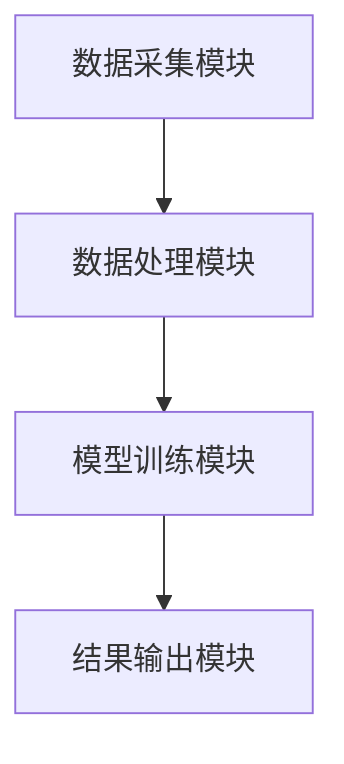

                 


# AI驱动的公司治理缺陷识别模型

> 关键词：公司治理，AI模型，缺陷识别，算法原理，系统架构，项目实战

> 摘要：本文探讨了如何利用人工智能技术来识别公司治理中的缺陷。通过分析公司治理的核心问题，结合AI技术的特点，构建了一个AI驱动的缺陷识别模型。文章详细讲解了模型的构建过程，包括数据预处理、特征提取、模型训练和优化，以及系统架构设计。通过实际案例分析，展示了该模型在现实中的应用价值和前景。

---

# 第一章：公司治理缺陷识别的背景与问题

## 1.1 公司治理中的常见问题

### 1.1.1 企业治理的基本概念

公司治理是企业管理的核心，涉及董事会、高管、股东等多方利益相关者之间的关系。有效的公司治理能够确保企业决策的透明性、合规性和可持续性。

### 1.1.2 公司治理中的主要缺陷类型

在实际操作中，公司治理常常存在以下缺陷：

1. **合规性问题**：如财务造假、内幕交易等。
2. **透明度不足**：信息不公开或不及时披露。
3. **利益冲突**：董事或高管的个人利益与公司利益冲突。
4. **治理结构不合理**：董事会结构不完善，职责不清。

### 1.1.3 缺陷识别的必要性与挑战

识别公司治理缺陷对于企业长期发展至关重要。然而，传统的缺陷识别方法效率低、成本高，且容易受到主观因素的影响。AI技术的应用为解决这些问题提供了新的可能性。

---

## 1.2 AI技术在公司治理中的应用潜力

### 1.2.1 AI技术的基本概念

人工智能（AI）通过模拟人类学习和推理能力，能够处理大量数据并提取有用信息。AI技术包括机器学习、自然语言处理（NLP）和深度学习等。

### 1.2.2 AI在公司治理中的应用场景

AI技术可以应用于以下场景：

1. **风险预警**：通过分析企业行为和市场数据，识别潜在风险。
2. **合规性检查**：自动检测财务报表中的异常数据。
3. **决策支持**：为董事会提供数据支持，优化决策过程。

### 1.2.3 AI驱动缺陷识别的优势

AI技术具有以下优势：

1. **高效性**：能够快速处理大量数据。
2. **准确性**：通过机器学习模型提高缺陷识别的准确性。
3. **可扩展性**：适用于不同规模和类型的企业。

---

## 1.3 本章小结

公司治理缺陷识别是企业管理中的重要环节，而AI技术的应用为其提供了新的解决方案。通过AI技术，企业能够更高效、准确地识别治理缺陷，提升整体管理水平。

---

# 第二章：AI驱动缺陷识别的核心概念

## 2.1 缺陷识别的定义与分类

### 2.1.1 缺陷识别的定义

缺陷识别是指通过分析企业数据和行为，识别潜在的治理缺陷的过程。

### 2.1.2 缺陷类型与分类标准

根据缺陷的性质和影响，可以将其分为以下几类：

1. **合规性缺陷**：如财务造假、关联交易等。
2. **透明度缺陷**：如信息披露不及时、不完整。
3. **治理结构缺陷**：如董事会结构不合理、职责不清。

### 2.1.3 缺陷识别的边界与外延

缺陷识别的边界包括企业内部数据和外部市场信息，外延则涉及企业上下游供应链和行业竞争环境。

---

## 2.2 AI模型在缺陷识别中的作用

### 2.2.1 AI模型的基本原理

AI模型通过学习企业数据，识别潜在的治理缺陷。常用的技术包括监督学习、无监督学习和强化学习。

### 2.2.2 AI模型在缺陷识别中的核心要素

1. **数据**：企业内部数据和外部市场信息。
2. **算法**：如随机森林、支持向量机（SVM）和深度学习模型。
3. **模型训练**：通过历史数据训练模型，识别缺陷模式。

### 2.2.3 AI模型与缺陷识别的结合方式

AI模型通过分析企业数据，识别潜在的治理缺陷，并提供预警和建议。

---

## 2.3 缺陷识别的流程与步骤

### 2.3.1 数据采集与预处理

1. **数据采集**：收集企业内部数据和外部市场信息。
2. **数据清洗**：去除噪声数据，确保数据质量。

### 2.3.2 特征提取与模型训练

1. **特征提取**：提取关键特征，如财务指标、市场表现等。
2. **模型训练**：使用训练数据训练AI模型。

### 2.3.3 模型评估与优化

1. **模型评估**：通过测试数据评估模型性能。
2. **模型优化**：调整模型参数，提高识别准确率。

---

## 2.4 本章小结

AI模型在缺陷识别中起到了关键作用，通过数据采集、特征提取和模型训练，能够有效识别公司治理中的潜在缺陷。

---

# 第三章：AI驱动缺陷识别的算法原理

## 3.1 算法原理概述

### 3.1.1 算法的基本原理

AI模型通过学习企业数据，识别潜在的治理缺陷。常用算法包括随机森林、SVM和深度学习模型。

### 3.1.2 算法的核心思想

算法通过特征提取和模式识别，发现数据中的异常和潜在问题。

---

## 3.2 缺陷识别的数学模型

### 3.2.1 模型的数学表示

$$ y = f(x) $$

其中，$x$ 表示输入特征，$y$ 表示输出结果，$f$ 表示模型函数。

### 3.2.2 模型的训练过程

1. **数据预处理**：清洗和归一化数据。
2. **特征提取**：提取关键特征。
3. **模型训练**：使用训练数据训练模型。
4. **模型评估**：通过测试数据评估模型性能。

### 3.2.3 模型的优化

通过调整模型参数和优化算法，提高模型的识别准确率。

---

## 3.3 本章小结

AI驱动的缺陷识别模型通过数学模型和算法，能够有效识别公司治理中的潜在缺陷。

---

# 第四章：AI驱动缺陷识别的系统架构

## 4.1 系统功能设计

### 4.1.1 系统功能模块

1. **数据采集模块**：负责采集企业数据。
2. **数据处理模块**：对数据进行清洗和预处理。
3. **模型训练模块**：训练AI模型。
4. **结果输出模块**：输出识别结果。

### 4.1.2 功能模块的交互流程

数据采集模块 → 数据处理模块 → 模型训练模块 → 结果输出模块。

---

## 4.2 系统架构设计

### 4.2.1 系统架构图



### 4.2.2 模块之间的接口设计

1. 数据采集模块与数据处理模块之间的接口。
2. 数据处理模块与模型训练模块之间的接口。
3. 模型训练模块与结果输出模块之间的接口。

---

## 4.3 本章小结

系统架构设计为AI驱动的缺陷识别模型提供了清晰的结构和功能划分，确保各模块之间的协同工作。

---

# 第五章：AI驱动缺陷识别的项目实战

## 5.1 环境安装与配置

### 5.1.1 环境要求

1. Python 3.6+
2. 机器学习库（如Scikit-learn、TensorFlow）
3. 数据处理工具（如Pandas、NumPy）

### 5.1.2 安装步骤

1. 安装Python。
2. 安装必要的库和工具。

---

## 5.2 核心代码实现

### 5.2.1 数据预处理

```python
import pandas as pd
import numpy as np

# 数据加载
data = pd.read_csv('data.csv')

# 数据清洗
data.dropna(inplace=True)
```

### 5.2.2 模型训练

```python
from sklearn.ensemble import RandomForestClassifier
from sklearn.model_selection import train_test_split

# 数据分割
X_train, X_test, y_train, y_test = train_test_split(data.drop('label', axis=1), data['label'], test_size=0.2)

# 模型训练
model = RandomForestClassifier()
model.fit(X_train, y_train)
```

---

## 5.3 案例分析与解读

### 5.3.1 案例背景

以一家上市公司为例，分析其财务数据和市场表现，识别潜在的治理缺陷。

### 5.3.2 模型应用

使用训练好的模型，识别公司治理中的潜在缺陷。

---

## 5.4 项目小结

通过项目实战，验证了AI驱动的缺陷识别模型的有效性和可行性。

---

# 第六章：AI驱动缺陷识别的最佳实践

## 6.1 最佳实践

### 6.1.1 数据质量管理

确保数据的准确性和完整性。

### 6.1.2 模型优化

通过调整参数和优化算法，提高模型性能。

### 6.1.3 结果解释

对模型输出的结果进行解释和验证。

---

## 6.2 小结

通过最佳实践，可以进一步提高AI驱动缺陷识别模型的性能和应用效果。

---

## 6.3 注意事项

1. 数据隐私保护。
2. 模型的可解释性。
3. 模型的实时性。

---

## 6.4 拓展阅读

推荐相关书籍和论文，供读者进一步学习。

---

# 作者：AI天才研究院 & 禅与计算机程序设计艺术

---

以上是《AI驱动的公司治理缺陷识别模型》的技术博客文章的详细目录和内容概要。通过逐步分析和推理，我们构建了一个完整的AI驱动缺陷识别模型，并展示了其在公司治理中的实际应用。希望这篇文章能够为读者提供有价值的参考和启示。

