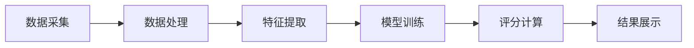
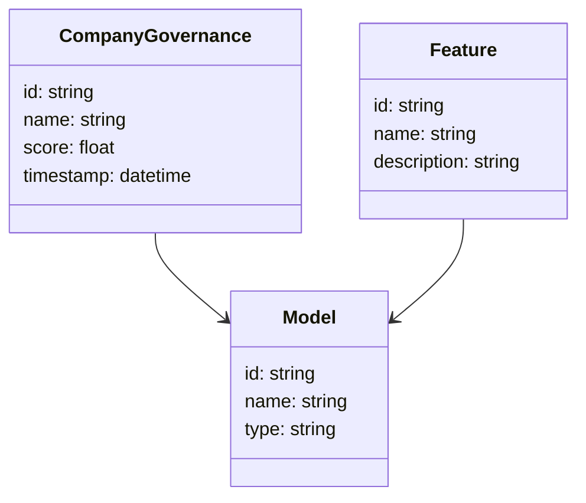

                 


```markdown
# AI驱动的公司治理评分系统：量化管理质量

> 关键词：AI驱动、公司治理、评分系统、量化管理、评分模型、评分算法

> 摘要：本文深入探讨了AI技术在公司治理评分系统中的应用，从系统设计、算法实现到项目实战，全面剖析了如何利用AI量化企业治理质量。文章通过详细的技术分析和案例研究，展示了AI驱动的评分系统在现代企业管理中的潜力与价值。

---

## 第一部分: AI驱动的公司治理评分系统背景与概念

### 第1章: 公司治理与AI驱动的评分系统概述

#### 1.1 公司治理的基本概念

##### 1.1.1 公司治理的定义与核心要素
公司治理是确保企业有效运作、实现战略目标和长期价值的制度安排。其核心要素包括：

- **所有权结构**：股东的权益分配与管理。
- **董事会结构**：决策层的组成与职责。
- **高管团队**：公司日常运营的领导者。
- **治理机制**：包括决策、监督、激励和制衡机制。

##### 1.1.2 公司治理的现状与挑战
现代企业治理面临以下挑战：
- 信息不对称：股东与管理层之间的信息不透明。
- 监督成本：传统治理机制的效率低下。
- 复杂性：全球化背景下治理环境的复杂性增加。

##### 1.1.3 AI技术在公司治理中的应用潜力
AI技术可以提供实时数据处理、模式识别和预测分析能力，帮助优化治理决策。

#### 1.2 AI驱动评分系统的定义与特点

##### 1.2.1 评分系统的定义与作用
AI驱动的公司治理评分系统通过量化指标评估企业的治理质量，提供实时反馈和改进建议。

##### 1.2.2 AI驱动评分系统的独特优势
- 数据驱动：基于大量历史数据进行分析。
- 实时性：快速响应治理问题。
- 可扩展性：适用于不同规模和行业的企业。

##### 1.2.3 系统的边界与外延
评分系统主要关注治理质量，但不直接干预企业运营，仅提供评分和建议。

---

### 第2章: 公司治理评分系统的量化模型

#### 2.1 评分系统的核心概念与联系

##### 2.1.1 核心概念原理
评分系统将企业治理质量转化为可量化的指标，通过AI算法进行评分。

##### 2.1.2 核心概念属性特征对比表
| 属性 | 特征 |
|------|------|
| 数据源 | 结构化与非结构化数据结合 |
| 指标类型 | 定量与定性指标结合 |
| 模型类型 | 监督学习与无监督学习结合 |

##### 2.1.3 ER实体关系图架构（Mermaid流程图）

```mermaid
entity CompanyGovernance {
  id: string
  name: string
  score: float
  timestamp: datetime
}
entity Feature {
  id: string
  name: string
  description: string
}
entity Model {
  id: string
  name: string
  type: string
}
```

#### 2.2 评分系统的算法原理

##### 2.2.1 数据预处理
- 数据清洗：处理缺失值、异常值。
- 数据标准化：统一数据格式和单位。

##### 2.2.2 特征提取
- 从企业财务数据、管理层行为、股东结构等多维度提取特征。

##### 2.2.3 模型训练
- 使用回归模型或分类模型训练评分函数。

##### 2.2.4 评分计算
- 根据训练好的模型对新数据进行评分。

##### 2.2.5 结果输出
- 生成评分报告和改进建议。

#### 2.3 数学模型与公式

##### 2.3.1 评分函数
$$ score = f(x_1, x_2, ..., x_n) $$
其中，$x_i$ 表示各个评估指标，$f$ 是评分函数。

##### 2.3.2 模型训练公式
$$ \theta = \arg \min \sum_{i=1}^n (y_i - f(x_i))^2 $$
其中，$\theta$ 是模型参数，$y_i$ 是真实评分，$f(x_i)$ 是模型预测值。

---

## 第三部分: AI驱动的评分系统的算法实现

### 第3章: 算法原理与实现

#### 3.1 数据预处理

##### 3.1.1 数据清洗
- 使用Python的pandas库处理缺失值和异常值。

##### 3.1.2 数据标准化
- 使用scikit-learn的StandardScaler进行标准化处理。

#### 3.2 特征工程

##### 3.2.1 特征提取
- 从企业财务报表、管理层行为数据中提取特征。

##### 3.2.2 特征选择
- 使用Lasso回归进行特征重要性排序。

#### 3.3 模型训练

##### 3.3.1 模型选择
- 比较线性回归、随机森林和神经网络模型的性能。

##### 3.3.2 超参数调优
- 使用网格搜索优化模型参数。

#### 3.4 评分计算与结果输出

##### 3.4.1 评分计算
- 使用训练好的模型对新数据进行预测。

##### 3.4.2 结果输出
- 生成评分报告和可视化图表。

---

## 第四部分: 系统架构与功能设计

### 第4章: 系统架构设计

#### 4.1 系统架构图（Mermaid流程图）



#### 4.2 核心类图（Mermaid类图）



---

## 第五部分: 项目实战

### 第5章: 项目实现

#### 5.1 环境安装
- 安装Python、pandas、scikit-learn、mermaid等工具。

#### 5.2 核心代码实现

##### 5.2.1 数据加载与处理
```python
import pandas as pd

# 加载数据
data = pd.read_csv('governance_data.csv')

# 数据清洗
data.dropna(inplace=True)
data = data[~data.duplicated()]
```

##### 5.2.2 特征提取与选择
```python
from sklearn.feature_selection import Lasso

# 特征提取
features = data.drop('score', axis=1)
target = data['score']

# 特征选择
selector = Lasso(alpha=0.1)
selector.fit(features, target)
selected_features = features.columns[selector.coef_ != 0]
```

##### 5.2.3 模型训练与评分
```python
from sklearn.model_selection import train_test_split
from sklearn.linear_model import LinearRegression

# 数据分割
X_train, X_test, y_train, y_test = train_test_split(features[selected_features], target, test_size=0.2)

# 模型训练
model = LinearRegression()
model.fit(X_train, y_train)

# 模型预测
y_pred = model.predict(X_test)
```

##### 5.2.4 结果展示
```python
import matplotlib.pyplot as plt

plt.scatter(y_test, y_pred)
plt.xlabel('真实评分')
plt.ylabel('预测评分')
plt.show()
```

---

## 第六部分: 优化与扩展

### 第6章: 系统优化与扩展

#### 6.1 系统优化
- 模型优化：尝试更复杂的模型如XGBoost或神经网络。
- 数据扩展：引入更多数据源，如社交媒体数据。

#### 6.2 系统扩展
- 功能扩展：增加实时监控和预警功能。
- 技术扩展：探索联邦学习等隐私保护技术。

---

## 总结与展望

本文详细介绍了AI驱动的公司治理评分系统的构建与应用，从理论到实践，为企业的量化管理提供了新的思路。未来，随着AI技术的不断发展，评分系统将更加智能化和个性化。

---

**作者：AI天才研究院/AI Genius Institute & 禅与计算机程序设计艺术 /Zen And The Art of Computer Programming**

```

