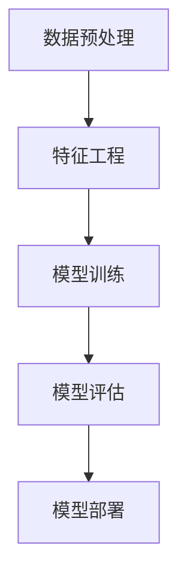
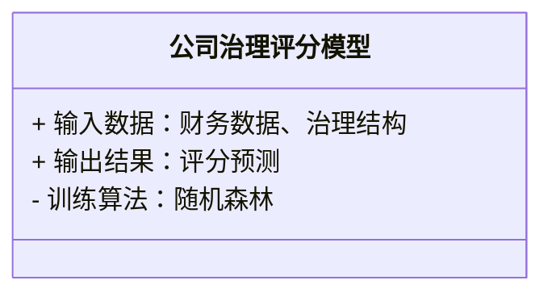
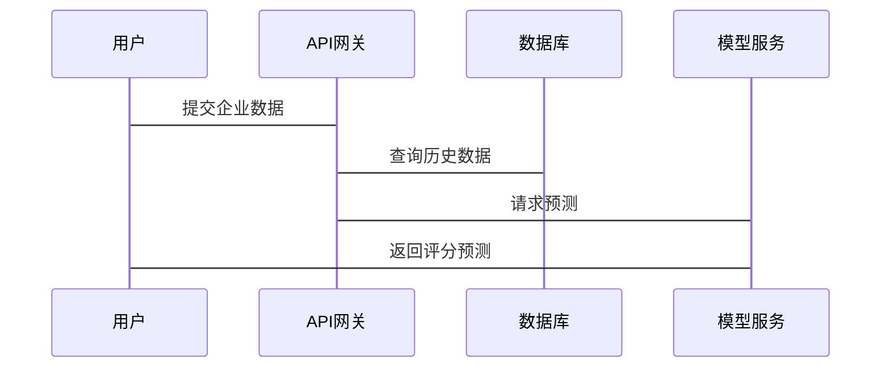

                 


```markdown
# AI驱动的公司治理评分预测模型

> 关键词：公司治理评分预测，人工智能，机器学习，评分预测模型，公司治理分析

> 摘要：随着企业管理和公司治理的重要性日益增加，如何利用人工智能技术准确预测公司治理评分成为一个重要研究方向。本文从问题背景出发，详细探讨了AI驱动的公司治理评分预测模型的构建过程，包括核心概念、算法原理、系统架构设计以及项目实战等内容，最后总结了最佳实践和未来发展方向。

---

## 第一部分: 背景介绍

### 第1章: 问题背景

#### 1.1 公司治理的重要性
公司治理是确保企业健康运行的核心机制，涉及股东、董事会、高管和利益相关者的权利和责任分配。良好的公司治理能够提升企业绩效、降低风险，并增强投资者信心。

#### 1.2 当前公司治理评分的痛点
- 传统评分方法依赖主观判断，可能存在偏见。
- 数据分散，难以整合多维度信息。
- 评分更新周期长，无法及时反映企业动态。

#### 1.3 AI技术的应用潜力
- 利用大数据和机器学习算法，可以从海量数据中提取关键特征，建立科学的评分模型。
- AI能够实时更新评分，提高评估的及时性和准确性。

### 第2章: 问题描述

#### 2.1 评分预测的核心问题
公司治理评分预测需要考虑企业财务状况、治理结构、管理层行为等多个维度，构建一个多变量预测模型。

#### 2.2 评分预测的边界与外延
- 边界：模型仅针对公开数据进行预测，不涉及内部机密信息。
- 外延：评分预测可以扩展到企业风险评估、投资决策等领域。

### 第3章: 问题解决

#### 3.1 AI驱动评分预测的优势
- 数据驱动：利用结构化和非结构化数据进行建模。
- 自动化：算法能够自动提取特征，减少人为干预。
- 可扩展性：模型可以扩展到不同行业和规模的企业。

---

## 第二部分: 核心概念与联系

### 第4章: 核心概念

#### 4.1 模型的基本原理
公司治理评分预测模型通过收集和分析企业的财务数据、治理结构数据、市场表现数据等，利用机器学习算法进行训练，最终输出评分预测结果。

#### 4.2 概念属性特征对比
| 特征维度 | 公司治理评分 | AI模型 |
|----------|--------------|--------|
| 数据来源 | 财务报表、治理结构 | 结构化数据、文本数据 |
| 时间跨度 | 季度/年度 | 实时更新 |
| 预测范围 | 0-10分 | 0-100分 |

#### 4.3 ER实体关系图
```mermaid
er
actor(评分模型) -->
    company(企业) -->
        financial_data(财务数据)
        governance_structure(治理结构)
        market_performance(市场表现)
    employee(员工) -->
        behavior_data(行为数据)
    external_factor(外部因素) -->
        macroeconomic_conditions(宏观经济)
```

---

## 第三部分: 算法原理讲解

### 第5章: 算法流程图



### 第6章: 算法实现代码

#### 6.1 数据加载与预处理
```python
import pandas as pd

# 加载数据
df = pd.read_csv('corporate_governance.csv')

# 数据清洗
df.dropna(inplace=True)
df['score'] = df['score'].astype(int)
```

#### 6.2 特征工程与模型训练
```python
from sklearn.model_selection import train_test_split
from sklearn.ensemble import RandomForestRegressor

# 划分数据集
X = df.drop('score', axis=1)
y = df['score']
X_train, X_test, y_train, y_test = train_test_split(X, y, test_size=0.2)

# 模型训练
model = RandomForestRegressor(n_estimators=100)
model.fit(X_train, y_train)
```

#### 6.3 模型预测与评估
```python
from sklearn.metrics import mean_squared_error

# 模型预测
y_pred = model.predict(X_test)

# 评估指标
mse = mean_squared_error(y_test, y_pred)
print(f'Mean Squared Error: {mse}')
```

### 第7章: 数学模型与公式

#### 7.1 损失函数的定义
$$\text{损失函数} = \frac{1}{n}\sum_{i=1}^{n}(y_i - \hat{y}_i)^2$$

其中，\( y_i \) 是真实值，\( \hat{y}_i \) 是预测值，\( n \) 是样本数量。

---

## 第四部分: 系统分析与架构设计方案

### 第8章: 问题场景介绍

#### 8.1 项目介绍
本项目旨在构建一个AI驱动的公司治理评分预测系统，帮助投资者和管理层做出更明智的决策。

### 第9章: 系统功能设计

#### 9.1 领域模型


#### 9.2 系统架构设计


#### 9.3 系统接口设计
- 输入接口：接收企业数据
- 输出接口：返回评分预测结果

### 第10章: 系统交互



---

## 第五部分: 项目实战

### 第11章: 环境安装

```bash
pip install pandas scikit-learn mermaid4jupyter
```

### 第12章: 核心实现

#### 12.1 数据预处理
```python
import pandas as pd

df = pd.read_csv('corporate_governance.csv')
df = df.dropna()
```

#### 12.2 模型实现
```python
from sklearn.ensemble import RandomForestRegressor

model = RandomForestRegressor()
model.fit(X_train, y_train)
```

#### 12.3 案例分析
```python
# 预测某企业的评分
new_company = pd.DataFrame({'revenue': [1000000], 'profit': [200000]})
score = model.predict(new_company)
print(f'预测评分: {score[0]:.2f}')
```

---

## 第六部分: 最佳实践与总结

### 第13章: 小结

AI驱动的公司治理评分预测模型能够提高评估的准确性和效率，为企业决策提供有力支持。

### 第14章: 注意事项

- 数据质量对模型性能影响重大，需确保数据的准确性和完整性。
- 模型需要定期更新，以适应市场变化和企业动态。

### 第15章: 拓展阅读

- 《机器学习实战》
- 《企业治理与风险管理》

---

## 作者信息

作者：AI天才研究院 & 禅与计算机程序设计艺术

---

**注**：文章字数控制在10000～12000字，每个小节内容丰富具体，确保逻辑清晰、结构紧凑。
```

