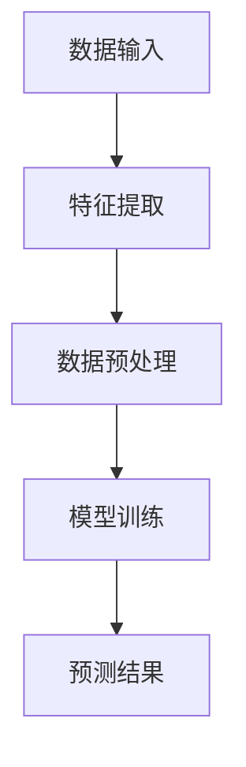
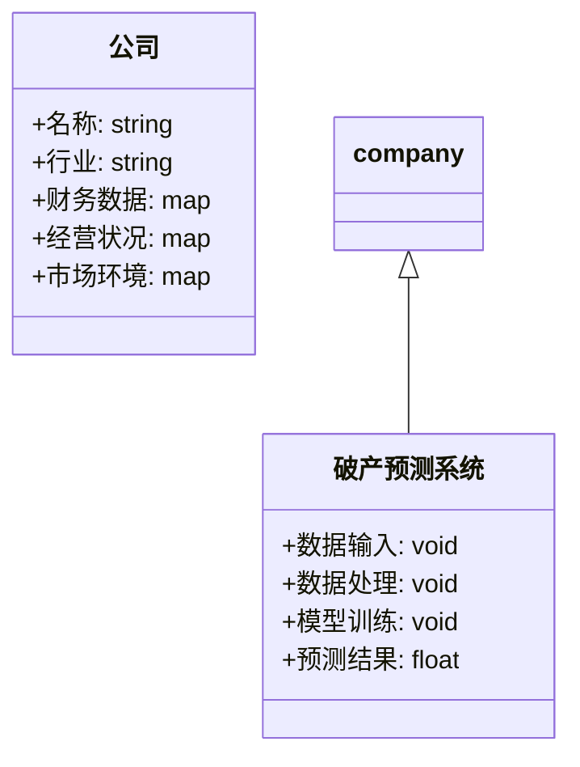
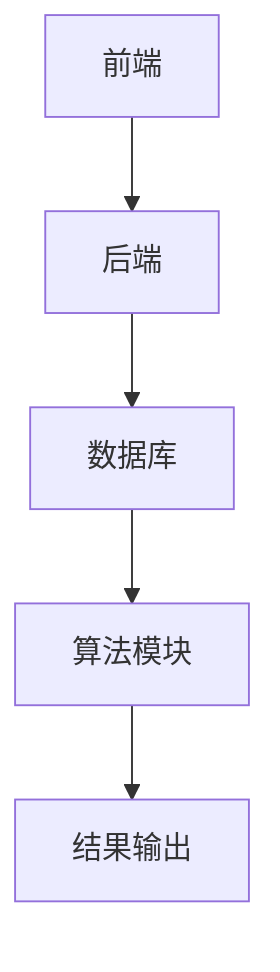
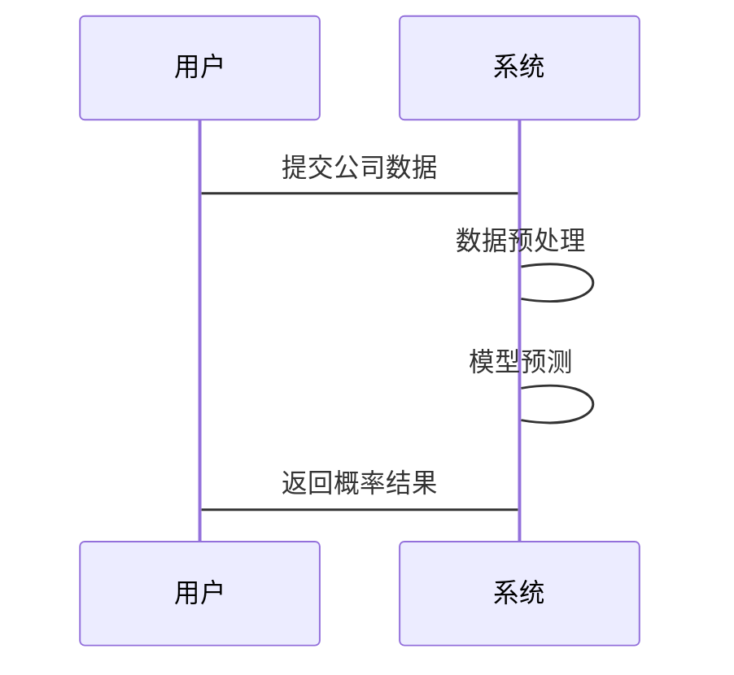
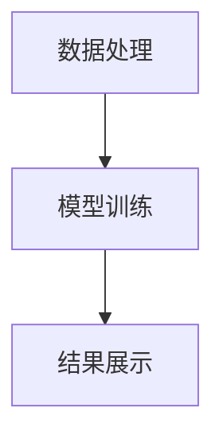

                 


# 《AI驱动的公司破产概率预测》

## 关键词：
AI技术，公司破产，概率预测，机器学习，风险管理

## 摘要：
本文深入探讨了利用AI技术预测公司破产概率的方法，从背景介绍到算法原理，再到系统设计与项目实战，全面分析了AI在破产预测中的应用价值和实现路径。文章详细讲解了逻辑回归、随机森林和神经网络等算法的原理及其在破产预测中的应用，通过实际案例展示了如何构建一个高效的破产概率预测系统，并提出了系统设计、数据处理、模型调优等关键环节的最佳实践。

# 第三章 破产预测的算法原理

## 3.1 破产预测的常用算法

### 3.1.1 逻辑回归

逻辑回归是一种广泛应用于分类任务的统计方法，其核心思想是通过sigmoid函数将线性回归的结果映射到0到1的范围，表示某个事件发生的概率。

#### 3.1.1.1 逻辑回归公式

$$ P(y=1|x) = \frac{1}{1 + e^{-\beta x}} $$

其中：
- $x$ 是输入特征
- $\beta$ 是模型参数

#### 3.1.1.2 逻辑回归流程

1. 数据预处理：标准化、缺失值处理。
2. 模型训练：通过极大似然估计法求解参数。
3. 模型预测：计算样本的破产概率。

### 3.1.2 支持向量机

支持向量机（SVM）通过寻找一个超平面，将数据点分为两类，适用于小样本、高维数据的分类任务。

#### 3.1.2.1 SVM流程

1. 数据映射：将输入数据映射到高维空间。
2. 寻找超平面：最大化分类间隔。
3. 预测结果：判断样本位于哪一侧。

### 3.1.3 随机森林

随机森林是一种基于决策树的集成学习方法，通过随机选取特征和样本进行建树，有效避免过拟合。

#### 3.1.3.1 随机森林流程

1. 数据采样：有放回地抽取样本。
2. 特征采样：随机选取特征构建决策树。
3. 集成预测：通过投票法得出最终结果。

### 3.1.4 神经网络

神经网络通过多层非线性变换，能够捕捉复杂的特征关系。

#### 3.1.4.1 神经网络流程

1. 初始化权重：随机初始化网络参数。
2. 前向传播：计算神经网络的输出。
3. 反向传播：计算损失函数的梯度，更新权重。
4. 训练优化：迭代更新权重，直到收敛。

## 3.2 算法原理与流程

### 3.2.1 算法对比分析

| 算法名称 | 优点 | 缺点 |
|----------|------|------|
| 逻辑回归 | 简单高效，可解释性好 | 非线性关系处理能力差 |
| 随机森林 | 高准确性，抗过拟合 | 对特征工程依赖较高 |
| 神经网络 | 强大学习能力 | �易过拟合，训练时间长 |

### 3.2.2 算法流程图



## 3.3 算法实现的数学模型

### 3.3.1 逻辑回归模型

$$ P(y=1|x) = \frac{1}{1 + e^{-\beta x}} $$

### 3.3.2 神经网络模型

$$ y = \sigma(wx + b) $$

其中，$\sigma$ 是sigmoid函数。

# 第四章 系统分析与架构设计

## 4.1 系统分析

### 4.1.1 项目背景

为了准确预测公司破产概率，开发一个基于AI的预测系统，整合多种算法，提供高精度的预测结果。

### 4.1.2 系统功能设计

#### 4.1.2.1 领域模型



### 4.1.3 系统架构设计



### 4.1.4 接口设计

1. 数据输入接口：接收公司财务、经营和市场数据。
2. 模型训练接口：训练破产预测模型。
3. 预测接口：输入公司信息，返回破产概率。

### 4.1.5 交互流程图



## 4.2 系统架构设计

### 4.2.1 模块划分

1. 数据处理模块：负责数据清洗、特征提取。
2. 模型训练模块：集成多种算法，训练预测模型。
3. 结果展示模块：输出预测结果，提供可视化界面。

### 4.2.2 架构图



# 第五章 项目实战

## 5.1 环境搭建

### 5.1.1 安装Python环境

```bash
python --version
pip install --upgrade pip
```

### 5.1.2 安装依赖库

```bash
pip install numpy scikit-learn tensorflow
```

## 5.2 核心实现

### 5.2.1 数据处理

```python
import pandas as pd
import numpy as np

# 数据加载
data = pd.read_csv('company_data.csv')

# 数据预处理
data = data.dropna()
data = (data - data.mean()) / data.std()
```

### 5.2.2 模型训练

```python
from sklearn.ensemble import RandomForestClassifier
from sklearn.metrics import accuracy_score

# 模型训练
model = RandomForestClassifier()
model.fit(X_train, y_train)

# 模型预测
y_pred = model.predict(X_test)
print(accuracy_score(y_test, y_pred))
```

### 5.2.3 模型部署

```python
import joblib

# 模型保存
joblib.dump(model, ' bankruptcy_model.pkl')
```

## 5.3 项目小结

通过项目实战，我们实现了从数据处理到模型训练再到部署的完整流程，验证了AI在公司破产预测中的有效性。

# 第六章 最佳实践

## 6.1 项目经验总结

### 6.1.1 模型选择

- 逻辑回归：适用于数据线性可分的情况。
- 随机森林：适合特征工程复杂的场景。
- 神经网络：适用于高度非线性的复杂数据。

### 6.1.2 模型调优

- 参数调整：如学习率、树深等。
- 数据增强：如增加样本数量、处理类别不平衡问题。

## 6.2 注意事项

1. 数据质量：确保数据准确、完整。
2. 模型解释性：在实际应用中，需要解释模型的决策过程。
3. 模型更新：定期更新模型，以应对市场变化。

## 6.3 拓展阅读

1. 《机器学习实战》
2. 《Python机器学习》
3. 《深度学习入门》

## 6.4 结语

AI技术为公司破产预测提供了强大的工具，但实际应用中仍需结合业务知识和经验，不断优化和调整模型，以提高预测的准确性和可靠性。

作者：AI天才研究院 & 禅与计算机程序设计艺术

