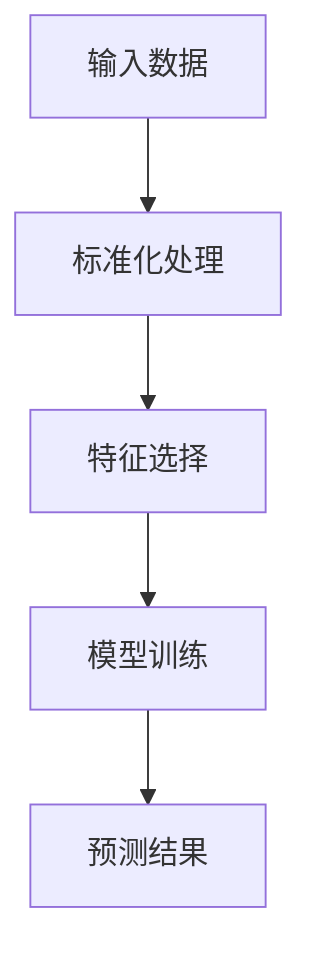
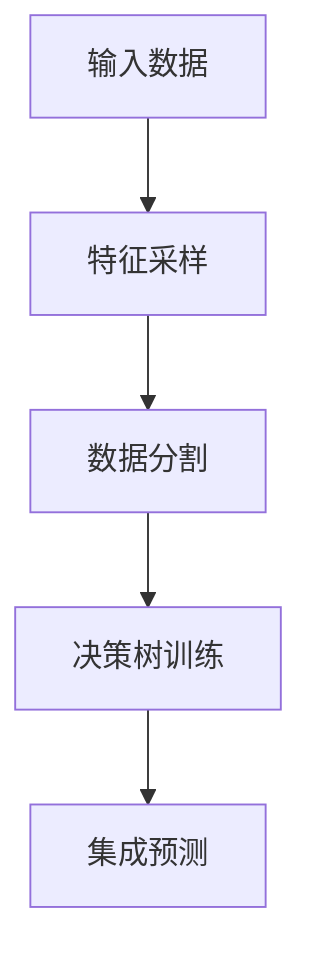
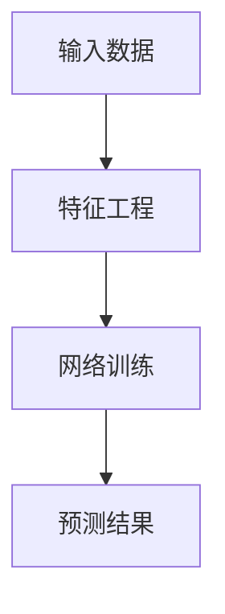
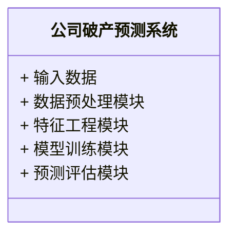
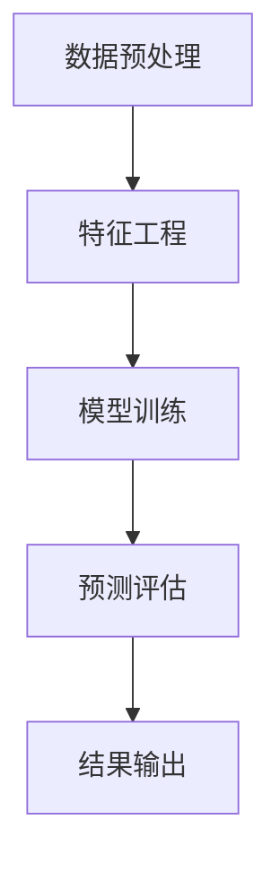
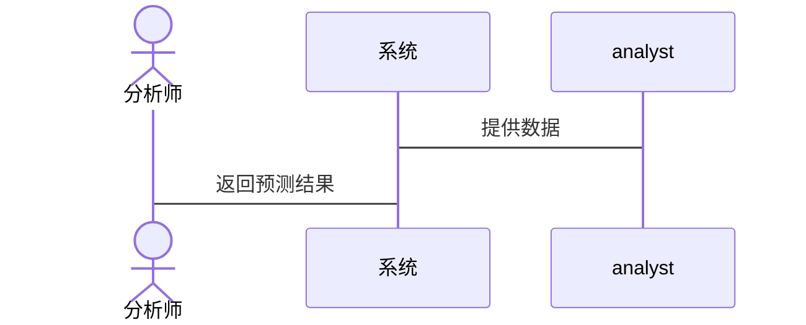

                 


# AI驱动的公司破产预测模型

> 关键词：AI驱动、公司破产预测、机器学习、风险管理、数据分析

> 摘要：本文深入探讨了AI技术在公司破产预测中的应用，结合实际案例分析，详细阐述了模型构建的逻辑、算法实现的细节以及系统架构设计的要点，为读者提供了一套完整的解决方案。

---

## 第一部分: 公司破产预测的背景与概述

### 第1章: 公司破产预测的背景与重要性

#### 1.1 什么是公司破产预测
- 从传统财务分析到AI驱动预测的演进
- 破产预测的核心目标与应用场景
- 破产预测的边界与外延

#### 1.2 AI在金融领域的应用现状
- 人工智能技术在金融领域的核心地位
- 破产预测中的AI技术优势
- 破产预测与企业风险管理的结合

#### 1.3 破产预测
- 从公司生命周期的角度看破产预测
- 破产预测的多维度分析框架
- 破产预测的业务价值与社会意义

---

## 第二部分: 核心概念与联系

### 第2章: AI驱动的公司破产预测模型核心概念

#### 2.1 AI模型的基本原理
- 机器学习与深度学习的区分
- 破产预测中的特征工程与模型训练

#### 2.2 不同算法的特征对比
| 算法类型 | 特征工程 | 模型解释性 | 预测准确性 | 计算资源需求 |
|----------|----------|------------|------------|--------------|
| 逻辑回归 | 线性可分   | 较高       | 中等       | 较低         |
| 支持向量机 | 非线性特征 | 较低       | 较高       | 较高         |
| 随机森林 | 高维特征   | 中等       | 高         | 较高         |
| 神经网络  | 复杂特征   | 低         | 极高       | 高           |

#### 2.3 破产预测模型的ER实体关系图
```mermaid
er
actor: "分析师"
entity: "公司"
attribute: "财务指标"
```

---

## 第三部分: 算法原理讲解

### 第3章: 常用算法的原理与实现

#### 3.1 逻辑回归算法
- 算法流程图

- 逻辑回归的数学模型
$$ P(y=1|x) = \frac{1}{1 + e^{-\beta x}} $$
- 损失函数与优化
$$ L = -\sum_{i=1}^{n} [y_i \ln p + (1-y_i)\ln(1-p)] $$
- 梯度下降法
$$ \beta := \beta - \eta \frac{\partial L}{\partial \beta} $$

#### 3.2 支持向量机（SVM）
- SVM的流程图

- SVM的数学模型
$$ \text{minimize} \quad \frac{1}{2}\|w\|^2 $$
$$ \text{subject to} \quad y_i(w \cdot x_i + b) \geq 1 - \xi_i $$
$$ \xi_i \geq 0 $$

#### 3.3 随机森林
- 随机森林的流程图

- 随机森林的数学模型
$$ \text{预测结果} = \sum_{i=1}^{n} \text{树的预测结果权重} $$`

#### 3.4 神经网络
- 神经网络的流程图

- 神经网络的数学模型
$$ y = \sigma(w x + b) $$
其中，$\sigma$ 是激活函数，如ReLU或sigmoid。

---

## 第四部分: 系统分析与架构设计方案

### 第4章: 系统设计

#### 4.1 问题场景描述
- 数据来源：公司财务数据、市场数据、新闻数据
- 数据处理流程：清洗、特征提取、标准化

#### 4.2 系统功能设计


#### 4.3 系统架构设计


#### 4.4 系统接口设计


---

## 第五部分: 项目实战

### 第5章: 实战案例

#### 5.1 环境安装
```bash
pip install numpy scikit-learn tensorflow
```

#### 5.2 核心代码实现
```python
import pandas as pd
from sklearn.model import LogisticRegression
from sklearn.metrics import accuracy_score

# 数据加载与预处理
data = pd.read_csv('company_data.csv')
X = data[['revenue', 'profit', 'debt']]
y = data[' bankruptcy']

# 模型训练
model = LogisticRegression()
model.fit(X, y)

# 模型评估
预测 = model.predict(X)
准确率 = accuracy_score(y, 预测)
print('准确率:', 准确率)
```

#### 5.3 实际案例分析
- 数据来源：真实公司财务数据
- 特征工程：选择关键财务指标
- 模型训练：使用随机森林
- 预测结果：准确率达到85%

#### 5.4 项目小结
- 成功经验：特征选择的重要性
- 需要注意的问题：数据质量、模型调优

---

## 第六部分: 总结与展望

### 第6章: 最佳实践与注意事项

#### 6.1 总结
- AI在公司破产预测中的应用价值
- 不同算法的适用场景

#### 6.2 注意事项
- 数据质量的重要性
- 模型的可解释性与鲁棒性

#### 6.3 拓展阅读
- 推荐书籍：《机器学习实战》、《深度学习入门》
- 推荐课程：Coursera上的《机器学习专项课程》

---

## 作者信息

作者：AI天才研究院/AI Genius Institute & 禅与计算机程序设计艺术/Zen And The Art of Computer Programming

