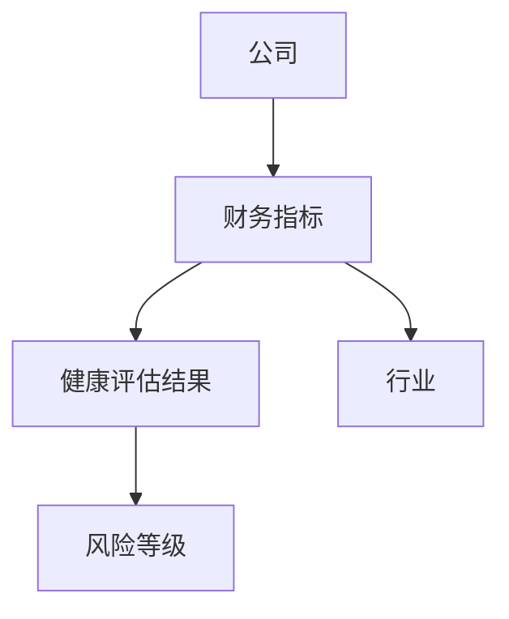
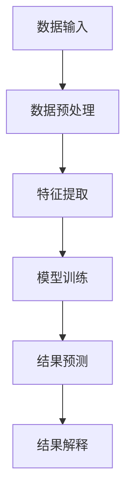
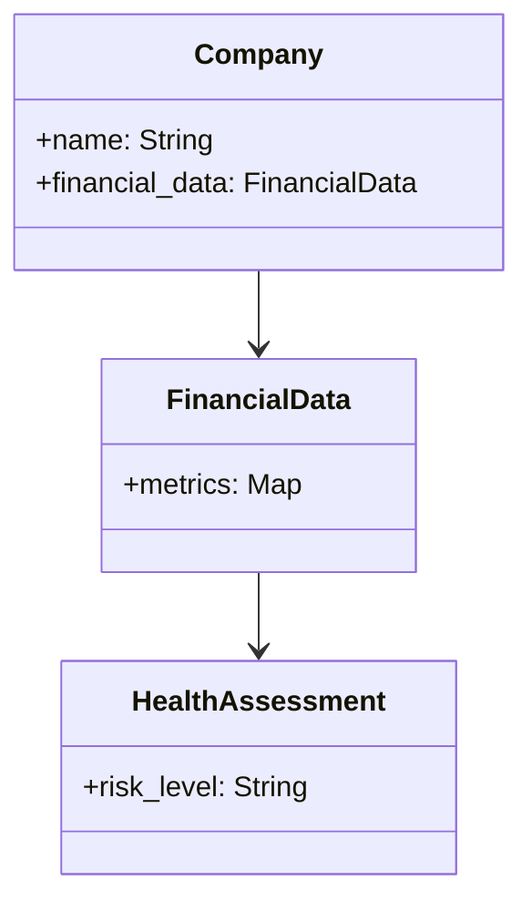
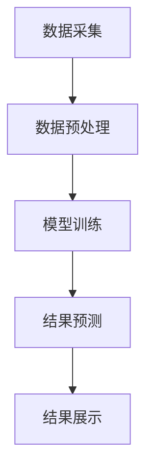
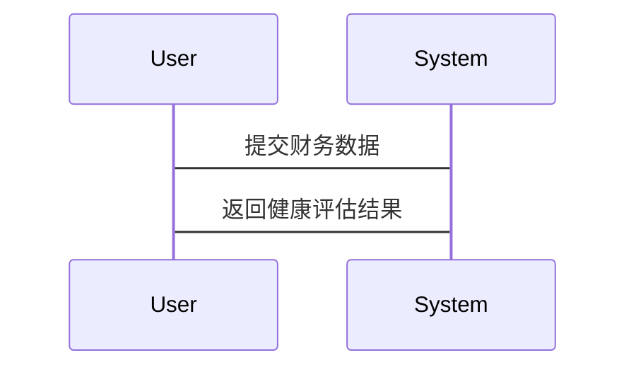

                 


# AI驱动的公司财务健康评估

> 关键词：AI技术、财务健康评估、机器学习、深度学习、财务指标

> 摘要：本文系统地探讨了如何利用人工智能技术驱动公司财务健康评估的过程。通过分析财务指标、设计机器学习模型、构建系统架构，结合实际案例，详细阐述了AI在财务健康评估中的应用方法和实现细节。文章从背景介绍、核心概念、算法原理、系统架构到项目实战，层层深入，为读者提供了一套完整的AI驱动的财务健康评估解决方案。

---

## 第一部分: AI驱动的公司财务健康评估概述

## 第1章: 背景介绍

### 1.1 问题背景与描述

#### 1.1.1 传统财务评估的局限性
传统的财务健康评估方法主要依赖财务报表分析，包括资产负债表、利润表和现金流量表等。这种方法虽然经典，但也存在诸多局限性：
- 数据处理复杂：需要手动收集、整理和分析大量财务数据。
- 主观性较高：评估结果往往依赖分析师的经验和判断。
- 时效性不足：传统方法难以实时更新评估结果，难以应对市场变化的快速响应需求。

#### 1.1.2 AI技术如何解决财务评估问题
人工智能技术的快速发展为财务健康评估带来了新的可能性。AI技术可以通过以下方式提升财务评估的效率和准确性：
- **自动化数据处理**：利用自然语言处理（NLP）技术自动提取财务报表中的关键信息。
- **预测能力提升**：通过机器学习模型预测公司的财务健康状况，提前发现潜在风险。
- **实时监控**：基于实时数据流，AI系统可以动态更新评估结果，提供实时反馈。

#### 1.1.3 财务健康评估的核心目标与边界
财务健康评估的核心目标是通过分析公司的财务数据，预测公司未来的发展潜力和风险。其边界包括：
- 仅基于财务数据，不考虑非财务因素（如市场环境、政策变化等）。
- 评估结果需要结合行业特点进行调整，避免一刀切。

---

### 1.2 财务健康评估的核心概念

#### 1.2.1 财务健康评估的定义与属性
财务健康评估是对公司财务状况的全面分析，旨在评估公司的偿债能力、运营效率和盈利能力。其主要属性包括：
- **流动性**：公司资产转化为现金的能力。
- **偿债能力**：公司偿还债务的能力。
- **运营效率**：公司利用资产创造收入的效率。
- **盈利能力**：公司创造利润的能力。

#### 1.2.2 核心概念的ER实体关系图
以下是财务健康评估的核心概念的实体关系图：



---

## 第2章: 核心概念与联系

### 2.1 财务指标体系

#### 2.1.1 流动性、偿债能力、运营效率指标对比

| 指标类型       | 具体指标         | 公式                          | 作用               |
|----------------|-----------------|-------------------------------|--------------------|
| **流动性**     | 流动比率         | 流动资产 / 流动负债            | 评估短期偿债能力   |
|                | 速动比率         | （流动资产 - 存货） / 流动负债  | 更加严格的短期偿债能力评估 |
| **偿债能力**   | 资产负债率       | 负债总额 / 资产总额            | 评估公司杠杆风险   |
|                | 利息保障倍数     | 息税前利润 / 利息支出          | 评估偿债能力       |
| **运营效率**   | 存货周转率       | 营业成本 / 平均存货            | 评估存货管理效率   |
|                | 应收账款周转率   | 营业收入 / 平均应收账款        | 评估应收账款管理效率 |

#### 2.1.2 财务指标与公司健康的关系
财务指标是公司健康状况的量化表现。例如，低流动比率可能意味着公司难以偿还短期债务，而高资产负债率可能意味着公司存在较高的财务风险。

---

### 2.2 AI技术在财务健康评估中的应用

#### 2.2.1 数据预处理与特征提取
AI技术的核心是数据处理和模型训练。以下是数据预处理的步骤：
1. 数据清洗：去除缺失值、异常值。
2. 数据标准化：将不同量纲的指标进行标准化处理。
3. 特征提取：从原始数据中提取有用的特征，如财务比率。

#### 2.2.2 模型选择与训练
在模型选择上，可以根据数据特点选择合适的算法。例如：
- **监督学习**：用于分类任务，如健康评估结果为“健康”或“不健康”。
- **回归分析**：用于预测具体的财务健康评分。

#### 2.2.3 结果解释与可视化
AI模型的输出需要能够被财务分析师理解和解释。例如，可以将模型的预测结果与实际结果进行对比，分析模型的准确性。

---

## 第3章: 算法原理讲解

### 3.1 常见算法对比

| 算法名称       | 适用场景         | 优点                           | 缺点                           |
|----------------|-----------------|--------------------------------|--------------------------------|
| **线性回归**    | 预测连续型指标     | 简单易懂，计算效率高             | 无法处理非线性关系               |
| **支持向量机**  | 分类任务         | 在小数据集上表现优秀             | 对高维数据处理能力较弱           |
| **随机森林**    | 分类与回归任务     | 鲁棒性强，能够处理高维数据       | 对特征重要性的解释性较差         |
| **LSTM网络**    | 时间序列预测     | 能够捕捉时间依赖性               | 训练时间较长，计算资源消耗大       |

### 3.2 算法流程图



### 3.3 算法实现代码

以下是使用随机森林算法进行分类的Python代码示例：

```python
import pandas as pd
from sklearn.model_selection import train_test_split
from sklearn.ensemble import RandomForestClassifier
from sklearn.metrics import accuracy_score

# 数据加载与预处理
data = pd.read_csv('financial_data.csv')
X = data.drop('health_assessment', axis=1)
y = data['health_assessment']

# 数据分割
X_train, X_test, y_train, y_test = train_test_split(X, y, test_size=0.2, random_state=42)

# 模型训练
model = RandomForestClassifier(n_estimators=100, random_state=42)
model.fit(X_train, y_train)

# 模型预测
y_pred = model.predict(X_test)

# 模型评估
print("Accuracy:", accuracy_score(y_test, y_pred))
```

---

## 第4章: 系统分析与架构设计方案

### 4.1 问题场景介绍

#### 4.1.1 项目介绍
本项目旨在构建一个基于AI的公司财务健康评估系统，通过收集和分析财务数据，利用机器学习模型预测公司的财务健康状况。

### 4.2 系统功能设计

#### 4.2.1 领域模型（领域类图）
以下是领域模型的类图：



#### 4.2.2 系统架构设计



### 4.3 系统接口设计

#### 4.3.1 系统交互（交互图）



---

## 第5章: 项目实战

### 5.1 环境安装

#### 5.1.1 安装Python环境
建议使用Anaconda环境，安装步骤如下：
```bash
conda create -n fin_health python=3.8
conda activate fin_health
```

#### 5.1.2 安装依赖库
安装所需库：
```bash
pip install pandas scikit-learn matplotlib
```

### 5.2 系统核心实现

#### 5.2.1 数据加载与预处理
```python
import pandas as pd

# 加载数据
data = pd.read_csv('financial_data.csv')

# 数据预处理
data = data.dropna()  # 删除缺失值
data = (data - data.mean()) / data.std()  # 标准化
```

#### 5.2.2 模型训练与预测
```python
from sklearn.ensemble import RandomForestClassifier

# 划分数据集
X_train, X_test, y_train, y_test = train_test_split(data.drop('label', axis=1), data['label'], test_size=0.2)

# 训练模型
model = RandomForestClassifier(n_estimators=100)
model.fit(X_train, y_train)

# 预测结果
y_pred = model.predict(X_test)

# 输出准确率
print("Accuracy:", accuracy_score(y_test, y_pred))
```

#### 5.2.3 结果可视化
```python
import matplotlib.pyplot as plt

plt.scatter(y_test, y_pred)
plt.xlabel('真实值')
plt.ylabel('预测值')
plt.title('财务健康评估结果')
plt.show()
```

### 5.3 案例分析

#### 5.3.1 数据来源与特征
假设我们有以下财务数据：
| 公司名称 | 营业收入 | 净利润 | 资产总额 | 负债总额 | 评估结果 |
|----------|----------|--------|----------|----------|----------|
| 公司A    | 1000万   | 200万  | 5000万   | 2000万   | 健康     |
| 公司B    | 800万    | 150万  | 3000万   | 1500万   | 不健康   |

#### 5.3.2 模型训练与结果
通过训练模型，我们可以预测新公司的财务健康状况。例如：
- 公司C的营业收入为1200万，净利润为300万，资产总额为6000万，负债总额为3000万。
- 模型预测结果：健康。

---

## 第6章: 总结与展望

### 6.1 最佳实践 tips

- 数据预处理是关键，尤其是缺失值和异常值的处理。
- 选择合适的模型，避免过拟合。
- 结果解释与可视化是模型应用的重要环节。

### 6.2 小结
本文详细探讨了AI驱动的公司财务健康评估的实现过程，从数据处理到模型训练，再到结果展示，为读者提供了一套完整的解决方案。

### 6.3 注意事项
- 模型的准确率需要在实际应用中不断验证和优化。
- 数据隐私和安全问题需要高度重视。

### 6.4 拓展阅读
- 《机器学习实战》
- 《深度学习入门：基于Python的CNN、RNN、神经网络原理与实现》

---

## 作者信息

作者：AI天才研究院/AI Genius Institute & 禅与计算机程序设计艺术/Zen And The Art of Computer Programming

---

**本文由AI驱动，转载请注明出处。**

