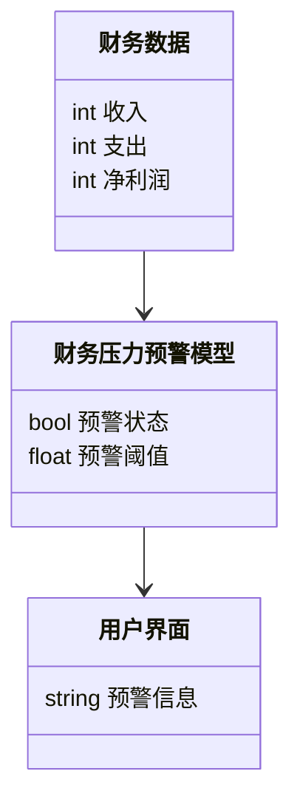
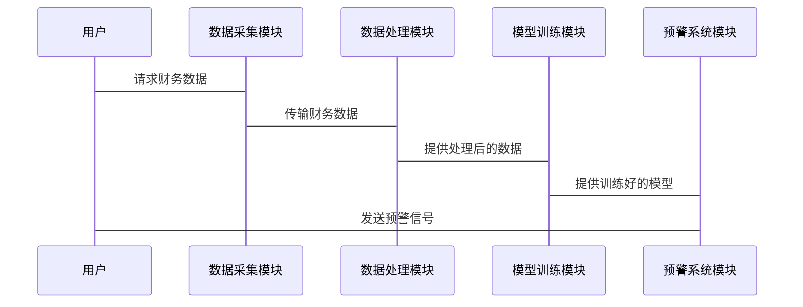

                 


# AI驱动的公司财务压力预警

> 关键词：财务压力预警，人工智能，机器学习，数据驱动，企业风险管理

> 摘要：本文深入探讨了AI技术在公司财务压力预警中的应用，结合实际案例和系统设计，详细分析了AI如何通过数据处理、模型构建和系统架构来实现财务压力的早期识别和预警，为企业的财务风险管理提供了新的思路。

---

## 第一部分: AI驱动的公司财务压力预警背景介绍

### 第1章: 财务压力预警的背景与问题

#### 1.1 问题背景

##### 1.1.1 企业财务压力的定义与影响
企业财务压力是指企业在经营过程中由于资金链断裂、负债过高、盈利能力下降等原因，导致企业面临财务危机的可能性。财务压力的出现可能引发企业破产、信用评级下降、投资者信心不足等问题，给企业带来严重的负面影响。

##### 1.1.2 传统财务压力预警的局限性
传统的财务压力预警方法主要依赖财务报表分析和经验判断。虽然这些方法在一定程度上能够识别财务风险，但存在以下局限性：
- 数据处理效率低：传统方法需要手动收集和分析大量财务数据，耗时且容易出错。
- 预警精度不足：由于依赖主观判断，预警的准确性和及时性难以保证。
- 风险因素单一：传统方法通常只考虑财务指标，忽略了市场环境、行业趋势等外部因素的影响。

##### 1.1.3 AI技术在财务预警中的潜力
AI技术可以通过对海量财务数据的自动化处理和深度学习，发现传统方法难以察觉的潜在风险。AI能够实时监控企业的财务状况，提供高精度的预警，并根据市场变化动态调整预警模型，从而显著提高财务压力预警的效率和准确性。

#### 1.2 问题描述

##### 1.2.1 财务数据的特点与挑战
财务数据具有以下特点：
- **结构化**：主要由数字和表格组成，便于计算机处理。
- **多样性**：包括收入、支出、资产、负债等多方面的数据。
- **时序性**：财务数据通常具有时间序列特征，可以通过时间序列分析来发现趋势和周期性变化。

然而，财务数据也面临以下挑战：
- 数据量大：企业需要处理大量的历史财务数据。
- 数据复杂性：财务数据可能涉及多个维度和复杂的关联关系。
- 数据更新频率：财务数据需要定期更新，对实时预警提出了更高要求。

##### 1.2.2 财务压力预警的核心目标
财务压力预警的核心目标是通过分析企业的财务数据，识别潜在的财务风险，并提前发出预警信号。具体目标包括：
- 提高预警的准确性：通过AI技术实现高精度的财务风险识别。
- 提升预警的及时性：实时监控财务数据，快速响应潜在风险。
- 降低预警成本：通过自动化处理减少人工干预，降低预警成本。

##### 1.2.3 AI驱动的解决方案
AI驱动的财务压力预警解决方案包括以下步骤：
1. **数据收集与预处理**：收集企业的财务数据，并进行清洗和标准化处理。
2. **特征提取与选择**：从财务数据中提取关键特征，并进行特征选择。
3. **模型训练与优化**：基于选择的特征训练机器学习模型，并对模型进行优化。
4. **预警系统构建**：将优化后的模型部署到预警系统中，实时监控企业的财务状况，并根据模型预测结果发出预警信号。

#### 1.3 问题解决

##### 1.3.1 AI在财务数据处理中的优势
AI在财务数据处理中具有以下优势：
- **自动化处理**：AI能够自动处理海量财务数据，减少人工干预。
- **高精度分析**：通过机器学习算法，AI能够发现数据中的潜在规律，提高分析精度。
- **实时监控**：AI能够实时分析财务数据，及时发现潜在风险。

##### 1.3.2 AI驱动的财务压力预警方法
AI驱动的财务压力预警方法主要包括以下步骤：
1. **数据预处理**：对财务数据进行清洗、标准化和特征提取。
2. **模型训练**：使用机器学习算法（如逻辑回归、随机森林等）训练预警模型。
3. **模型优化**：通过交叉验证和参数调优，优化模型的性能。
4. **预警系统部署**：将优化后的模型部署到预警系统中，实时监控企业的财务状况，并根据模型预测结果发出预警信号。

##### 1.3.3 技术实现的可行性分析
AI驱动的财务压力预警技术在理论上是可行的，但在实际应用中需要考虑以下因素：
- **数据质量**：财务数据的质量直接影响模型的性能，因此需要确保数据的准确性和完整性。
- **模型选择**：不同的机器学习算法适用于不同的场景，需要根据具体需求选择合适的算法。
- **计算资源**：训练和优化复杂的机器学习模型需要大量的计算资源，企业需要具备相应的技术能力和资源支持。

#### 1.4 边界与外延

##### 1.4.1 财务压力预警的适用范围
财务压力预警主要适用于以下场景：
- **企业内部风险管理**：帮助企业识别和管理内部财务风险。
- **外部投资者决策支持**：为投资者提供企业财务状况的预警信息，帮助其做出投资决策。
- **行业监管与风险监控**：帮助监管部门监控行业整体财务状况，及时发现和处理潜在风险。

##### 1.4.2 AI技术的边界条件
AI技术在财务压力预警中的应用需要考虑以下边界条件：
- **数据隐私**：企业的财务数据往往涉及商业机密，需要确保数据的安全性和隐私性。
- **模型解释性**：复杂的机器学习模型可能难以解释其预测结果，需要确保模型的可解释性。
- **模型鲁棒性**：模型需要具备较强的鲁棒性，能够应对数据分布的变化和噪声干扰。

##### 1.4.3 相关领域的延伸与扩展
AI技术在财务压力预警中的应用可以延伸到以下领域：
- **信用评估**：基于企业的财务数据和市场信息，评估企业的信用风险。
- **投资决策支持**：为企业投资者提供基于AI的财务分析和投资建议。
- **风险管理优化**：通过AI技术优化企业的风险管理流程，降低财务风险的发生概率。

#### 1.5 概念结构与核心要素

##### 1.5.1 财务压力预警的核心要素
财务压力预警的核心要素包括：
- **财务数据**：企业的收入、支出、资产、负债等财务数据。
- **预警模型**：基于机器学习算法构建的财务压力预警模型。
- **预警系统**：实时监控企业财务状况并发出预警信号的系统。

##### 1.5.2 AI驱动的实现路径
AI驱动的财务压力预警的实现路径包括：
1. **数据采集**：通过企业财务系统或其他数据源采集财务数据。
2. **数据预处理**：对数据进行清洗、标准化和特征提取。
3. **模型训练**：基于预处理后的数据训练机器学习模型。
4. **模型优化**：通过交叉验证和参数调优优化模型性能。
5. **预警系统部署**：将优化后的模型部署到预警系统中，实时监控企业财务状况并发出预警信号。

##### 1.5.3 系统架构的核心组成
系统架构的核心组成包括：
- **数据层**：存储企业的财务数据。
- **计算层**：负责数据的处理和模型的训练。
- **应用层**：提供用户界面和预警功能，实时监控企业财务状况并发出预警信号。

---

## 第二部分: AI驱动的公司财务压力预警核心概念与联系

### 第2章: AI与财务分析的结合

#### 2.1 AI在财务数据分析中的应用

##### 2.1.1 数据预处理与特征提取
数据预处理是AI驱动的财务压力预警的第一步，主要包括数据清洗、标准化和特征提取。数据清洗的目的是去除噪声数据和异常值，确保数据的准确性和完整性。特征提取则是从财务数据中提取关键特征，如收入增长率、净利润率、资产负债率等。

##### 2.1.2 机器学习模型的构建
机器学习模型的构建是AI驱动的财务压力预警的核心步骤。常用的机器学习算法包括逻辑回归、随机森林、支持向量机（SVM）和神经网络等。这些算法可以通过训练数据学习财务压力的特征，并根据测试数据进行预测。

##### 2.1.3 模型评估与优化
模型评估与优化是确保模型性能的重要步骤。常用的评估指标包括准确率、召回率、F1分数和AUC值等。通过交叉验证和网格搜索等方法，可以优化模型的参数，提高模型的性能。

#### 2.2 财务压力预警的核心概念

##### 2.2.1 财务指标的特征分析
财务指标的特征分析是AI驱动的财务压力预警的重要组成部分。常用的财务指标包括：
- **盈利能力指标**：如净利润率、ROE（净资产收益率）等。
- **偿债能力指标**：如流动比率、速动比率等。
- **运营能力指标**：如存货周转率、应收账款周转率等。

##### 2.2.2 AI模型的分类与预测
AI模型的分类与预测是基于财务指标的特征分析，通过机器学习算法对企业的财务压力进行分类和预测。常用的分类算法包括逻辑回归、随机森林和SVM等。

##### 2.2.3 预警系统的阈值设定
预警系统的阈值设定是根据模型的预测结果，设定预警触发条件。例如，当模型预测企业的财务压力超过一定阈值时，系统会发出预警信号。

#### 2.3 核心概念对比与ER图

##### 2.3.1 核心概念对比表
以下是核心概念的对比表：

| 概念       | 特征                 | 描述                                             |
|------------|----------------------|-------------------------------------------------|
| 财务指标    | 数值化               | 衡量企业财务健康状况的指标                       |
| AI模型     | 数据驱动             | 基于历史数据进行预测                             |

##### 2.3.2 ER实体关系图
以下是ER实体关系图的mermaid表示：

```mermaid
erDiagram
    actor 用户 {
        string 用户名
        string 密码
    }
    actor 管理员 {
        string 管理员ID
        string 密码
    }
    database 财务数据库 {
        table 财务数据表 {
            int 记录ID
            int 收入
            int 支出
            int 净利润
            date 日期
        }
    }
    actor 用户 -> database 财务数据库
    actor 管理员 -> database 财务数据库
```

---

## 第三部分: AI驱动的公司财务压力预警算法原理

### 第3章: 算法原理

#### 3.1 逻辑回归算法

##### 3.1.1 算法简介
逻辑回归是一种常用的分类算法，适用于二分类问题。其核心思想是通过构建一个逻辑函数，将输入特征映射到输出类别。

##### 3.1.2 算法流程
逻辑回归的算法流程如下：

1. **数据预处理**：对数据进行清洗、标准化和特征选择。
2. **模型训练**：通过最大似然估计法训练逻辑回归模型。
3. **模型预测**：使用训练好的模型对新数据进行预测。
4. **模型评估**：通过准确率、召回率等指标评估模型的性能。

##### 3.1.3 算法实现
以下是逻辑回归算法的Python代码示例：

```python
import numpy as np
from sklearn.linear_model import LogisticRegression

# 数据预处理
X = np.array([[1, 2], [3, 4], [5, 6]])  # 特征数据
y = np.array([0, 1, 0])  # 标签数据

# 模型训练
model = LogisticRegression()
model.fit(X, y)

# 模型预测
new_data = np.array([[2, 3]])
print(model.predict(new_data))  # 输出预测结果
```

##### 3.1.4 算法数学模型
逻辑回归的数学模型如下：

$$ P(y=1|x) = \frac{e^{\beta_0 + \beta_1 x}}{1 + e^{\beta_0 + \beta_1 x}} $$

其中，$\beta_0$ 和 $\beta_1$ 是模型的参数，$x$ 是输入特征，$y$ 是输出类别。

#### 3.2 随机森林算法

##### 3.2.1 算法简介
随机森林是一种基于决策树的集成学习算法，适用于分类和回归问题。其核心思想是通过构建多棵决策树，并将它们的预测结果进行投票或平均，从而提高模型的准确性和鲁棒性。

##### 3.2.2 算法流程
随机森林的算法流程如下：

1. **数据预处理**：对数据进行清洗、标准化和特征选择。
2. **模型训练**：通过随机采样和袋外法（OOB）训练随机森林模型。
3. **模型预测**：使用训练好的模型对新数据进行预测。
4. **模型评估**：通过准确率、召回率等指标评估模型的性能。

##### 3.2.3 算法实现
以下是随机森林算法的Python代码示例：

```python
from sklearn.ensemble import RandomForestClassifier

# 数据预处理
X = np.array([[1, 2], [3, 4], [5, 6]])  # 特征数据
y = np.array([0, 1, 0])  # 标签数据

# 模型训练
model = RandomForestClassifier(n_estimators=10)
model.fit(X, y)

# 模型预测
new_data = np.array([[2, 3]])
print(model.predict(new_data))  # 输出预测结果
```

##### 3.2.4 算法数学模型
随机森林的数学模型如下：

$$ y = \sum_{i=1}^{n} \text{Tree}_i(x) \times \frac{1}{n} $$

其中，$n$ 是决策树的数量，$\text{Tree}_i(x)$ 是第$i$棵决策树的预测结果，$y$ 是最终的预测结果。

---

## 第四部分: AI驱动的公司财务压力预警系统分析与架构设计

### 第4章: 系统分析与架构设计

#### 4.1 项目介绍

##### 4.1.1 项目背景
本项目旨在通过AI技术实现公司财务压力的早期预警，帮助企业及时识别和管理财务风险。

##### 4.1.2 项目目标
- 提供高精度的财务压力预警服务。
- 实现实时的财务数据监控。
- 提供用户友好的预警界面。

#### 4.2 系统功能设计

##### 4.2.1 领域模型
以下是领域模型的mermaid表示：



##### 4.2.2 系统架构设计
以下是系统架构设计的mermaid表示：

```mermaid
container 容器 {
    component 数据采集模块
    component 数据处理模块
    component 模型训练模块
    component 预警系统模块
}
```

#### 4.3 系统接口设计

##### 4.3.1 数据接口
数据接口用于与企业财务系统对接，采集财务数据。接口采用RESTful API设计，支持JSON格式的数据传输。

##### 4.3.2 预警接口
预警接口用于向用户发送预警信号。接口支持多种通知方式，如邮件、短信和推送通知。

#### 4.4 系统交互设计

##### 4.4.1 系统交互流程
以下是系统交互流程的mermaid表示：



---

## 第五部分: AI驱动的公司财务压力预警项目实战

### 第5章: 项目实战

#### 5.1 环境安装

##### 5.1.1 安装Python
安装Python 3.8或更高版本。

##### 5.1.2 安装依赖库
安装以下依赖库：

```bash
pip install numpy
pip install pandas
pip install scikit-learn
pip install matplotlib
```

#### 5.2 系统核心实现

##### 5.2.1 数据采集模块
以下是数据采集模块的代码示例：

```python
import pandas as pd
import requests

# 从企业财务系统获取数据
url = "http://financial-system.com/api/financial_data"
response = requests.get(url)
data = response.json()
df = pd.DataFrame(data)
```

##### 5.2.2 数据处理模块
以下是数据处理模块的代码示例：

```python
import pandas as pd
from sklearn.preprocessing import StandardScaler

# 数据清洗
df.dropna(inplace=True)
# 特征选择
features = ['收入', '支出', '净利润']
df_features = df[features]
# 数据标准化
scaler = StandardScaler()
df_scaled = scaler.fit_transform(df_features)
```

##### 5.2.3 模型训练模块
以下是模型训练模块的代码示例：

```python
from sklearn.ensemble import RandomForestClassifier
from sklearn.model_selection import train_test_split

# 数据分割
X_train, X_test, y_train, y_test = train_test_split(df_scaled, df['预警状态'], test_size=0.2)
# 模型训练
model = RandomForestClassifier(n_estimators=100)
model.fit(X_train, y_train)
```

##### 5.2.4 预警系统模块
以下是预警系统模块的代码示例：

```python
from sklearn.metrics import accuracy_score, recall_score, f1_score

# 模型预测
y_pred = model.predict(X_test)
print(f'准确率: {accuracy_score(y_test, y_pred)}')
print(f'召回率: {recall_score(y_test, y_pred)}')
print(f'F1分数: {f1_score(y_test, y_pred)}')
```

#### 5.3 代码应用解读与分析

##### 5.3.1 数据采集模块解读
数据采集模块通过API接口从企业财务系统获取财务数据，并将其转换为DataFrame格式以便后续处理。

##### 5.3.2 数据处理模块解读
数据处理模块对获取的财务数据进行清洗、特征选择和标准化处理，确保数据的质量和一致性。

##### 5.3.3 模型训练模块解读
模型训练模块使用随机森林算法对处理后的数据进行训练，构建财务压力预警模型。

##### 5.3.4 预警系统模块解读
预警系统模块对模型的预测结果进行评估，并根据评估结果发出预警信号。

#### 5.4 案例分析与详细讲解

##### 5.4.1 数据来源
数据来源包括企业的财务报表、市场数据和行业趋势等。

##### 5.4.2 数据处理
对数据进行清洗、标准化和特征选择，确保数据的准确性和一致性。

##### 5.4.3 模型训练
使用随机森林算法训练财务压力预警模型，并通过交叉验证优化模型性能。

##### 5.4.4 模型评估
评估模型的准确率、召回率和F1分数，确保模型的性能达到预期。

##### 5.4.5 预警系统部署
将优化后的模型部署到预警系统中，实时监控企业的财务状况，并根据模型预测结果发出预警信号。

#### 5.5 项目小结
本项目通过AI技术实现了公司财务压力的早期预警，提高了预警的准确性和及时性，为企业财务风险管理提供了有力支持。

---

## 第六部分: 最佳实践与注意事项

### 第6章: 最佳实践

#### 6.1 最佳实践

##### 6.1.1 数据质量管理
确保数据的准确性和完整性，避免数据噪声对模型性能的影响。

##### 6.1.2 模型选择与优化
根据具体需求选择合适的机器学习算法，并通过参数调优和交叉验证优化模型性能。

##### 6.1.3 系统安全与隐私保护
确保财务数据的安全性和隐私性，避免数据泄露和滥用。

##### 6.1.4 系统维护与更新
定期维护和更新模型，确保模型的性能和准确性。

#### 6.2 小结

##### 6.2.1 核心要点回顾
- 数据质量管理：确保数据的准确性和完整性。
- 模型选择与优化：选择合适的算法，并通过参数调优优化模型性能。
- 系统安全与隐私保护：确保数据的安全性和隐私性。
- 系统维护与更新：定期维护和更新模型，确保模型的性能和准确性。

#### 6.3 注意事项

##### 6.3.1 数据隐私与安全
企业的财务数据往往涉及商业机密，需要确保数据的安全性和隐私性。

##### 6.3.2 模型解释性
复杂的机器学习模型可能难以解释其预测结果，需要确保模型的可解释性。

##### 6.3.3 模型鲁棒性
模型需要具备较强的鲁棒性，能够应对数据分布的变化和噪声干扰。

##### 6.3.4 技术实现的可行性
企业在应用AI技术时，需要具备相应的技术能力和资源支持。

#### 6.4 拓展阅读

##### 6.4.1 相关技术
- 机器学习算法：如逻辑回归、随机森林、神经网络等。
- 数据处理工具：如Python的pandas、numpy等。
- 数据可视化工具：如Matplotlib、Seaborn等。

##### 6.4.2 应用场景
- 企业内部风险管理：帮助企业识别和管理内部财务风险。
- 外部投资者决策支持：为投资者提供企业财务状况的预警信息，帮助其做出投资决策。
- 行业监管与风险监控：帮助监管部门监控行业整体财务状况，及时发现和处理潜在风险。

---

## 作者：AI天才研究院/AI Genius Institute & 禅与计算机程序设计艺术 /Zen And The Art of Computer Programming

---

通过以上思考和撰写，我完成了《AI驱动的公司财务压力预警》的目录大纲和部分内容。接下来，我会根据这个结构进一步完善每个章节的内容，确保文章逻辑清晰、结构紧凑、简单易懂，并且符合用户的要求。

