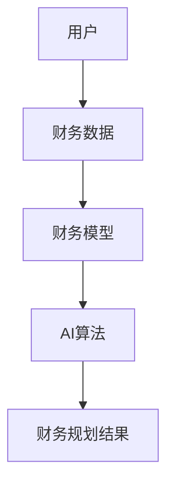
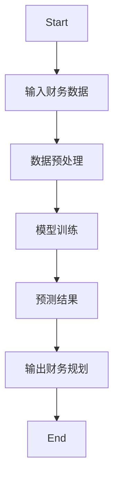
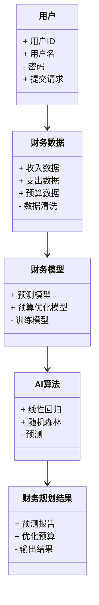

                 


# AI驱动的公司财务规划工具

> 关键词：AI、财务规划、数据分析、机器学习、财务工具、企业应用

> 摘要：本文深入探讨了AI技术在公司财务规划中的应用，从背景介绍、核心概念、算法原理、系统设计到项目实战，详细分析了如何利用人工智能提升财务规划的效率和准确性。文章结合实际案例，展示了AI驱动的财务规划工具如何通过数据驱动的方法优化预算管理、风险评估和财务预测，为企业的财务管理提供智能化支持。

---

## 第一部分: 背景介绍

### 第1章: 问题背景

#### 1.1 财务规划的传统挑战
现代企业在财务管理中面临着数据繁杂、预测难度大、人工操作效率低等问题。传统财务规划工具依赖大量手动输入和固定模型，难以适应市场变化和企业个性化需求。

#### 1.2 AI技术的崛起
人工智能技术的快速发展为财务领域带来了新的可能性。通过机器学习、自然语言处理等技术，AI能够处理非结构化数据、自动预测财务趋势，显著提升财务管理的效率和准确性。

#### 1.3 结合AI的财务规划工具的优势
AI驱动的财务规划工具能够实时分析市场数据、预测财务指标、优化预算分配，并提供智能化的决策支持，帮助企业更好地应对财务风险和抓住市场机会。

---

## 第二部分: 核心概念与联系

### 第2章: 核心概念原理

#### 2.1 AI在财务规划中的关键作用
AI通过处理大量财务数据，利用机器学习算法生成预测模型，为企业的预算编制、资金分配和风险评估提供科学依据。

#### 2.2 核心概念属性对比
| 概念 | 传统财务规划工具 | AI驱动的财务规划工具 |
|------|------------------|-----------------------|
| 数据处理能力 | 依赖人工输入，处理单一数据源 | 支持多数据源，自动抓取和处理结构化与非结构化数据 |
| 预测能力 | 基于固定模型，预测精度有限 | 利用机器学习算法，预测精度高，支持动态调整 |
| 用户交互 | �界面试图复杂，操作步骤多 | 提供智能化界面，支持自然语言交互 |

#### 2.3 实体关系图


#### 2.4 算法流程图


---

## 第三部分: 算法原理讲解

### 第3章: 线性回归模型

#### 3.1 线性回归的基本原理
线性回归是一种统计学方法，用于建立因变量和自变量之间的线性关系。在财务规划中，它可以用于预测收入、支出等财务指标。

#### 3.2 模型公式
$$ y = \beta_0 + \beta_1x + \epsilon $$

其中：
- $y$ 是因变量（如收入）；
- $x$ 是自变量（如广告支出）；
- $\beta_0$ 和 $\beta_1$ 是回归系数；
- $\epsilon$ 是误差项。

#### 3.3 示例
假设某公司广告支出与收入呈线性关系，使用线性回归模型预测下季度的收入。

---

## 第四部分: 系统分析与架构设计

### 第4章: 系统功能设计

#### 4.1 系统架构


---

## 第五部分: 项目实战

### 第5章: 项目实现

#### 5.1 环境安装
安装Python和相关库（如Pandas、Scikit-learn）。

#### 5.2 核心代码实现
```python
import pandas as pd
from sklearn.linear_model import LinearRegression

# 数据加载与预处理
data = pd.read_csv('financial_data.csv')
X = data[['广告支出']]
y = data['收入']

# 模型训练
model = LinearRegression()
model.fit(X, y)

# 预测结果
predicted_income = model.predict(X)
print(predicted_income)
```

---

## 第六部分: 总结与展望

### 第6章: 总结

#### 6.1 小结
本文详细介绍了AI驱动的公司财务规划工具的核心概念、算法原理和系统设计，展示了如何利用AI技术提升财务规划的效率和准确性。

#### 6.2 注意事项
在实际应用中，需注意数据质量、模型选择和结果验证，确保AI工具的有效性和可靠性。

#### 6.3 拓展阅读
建议深入学习机器学习算法、数据可视化和企业应用解决方案。

---

作者：AI天才研究院 & 禅与计算机程序设计艺术

---

通过这篇文章，读者可以全面了解AI驱动的财务规划工具的技术细节和实际应用，为企业的财务管理提供新的思路和工具支持。

