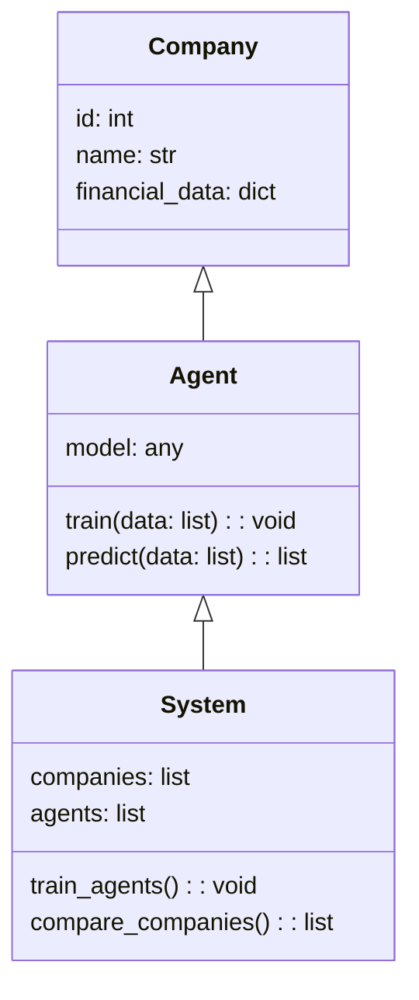
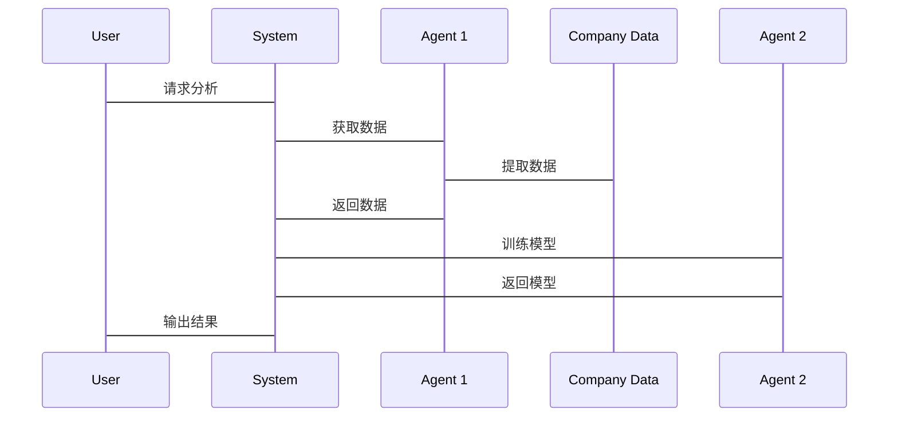

                 


# AI驱动的公司间比较分析：价值投资中的多智能体应用

> **关键词**：AI驱动、公司间比较分析、价值投资、多智能体、协同学习、投资决策、系统架构

> **摘要**：  
本文探讨了AI驱动的公司间比较分析在价值投资中的应用，重点分析了多智能体系统在公司比较分析中的协作机制与优势。文章从问题背景、核心概念、算法原理、系统架构等多方面展开，结合实际案例，详细阐述了AI驱动的公司间比较分析的实现路径和应用价值，为投资者提供了新的视角和工具。

---

## 第一部分: AI驱动的公司间比较分析背景与基础

### 第1章: 公司间比较分析的背景与挑战

#### 1.1 问题背景

##### 1.1.1 传统公司比较分析的局限性
传统的公司比较分析依赖于人工收集和整理数据，分析效率低，且难以覆盖海量数据。这种方法容易受到主观因素的影响，难以全面捕捉市场变化。

##### 1.1.2 价值投资中的公司比较分析需求
价值投资者需要通过公司间的横向对比，识别具有长期投资价值的标的。然而，传统方法在数据处理和分析深度上存在明显不足。

##### 1.1.3 AI驱动的公司间比较分析的优势
AI技术能够快速处理海量数据，发现传统方法难以察觉的模式和关联，为价值投资提供更精准的决策支持。

#### 1.2 问题描述

##### 1.2.1 传统公司比较分析的流程与方法
传统的公司比较分析流程包括数据收集、初步筛选、深度分析等步骤，但效率低下且容易出错。

##### 1.2.2 价值投资中的关键决策问题
投资者需要解决的关键问题包括如何高效筛选优质公司、如何量化公司间的异同、如何预测未来趋势等。

##### 1.2.3 当前技术手段的不足与改进方向
现有技术手段难以同时满足数据处理效率和分析深度的需求，改进方向包括引入AI技术、多智能体协作等。

#### 1.3 问题解决

##### 1.3.1 多智能体协作的定义与特点
多智能体协作是指多个智能体通过协同工作，共同完成复杂任务。其特点是分布式计算、自主性、协作性和适应性。

##### 1.3.2 多智能体在公司间比较分析中的应用
多智能体可以分别负责数据收集、特征提取、模型训练等任务，通过协作提高整体分析效率和准确性。

##### 1.3.3 AI驱动的公司间比较分析的实现路径
通过构建多智能体系统，利用AI技术实现公司间的多维度对比分析，为投资者提供决策支持。

#### 1.4 边界与外延

##### 1.4.1 公司间比较分析的边界条件
包括数据来源、分析范围、时间窗口等限制条件。

##### 1.4.2 多智能体应用的适用范围与限制
适用于复杂任务的分解与协同，但需考虑计算资源和数据隐私问题。

##### 1.4.3 相关概念的扩展与延伸
包括分布式计算、协同学习、强化学习等技术的扩展应用。

#### 1.5 概念结构与核心要素

##### 1.5.1 公司间比较分析的核心要素
包括公司基本面、行业地位、财务指标等。

##### 1.5.2 多智能体系统的核心组成
包括智能体、通信机制、协作策略等。

##### 1.5.3 AI驱动的公司间比较分析的逻辑框架
通过多智能体协作，实现数据处理、特征提取、模型训练、结果输出等环节的无缝对接。

---

### 第2章: 多智能体系统的核心概念与联系

#### 2.1 多智能体系统的基本原理

##### 2.1.1 多智能体系统的定义与特点
多智能体系统是由多个智能体组成的分布式系统，具有自主性、协作性和适应性等特点。

##### 2.1.2 多智能体系统的组成要素
包括智能体、环境、通信机制、协作策略等。

##### 2.1.3 多智能体系统的协作机制
通过通信和协调，智能体之间共享信息、分配任务、优化决策。

#### 2.2 多智能体系统的核心概念对比

##### 2.2.1 不同多智能体系统的对比分析
从分布式计算、自主性、协作性等方面进行对比。

##### 2.2.2 多智能体与单智能体的对比
多智能体在任务分解、并行处理等方面具有优势。

##### 2.2.3 多智能体系统中的角色分配与任务分工
根据任务需求，合理分配智能体的角色和任务。

#### 2.3 实体关系图（ER图）架构

##### 2.3.1 多智能体系统的ER图设计
通过ER图描述实体之间的关系，包括智能体、任务、数据等。

##### 2.3.2 实体之间的关系与交互
展示智能体之间的数据流、任务分配等交互过程。

##### 2.3.3 ER图的扩展与优化
根据实际需求，优化ER图的结构和关系。

---

### 第3章: 多智能体系统的算法原理

#### 3.1 多智能体协同学习算法

##### 3.1.1 联邦学习（Federated Learning）

###### 3.1.1.1 联邦学习的定义与特点
联邦学习是一种分布式机器学习方法，多个智能体在不共享数据的情况下协同训练模型。

###### 3.1.1.2 联邦学习的流程
包括数据收集、模型训练、模型聚合等步骤。

###### 3.1.1.3 联邦学习的数学模型
$$ L_{\text{fed}} = \frac{1}{n}\sum_{i=1}^{n} L_i $$

###### 3.1.1.4 联邦学习的优势
保护数据隐私，提高模型泛化能力。

##### 3.1.2 强化学习（Reinforcement Learning）

###### 3.1.2.1 强化学习的定义与特点
智能体通过与环境交互，学习最优策略。

###### 3.1.2.2 强化学习的数学模型
$$ Q(s, a) = r + \gamma \max_{a'} Q(s', a') $$

###### 3.1.2.3 强化学习在多智能体中的应用
用于动态任务分配和协作策略优化。

#### 3.2 多智能体协同学习算法的实现

##### 3.2.1 算法流程图（Mermaid）

```mermaid
graph TD
A[开始] -> B[初始化智能体]
B -> C[数据收集]
C -> D[特征提取]
D -> E[模型训练]
E -> F[结果输出]
F -> G[结束]
```

##### 3.2.2 Python源代码实现

```python
import numpy as np
import matplotlib.pyplot as plt

# 示例代码：多智能体协同学习
class Agent:
    def __init__(self, learning_rate=0.1):
        self.lr = learning_rate
        self.model = np.random.rand(2, 1)

    def train(self, x, y, iters=100):
        for _ in range(iters):
            y_pred = self.model.dot(x)
            loss = np.mean((y_pred - y) ** 2)
            dL = 2 * (y_pred - y).dot(x.T) / x.shape[1]
            self.model -= self.lr * dL.T

    def predict(self, x):
        return self.model.dot(x)

# 示例数据
x = np.array([[1, 2], [3, 4]]).T
y = np.array([5, 6])

agent = Agent()
agent.train(x, y)
print(agent.predict(x))
```

---

### 第4章: 系统分析与架构设计

#### 4.1 问题场景介绍

##### 4.1.1 系统目标
构建一个AI驱动的公司间比较分析系统，支持多智能体协作。

##### 4.1.2 系统范围
涵盖数据收集、特征提取、模型训练、结果输出等环节。

##### 4.1.3 用户需求
为投资者提供高效、精准的公司比较分析工具。

#### 4.2 项目介绍

##### 4.2.1 项目目标
实现基于多智能体的公司间比较分析系统。

##### 4.2.2 项目范围
包括数据处理、模型训练、结果展示等功能。

##### 4.2.3 项目团队
由数据科学家、算法工程师、系统架构师组成。

#### 4.3 系统功能设计

##### 4.3.1 领域模型（Mermaid 类图）



##### 4.3.2 系统架构设计（Mermaid 架构图）

```mermaid
container 公司比较分析系统 {
    Company Data
    Agent 1
    Agent 2
    Agent 3
}
Agent 1 --> Company Data
Agent 2 --> Company Data
Agent 3 --> Company Data
Company Data --> System
```

##### 4.3.3 系统接口设计

###### 4.3.3.1 数据接口
定义数据输入格式和接口函数。

###### 4.3.3.2 模型接口
定义模型训练和预测的接口。

###### 4.3.3.3 用户接口
提供友好的用户界面，展示分析结果。

##### 4.3.4 系统交互（Mermaid 序列图）



---

### 第5章: 项目实战

#### 5.1 环境安装

##### 5.1.1 系统要求
Python 3.8+

##### 5.1.2 安装依赖
```
pip install numpy matplotlib
```

#### 5.2 系统核心实现源代码

##### 5.2.1 数据收集与预处理

```python
import pandas as pd
import numpy as np

# 示例数据：公司A和公司B的财务数据
data = {
    '公司': ['A', 'B'],
    '收入': [100, 150],
    '利润': [20, 30],
    '市盈率': [15, 20]
}
df = pd.DataFrame(data)
```

##### 5.2.2 模型训练与预测

```python
class CompanyComparisonAgent:
    def __init__(self, learning_rate=0.1):
        self.lr = learning_rate
        self.model = np.random.rand(3, 1)

    def train(self, X, y, iters=100):
        for _ in range(iters):
            y_pred = self.model.dot(X.T)
            loss = np.mean((y_pred - y) ** 2)
            dL = 2 * (y_pred - y).dot(X) / X.shape[0]
            self.model -= self.lr * dL.T

    def predict(self, X):
        return self.model.dot(X.T)

# 示例数据
X = df[['收入', '利润', '市盈率']].values
y = df['公司'].apply(lambda x: 1 if x == 'A' else 0).values

agent = CompanyComparisonAgent()
agent.train(X, y)
print(agent.predict(X))
```

##### 5.2.3 结果解读与分析
通过模型训练，可以识别公司在不同维度上的表现差异，为投资者提供决策依据。

#### 5.3 实际案例分析

##### 5.3.1 案例背景
分析两家公司在收入、利润、市盈率等方面的差异。

##### 5.3.2 数据分析与建模
使用多智能体系统进行数据处理和模型训练。

##### 5.3.3 案例解读
根据模型输出，识别公司在不同维度上的优势和劣势。

#### 5.4 项目小结

##### 5.4.1 核心发现
AI驱动的多智能体系统能够显著提高公司比较分析的效率和准确性。

##### 5.4.2 实践意义
为投资者提供更精准的决策支持，提升投资效率。

---

## 第六部分: 最佳实践与总结

### 第6章: 最佳实践

#### 6.1 小结

##### 6.1.1 核心观点总结
AI驱动的多智能体系统在公司比较分析中具有显著优势。

##### 6.1.2 关键成功因素
数据质量、模型优化、系统架构设计等。

#### 6.2 注意事项

##### 6.2.1 数据隐私与安全
确保数据处理过程中的隐私保护。

##### 6.2.2 系统可扩展性
设计可扩展的系统架构，适应数据规模的增加。

##### 6.2.3 模型解释性
确保模型的可解释性，便于投资者理解分析结果。

#### 6.3 拓展阅读

##### 6.3.1 推荐书籍
《Deep Learning》、《Multi-Agent Systems》

##### 6.3.2 推荐论文
《Federated Learning: Challenges, Mathematics, and Perspectives》

---

## 作者

**作者：** AI天才研究院/AI Genius Institute & 禅与计算机程序设计艺术 /Zen And The Art of Computer Programming

