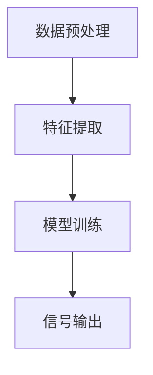

                 


# AI驱动的另类数据投资信号提取

## 关键词：
- AI技术，另类数据，投资信号，自然语言处理，计算机视觉，机器学习

## 摘要：
本文深入探讨了利用人工智能技术从另类数据中提取投资信号的方法，结合实际案例分析和系统设计，详细讲解了从数据预处理到模型训练的整个流程，旨在为金融从业者和AI开发者提供理论支持和实践指导。

---

## 第一章: 背景与问题描述

### 1.1 问题背景
#### 1.1.1 传统金融数据分析的局限性
传统金融分析主要依赖历史价格、成交量等有限数据，难以捕捉市场波动的全貌。随着市场的复杂化，仅凭传统数据难以做出准确的投资决策。

#### 1.1.2 另类数据的定义与特点
另类数据是指传统金融数据之外的非结构化数据，如社交媒体文本、卫星图像等。这些数据具有实时性、多样性和潜在信息丰富等特点。

#### 1.1.3 AI技术在金融领域的应用潜力
人工智能技术，尤其是NLP和CV，能够从另类数据中提取有价值的信息，为投资决策提供新的视角。

---

## 第二章: 另类数据与AI技术基础

### 2.1 另类数据的类型与来源
#### 2.1.1 文本数据（新闻、社交媒体）
社交媒体上的情绪分析可以帮助预测市场走势，新闻中的关键词可以揭示潜在的市场动向。

#### 2.1.2 图像数据（卫星图像、市场图表）
卫星图像可以用来分析经济活动，市场图表中的模式识别有助于发现趋势。

#### 2.1.3 声音数据（电话会议、市场情绪分析）
语音识别技术可以提取电话会议中的关键信息，帮助投资者了解市场情绪。

#### 2.1.4 其他非传统数据源
包括地理位置数据、物联网数据等。

### 2.2 AI技术在另类数据处理中的应用
#### 2.2.1 自然语言处理（NLP）
用于分析文本数据，提取情感倾向和关键词。

#### 2.2.2 计算机视觉（CV）
用于处理图像数据，识别模式和异常。

#### 2.2.3 机器学习（ML）
用于分类、回归和聚类分析。

#### 2.2.4 强化学习（RL）
用于动态策略优化。

---

## 第三章: 投资信号提取的算法原理

### 3.1 信号提取的关键算法
#### 3.1.1 文本挖掘与情感分析
使用NLP技术，如TF-IDF和词嵌入，进行情感分析和关键词提取。

#### 3.1.2 图像识别与模式匹配
使用CNN进行图像分类和目标检测。

#### 3.1.3 时间序列分析
使用LSTM模型捕捉时间依赖性。

#### 3.1.4 聚类分析与异常检测
使用K-means和Isolation Forest识别异常模式。

### 3.2 算法流程图（mermaid）


### 3.3 算法实现代码
```python
import pandas as pd
from sklearn.feature_extraction.text import TfidfVectorizer

# 示例：文本数据预处理
data = pd.read_csv('tweets.csv')
vectorizer = TfidfVectorizer()
tfidf = vectorizer.fit_transform(data['text'])
print(tfidf)
```

---

## 第四章: 系统架构与设计

### 4.1 系统功能模块
#### 4.1.1 数据采集模块
负责从社交媒体、新闻网站等渠道获取数据。

#### 4.1.2 数据处理模块
对数据进行清洗、转换和特征提取。

#### 4.1.3 模型训练模块
训练机器学习模型，生成投资信号。

#### 4.1.4 信号输出模块
将信号输出为可读格式，供投资决策参考。

### 4.2 系统架构设计


---

## 第五章: 项目实战与案例分析

### 5.1 项目环境搭建
#### 5.1.1 Python环境安装
使用Anaconda安装Python和相关库。

#### 5.1.2 必要库的安装
安装如TensorFlow、PyTorch、NLTK等库。

### 5.2 核心代码实现
#### 5.2.1 数据预处理代码
```python
import pandas as pd
from sklearn.model_selection import train_test_split

# 示例：分割数据集
data = pd.read_csv('alternative_data.csv')
X_train, X_test, y_train, y_test = train_test_split(data.drop('label', axis=1), data['label'], test_size=0.2)
```

#### 5.2.2 模型训练代码
```python
from sklearn.ensemble import RandomForestClassifier

# 示例：训练随机森林模型
model = RandomForestClassifier()
model.fit(X_train, y_train)
print("Accuracy:", model.score(X_test, y_test))
```

### 5.3 案例分析
#### 5.3.1 案例背景
分析社交媒体数据中的市场情绪，预测股票价格波动。

#### 5.3.2 数据处理与特征提取
使用NLP技术提取关键词和情感倾向。

#### 5.3.3 模型训练与评估
训练分类模型，评估其准确性和稳定性。

---

## 第六章: 总结与展望

### 6.1 总结
本文详细探讨了利用AI技术从另类数据中提取投资信号的方法，结合了NLP、CV和机器学习等多种技术，展示了其在金融领域的巨大潜力。

### 6.2 注意事项
在实际应用中，需注意数据质量、模型鲁棒性和法律法规问题。

### 6.3 未来展望
未来，随着技术进步，AI在另类数据中的应用将更加广泛和深入。

---

## 作者：AI天才研究院/AI Genius Institute & 禅与计算机程序设计艺术 /Zen And The Art of Computer Programming

---

通过以上结构，文章详细介绍了AI驱动的另类数据投资信号提取的各个方面，从理论到实践，为读者提供了全面的指导。希望这篇文章能为您提供有价值的信息！

