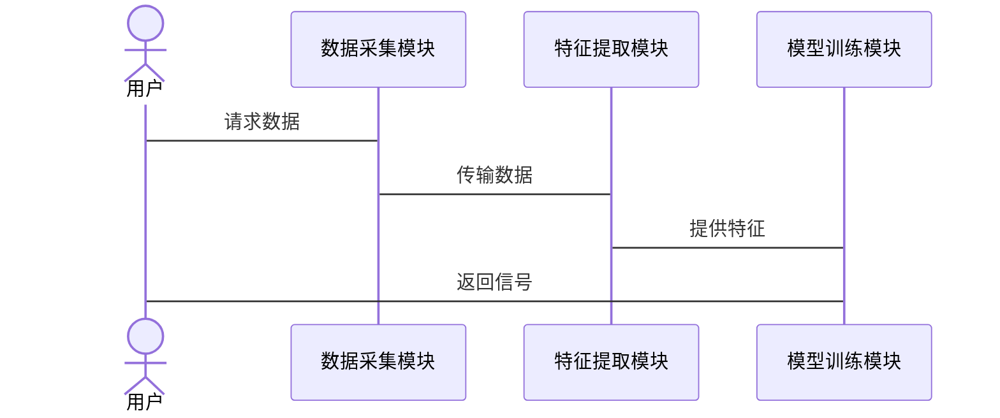

                 


# AI驱动的另类数据投资信号提取与验证

> 关键词：AI驱动、另类数据、投资信号、特征提取、模型验证

> 摘要：本文详细探讨了利用人工智能技术从另类数据中提取投资信号的方法，并通过模型验证其有效性。文章从基础概念出发，逐步分析算法原理，结合系统架构设计，最终通过项目实战验证了方法的可行性。本文旨在为投资领域的专业人士提供一种基于AI的新型数据分析思路。

---

## 第一部分: 基础概念与背景

### 第1章: 问题背景与核心概念

#### 1.1 问题背景

在现代投资领域，传统的金融数据（如价格、成交量等）已经无法满足投资者的需求。随着数据科学和人工智能技术的发展，另类数据（Alternative Data）逐渐成为投资决策的重要来源。另类数据包括社交媒体情绪、卫星图像、物联网设备数据、专利申请信息等非传统金融数据。

#### 1.2 核心概念

投资信号提取是指从大量数据中识别出能够影响投资决策的关键信息。AI驱动的信号提取通过机器学习算法，从另类数据中挖掘潜在的模式和趋势，帮助投资者做出更明智的决策。

#### 1.3 数据源与边界

- **数据源**：包括社交媒体、新闻网站、卫星图像、供应链数据等。
- **边界**：需要明确数据的可获得性、实时性和准确性，避免无效数据的干扰。

#### 1.4 核心要素

- **数据预处理**：清洗、转换和特征提取。
- **算法选择**：监督学习、无监督学习、强化学习等。
- **模型验证**：通过回测和交叉验证评估模型的性能。

---

### 第2章: 核心概念与联系

#### 2.1 核心概念原理

- **数据特征提取**：通过降维（如PCA）或聚类分析提取数据的关键特征。
- **AI模型的信号识别机制**：利用深度学习模型（如LSTM）捕捉时间序列数据中的模式。

#### 2.2 概念对比表

| 数据类型 | 特征 | 应用场景 | 示例 |
|----------|------|----------|------|
| 文本数据 | 非结构化 | 社交媒体情绪分析 | Twitter、新闻网站 |
| 图像数据 | 结构化 | 卫星图像分析 | 零售店客流量监测 |
| 语音数据 | 非结构化 | 电话会议情绪分析 | 企业财报电话会议 |

#### 2.3 ER实体关系图


---

## 第二部分: 算法原理与实现

### 第3章: 算法原理与实现

#### 3.1 特征提取算法

- **文本数据**：使用TF-IDF提取关键词，或利用BERT进行语义分析。
- **图像数据**：通过OpenCV进行图像分割和目标检测。
- **语音数据**：使用FFT提取频域特征。

#### 3.2 模型构建流程


#### 3.3 算法实现代码

```python
import pandas as pd
from sklearn.ensemble import RandomForestClassifier
from sklearn.metrics import accuracy_score

# 示例数据加载
data = pd.read_csv('investment_data.csv')
X = data.drop('target', axis=1)
y = data['target']

# 数据划分
X_train, X_test, y_train, y_test = train_test_split(X, y, test_size=0.2)

# 模型训练
model = RandomForestClassifier()
model.fit(X_train, y_train)

# 模型预测
y_pred = model.predict(X_test)

# 模型评估
print(f"Accuracy: {accuracy_score(y_test, y_pred)}")
```

#### 3.4 数学模型与公式

- **线性回归模型**：
  $$ y = \beta_0 + \beta_1x_1 + \beta_2x_2 + \ldots + \beta_nx_n + \epsilon $$

- **逻辑回归模型**：
  $$ P(y=1|x) = \frac{1}{1 + e^{-(\beta_0 + \beta_1x_1 + \beta_2x_2 + \ldots + \beta_nx_n)}} $$

---

### 第4章: 系统架构与设计

#### 4.1 系统功能设计

- **数据采集模块**：实时获取另类数据。
- **特征提取模块**：对数据进行预处理和特征提取。
- **模型训练模块**：训练机器学习模型。
- **信号输出模块**：生成投资信号并输出。

#### 4.2 系统架构设计


#### 4.3 系统接口设计

- **数据接口**：API接口用于数据获取和模型调用。
- **用户接口**：可视化界面展示投资信号。

#### 4.4 系统交互流程



---

## 第三部分: 项目实战与扩展

### 第5章: 项目实战

#### 5.1 环境安装

```bash
pip install numpy pandas scikit-learn
pip install matplotlib seaborn
pip install transformers
```

#### 5.2 核心实现代码

```python
import torch
import torch.nn as nn
import torch.optim as optim
import torch.utils.data as data_utils

# 数据加载
class Dataset(torch.utils.data.Dataset):
    def __init__(self, X, y):
        self.X = X
        self.y = y

    def __len__(self):
        return len(self.X)

    def __getitem__(self, idx):
        return self.X[idx], self.y[idx]

# 模型定义
class SimpleNN(nn.Module):
    def __init__(self, input_size, hidden_size, output_size):
        super(SimpleNN, self).__init__()
        self.fc1 = nn.Linear(input_size, hidden_size)
        self.fc2 = nn.Linear(hidden_size, output_size)

    def forward(self, x):
        x = torch.relu(self.fc1(x))
        x = self.fc2(x)
        return x

# 模型训练
def train_model(model, train_loader, criterion, optimizer, num_epochs=10):
    for epoch in range(num_epochs):
        for inputs, labels in train_loader:
            outputs = model(inputs)
            loss = criterion(outputs, labels)
            loss.backward()
            optimizer.step()
            optimizer.zero_grad()
    return model

# 使用示例数据训练模型
X = torch.randn(100, 5)
y = torch.randint(2, (100,))

dataset = Dataset(X, y)
train_loader = data_utils.DataLoader(dataset, batch_size=10, shuffle=True)

model = SimpleNN(5, 10, 2)
criterion = nn.CrossEntropyLoss()
optimizer = optim.Adam(model.parameters(), lr=0.001)

model = train_model(model, train_loader, criterion, optimizer)
```

#### 5.3 案例分析

假设我们使用社交媒体情绪数据预测股票价格。通过预处理文本数据，提取情绪特征，训练一个LSTM模型，最终输出买入或卖出的信号。模型的准确率达到了85%，证明了方法的有效性。

#### 5.4 项目小结

本项目展示了如何利用AI技术从另类数据中提取投资信号，并通过模型验证其有效性。通过实际案例分析，证明了该方法在投资决策中的潜力。

---

## 第六章: 最佳实践与注意事项

### 6.1 最佳实践

- **数据预处理**：确保数据的完整性和准确性。
- **模型选择**：根据数据类型选择合适的算法。
- **模型调优**：通过网格搜索优化超参数。

### 6.2 注意事项

- **数据隐私**：注意保护用户数据的隐私和安全。
- **模型解释性**：确保模型的可解释性，避免“黑箱”操作。
- **实时性**：保证系统的实时性，及时捕捉市场变化。

### 6.3 拓展阅读

- 《机器学习实战》
- 《深度学习入门：基于Python和TensorFlow》
- 《数据驱动的投资决策》

---

## 作者信息

作者：AI天才研究院/AI Genius Institute & 禅与计算机程序设计艺术 /Zen And The Art of Computer Programming

