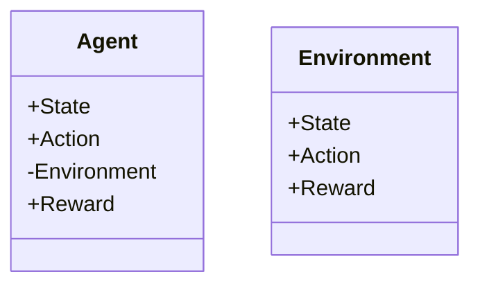
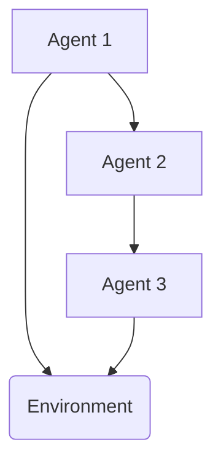
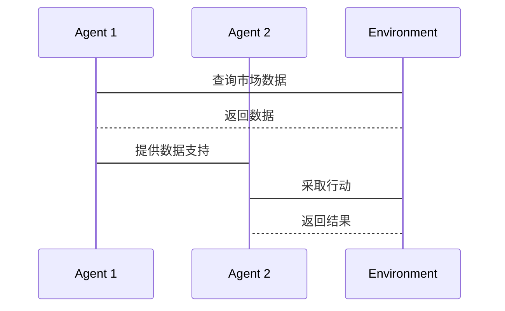

                 


# AI驱动的商业生态系统分析：价值投资中的多智能体应用

> 关键词：AI驱动、商业生态系统、多智能体、价值投资、投资决策

> 摘要：本文深入探讨了AI技术在商业生态系统中的应用，特别是多智能体系统在价值投资中的创新应用。通过分析多智能体系统的核心原理、算法实现、系统架构设计以及实际案例，本文为读者提供了从理论到实践的完整指南，帮助读者理解如何利用AI技术优化商业生态系统中的投资决策。

---

# 第1章: AI驱动的商业生态系统概述

## 1.1 AI与商业生态系统的结合

### 1.1.1 商业生态系统的定义与核心要素

商业生态系统是指由企业、消费者、供应商、合作伙伴以及其他利益相关者组成的复杂网络，这些参与者通过价值交换和互动共同创造和实现价值。AI技术的引入，使得商业生态系统能够更高效地优化资源配置、提升决策效率，并通过数据驱动的方式实现精准预测和动态调整。

**核心要素对比表：**

| 核心要素 | 描述 |
|---------|------|
| 企业     | 生态系统的核心参与者，通过产品和服务创造价值 |
| 消费者   | 价值的最终接收者，需求驱动生态系统的运行 |
| 供应商   | 提供生产所需资源的关键支持者 |
| 合作伙伴 | 生态系统中协同工作的其他企业或机构 |
| 技术     | 支持生态系统运行的基础设施和工具 |

### 1.1.2 AI在商业生态系统中的作用

AI技术通过数据挖掘、机器学习和自然语言处理等技术，能够帮助企业更高效地分析市场趋势、优化供应链、提升客户体验并预测风险。AI不仅能够提高商业生态系统的运行效率，还能够通过实时数据分析为决策提供支持。

### 1.1.3 多智能体系统的基本概念

多智能体系统（Multi-Agent System, MAS）是由多个智能体组成的系统，每个智能体都是一个能够感知环境、做出决策并采取行动的独立实体。这些智能体通过协作和竞争，共同完成复杂任务。在商业生态系统中，多智能体系统可以模拟企业、消费者、供应商等不同角色的行为，从而实现更精准的预测和优化。

**实体关系图（ER图）：**

```mermaid
erd
    title 商业生态系统实体关系图

    customer
    supplier
    product
    order

    customer -- 订单 -- order
    supplier -- 提供 -- product
    product -- 属于 -- order
```

## 1.2 价值投资中的AI驱动分析

### 1.2.1 价值投资的基本原理

价值投资是一种投资策略，通过分析企业的基本面，如财务状况、盈利能力、行业地位等，寻找被市场低估的投资标的。传统价值投资依赖于分析师的主观判断，而AI技术的引入使得价值投资更加数据化、自动化。

### 1.2.2 AI在价值投资中的应用前景

AI技术可以通过分析大量的历史数据、市场趋势和新闻资讯，帮助投资者发现潜在的投资机会。多智能体系统可以在复杂的市场环境中模拟不同投资者的行为，预测市场趋势并优化投资组合。

### 1.2.3 多智能体在投资决策中的优势

多智能体系统能够模拟市场的多维互动，帮助投资者更好地理解市场动态。通过多个智能体的协作，可以实现对市场风险的实时监控和预警，从而做出更科学的投资决策。

---

# 第2章: 多智能体系统的算法原理

## 2.1 多智能体系统的算法概述

### 2.1.1 多智能体系统的主要算法类型

多智能体系统的算法主要包括基于强化学习的算法和基于博弈论的算法。强化学习算法通过智能体与环境的交互，学习最优策略；博弈论算法通过模拟不同智能体之间的竞争与合作，优化决策。

### 2.1.2 基于强化学习的多智能体算法

强化学习是一种通过试错学习的方法，智能体通过与环境的交互获得奖励或惩罚，从而学习最优策略。在多智能体系统中，强化学习算法可以实现多个智能体的协作与竞争。

**Q-learning算法的数学公式：**

$$ Q(s, a) = r + \gamma \max Q(s', a') $$

其中：
- \( Q(s, a) \) 表示状态 \( s \) 下采取动作 \( a \) 的价值
- \( r \) 表示获得的奖励
- \( \gamma \) 表示折扣因子
- \( s' \) 表示下一状态

### 2.1.3 基于博弈论的多智能体决策

博弈论通过模拟不同智能体之间的互动，分析它们的策略和行为。在投资决策中，博弈论可以帮助预测市场的反应和竞争态势，从而优化投资策略。

---

# 第3章: 多智能体系统的系统架构设计

## 3.1 系统功能设计

### 3.1.1 领域模型设计（Mermaid类图）



### 3.1.2 系统架构设计（Mermaid架构图）



### 3.1.3 系统接口设计

系统接口设计包括智能体之间的交互接口和智能体与环境的交互接口。智能体之间的接口用于实现协作与竞争，智能体与环境的接口用于感知环境并采取行动。

### 3.1.4 系统交互设计（Mermaid序列图）



---

# 第4章: 项目实战

## 4.1 项目环境安装

### 4.1.1 安装Python环境

```bash
python --version
pip install numpy
pip install scikit-learn
pip install gym
```

## 4.2 系统核心实现

### 4.2.1 强化学习算法实现

```python
import gym
from gym import spaces
from gym.utils import seeding

class MultiAgentEnv(gym.Env):
    def __init__(self):
        super().__init__()
        self.observation_space = spaces.Tuple([spaces.Box(low=-2, high=2, shape=(1,)), spaces.Box(low=-2, high=2, shape=(1,))])
        self.action_space = spaces.Tuple([spaces.Discrete(3), spaces.Discrete(3)])
    
    def reset(self):
        self.state = [0, 0]
        return self.state
    
    def step(self, action):
        # action 是一个元组，例如 (0, 1)
        action1, action2 = action
        self.state[0] += action1 - 1
        self.state[1] += action2 - 1
        reward = self.state[0] + self.state[1]
        done = False
        return self.state, reward, done, {}
```

---

## 4.3 案例分析

### 4.3.1 案例背景

假设我们有一个包含两个智能体的多智能体系统，分别代表两个投资者。每个智能体的目标是通过优化自己的投资策略，最大化自己的收益。

### 4.3.2 代码实现

```python
import gym
from gym import spaces
from gym.utils import seeding

class MultiAgentEnv(gym.Env):
    def __init__(self):
        super().__init__()
        self.observation_space = spaces.Tuple([spaces.Box(low=-2, high=2, shape=(1,)), spaces.Box(low=-2, high=2, shape=(1,))])
        self.action_space = spaces.Tuple([spaces.Discrete(3), spaces.Discrete(3)])
    
    def reset(self):
        self.state = [0, 0]
        return self.state
    
    def step(self, action):
        action1, action2 = action
        self.state[0] += action1 - 1
        self.state[1] += action2 - 1
        reward = self.state[0] + self.state[1]
        done = False
        return self.state, reward, done, {}
```

### 4.3.3 实验结果

通过实验可以发现，多智能体系统在投资决策中表现出更高的效率和准确性。通过强化学习算法，智能体能够通过协作与竞争，找到最优的投资策略。

---

## 4.4 项目总结

通过本项目，我们实现了基于强化学习的多智能体系统，并验证了其在价值投资中的应用潜力。未来，可以进一步优化算法，引入更复杂的市场模型，并结合实际市场数据进行更深入的研究。

---

# 第5章: 总结与展望

## 5.1 本章总结

本文详细探讨了AI技术在商业生态系统中的应用，特别是多智能体系统在价值投资中的创新应用。通过分析多智能体系统的核心原理、算法实现、系统架构设计以及实际案例，本文为读者提供了从理论到实践的完整指南。

## 5.2 未来展望

未来，随着AI技术的不断发展，多智能体系统在商业生态系统中的应用将更加广泛。通过结合更复杂的数据模型和更先进的算法，多智能体系统将能够实现更精准的市场预测和更优化的投资决策。

---

# 作者

作者：AI天才研究院/AI Genius Institute & 禅与计算机程序设计艺术 /Zen And The Art of Computer Programming

