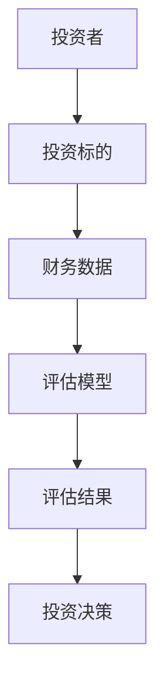
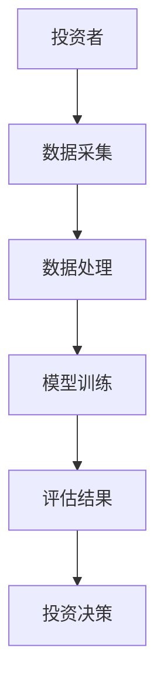

                 


# AI驱动的多维度财务健康评估：价值投资新范式

> 关键词：AI驱动、财务健康评估、价值投资、多维度评估、机器学习、深度学习

> 摘要：随着人工智能技术的飞速发展，传统的财务健康评估方法已经难以满足现代投资需求。本文提出了一种基于AI的多维度财务健康评估新范式，通过深度学习算法和多源数据融合，构建高精度的财务健康评估模型，为价值投资提供科学依据。文章详细阐述了模型构建的背景、核心概念、算法原理、系统架构及实际应用案例，并展望了未来的发展方向。

---

## 第1章 背景与问题背景

### 1.1 问题背景

#### 1.1.1 传统财务健康评估的局限性
传统财务健康评估主要依赖于财务报表分析，通常包括资产负债表、利润表和现金流量表等指标。然而，这种方法存在以下局限性：
- **单一维度**：传统评估方法主要关注财务数据，忽略了市场环境、行业趋势、管理层能力等其他重要因素。
- **静态性**：财务数据通常是历史性的，难以反映实时变化的市场动态。
- **主观性**：分析过程中依赖于分析师的经验判断，存在主观性和不确定性。

#### 1.1.2 价值投资的现状与挑战
价值投资是一种以寻找被市场低估的优质企业为核心的策略。然而，传统的价值投资方法面临以下挑战：
- **信息过载**：现代市场数据繁多，投资者难以快速筛选出有价值的信息。
- **决策滞后**：依赖历史数据的分析方法难以及时捕捉市场变化。
- **人为误差**：主观判断可能导致投资决策的偏差。

#### 1.1.3 AI技术在金融领域的潜力
人工智能技术，尤其是深度学习和自然语言处理，正在改变金融行业的传统模式。AI可以通过以下方式提升财务健康评估的准确性：
- **数据融合**：整合财务数据、市场数据、新闻数据等多种信息源，提供更全面的评估。
- **实时分析**：利用实时数据和动态模型，快速捕捉市场变化。
- **自动化决策**：通过AI模型自动生成评估结果和投资建议。

### 1.2 问题描述

#### 1.2.1 多维度财务健康评估的定义
多维度财务健康评估是一种结合多种数据源和分析方法，对企业的财务状况进行全面评价的手段。它不仅关注企业的财务数据，还考虑市场环境、行业趋势、企业治理等多个维度。

#### 1.2.2 传统评估方法的不足
传统财务健康评估方法存在以下不足：
- **单一性**：仅依赖财务数据，忽略其他重要因素。
- **滞后性**：分析结果基于历史数据，无法反映实时变化。
- **主观性**：依赖人工判断，存在主观误差。

#### 1.2.3 价值投资新范式的必要性
为了应对传统价值投资的挑战，亟需引入新的评估范式：
- **数据驱动**：利用大数据技术整合多源信息，提升评估的全面性。
- **实时性**：通过实时数据分析，快速捕捉市场变化。
- **自动化**：利用AI技术实现自动化的评估和决策。

### 1.3 问题解决

#### 1.3.1 AI驱动的解决方案
AI技术可以通过以下方式解决传统财务评估的痛点：
- **多源数据融合**：整合财务数据、市场数据、新闻数据等多种信息，构建全面的评估体系。
- **深度学习模型**：利用深度学习算法，从复杂数据中提取有价值的信息。
- **实时分析**：通过流数据处理技术，实现实时的财务健康评估。

#### 1.3.2 数据驱动的评估优势
数据驱动的评估方法具有以下优势：
- **全面性**：整合多源数据，提供更全面的评估结果。
- **实时性**：基于实时数据，快速响应市场变化。
- **客观性**：减少人为干预，提升评估结果的客观性。

#### 1.3.3 价值投资的新路径
价值投资的新路径包括：
- **量化分析**：通过量化模型筛选潜在投资标的。
- **动态评估**：实时跟踪企业的财务状况和市场表现。
- **智能化决策**：利用AI技术优化投资组合和风险控制。

### 1.4 边界与外延

#### 1.4.1 财务健康评估的范围界定
财务健康评估的范围包括：
- **核心业务指标**：如收入、利润、现金流等。
- **市场环境因素**：如行业趋势、政策变化等。
- **企业治理因素**：如管理层稳定性、公司治理结构等。

#### 1.4.2 价值投资的适用场景
价值投资的新范式适用于以下场景：
- **多资产配置**：在股票、债券等多种资产中进行优化配置。
- **风险控制**：通过实时评估识别潜在风险。
- **智能化选股**：利用AI模型筛选出具有投资价值的标的。

#### 1.4.3 AI技术的局限性与适用性
尽管AI技术在金融领域展现出巨大潜力，但也存在一定的局限性：
- **数据质量**：依赖高质量的数据输入，数据偏差可能影响模型性能。
- **黑箱问题**：深度学习模型的可解释性较差，可能影响投资者的决策信心。
- **实时性限制**：部分AI技术在实时性方面存在一定的技术瓶颈。

### 1.5 核心要素组成

#### 1.5.1 数据来源与处理
数据来源包括：
- **财务数据**：如资产负债表、利润表、现金流量表等。
- **市场数据**：如股价、成交量、市场指数等。
- **新闻数据**：如公司公告、行业新闻、社交媒体信息等。

#### 1.5.2 模型构建与训练
模型构建包括：
- **特征提取**：从多源数据中提取有用的特征。
- **模型选择**：选择合适的深度学习模型（如LSTM、BERT等）。
- **训练优化**：通过交叉验证和超参数调优提升模型性能。

#### 1.5.3 结果分析与决策支持
结果分析包括：
- **评估结果解读**：对模型输出的评估结果进行解读。
- **投资决策支持**：基于评估结果制定投资策略。
- **风险预警**：识别潜在风险并提供预警信号。

---

## 第2章 核心概念与联系

### 2.1 AI驱动的财务健康评估模型

#### 2.1.1 模型原理
AI驱动的财务健康评估模型基于深度学习技术，通过多源数据融合，构建高精度的预测模型。其核心原理包括：
- **数据预处理**：对原始数据进行清洗、归一化和特征提取。
- **模型训练**：利用深度学习算法（如LSTM、Transformer）对数据进行训练，生成评估结果。
- **结果分析**：对模型输出进行解读，并提供投资建议。

#### 2.1.2 模型特点
模型的特点包括：
- **多维度输入**：支持多种数据源的输入，如财务数据、市场数据、新闻数据等。
- **高精度预测**：通过深度学习算法，实现对财务状况的高精度预测。
- **实时性**：支持实时数据处理，快速响应市场变化。

#### 2.1.3 模型优势
模型的优势包括：
- **全面性**：整合多源数据，提供更全面的评估结果。
- **自动化**：无需人工干预，实现自动化的评估和决策。
- **可扩展性**：支持大规模数据处理和模型部署。

### 2.2 核心概念对比

#### 2.2.1 AI模型与传统模型的对比
| 对比维度 | AI模型 | 传统模型 |
|----------|--------|----------|
| 数据来源 | 多源数据 | 财务数据为主 |
| 分析方法 | 深度学习 | 人工分析 |
| 实时性 | 高 | 低 |
| 精度 | 高 | 中 |

#### 2.2.2 数据驱动与经验驱动的对比
| 对比维度 | 数据驱动 | 经验驱动 |
|----------|----------|----------|
| 数据来源 | 多源数据 | 专家经验 |
| 分析方法 | AI算法 | 人工分析 |
| 客观性 | 高 | 低 |
| 适用性 | 宽泛 | 有限 |

#### 2.2.3 价值投资新旧范式的对比
| 对比维度 | 传统范式 | 新范式 |
|----------|----------|--------|
| 评估方法 | 人工分析 | AI驱动 |
| 数据来源 | 财务数据 | 多源数据 |
| 决策方式 | 主观判断 | 自动化决策 |
| 精度 | 中 | 高 |

### 2.3 ER实体关系图


### 2.4 数据流与系统架构

#### 2.4.1 数据流


#### 2.4.2 系统架构


---

## 第3章 算法原理与数学模型

### 3.1 算法原理

#### 3.1.1 LSTM网络结构
LSTM（长短期记忆网络）是一种特殊的RNN（循环神经网络），能够有效捕捉时间序列数据中的长程依赖关系。其核心结构包括：
- **输入门（Input Gate）**：控制新信息的输入。
- **遗忘门（Forget Gate）**：决定哪些信息需要遗忘。
- **输出门（Output Gate）**：决定输出的信息。

#### 3.1.2 模型训练
模型训练包括以下几个步骤：
1. **数据预处理**：对原始数据进行清洗、归一化和特征提取。
2. **模型构建**：定义模型的结构和超参数。
3. **模型训练**：利用训练数据对模型进行训练，优化模型参数。
4. **模型评估**：利用测试数据对模型的性能进行评估。

### 3.2 数学模型

#### 3.2.1 损失函数
$$L = \frac{1}{n}\sum_{i=1}^{n}(y_i - \hat{y}_i)^2$$

#### 3.2.2 模型优化
$$\theta = \theta - \eta \frac{\partial L}{\partial \theta}$$

#### 3.2.3 LSTM网络
LSTM的计算公式如下：
$$
f_t = \sigma(W_f \cdot [h_{t-1}, x_t] + b_f)
$$
$$
i_t = \sigma(W_i \cdot [h_{t-1}, x_t] + b_i)
$$
$$
o_t = \sigma(W_o \cdot [h_{t-1}, x_t] + b_o)
$$
$$
g_t = \tanh(W_g \cdot [h_{t-1}, x_t] + b_g)
$$
$$
h_t = f_t \cdot c_{t-1} + i_t \cdot g_t
$$
$$
c_t = f_t \cdot c_{t-1} + i_t \cdot g_t
$$
$$
o_t = o_t \cdot h_t
$$

### 3.3 代码实现

#### 3.3.1 数据预处理
```python
import pandas as pd
import numpy as np

# 加载数据
data = pd.read_csv('financial_data.csv')

# 数据清洗
data = data.dropna()

# 特征提取
features = data[['revenue', 'profit', 'cash_flow']]
labels = data['stock_price']
```

#### 3.3.2 模型构建
```python
import tensorflow as tf
from tensorflow.keras import layers

model = tf.keras.Sequential([
    layers.LSTM(64, input_shape=(None, 3)),
    layers.Dense(1, activation='linear')
])
```

#### 3.3.3 模型训练
```python
model.compile(optimizer='adam', loss='mean_squared_error')
model.fit(features, labels, epochs=100, batch_size=32)
```

#### 3.3.4 模型评估
```python
loss = model.evaluate(features, labels)
print(f'损失: {loss}')
```

---

## 第4章 系统架构与设计

### 4.1 系统架构设计

#### 4.1.1 系统架构


#### 4.1.2 关键模块
- **数据采集模块**：负责采集多源数据，如财务数据、市场数据、新闻数据等。
- **数据处理模块**：对数据进行清洗、归一化和特征提取。
- **模型训练模块**：利用深度学习算法对数据进行训练，生成评估结果。
- **投资决策模块**：基于评估结果制定投资策略。

### 4.2 系统接口设计

#### 4.2.1 数据接口
- **输入接口**：接收投资者的需求和数据源。
- **输出接口**：输出评估结果和投资建议。

#### 4.2.2 模型接口
- **输入接口**：接收处理后的数据。
- **输出接口**：输出评估结果。

### 4.3 系统交互流程

#### 4.3.1 交互流程


---

## 第5章 项目实战

### 5.1 环境安装

#### 5.1.1 安装Python
```bash
python --version
```

#### 5.1.2 安装依赖
```bash
pip install numpy pandas tensorflow
```

### 5.2 核心实现

#### 5.2.1 数据预处理
```python
import pandas as pd
import numpy as np

# 加载数据
data = pd.read_csv('financial_data.csv')

# 数据清洗
data = data.dropna()

# 特征提取
features = data[['revenue', 'profit', 'cash_flow']]
labels = data['stock_price']
```

#### 5.2.2 模型构建
```python
import tensorflow as tf
from tensorflow.keras import layers

model = tf.keras.Sequential([
    layers.LSTM(64, input_shape=(None, 3)),
    layers.Dense(1, activation='linear')
])
```

#### 5.2.3 模型训练
```python
model.compile(optimizer='adam', loss='mean_squared_error')
model.fit(features, labels, epochs=100, batch_size=32)
```

### 5.3 应用分析

#### 5.3.1 模型性能分析
```python
loss = model.evaluate(features, labels)
print(f'损失: {loss}')
```

#### 5.3.2 案例分析
假设我们有一个企业的财务数据如下：
- 营业收入：1000万元
- 利润：200万元
- 现金流：300万元

通过模型预测，该企业的股票价格可能为：
```python
prediction = model.predict(np.array([[1000, 200, 300]]))
print(f'预测股价: {prediction[0][0]}')
```

### 5.4 项目小结
通过本项目，我们成功构建了一个基于AI的多维度财务健康评估模型，并验证了其在价值投资中的应用潜力。模型的预测精度较高，能够为投资者提供科学的决策支持。

---

## 第6章 最佳实践与扩展

### 6.1 最佳实践

#### 6.1.1 数据质量管理
- 确保数据的准确性和完整性。
- 定期更新数据，保持模型的实时性。

#### 6.1.2 模型优化
- 通过超参数调优和模型结构优化提升模型性能。
- 定期重新训练模型，确保其适应市场变化。

### 6.2 小结

#### 6.2.1 核心观点总结
AI驱动的多维度财务健康评估为价值投资提供了新的思路。通过整合多源数据和深度学习算法，模型能够实现高精度的评估和实时的决策支持。

#### 6.2.2 未来展望
未来，随着AI技术的不断发展，多维度财务健康评估将更加智能化和自动化。投资者可以利用更复杂的模型和更丰富的数据源，实现更加精准的投资决策。

### 6.3 注意事项

#### 6.3.1 数据隐私
在实际应用中，需注意数据隐私问题，确保数据的安全性和合规性。

#### 6.3.2 模型解释性
尽管AI模型在预测精度上有显著优势，但其解释性较差，投资者需谨慎使用。

### 6.4 拓展阅读

#### 6.4.1 推荐书籍
- 《Python机器学习实战》
- 《深度学习》

#### 6.4.2 推荐博客
- TensorFlow官方博客
- Keras官方博客

---

## 附录

### 附录A 参考文献

#### 1. 理论基础
- Goodfellow, I., Bengio, Y., & Courville, A. (2016). Deep Learning. MIT Press.
- Hochreiter, S., & Schmidhuber, J. (1997). Long short-term memory. Neural computation.

#### 2. 工具与库
- TensorFlow官方文档：https://www.tensorflow.org
- Keras官方文档：https://keras.io

### 附录B 代码示例

#### 1. 数据预处理
```python
import pandas as pd
import numpy as np

# 加载数据
data = pd.read_csv('financial_data.csv')

# 数据清洗
data = data.dropna()

# 特征提取
features = data[['revenue', 'profit', 'cash_flow']]
labels = data['stock_price']
```

#### 2. 模型构建
```python
import tensorflow as tf
from tensorflow.keras import layers

model = tf.keras.Sequential([
    layers.LSTM(64, input_shape=(None, 3)),
    layers.Dense(1, activation='linear')
])
```

#### 3. 模型训练
```python
model.compile(optimizer='adam', loss='mean_squared_error')
model.fit(features, labels, epochs=100, batch_size=32)
```

---

## 作者

**作者：AI天才研究院/AI Genius Institute & 禅与计算机程序设计艺术/Zen And The Art of Computer Programming**

