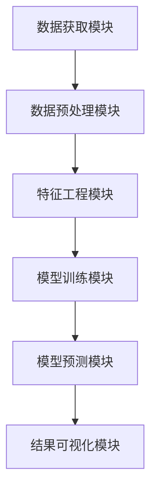

                 


```markdown
# AI驱动的宏观经济预测模型

> 关键词：AI, 宏观经济预测, 机器学习, 时间序列分析, 数据特征工程

> 摘要：本文将详细介绍AI驱动的宏观经济预测模型的构建与应用。通过结合机器学习算法和大数据分析，我们探讨如何利用AI技术提高宏观经济预测的准确性与效率。从数据特征工程到模型训练，从系统架构设计到实际案例分析，本文将全面解析AI驱动的宏观经济预测模型的核心概念与实现方法。

---

## 第一部分: 宏观经济预测与AI的结合

### 第1章: 宏观经济预测的背景与意义

#### 1.1 宏观经济预测的基本概念
- 1.1.1 宏观经济预测的定义
  - 宏观经济预测是通过对经济指标的分析，预测未来经济走势的过程。
  - 典型的经济指标包括GDP、失业率、通货膨胀率等。

- 1.1.2 宏观经济预测的重要性
  - 为政策制定者提供决策依据。
  - 帮助企业和投资者做出更明智的经济决策。
  - 有助于防范经济危机，优化资源配置。

#### 1.2 AI在宏观经济预测中的作用
- 1.2.1 AI技术的特点
  - 数据处理能力强。
  - 模型自适应性高。
  - 可以处理复杂非线性关系。

- 1.2.2 AI驱动宏观经济预测的优势
  - 提高预测的准确性和及时性。
  - 能够处理海量数据，发现传统方法难以察觉的模式。
  - 可以实时更新模型，适应经济环境的变化。

#### 1.3 宏观经济预测模型的核心要素
- 1.3.1 数据来源与特征
  - 数据来源包括政府统计、金融数据、行业报告等。
  - 数据特征包括时间序列特征、变量之间的相关性等。

- 1.3.2 模型输入与输出
  - 输入：经济指标的历史数据。
  - 输出：预测的经济指标值及其置信区间。

- 1.3.3 模型评估与优化
  - 使用均方误差（MSE）、R平方（R²）等指标评估模型性能。
  - 通过交叉验证优化模型参数。

### 第2章: AI驱动的宏观经济预测模型的定义

#### 2.1 宏观经济预测模型的分类
- 2.1.1 线性模型
  - 简单线性回归、多元线性回归。
- 2.1.2 非线性模型
  - 支持向量机（SVM）、随机森林、神经网络等。

#### 2.2 AI驱动模型的核心特点
- 数据驱动：依赖大量数据进行训练。
- 自适应性：能够根据新数据自动调整模型。
- 高维特征处理：能够处理高维复杂数据。

#### 2.3 模型的边界与外延
- 数据范围的边界：模型适用于特定时间范围和经济环境。
- 应用场景的外延：可以扩展到金融、能源等其他领域。

---

## 第二部分: 宏观经济预测中的数据与特征工程

### 第3章: 数据的获取与预处理

#### 3.1 数据的获取渠道
- 政府统计机构：如国家统计局。
- 金融市场：股票价格、汇率等。
- 学术研究：期刊论文、研究报告。

#### 3.2 数据的预处理方法
- 数据清洗：处理缺失值、异常值。
- 特征提取：从原始数据中提取有用的特征。
- 数据标准化：将数据归一化，方便模型训练。

### 第4章: 特征工程的核心原理

#### 4.1 特征选择与降维
- 主成分分析（PCA）：降低特征维度。
- 逐步回归：通过统计方法选择重要特征。

#### 4.2 特征构建与组合
- 滞后特征：使用历史数据作为特征。
- 趋势特征：计算数据的移动平均值。

#### 4.3 时间序列特征的处理
- 常见的时间序列特征：均值、标准差、自相关系数等。

---

## 第三部分: AI驱动宏观经济预测模型的算法原理

### 第5章: 常见宏观经济预测算法解析

#### 5.1 线性回归模型
- 5.1.1 线性回归的基本原理
  - 假设因变量与自变量之间存在线性关系。
  - 使用最小二乘法拟合最佳回归线。

- 5.1.2 线性回归的数学模型
  $$ y = \beta_0 + \beta_1x_1 + \beta_2x_2 + ... + \beta_nx_n + \epsilon $$

#### 5.2 随机森林模型
- 5.2.1 随机森林的基本原理
  - 由多个决策树组成，通过投票或平均得到最终预测结果。
  - 能够处理高维数据，防止过拟合。

#### 5.3 神经网络模型
- 5.3.1 神经网络的基本结构
  - 输入层、隐藏层、输出层。
  - 使用反向传播算法进行训练。

- 5.3.2 LSTM网络在时间序列预测中的应用
  - LSTM（长短期记忆网络）适合处理时间序列数据。
  - 使用门控机制保存长期信息。

---

## 第四部分: 系统架构设计与实现

### 第6章: 系统架构设计

#### 6.1 问题场景介绍
- 数据获取与处理模块。
- 特征工程模块。
- 模型训练与预测模块。
- 结果分析与可视化模块。

#### 6.2 系统功能设计
- 数据获取模块：从数据库或API获取经济数据。
- 特征工程模块：对数据进行清洗、特征提取和标准化。
- 模型训练模块：选择合适的算法，训练模型并保存。
- 模型预测模块：使用训练好的模型进行预测并输出结果。

#### 6.3 系统架构设计图


---

## 第五部分: 项目实战

### 第7章: 项目实战与案例分析

#### 7.1 项目环境安装
- 安装Python和必要的库：numpy、pandas、scikit-learn、keras等。

#### 7.2 核心代码实现
- 数据预处理代码：
```python
import pandas as pd
import numpy as np

# 读取数据
data = pd.read_csv('economic_data.csv')

# 数据清洗
data = data.dropna()
data = (data - data.mean()) / data.std()  # 标准化
```

- 模型训练代码：
```python
from sklearn.ensemble import RandomForestRegressor
from sklearn.model_selection import train_test_split

# 划分数据集
X_train, X_test, y_train, y_test = train_test_split(data.drop('target', axis=1), data['target'], test_size=0.2)

# 训练模型
model = RandomForestRegressor()
model.fit(X_train, y_train)

# 预测
y_pred = model.predict(X_test)
```

#### 7.3 实际案例分析
- 使用历史数据训练模型。
- 预测未来经济指标并分析结果。

---

## 第六部分: 总结与展望

### 第8章: 总结与最佳实践

#### 8.1 最佳实践
- 数据质量是模型性能的关键。
- 选择合适的算法，避免过度拟合。
- 定期更新模型，适应经济环境变化。

#### 8.2 小结
- AI驱动的宏观经济预测模型通过结合大数据和机器学习算法，显著提高了预测的准确性和效率。
- 随着技术的发展，未来可以进一步优化模型，引入更复杂的时间序列算法和深度学习技术。

---

## 作者信息

作者：AI天才研究院/AI Genius Institute  
联系方式：[contact@ai-genius.com](mailto:contact@ai-genius.com)  
版权所有：AI驱动的宏观经济预测模型研究与应用

---

以上是《AI驱动的宏观经济预测模型》的详细目录和内容安排。希望对您有所帮助！
```

