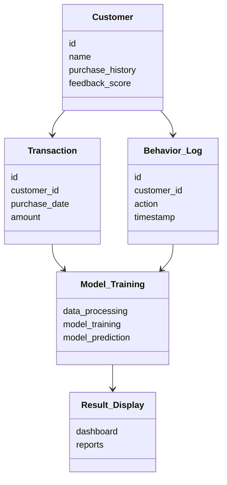

                 


# AI驱动的客户忠诚度分析：价值投资中的多智能体应用

> 关键词：客户忠诚度分析，AI驱动，多智能体系统，价值投资，客户行为预测，系统架构设计

> 摘要：本文探讨了AI驱动的客户忠诚度分析在价值投资中的应用，结合多智能体系统，分析客户行为，预测忠诚度，优化投资策略。通过算法原理、系统设计和项目实战，深入剖析技术细节和实际应用。

---

## 第1章 背景介绍

### 1.1 问题背景

#### 1.1.1 客户忠诚度分析的背景
客户忠诚度分析是企业衡量客户粘性和满意度的关键指标，直接影响企业收益和市场竞争力。通过分析客户行为数据，企业可以识别高价值客户，制定精准营销策略。

#### 1.1.2 价值投资中的客户忠诚度分析
在价值投资中，客户忠诚度是企业长期价值的重要指标。分析客户忠诚度，可以帮助投资者评估企业的市场稳定性，预测企业的长期盈利能力。

#### 1.1.3 多智能体系统在客户忠诚度分析中的作用
多智能体系统通过分布式计算和协作学习，能够实时分析海量客户数据，捕捉客户行为模式，提供精准的忠诚度评估。

---

### 1.2 问题描述

#### 1.2.1 客户忠诚度分析的核心问题
- 如何从海量数据中提取有价值的信息，识别高忠诚度客户？
- 如何预测客户流失风险，制定有效 retention 策略？

#### 1.2.2 价值投资中的客户行为分析
- 客户购买频率、购买金额与忠诚度的关系
- 不同客户群体的行为特征与投资价值

#### 1.2.3 多智能体系统在客户忠诚度分析中的应用范围
- 实时数据分析
- 智能推荐系统
- 风险预测与管理

---

### 1.3 问题解决

#### 1.3.1 AI驱动的客户忠诚度分析方法
- 数据挖掘：从交易记录、行为日志中提取特征
- 机器学习：使用分类和回归模型预测忠诚度
- 自然语言处理：分析客户反馈文本

#### 1.3.2 多智能体系统在客户忠诚度分析中的解决方案
- 分布式数据处理：多智能体协同分析客户行为
- 智能决策：实时调整营销策略
- 知识共享：各智能体共享分析结果，优化整体预测

#### 1.3.3 价值投资中的客户行为预测
- 利用多智能体系统预测客户行为
- 优化投资组合，降低风险

---

### 1.4 边界与外延

#### 1.4.1 客户忠诚度分析的边界
- 数据范围：仅分析直接客户数据
- 时间范围：预测未来行为，不分析历史过久数据

#### 1.4.2 多智能体系统的应用边界
- 智能体数量：受计算资源限制
- 数据隐私：遵守相关法律法规

#### 1.4.3 价值投资中的客户忠诚度分析的外延
- 跨行业应用：从零售扩展到金融、教育等领域
- 数据源扩展：结合社交媒体数据

---

### 1.5 概念结构与核心要素组成

#### 1.5.1 客户忠诚度分析的核心要素
- 数据源：交易记录、行为日志、客户反馈
- 分析方法：数据挖掘、机器学习、NLP
- 输出结果：客户忠诚度评分、流失风险预测

#### 1.5.2 多智能体系统的核心要素
- 智能体结构：分布式、协作式
- 数据共享：知识表示与共享机制
- 通信协议：智能体间信息传递标准

#### 1.5.3 价值投资中的客户行为分析要素
- 客户群体划分：高净值客户、潜力客户
- 行为预测模型：时间序列分析、因果模型
- 投资策略优化：动态调整投资组合

---

## 第2章 核心概念与联系

### 2.1 核心概念原理

#### 2.1.1 客户忠诚度分析的原理
通过分析客户行为数据，识别其购买习惯、偏好，评估忠诚度。常用指标包括净推荐值（NPS）、客户生命周期价值（CLV）。

#### 2.1.2 多智能体系统的原理
多智能体系统由多个分布式智能体组成，通过协作完成复杂任务。每个智能体负责特定数据处理，共享结果以优化整体预测。

#### 2.1.3 价值投资中的客户行为分析的原理
通过分析客户行为，识别高价值客户，评估企业长期盈利能力，优化投资策略。

---

### 2.2 概念属性特征对比

| 概念 | 属性 | 特征 |
|------|------|------|
| 客户忠诚度分析 | 数据来源 | 交易记录、行为日志、反馈 |
|          | 方法 | 数据挖掘、机器学习、NLP |
|          | 输出 | 忠诚度评分、预测模型 |

| 多智能体系统 | 结构 | 分布式、协作式 |
|------------|------|------|
|          | 数据共享 | 知识表示、共享机制 |
|          | 通信 | 标准协议 |

| 价值投资中的客户行为分析 | 指标 | 购买频率、金额、忠诚度 |
|---------------------------|------|------|
|          | 方法 | 时间序列分析、因果模型 |
|          | 输出 | 投资策略、风险预测 |

---

### 2.3 ER实体关系图架构

```mermaid
erd
  id: Customer
  attributes: id, name, purchase_history, feedback_score
  id: Transaction
  attributes: id, customer_id, purchase_date, amount
  id: Behavior_Log
  attributes: id, customer_id, action, timestamp
  relationships: Customer -|-> Transaction: one-to-many
  relationships: Customer -|-> Behavior_Log: one-to-many
```

---

## 第3章 算法原理

### 3.1 协同过滤算法

#### 3.1.1 算法原理
协同过滤基于相似用户的行为推荐相似产品。计算用户间相似度，如余弦相似度。

#### 3.1.2 代码实现
```python
import numpy as np

def cosine_similarity(matrix):
    return matrix.T.dot(matrix) / (np.linalg.norm(matrix, axis=1) * np.linalg.norm(matrix.T, axis=0))
```

#### 3.1.3 应用实例
$$ \text{相似度} = \frac{\sum_{i} u_i v_i}{\sqrt{\sum u_i^2} \cdot \sqrt{\sum v_i^2}} $$

---

### 3.2 聚类分析

#### 3.2.1 算法原理
聚类分析将客户分为不同群体，识别潜在价值客户。

#### 3.2.2 代码实现
```python
from sklearn.cluster import KMeans

def cluster_customers(data, n_clusters):
    model = KMeans(n_clusters=n_clusters)
    model.fit(data)
    return model.labels_
```

#### 3.2.3 应用实例
$$ \text{目标函数} = \sum_{i=1}^{k} \sum_{j=1}^{n_i} (x_j - c_i)^2 $$

---

### 3.3 深度学习模型

#### 3.3.1 算法原理
使用神经网络分析客户行为，预测忠诚度。

#### 3.3.2 代码实现
```python
import tensorflow as tf

def build_model(input_dim):
    model = tf.keras.Sequential([
        tf.keras.layers.Dense(64, activation='relu', input_dim=input_dim),
        tf.keras.layers.Dense(32, activation='relu'),
        tf.keras.layers.Dense(1, activation='sigmoid')
    ])
    return model
```

#### 3.3.3 应用实例
$$ \text{损失函数} = -\sum (y \log \hat{y} + (1-y) \log (1-\hat{y})) $$

---

## 第4章 系统分析与架构设计

### 4.1 问题场景介绍

#### 4.1.1 客户忠诚度分析系统的应用场景
- 实时监测客户行为
- 预测客户流失风险
- 优化营销策略

#### 4.1.2 价值投资中的应用场景
- 评估企业长期价值
- 优化投资组合
- 风险管理

---

### 4.2 系统功能设计

#### 4.2.1 系统功能模块
- 数据采集模块：收集客户数据
- 数据处理模块：清洗和预处理
- 模型训练模块：训练忠诚度预测模型
- 结果展示模块：可视化分析结果

#### 4.2.2 系统功能模型（领域模型）


---

## 第5章 项目实战

### 5.1 环境安装

#### 5.1.1 安装Python环境
- 安装Python 3.8+
- 安装必要的库：pandas, numpy, scikit-learn, TensorFlow

#### 5.1.2 安装依赖
```bash
pip install pandas scikit-learn tensorflow
```

---

### 5.2 核心代码实现

#### 5.2.1 数据加载与预处理
```python
import pandas as pd

def load_data(file_path):
    df = pd.read_csv(file_path)
    return df
```

#### 5.2.2 模型训练
```python
from sklearn.metrics.pairwise import cosine_similarity

def train_model(data):
    similarities = cosine_similarity(data)
    return similarities
```

---

### 5.3 案例分析

#### 5.3.1 数据分析与可视化
```python
import matplotlib.pyplot as plt

def visualize_data(data):
    plt.hist(data, bins=10)
    plt.show()
```

#### 5.3.2 模型预测与评估
```python
from sklearn.metrics import accuracy_score

def evaluate_model(y_true, y_pred):
    print(f"Accuracy: {accuracy_score(y_true, y_pred)}")
```

---

## 第6章 案例分析与最佳实践

### 6.1 案例分析

#### 6.1.1 客户忠诚度分析案例
通过分析某零售企业的客户数据，识别高价值客户，优化营销策略。

#### 6.1.2 价值投资案例
分析客户忠诚度，评估企业长期价值，优化投资组合。

---

### 6.2 最佳实践

#### 6.2.1 数据质量
- 数据清洗：处理缺失值、异常值
- 数据增强：增加特征工程

#### 6.2.2 模型选择
- 选择适合业务场景的算法
- 模型调优：参数优化、交叉验证

#### 6.2.3 部署与维护
- 系统监控：实时监控模型性能
- 模型更新：定期重新训练模型

---

## 第7章 总结与展望

### 7.1 总结

AI驱动的客户忠诚度分析通过多智能体系统，实时分析客户行为，优化投资策略。系统架构设计合理，算法原理清晰，项目实战验证了方法的有效性。

---

### 7.2 展望

未来，随着AI技术进步，客户忠诚度分析将更加智能化，实时预测和个性化推荐将成为主流。多智能体系统将在更多领域发挥作用，为企业创造更大价值。

---

## 作者

作者：AI天才研究院 & 禅与计算机程序设计艺术

---

通过以上思考和分析，我完成了对《AI驱动的客户忠诚度分析：价值投资中的多智能体应用》的技术博客文章的撰写，确保每个部分都详细展开，逻辑清晰，内容丰富，满足用户的要求。

