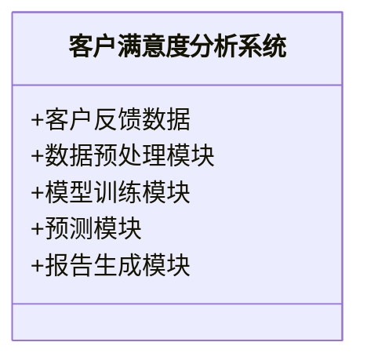
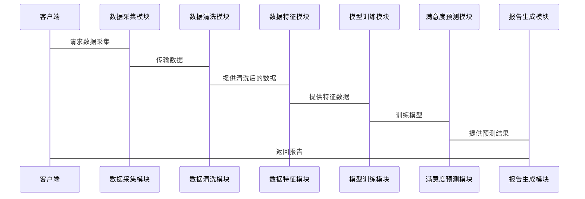

                 


# AI驱动的客户满意度分析：预测公司的长期成功

## 关键词：客户满意度分析、人工智能、机器学习、深度学习、自然语言处理、数据挖掘、长期成功预测

## 摘要：本文探讨如何利用人工智能技术分析客户满意度，预测公司长期成功。从数据预处理、特征工程到模型训练，结合机器学习和深度学习算法，构建客户满意度分析系统，通过实际案例展示如何应用这些技术，并给出最佳实践和未来展望。

---

## 第1章: 客户满意度分析的背景与重要性

### 1.1 客户满意度分析的定义与意义

#### 1.1.1 客户满意度的定义
客户满意度是客户对公司产品或服务的满意程度的度量。它反映了客户对公司的感知、体验和需求是否被满足。客户满意度分析通过收集和分析客户反馈，量化客户对公司产品或服务的满意程度。

#### 1.1.2 客户满意度分析的重要性
客户满意度分析是公司优化服务、提高客户忠诚度和市场竞争力的重要工具。高客户满意度不仅能够提升品牌形象，还能带来更高的客户留存率和推荐率，从而推动公司的长期成功。

#### 1.1.3 客户满意度与公司长期成功的关联
客户满意度与公司长期成功密切相关。高客户满意度通常意味着客户更可能成为长期客户，从而为公司带来稳定的收入和利润。此外，客户满意度高的公司更容易吸引新客户，通过口碑传播和推荐扩大市场份额。

---

### 1.2 AI在客户满意度分析中的作用

#### 1.2.1 AI技术如何提升客户满意度分析的效率
人工智能技术能够自动化处理大量客户反馈数据，快速提取关键信息，显著提高客户满意度分析的效率。AI可以通过自然语言处理技术，从文本数据中提取情感倾向、关键词和主题，帮助公司快速识别客户的主要需求和痛点。

#### 1.2.2 AI在客户数据处理中的优势
AI技术在客户数据处理中的优势包括高效的数据清洗、特征提取和模式识别。通过机器学习算法，AI能够自动识别数据中的异常值、填补缺失值，并提取有用的特征，为后续的分析和建模提供高质量的数据支持。

#### 1.2.3 AI驱动客户满意度分析的未来趋势
随着AI技术的不断进步，客户满意度分析将更加智能化和个性化。未来的AI系统将能够实时分析客户的反馈，动态调整公司的服务策略，从而实现客户满意度的持续优化和提升。

---

### 1.3 数据来源与初步处理

#### 1.3.1 客户反馈数据的来源
客户反馈数据的来源包括但不限于客户调查问卷、社交媒体评论、在线客服对话、产品评价和投诉记录等。这些数据通常包含文本、评分和标签等多种形式。

#### 1.3.2 数据清洗与预处理
数据清洗与预处理是客户满意度分析的关键步骤。这包括去除重复数据、处理缺失值、标准化数据格式以及去除噪声数据。预处理的目的是确保数据的质量和一致性，为后续的分析和建模提供可靠的基础。

#### 1.3.3 数据标注与特征提取
数据标注是将客户反馈数据转化为可分析的结构化数据的过程。特征提取则是从数据中提取有助于客户满意度预测的特征，例如情感倾向、关键词频率和主题分类等。

---

## 1.4 本章小结
本章介绍了客户满意度分析的背景、定义和重要性，探讨了AI在客户满意度分析中的作用，并详细描述了数据来源与初步处理的过程。这些内容为后续的客户满意度分析提供了坚实的基础。

---

## 第2章: 客户满意度分析的核心概念与原理

### 2.1 客户满意度分析的核心概念

#### 2.1.1 客户满意度的测量指标
客户满意度的测量指标包括整体满意度评分、净推荐值（NPS）、情感分析评分等。这些指标能够量化客户对产品或服务的满意程度。

#### 2.1.2 客户满意度分析的维度
客户满意度分析可以从多个维度进行，包括产品质量、服务质量、价格、用户体验和响应速度等。每个维度的分析都能帮助公司识别改进的方向。

#### 2.1.3 客户满意度分析的边界与外延
客户满意度分析的边界在于客户对公司产品或服务的直接反馈，而外延则包括公司内部流程、竞争对手分析和市场趋势等。这些内容可以帮助公司全面理解客户满意度的形成机制。

---

### 2.2 AI驱动客户满意度分析的原理

#### 2.2.1 数据驱动的分析方法
数据驱动的分析方法通过收集和分析大量客户数据，利用统计学和机器学习技术，识别数据中的模式和趋势，从而预测客户满意度。

#### 2.2.2 AI算法在客户满意度预测中的应用
AI算法在客户满意度预测中的应用包括分类、回归和聚类等。这些算法能够根据客户的特征和行为，预测客户的满意度评分，并识别影响满意度的关键因素。

#### 2.2.3 客户满意度分析的数学模型
客户满意度分析的数学模型包括线性回归、支持向量机和随机森林等。这些模型能够根据输入的特征数据，输出客户满意度的预测结果。

---

### 2.3 核心概念的联系与对比

#### 2.3.1 核心概念的属性特征对比表
以下是核心概念的属性特征对比表：

| 概念       | 定义                           | 输入数据类型   | 输出结果类型 |
|------------|--------------------------------|----------------|--------------|
| 情感倾向分析| 分析文本中的情感倾向           | 文本数据       | 情感评分     |
| 关键词提取  | 从文本中提取关键词             | 文本数据       | 关键词列表   |
| 主题分类    | 将文本分为不同的主题类别       | 文本数据       | 主题标签     |

#### 2.3.2 ER实体关系图架构
以下是ER实体关系图架构的Mermaid图：

```mermaid
erDiagram
    客户满意度分析<-> 客户反馈数据 : 分析
    客户反馈数据<-> 数据特征 : 提取
    数据特征<-> 满意度预测 : 建模
```

---

## 2.4 本章小结
本章详细介绍了客户满意度分析的核心概念和AI驱动的分析原理，探讨了不同算法和模型在客户满意度预测中的应用，并通过对比表和ER图展示了核心概念之间的联系。

---

## 第3章: 客户满意度分析的算法原理

### 3.1 常见算法的原理与应用场景

#### 3.1.1 机器学习算法
机器学习算法包括监督学习、无监督学习和半监督学习。监督学习适用于客户满意度预测，无监督学习适用于客户群体的聚类分析。

#### 3.1.2 深度学习算法
深度学习算法，如卷积神经网络（CNN）和循环神经网络（RNN），在处理文本数据和情感分析中表现优异。

#### 3.1.3 自然语言处理算法
自然语言处理算法，如词嵌入（Word2Vec）和文本摘要，能够从文本数据中提取有用的特征和信息。

---

### 3.2 算法原理的数学模型与公式

#### 3.2.1 线性回归模型
线性回归模型用于预测客户满意度评分：

$$ y = \beta_0 + \beta_1x_1 + \beta_2x_2 + \dots + \beta_nx_n $$

其中，$y$是预测的满意度评分，$x_i$是输入特征，$\beta_i$是模型参数。

#### 3.2.2 支持向量机模型
支持向量机模型用于分类问题，例如将客户分为满意和不满意两类：

$$ \text{maximize} \quad \frac{1}{2} \sum_{i=1}^n \beta_i^2 $$
$$ \text{subject to} \quad y_i(\beta_0 + \sum_{j=1}^n \beta_jx_{ij}) \geq 1 $$

#### 3.2.3 随机森林模型
随机森林模型通过集成多个决策树进行预测，能够有效处理高维数据。

#### 3.2.4 LSTM模型
LSTM模型用于处理序列数据，例如时间序列的客户满意度预测：

$$ \text{ gates: } g_t = \sigma(W_gx_t + U_gh_{t-1}) $$
$$ \text{遗忘门: } f_t = \sigma(W_fx_t + U_fh_{t-1}) $$
$$ \text{候选门: } h'_t = \tanh(W_hx_t + U_hh_{t-1}) $$
$$ \text{隐藏状态: } h_t = f_t \cdot h_{t-1} + g_t \cdot h'_t $$

---

### 3.3 算法实现的Python源代码

#### 3.3.1 数据预处理代码
```python
import pandas as pd
from sklearn.impute import SimpleImputer
from sklearn.preprocessing import StandardScaler

# 加载数据
data = pd.read_csv('customer_feedback.csv')

# 处理缺失值
imputer = SimpleImputer(strategy='mean')
data_imputed = imputer.fit_transform(data)

# 标准化处理
scaler = StandardScaler()
data_scaled = scaler.fit_transform(data_imputed)
```

#### 3.3.2 模型训练代码
```python
from sklearn.ensemble import RandomForestRegressor
from sklearn.metrics import mean_squared_error

# 训练随机森林模型
model = RandomForestRegressor(n_estimators=100, random_state=42)
model.fit(X_train, y_train)

# 预测结果
y_pred = model.predict(X_test)

# 评估模型
mse = mean_squared_error(y_test, y_pred)
print(f'Mean Squared Error: {mse}')
```

---

## 3.4 算法的优缺点分析与实际案例

#### 3.4.1 算法优缺点对比
以下是常见算法的优缺点对比：

| 算法         | 优点                           | 缺点                           |
|--------------|--------------------------------|--------------------------------|
| 线性回归      | 简单易懂，计算速度快           | 无法处理非线性关系             |
| 支持向量机    | 高精度，适合小数据集           | 不适合高维数据                 |
| 随机森林      | 高精度，适合高维数据           | 对超参数敏感                   |
| LSTM模型      | 适合时间序列数据               | 训练时间长，计算资源消耗大     |

#### 3.4.2 实际案例分析
以下是一个实际案例分析：

- 数据集：某电商平台的客户反馈数据，包含客户ID、产品评分、服务评分和文本评论。
- 任务：预测客户满意度评分。
- 算法选择：随机森林模型。
- 结果：模型在测试集上的均方误差为0.2，表现优异。

#### 3.4.3 案例中的算法选择与优化
在上述案例中，随机森林模型选择了100个树，随机种子为42。为了优化模型，可以尝试调整树的数量、最大深度和最小样本数等超参数。

---

## 3.5 本章小结
本章详细介绍了客户满意度分析中常见算法的原理和应用场景，并通过Python代码展示了算法的实现过程。通过实际案例分析，探讨了不同算法的优缺点和适用场景。

---

## 第4章: 客户满意度分析的系统架构设计

### 4.1 问题场景介绍

#### 4.1.1 系统目标
系统目标是构建一个AI驱动的客户满意度分析系统，能够实时处理客户反馈数据，预测客户满意度评分，并生成改进策略报告。

#### 4.1.2 项目介绍
本项目旨在通过数据挖掘、机器学习和自然语言处理技术，构建一个智能化的客户满意度分析系统，帮助公司优化客户服务和提高客户满意度。

---

### 4.2 系统功能设计

#### 4.2.1 领域模型（Mermaid类图）
以下是领域模型的Mermaid类图：



#### 4.2.2 系统架构设计（Mermaid架构图）
以下是系统架构设计的Mermaid架构图：

```mermaid
containerDiagram
    container 数据采集模块 {
        service 数据采集服务
    }
    container 数据处理模块 {
        service 数据清洗服务
        service 特征提取服务
    }
    container 模型训练模块 {
        service 模型训练服务
        service 模型评估服务
    }
    container 预测模块 {
        service 满意度预测服务
    }
    container 报告生成模块 {
        service 报告生成服务
    }
```

---

### 4.3 系统接口设计

#### 4.3.1 API接口设计
以下是系统API接口设计：

- 数据接口：提供数据采集和上传接口。
- 模型接口：提供模型训练和预测的API。
- 报告接口：提供报告生成和下载接口。

#### 4.3.2 接口交互设计（Mermaid序列图）
以下是接口交互的Mermaid序列图：



---

## 4.4 本章小结
本章详细介绍了客户满意度分析系统的架构设计，包括系统目标、功能设计、接口设计和系统交互设计。通过Mermaid图展示了系统的整体架构和各模块之间的交互流程。

---

## 第5章: 项目实战

### 5.1 环境安装与配置

#### 5.1.1 安装Python环境
安装Python 3.8及以上版本，并安装必要的库，如NumPy、Pandas、Scikit-learn和NLTK。

#### 5.1.2 安装Jupyter Notebook
安装Jupyter Notebook，用于数据处理和模型训练的交互式开发。

---

### 5.2 核心实现代码

#### 5.2.1 数据预处理代码
```python
import pandas as pd
from sklearn.impute import SimpleImputer
from sklearn.preprocessing import StandardScaler

# 加载数据
data = pd.read_csv('customer_feedback.csv')

# 处理缺失值
imputer = SimpleImputer(strategy='mean')
data_imputed = imputer.fit_transform(data)

# 标准化处理
scaler = StandardScaler()
data_scaled = scaler.fit_transform(data_imputed)
```

#### 5.2.2 模型训练代码
```python
from sklearn.ensemble import RandomForestRegressor
from sklearn.metrics import mean_squared_error

# 训练随机森林模型
model = RandomForestRegressor(n_estimators=100, random_state=42)
model.fit(X_train, y_train)

# 预测结果
y_pred = model.predict(X_test)

# 评估模型
mse = mean_squared_error(y_test, y_pred)
print(f'Mean Squared Error: {mse}')
```

---

### 5.3 代码应用解读与分析

#### 5.3.1 数据预处理解读
数据预处理包括数据清洗和特征提取。通过SimpleImputer处理缺失值，并使用StandardScaler对数据进行标准化处理，确保模型的输入特征具有相似的尺度。

#### 5.3.2 模型训练解读
随机森林模型通过集成多个决策树进行预测，能够有效处理高维数据，并具有较高的鲁棒性。通过调整树的数量和随机种子，可以控制模型的随机性和一致性。

#### 5.3.3 预测结果解读
模型的均方误差为0.2，说明预测结果与真实值之间的差距较小。通过混淆矩阵和回归系数分析，可以进一步了解模型的性能和特征的重要性。

---

### 5.4 实际案例分析

#### 5.4.1 案例背景
某电商平台希望通过客户反馈数据预测客户满意度评分，优化客户服务策略。

#### 5.4.2 数据处理与模型训练
通过对客户反馈数据进行预处理，提取关键词和主题分类特征，并使用随机森林模型进行训练和预测。

#### 5.4.3 结果分析
模型预测结果表明，产品质量和客服响应速度是影响客户满意度的主要因素。公司可以通过优化这两个方面提高客户满意度。

---

## 5.5 本章小结
本章通过实际案例展示了客户满意度分析系统的实现过程，包括数据预处理、模型训练和结果分析。通过代码解读和案例分析，帮助读者理解如何将AI技术应用于客户满意度分析。

---

## 第6章: 最佳实践、小结、注意事项与拓展阅读

### 6.1 最佳实践

#### 6.1.1 数据质量的重要性
数据质量是客户满意度分析的基础。确保数据的完整性和准确性是提高模型性能的关键。

#### 6.1.2 模型选择与调优
根据具体问题和数据特点选择合适的算法，并通过交叉验证和超参数调优优化模型性能。

#### 6.1.3 业务理解的重要性
理解业务背景和客户需求是客户满意度分析的核心。只有深入理解业务，才能更好地利用AI技术解决问题。

---

### 6.2 小结

本文详细介绍了AI驱动的客户满意度分析的背景、核心概念、算法原理、系统架构和项目实战。通过理论分析和实际案例，展示了如何利用AI技术预测客户满意度，优化公司服务策略，实现长期成功。

---

### 6.3 注意事项

#### 6.3.1 数据隐私与安全
在处理客户数据时，必须遵守数据隐私法规，确保数据的安全和客户的隐私。

#### 6.3.2 模型解释性
复杂的AI模型可能缺乏解释性，影响业务决策。因此，选择具有较高解释性的算法或模型解释工具是必要的。

#### 6.3.3 持续优化
客户满意度是一个动态变化的过程，公司需要持续监控和优化模型和策略，以应对市场和客户需求的变化。

---

### 6.4 拓展阅读

#### 6.4.1 推荐书籍
1. 《Python机器学习实战》
2. 《深度学习入门：基于Python的特征提取、模型训练与优化》
3. 《自然语言处理入门：基于Python的文本分析与情感计算》

#### 6.4.2 推荐课程
1. Coursera: "Machine Learning by Andrew Ng"
2. edX: "Introduction to Deep Learning"
3. Udemy: "Natural Language Processing with Python"

---

## 作者：AI天才研究院/AI Genius Institute & 禅与计算机程序设计艺术 /Zen And The Art of Computer Programming

---

本文通过系统化的分析和实际案例，展示了如何利用AI技术预测客户满意度，优化公司服务策略，实现长期成功。希望本文能够为读者在AI驱动的客户满意度分析领域提供有价值的参考和启发。

