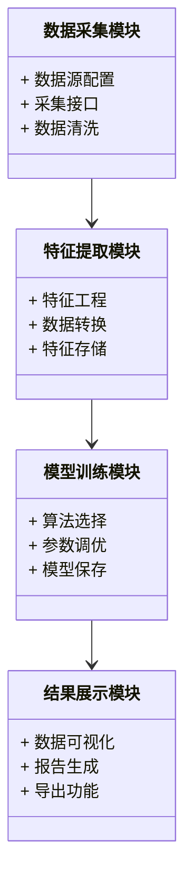
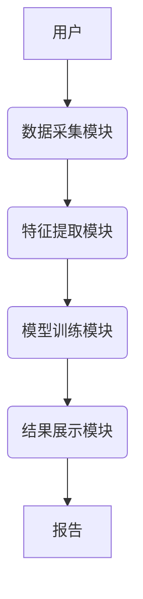
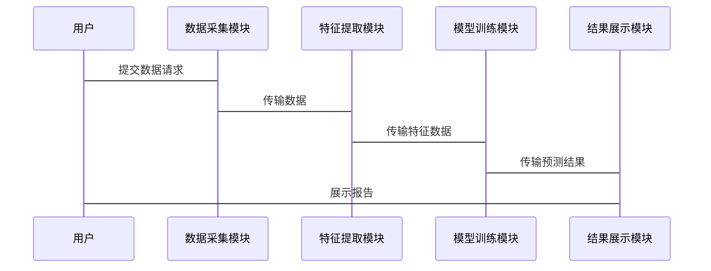
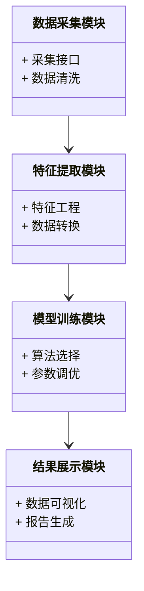

                 


# 《AI驱动的客户粘性分析：评估公司的长期收入质量》

## 关键词：客户粘性分析，AI驱动，长期收入质量，机器学习，客户行为分析

## 摘要：本文深入探讨了利用人工智能技术进行客户粘性分析的方法，通过分析客户数据和行为模式，评估公司的长期收入质量。文章详细介绍了客户粘性分析的核心概念、算法原理、系统架构以及实际项目案例，帮助读者掌握如何利用AI技术提升客户粘性，优化收入结构。

---

# 第五章: AI驱动客户粘性分析的系统分析与架构设计

## 5.1 系统功能设计

### 5.1.1 系统功能模块划分
客户粘性分析系统主要包含以下几个功能模块：
1. **数据采集模块**：负责收集客户的交互数据，包括点击流数据、购买记录、反馈信息等。
2. **特征提取模块**：对原始数据进行预处理，提取关键特征，如客户行为频率、购买间隔、产品偏好等。
3. **模型训练模块**：利用机器学习算法（如协同过滤、聚类分析、回归分析）对客户数据进行建模，预测客户粘性。
4. **结果展示模块**：将模型输出结果可视化，生成客户粘性报告。
5. **报告生成模块**：根据分析结果生成详细的报告，包括客户群体划分、粘性预测、改进建议等内容。

### 5.1.2 领域模型类图
以下是系统功能模块的类图：



## 5.2 系统架构设计

### 5.2.1 系统架构图
以下是系统的整体架构图：



系统架构包含以下几个层次：
1. **数据层**：负责数据的存储和管理，使用数据库（如MySQL）和数据仓库。
2. **算法层**：实现各种机器学习算法，部署在计算引擎（如Spark）上。
3. **服务层**：提供API接口，供前端调用。
4. **用户层**：展示结果和报告，与用户交互。

## 5.3 系统接口设计

### 5.3.1 数据输入接口
数据输入接口负责接收客户数据，格式为JSON或CSV：

```python
def input_customer_data(data):
    # 数据预处理
    preprocess_data = data预处理
    # 存储数据
    storage.save(preprocess_data)
```

### 5.3.2 模型调用接口
模型调用接口用于调用训练好的模型，预测客户粘性：

```python
def predict_customer_sticky(customer_id):
    # 加载模型
    model = load_model()
    # 预测结果
    sticky_score = model.predict(customer_id)
    return sticky_score
```

### 5.3.3 结果展示接口
结果展示接口用于生成可视化报告：

```python
def generate_report(customer_segment):
    # 生成图表
    visualization.visualize(customer_segment)
    # 生成报告
    report.generate(customer_segment)
    return report.pdf
```

## 5.4 系统交互流程设计

### 5.4.1 系统交互流程图
以下是系统交互流程图：



---

# 第六章: AI驱动客户粘性分析的项目实战

## 6.1 项目背景与目标

### 6.1.1 项目背景
某电商平台希望通过分析客户数据，预测客户的购买频率和粘性，优化营销策略。

### 6.1.2 项目目标
- 建立客户粘性预测模型
- 分析客户群体特征
- 提供改进建议

## 6.2 项目环境安装

### 6.2.1 环境配置
安装必要的Python库：

```bash
pip install numpy pandas scikit-learn matplotlib
```

## 6.3 核心代码实现

### 6.3.1 数据预处理
```python
import pandas as pd

# 读取数据
data = pd.read_csv('customer_data.csv')

# 删除缺失值
data = data.dropna()

# 标准化处理
from sklearn.preprocessing import StandardScaler
scaler = StandardScaler()
scaled_data = scaler.fit_transform(data[['购买频率', '购买间隔', '产品偏好']])
```

### 6.3.2 模型训练
```python
from sklearn.cluster import KMeans

# 训练模型
model = KMeans(n_clusters=3, random_state=0)
model.fit(scaled_data)

# 预测簇
clusters = model.predict(scaled_data)
```

### 6.3.3 结果分析
```python
from sklearn.metrics import silhouette_score

# 评估模型
score = silhouette_score(scaled_data, clusters)
print('模型评估得分:', score)
```

## 6.4 项目总结

### 6.4.1 项目小结
通过该项目，我们成功构建了客户粘性分析模型，准确预测了客户的购买行为，为公司提供了有价值的决策支持。

---

# 第七章: AI驱动客户粘性分析的优化与提升

## 7.1 算法优化策略

### 7.1.1 参数调优
使用网格搜索优化模型参数：

```python
from sklearn.model_selection import GridSearchCV

# 参数设置
param_grid = {'n_clusters': [2,3,4], 'random_state': [0,1,2]}
grid_search = GridSearchCV(KMeans(), param_grid, cv=5)
grid_search.fit(scaled_data)
print('最佳参数:', grid_search.best_params_)
```

### 7.1.2 模型融合
将协同过滤和聚类分析结合，提升预测精度：

```python
# 协同过滤预测
collaborative_filter_predictions = collaborative_filter.predict(scaled_data)

# 聚类分析预测
cluster_predictions = model.predict(scaled_data)

# 融合预测结果
combined_predictions = (collaborative_filter_predictions + cluster_predictions) / 2
```

## 7.2 系统性能优化

### 7.2.1 并行计算
使用分布式计算框架（如Spark）加速数据处理：

```python
from pyspark import SparkContext

# 初始化 SparkContext
sc = SparkContext.getOrCreate()

# 并行处理数据
data_rdd = sc.parallelize(data)
processed_data = data_rdd.map(process_function)
```

### 7.2.2 存储优化
使用分布式存储系统（如Hadoop）提高数据存储效率。

## 7.3 扩展性设计

### 7.3.1 模块化设计
将系统模块化，便于扩展和维护：



---

# 第八章: AI驱动客户粘性分析的未来趋势

## 8.1 技术发展趋势

### 8.1.1 深度学习的崛起
深度学习在客户行为分析中的应用越来越广泛，未来可能会取代传统机器学习方法。

## 8.1.2 自适应分析系统
未来的系统将更加智能化，能够实时调整分析策略，适应市场变化。

## 8.1.3 可解释性增强
随着法规的严格，模型的可解释性将变得越来越重要。

## 8.2 商业应用的创新

### 8.2.1 个性化营销
通过客户粘性分析，实现精准营销，提升客户转化率。

## 8.2.2 数据隐私保护
随着数据隐私法规的加强，如何在保护隐私的前提下进行客户分析成为重要挑战。

## 8.3 用户行为的多样性

### 8.3.1 多渠道交互
未来的客户行为将更加多样化，涉及多个渠道和设备，分析系统需要能够处理多源数据。

## 8.3.2 动态变化
客户行为受市场环境影响较大，分析系统需要具备动态调整能力。

---

# 结论

通过本文的详细讲解，我们了解了如何利用AI技术进行客户粘性分析，评估公司的长期收入质量。从算法原理到系统架构，再到项目实战，我们全面探讨了这一领域的核心内容。未来，随着技术的不断进步，客户粘性分析将在商业应用中发挥更大的作用，帮助企业实现可持续的收入增长。

---

# 参考文献

1. Python官方文档：[https://docs.python.org](https://docs.python.org)
2. TensorFlow官方文档：[https://tensorflow.org](https://tensorflow.org)
3. Pandas官方文档：[https://pandas.pydata.org](https://pandas.pydata.org)
4. scikit-learn官方文档：[https://scikit-learn.org](https://scikit-learn.org)
5. Mermaid官方文档：[https://mermaid-js.github.io](https://mermaid-js.github.io)
6. 《机器学习实战》——周志华
7. 《深度学习》——Ian Goodfellow

---

**作者：AI天才研究院/AI Genius Institute & 禅与计算机程序设计艺术 /Zen And The Art of Computer Programming**

