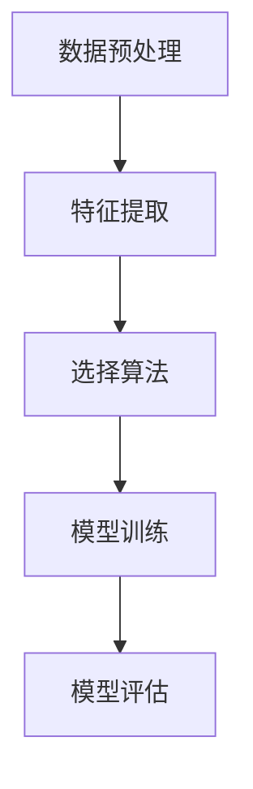
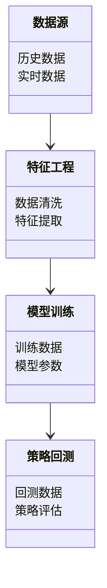
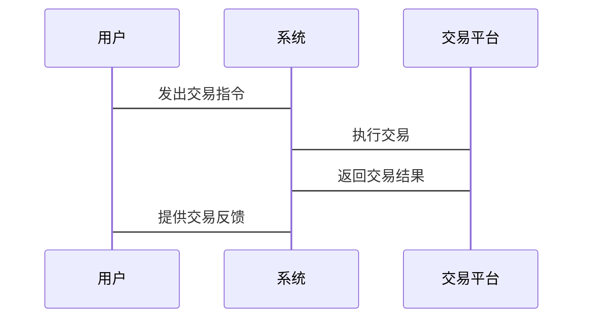

                 


# AI驱动的对冲基金策略分析

**关键词**: 对冲基金, AI, 机器学习, 金融策略, 算法交易, 自然语言处理

**摘要**: 本文详细探讨了AI技术在对冲基金策略分析中的应用，从基本概念、核心算法到系统架构，结合实际案例，分析了AI驱动对冲基金的优势、挑战及未来趋势。

---

# 第1章 对冲基金与AI驱动策略概述

## 1.1 对冲基金的基本概念

### 1.1.1 对冲基金的定义与特点
对冲基金是一种通过做空和做多多种金融资产以实现收益的投资工具，其特点是杠杆高、风险高、收益波动大。对冲基金的核心目标是通过套利、市场中性和绝对收益策略，在不同市场环境下实现稳健收益。

### 1.1.2 对冲基金的核心策略类型
对冲基金的主要策略包括：
- **股票多空策略**: 同时买入和卖出股票，通过价格波动获利。
- **套利策略**: 利用市场价差进行无风险或低风险套利。
- **事件驱动策略**: 投资于公司并购、重组等事件驱动的交易。
- **对冲策略**: 利用市场中性策略，通过多空平衡降低市场风险。

### 1.1.3 对冲基金与传统投资的区别
对冲基金通过复杂的金融工具和杠杆操作，能够在不同市场环境下实现收益，而传统投资则主要依赖于市场上涨时的收益。

---

## 1.2 AI在金融领域的应用背景

### 1.2.1 人工智能在金融领域的应用现状
AI技术在金融领域的应用日益广泛，包括股票预测、风险管理、交易自动化、客户画像等多个方面。AI通过对海量数据的分析，帮助投资者发现市场规律和潜在机会。

### 1.2.2 AI驱动对冲基金的优势与挑战
- **优势**: 提高交易效率、降低人为干扰、发现非线性关系、处理多维度数据。
- **挑战**: 数据质量、模型过拟合、市场变化、监管风险。

### 1.2.3 未来发展趋势与潜力
AI技术将进一步深度融合到对冲基金的各个层面，从数据采集、策略优化到风险控制，推动金融行业的智能化和自动化。

---

## 1.3 本章小结

通过对冲基金的基本概念和AI在金融领域的应用背景的介绍，本文为后续章节奠定了基础，展示了AI驱动对冲基金的潜力和重要性。

---

# 第2章 AI驱动对冲基金的核心概念与联系

## 2.1 核心概念原理

### 2.1.1 机器学习在金融中的应用
机器学习通过训练模型，识别数据中的模式和关系，帮助投资者预测市场走势和评估风险。例如，使用随机森林算法进行股票分类，预测股票的涨跌趋势。

### 2.1.2 自然语言处理在金融新闻分析中的作用
NLP技术可以分析新闻标题和内容，提取情感指标，预测市场情绪变化。例如，使用BERT模型分析财经新闻，预测股票价格波动。

### 2.1.3 强化学习在交易策略优化中的应用
强化学习通过模拟交易环境，训练智能体优化交易策略，提高收益并降低风险。例如，使用Q-learning算法优化订单簿中的买卖时机。

---

## 2.2 核心概念属性对比表格

| 对比项       | 机器学习       | 自然语言处理     | 强化学习       |
|--------------|----------------|-----------------|----------------|
| 应用场景     | 股票预测、风险评估 | 新闻情感分析     | 自动化交易策略优化 |
| 数据需求     | 结构化数据       | 文本数据         | 结构化和非结构化数据 |
| 模型复杂度   | 中等           | 较高             | 较高             |

---

## 2.3 ER实体关系图架构

```mermaid
erDiagram
    investor{
        inv_id : int
        inv_name : string
    }
    stock{
        stock_id : int
        stock_name : string
    }
    trade{
        trade_id : int
        trade_date : date
        inv_id : int
        stock_id : int
    }
    investor-|many> trade: "投资者参与的交易"
    stock-|many> trade: "股票参与的交易"
```

---

# 第3章 AI驱动对冲基金的算法原理讲解

## 3.1 常见算法原理

### 3.1.1 随机森林算法
随机森林是一种基于决策树的集成学习算法，通过组合多个决策树的预测结果，提高模型的准确性和鲁棒性。例如，使用随机森林预测股票的涨跌。

### 3.1.2 支持向量机算法
支持向量机（SVM）是一种监督学习算法，适用于分类和回归问题。通过构建超平面，将数据点分为不同类别，例如，用于分类股票的涨跌趋势。

### 3.1.3 神经网络算法
神经网络是一种仿生学算法，通过多层神经元的连接，学习数据中的复杂模式。例如，使用LSTM网络预测股票价格的时间序列变化。

---

## 3.2 算法流程图

### 3.2.1 机器学习算法流程图



---

## 3.3 Python源代码实现

### 3.3.1 随机森林算法实现

```python
from sklearn.ensemble import RandomForestClassifier

# 数据预处理
X_train, y_train = preprocess_data()

# 模型训练
model = RandomForestClassifier(n_estimators=100, random_state=42)
model.fit(X_train, y_train)

# 模型预测
y_pred = model.predict(X_test)
```

---

## 3.4 数学模型与公式详细讲解

### 3.4.1 线性回归模型
线性回归模型用于预测连续型变量，其数学公式为：

$$y = \beta_0 + \beta_1x_1 + \beta_2x_2 + \epsilon$$

其中，$$\epsilon$$ 是误差项。

### 3.4.2 支持向量机的数学模型
支持向量机的目标是最小化以下优化问题：

$$\min_{\beta,b,\xi} \frac{1}{2}\|\beta\|^2 + C\sum_{i=1}^n \xi_i$$

约束条件为：

$$y_i(\beta \cdot x_i + b) \geq 1 - \xi_i$$
$$\xi_i \geq 0$$

---

## 3.5 本章小结

通过详细讲解机器学习、自然语言处理和强化学习的核心算法，本文为读者提供了对AI驱动对冲基金策略分析的理论基础和实践方法。

---

# 第4章 系统分析与架构设计方案

## 4.1 问题场景介绍

### 4.1.1 对冲基金策略分析的典型场景
- 数据采集与处理
- 特征工程与模型训练
- 策略回测与优化
- 实时交易与监控

### 4.1.2 AI驱动对冲基金系统的应用场景
- 自动化交易
- 风险管理
- 市场情绪分析
- 策略优化

---

## 4.2 领域模型设计

### 4.2.1 对冲基金策略分析的领域模型



---

## 4.3 系统架构设计

### 4.3.1 系统架构设计

```mermaid
container 对冲基金系统 {
    component 数据采集模块 {
        数据接口
        数据存储
    }
    component 特征工程模块 {
        数据清洗
        特征提取
    }
    component 模型训练模块 {
        训练算法
        模型参数
    }
    component 策略回测模块 {
        回测数据
        策略评估
    }
}
```

---

## 4.4 系统接口设计

### 4.4.1 系统接口设计

- 数据接口：从金融数据源（如Yahoo Finance）获取数据。
- 模型接口：与量化交易平台（如Interactive Brokers）对接，实现自动化交易。

---

## 4.5 系统交互设计

### 4.5.1 系统交互流程



---

## 4.6 本章小结

通过系统架构设计和交互流程的详细分析，本文为读者展示了如何构建一个高效的AI驱动对冲基金系统。

---

# 第5章 项目实战与案例分析

## 5.1 项目实战

### 5.1.1 环境安装
- Python 3.8+
- Jupyter Notebook
- 量化交易库（如Pandas、NumPy、Scikit-learn）

### 5.1.2 核心实现

```python
import pandas as pd
from sklearn.ensemble import RandomForestClassifier

# 数据加载
data = pd.read_csv('stock_data.csv')

# 数据预处理
data = preprocess_data(data)

# 特征提取
features = data.drop('target', axis=1)
target = data['target']

# 模型训练
model = RandomForestClassifier()
model.fit(features, target)

# 模型预测
predictions = model.predict(features)
```

---

## 5.2 案例分析

### 5.2.1 案例背景
假设我们有一个股票数据集，包括开盘价、收盘价、最高价、最低价、成交量等特征，目标是预测股票的上涨或下跌趋势。

### 5.2.2 模型实现与结果分析
```python
from sklearn.metrics import accuracy_score

accuracy = accuracy_score(target, predictions)
print(f'模型准确率: {accuracy}')
```

---

## 5.3 本章小结

通过实际案例的分析和实现，读者可以更好地理解AI驱动对冲基金策略分析的实践应用。

---

# 第6章 最佳实践与注意事项

## 6.1 最佳实践 tips

- 数据质量是关键，确保数据的完整性和准确性。
- 模型选择要根据实际问题，避免过度复杂化。
- 定期回测和优化，确保策略的有效性和稳健性。

---

## 6.2 小结

通过对冲基金与AI的结合，投资者可以利用AI技术提升交易效率和收益，但同时也需要关注数据质量和模型风险。

---

## 6.3 注意事项

- 风险管理是关键，避免过度杠杆和集中投资。
- 模型过拟合是常见问题，需通过交叉验证等方法进行优化。
- 遵守相关法律法规，确保交易的合规性。

---

## 6.4 拓展阅读

- 《机器学习实战》
- 《Python金融大数据分析》
- 《算法交易:数学模型与实践》

---

# 作者：AI天才研究院 & 禅与计算机程序设计艺术

---

通过本文的详细分析和讲解，读者可以系统地了解AI驱动对冲基金策略分析的核心概念、算法原理和实际应用，为未来的投资和研究提供有力的支持。

