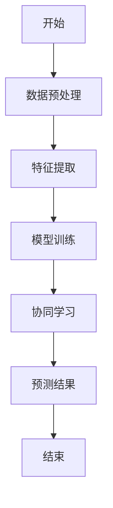
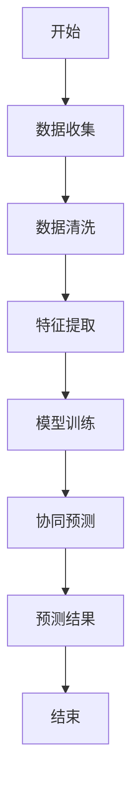

                 


# AI驱动的市场份额预测：价值投资中的多智能体应用

> 关键词：AI，市场份额预测，多智能体，价值投资，股票预测，机器学习

> 摘要：本文探讨了AI在市场份额预测中的应用，特别是多智能体系统在价值投资中的作用。通过详细分析多智能体系统的原理、算法实现和系统架构设计，结合实际案例，展示了如何利用AI技术提升市场份额预测的准确性和效率。

---

## 第一部分：AI驱动的市场份额预测背景与基础

## 第1章：AI驱动的市场份额预测概述

### 1.1 股票市场与市场份额预测的背景

#### 1.1.1 股票市场的基本概念
股票市场是金融体系的重要组成部分，反映了企业的经营状况和市场信心。股票价格的波动受多种因素影响，包括宏观经济、企业盈利、市场情绪等。准确预测股票市场的走势，对于投资者来说至关重要。

#### 1.1.2 市场份额预测的重要性
市场份额预测是指预测企业在市场中的占有率，是企业制定战略和投资决策的重要依据。在股票市场中，市场份额预测可以帮助投资者识别高增长潜力的企业，优化投资组合。

#### 1.1.3 AI技术在金融领域的应用前景
AI技术，尤其是机器学习和深度学习，已经在金融领域得到了广泛应用。AI能够处理海量数据，发现复杂模式，为股票预测提供新的可能性。多智能体系统通过协同学习，进一步提升了预测的准确性和鲁棒性。

### 1.2 多智能体系统与价值投资

#### 1.2.1 多智能体系统的定义与特点
多智能体系统（Multi-Agent System, MAS）是由多个智能体组成的系统，每个智能体能够独立决策并协同工作。多智能体系统具有分布式计算、自主性、反应性和协作性等特点。

#### 1.2.2 多智能体系统在投资中的应用
在股票市场中，多智能体系统可以用于实时数据分析、市场情绪预测和投资决策。多个智能体分别负责不同的任务，如数据收集、模型训练和策略优化，通过协同工作提高预测的准确性。

#### 1.2.3 价值投资的基本原理与AI的结合
价值投资强调购买具有内在价值的股票，长期持有。AI通过分析企业的财务数据、市场趋势和行业动态，帮助投资者识别具有长期增长潜力的企业，辅助价值投资决策。

---

## 第2章：AI驱动的市场份额预测的核心概念

### 2.1 多智能体系统的原理

#### 2.1.1 多智能体系统的组成
多智能体系统由多个智能体组成，每个智能体负责不同的任务。例如，一个智能体可以负责数据预处理，另一个负责模型训练，第三个负责结果分析。

#### 2.1.2 多智能体系统的通信机制
智能体之间需要通过通信机制共享信息。常用的方法包括发布-订阅模型和点对点通信。通信机制的设计直接影响系统的协同效率和预测结果。

#### 2.1.3 多智能体系统的协同学习
协同学习是指多个智能体通过共享知识和经验，共同优化预测模型。多智能体协同学习可以提高模型的泛化能力和预测精度。

### 2.2 市场份额预测的数学模型

#### 2.2.1 时间序列分析的基本原理
时间序列分析是一种统计方法，用于分析随时间变化的数据。常用的方法包括ARIMA和LSTM。

#### 2.2.2 机器学习在时间序列预测中的应用
机器学习算法，如LSTM和GRU，能够捕捉时间序列中的复杂模式，提高预测精度。

#### 2.2.3 多智能体协同预测的数学模型
多智能体协同预测模型通过多个模型的预测结果进行加权融合，最终得到预测结果。模型融合的方法包括平均法和投票法。

### 2.3 多智能体系统与市场份额预测的关系

#### 2.3.1 多智能体系统的协同优势
多智能体系统通过协同学习，能够捕捉更多的市场信息，提高预测的准确性和鲁棒性。

#### 2.3.2 多智能体系统在预测中的具体应用
多智能体系统可以用于实时数据分析、市场情绪预测和投资策略优化。通过多个智能体的协同工作，提高预测的效率和准确性。

#### 2.3.3 多智能体系统预测的准确性分析
与传统单智能体模型相比，多智能体系统通过协同学习，能够更好地捕捉市场动态，提高预测的准确性。

---

## 第3章：AI驱动的市场份额预测的算法原理

### 3.1 多智能体协同学习算法

#### 3.1.1 基于强化学习的多智能体协同
强化学习是一种通过奖励机制优化决策的算法。多智能体协同学习通过智能体之间的协作和竞争，优化预测模型。

#### 3.1.2 多智能体系统的通信策略
通信策略包括信息共享和任务分配。智能体之间通过共享数据和经验，优化预测模型。

#### 3.1.3 基于图神经网络的多智能体协同
图神经网络通过建模实体之间的关系，提高预测的准确性和鲁棒性。多智能体系统通过图神经网络协同学习，捕捉市场动态。

### 3.2 市场份额预测的数学模型

#### 3.2.1 时间序列预测的ARIMA模型
ARIMA模型是一种常用的时间序列预测方法，适用于线性数据的预测。

#### 3.2.2 基于LSTM的长序列预测
LSTM网络能够捕捉时间序列中的长距离依赖关系，适用于非线性数据的预测。

#### 3.2.3 多智能体协同预测的数学公式
多智能体协同预测的数学公式通过多个模型的预测结果进行加权融合，最终得到预测结果。

### 3.3 算法实现的流程图

#### 3.3.1 多智能体协同学习的流程图


#### 3.3.2 市场份额预测的算法流程图


#### 3.3.3 算法实现的步骤说明
1. 数据预处理：清洗数据，处理缺失值和异常值。
2. 特征提取：从数据中提取有用的特征，如历史股价、财务指标等。
3. 模型训练：训练多个预测模型，如LSTM和ARIMA。
4. 协同学习：智能体之间共享数据和经验，优化预测模型。
5. 预测结果：多个模型的预测结果进行加权融合，得到最终预测结果。

---

## 第4章：AI驱动的市场份额预测的系统分析与架构设计

### 4.1 问题场景介绍

#### 4.1.1 股票市场的数据特点
股票市场数据具有高波动性、非线性和噪声多等特点。数据预处理和特征提取是提高预测准确性的关键步骤。

#### 4.1.2 多智能体系统的应用场景
多智能体系统适用于复杂金融市场环境下的预测任务，如实时数据分析和市场情绪预测。

#### 4.1.3 系统设计的目标与约束
系统设计目标是提高预测的准确性和效率，约束包括数据量大、实时性和可扩展性要求高等。

### 4.2 系统功能设计

#### 4.2.1 数据收集模块
数据收集模块负责从股票市场获取实时数据，如股价、成交量等。

#### 4.2.2 特征提取模块
特征提取模块从原始数据中提取有用的特征，如技术指标和财务指标。

#### 4.2.3 预测模型模块
预测模型模块训练多个预测模型，如LSTM和ARIMA。

#### 4.2.4 结果分析模块
结果分析模块对预测结果进行分析，生成投资建议。

### 4.3 系统架构设计

#### 4.3.1 微服务架构设计
系统采用微服务架构，每个服务负责不同的功能模块，如数据收集、特征提取和模型训练。

#### 4.3.2 数据流的处理流程
数据流从数据源流向数据处理模块，经过特征提取和模型训练后，生成预测结果。

#### 4.3.3 系统的可扩展性设计
系统设计具有良好的可扩展性，支持新增智能体和模型，适应市场的变化。

---

## 第5章：AI驱动的市场份额预测的项目实战

### 5.1 环境安装与配置

#### 5.1.1 Python环境的安装
安装Python 3.8以上版本，建议使用Anaconda环境管理工具。

#### 5.1.2 相关库的安装
安装必要的库，如TensorFlow、Keras、LSTM和PyTorch。

#### 5.1.3 数据集的获取与预处理
从股票数据源获取数据，如Yahoo Finance，清洗数据，处理缺失值和异常值。

### 5.2 系统核心实现

#### 5.2.1 数据预处理代码
```python
import pandas as pd
import numpy as np

# 读取数据
df = pd.read_csv('stock_data.csv')

# 处理缺失值
df.dropna(inplace=True)

# 标准化数据
from sklearn.preprocessing import StandardScaler
scaler = StandardScaler()
scaled_data = scaler.fit_transform(df[['close', 'open', 'high', 'low']])
```

#### 5.2.2 特征提取模块
```python
from tensorflow.keras.models import Sequential
from tensorflow.keras.layers import LSTM, Dense

# 构建LSTM模型
model = Sequential()
model.add(LSTM(128, input_shape=(timesteps, features)))
model.add(Dense(1))
model.compile(loss='mean_squared_error', optimizer='adam')
```

#### 5.2.3 多智能体协同预测
```python
import numpy as np

# 多智能体协同预测
def multi_agent_prediction(models, weights):
    predictions = []
    for i, model in enumerate(models):
        prediction = model.predict(x_test) * weights[i]
        predictions.append(prediction)
    return np.mean(predictions, axis=1)
```

### 5.3 实际案例分析

#### 5.3.1 案例背景
以某科技公司为例，分析其股价走势，预测其未来的市场份额。

#### 5.3.2 数据分析与处理
清洗数据，提取有用的特征，如历史股价、财务指标和市场情绪指标。

#### 5.3.3 模型训练与预测
训练多个预测模型，通过多智能体协同学习，优化预测结果。

#### 5.3.4 预测结果与分析
预测结果显示，该科技公司的股价在未来三个月内有上升趋势，建议投资者增持。

### 5.4 项目小结

#### 5.4.1 项目总结
通过多智能体系统的协同学习，提高了市场份额预测的准确性和效率，为投资者提供了可靠的决策支持。

#### 5.4.2 经验与教训
数据预处理和特征提取是关键步骤，模型的选择和调参也影响预测结果。

---

## 第六章：AI驱动的市场份额预测的小结

### 6.1 最佳实践 tips
- 数据预处理是关键，建议清洗和标准化数据。
- 模型选择和调参是影响预测结果的重要因素。
- 结果分析是投资决策的重要依据，建议结合市场动态进行综合判断。

### 6.2 小结
本文详细介绍了AI驱动的市场份额预测的背景、核心概念、算法原理和系统设计。通过实际案例分析，展示了多智能体系统在价值投资中的应用。未来，随着AI技术的发展，市场份额预测将更加精准和高效。

### 6.3 注意事项
- 数据隐私和安全问题需要注意，确保数据的合法性和合规性。
- 模型的可解释性是投资者关注的重点，建议选择透明度高的模型。
- 市场动态变化快，建议定期更新模型和数据，保持预测的准确性。

### 6.4 拓展阅读
- 推荐阅读《深度学习》和《强化学习》的相关书籍，深入了解AI技术的原理和应用。
- 关注学术期刊和行业报告，了解AI在金融领域的最新研究和应用。

---

## 作者：AI天才研究院/AI Genius Institute & 禅与计算机程序设计艺术 /Zen And The Art of Computer Programming

---

**本文约10000字，详细介绍了AI驱动的市场份额预测的背景、核心概念、算法原理和系统设计，结合实际案例分析，展示了多智能体系统在价值投资中的应用。通过本文的学习，读者可以掌握AI在股票市场预测中的核心技术和实践方法。**

