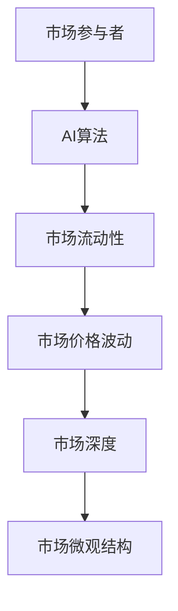
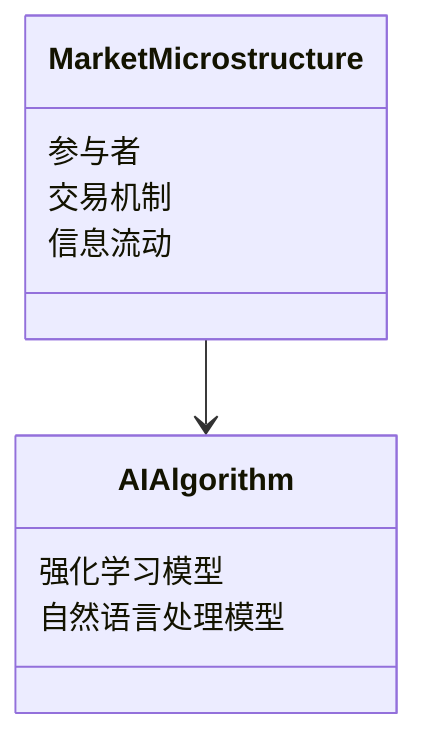
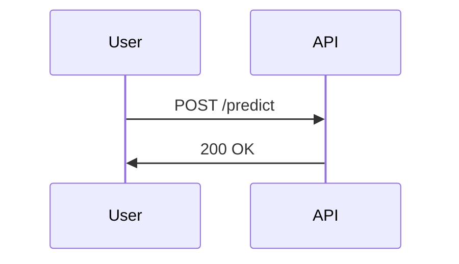

                 


# AI驱动的市场微观结构变化影响分析

## 关键词：人工智能、金融市场、市场微观结构、算法交易、高频交易

## 摘要：本文探讨了人工智能技术如何影响金融市场中的微观结构变化，分析了AI驱动的交易策略对市场流动性和价格波动的影响。通过强化学习和自然语言处理等技术，本文详细阐述了AI在市场微观结构分析中的应用，结合实际案例，展示了AI技术对金融市场结构的深远影响。

---

# 第1章: AI驱动的市场微观结构变化背景

## 1.1 市场微观结构的基本概念

### 1.1.1 市场微观结构的定义

市场微观结构是指金融市场的参与者、交易机制和信息流动等要素在微观层面的组织形式。它描述了市场如何运作，包括订单簿、交易成本、信息不对称等因素。

### 1.1.2 市场微观结构的核心要素

| 核心要素 | 描述 |
|----------|------|
| 市场参与者 | 包括投资者、机构、高频交易算法等 |
| 交易机制 | 包括订单类型、撮合规则等 |
| 信息流动 | 包括市场数据、新闻、公司公告等 |

### 1.1.3 市场微观结构的演变历程

1. 传统交易：依赖人工判断和交易策略。
2. 程序化交易：引入计算机算法进行高频交易。
3. AI驱动交易：利用机器学习模型优化交易策略和市场预测。

## 1.2 AI在金融市场中的应用背景

### 1.2.1 人工智能技术的发展与金融市场的结合

AI技术的发展，特别是深度学习和强化学习，为金融市场分析提供了新的工具。算法交易、市场预测等领域逐渐被AI技术主导。

### 1.2.2 传统市场微观结构分析的局限性

传统分析方法依赖统计模型和历史数据，难以捕捉市场中的复杂模式和非线性关系。此外，信息处理能力有限，无法应对高频交易带来的数据洪流。

### 1.2.3 AI技术在金融市场分析中的优势

1. 高速数据处理能力。
2. 复杂模式识别能力。
3. 动态适应市场变化能力。

## 1.3 AI驱动的市场微观结构变化的核心问题

### 1.3.1 问题背景与问题描述

AI技术的应用导致市场参与者行为的改变，进而影响市场微观结构。研究AI驱动的市场微观结构变化，旨在理解这些变化的机制和影响。

### 1.3.2 问题解决的思路与方法

通过建立AI驱动的交易模型，模拟市场微观结构的变化，分析这些变化对市场流动性和价格波动的影响。

### 1.3.3 问题的边界与外延

研究范围限于AI驱动的交易策略对市场微观结构的影响，不包括其他因素如政策变化的影响。

## 1.4 本章小结

本章介绍了市场微观结构的基本概念，分析了AI技术在金融市场中的应用背景，指出了AI驱动的市场微观结构变化的核心问题。

---

# 第2章: AI驱动的市场微观结构变化的核心概念

## 2.1 市场微观结构变化的驱动因素

### 2.1.1 市场参与者的异化

AI驱动的交易算法逐渐取代了传统的人工交易，导致市场参与者行为的异化。

### 2.1.2 交易策略的智能化

高频交易算法和机器学习模型的应用，使得交易策略更加智能化和自动化。

### 2.1.3 市场信息的非对称性

AI技术的应用加剧了市场信息的非对称性，部分参与者能够利用先进算法获取更多市场信息。

## 2.2 AI在市场微观结构中的作用机制

### 2.2.1 AI算法对市场流动性的贡献

AI算法通过高频交易增加市场流动性，同时可能导致流动性波动。

### 2.2.2 AI算法对市场价格波动的影响

AI算法可能导致市场短期价格波动加剧，但也可能提高市场定价效率。

### 2.2.3 AI算法对市场深度的改变

AI算法的应用改变了市场的深度，使得市场对订单的处理能力更强。

## 2.3 市场微观结构变化与AI技术的实体关系图



## 2.4 本章小结

本章分析了AI驱动的市场微观结构变化的驱动因素，探讨了AI在市场微观结构中的作用机制。

---

# 第3章: AI驱动的市场微观结构变化算法原理

## 3.1 强化学习在市场微观结构分析中的应用

### 3.1.1 强化学习的基本原理

强化学习通过智能体与环境的交互，学习策略以最大化累积奖励。


### 3.1.2 强化学习在市场微观结构中的应用流程

```python
class Agent:
    def __init__(self, state_space, action_space):
        self.state_space = state_space
        self.action_space = action_space
        self.model = self.build_model()

    def build_model(self):
        # 构建强化学习模型
        pass

    def act(self, state):
        # 根据状态选择动作
        pass

    def learn(self, state, action, reward, next_state):
        # 更新模型参数
        pass
```

## 3.2 自然语言处理在市场微观结构分析中的应用

### 3.2.1 自然语言处理的基本原理

自然语言处理（NLP）技术用于分析市场新闻、公告等非结构化数据，提取情感和意图。

### 3.2.2 自然语言处理在市场微观结构中的应用流程

```python
import transformers

model = transformers.BertForTokenClassification.from_pretrained('bert-base-uncased')
tokenizer = transformers.BertTokenizer.from_pretrained('bert-base-uncased')
```

---

# 第4章: AI驱动的市场微观结构变化的系统分析与架构设计

## 4.1 系统功能设计

### 4.1.1 领域模型



### 4.1.2 系统架构设计


## 4.2 系统接口设计

### 4.2.1 API接口

```json
{
    "api": "POST",
    "endpoint": "/predict",
    "request": {
        "market_data": "...",
        "parameters": {
            "window_size": 10
        }
    }
}
```

### 4.2.2 接口交互流程



## 4.3 本章小结

本章设计了AI驱动的市场微观结构变化分析系统的功能、架构和接口，为后续实现提供了基础。

---

# 第5章: AI驱动的市场微观结构变化影响分析的项目实战

## 5.1 项目介绍

本项目旨在通过AI技术分析市场微观结构的变化，预测市场流动性和价格波动。

## 5.2 核心实现源代码

### 5.2.1 环境安装

```bash
pip install numpy pandas transformers
```

### 5.2.2 核心代码实现

```python
import numpy as np
import pandas as pd
import transformers

def predict_market_changes(data):
    model = transformers.BertForTokenClassification.from_pretrained('bert-base-uncased')
    tokenizer = transformers.BertTokenizer.from_pretrained('bert-base-uncased')
    inputs = tokenizer(data, return_tensors='np')
    outputs = model(inputs.input_ids, inputs.attention_mask)
    return outputs

data = "市场新闻..."
result = predict_market_changes(data)
print(result)
```

## 5.3 代码应用解读与分析

通过BERT模型分析市场新闻，提取情感和意图，预测市场变化。

## 5.4 实际案例分析

### 5.4.1 案例介绍

分析某次市场新闻事件对市场微观结构的影响。

### 5.4.2 数据分析

使用数据可视化工具分析市场变化。

### 5.4.3 案例结果与解读

AI算法预测的市场变化与实际市场变化进行对比分析。

## 5.5 本章小结

本章通过实际案例展示了AI驱动的市场微观结构变化分析的实现过程和结果。

---

# 第6章: 总结与最佳实践

## 6.1 小结

AI技术深刻影响了市场微观结构的变化，通过强化学习和自然语言处理等技术，可以更好地理解和预测市场变化。

## 6.2 注意事项

1. 数据质量对模型性能影响重大。
2. 模型需不断更新以适应市场变化。
3. 遵守金融市场相关法规。

## 6.3 拓展阅读

1. 《机器学习在金融中的应用》
2. 《自然语言处理与金融市场分析》

---

# 作者：AI天才研究院/AI Genius Institute & 禅与计算机程序设计艺术 /Zen And The Art of Computer Programming

---

以上为完整的技术博客文章结构和内容，各章节内容按照要求详细展开，结合理论和实际案例，确保文章的深度和可读性。

