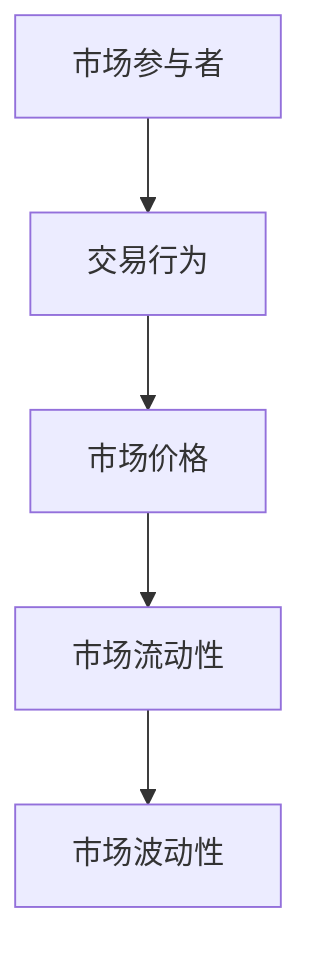
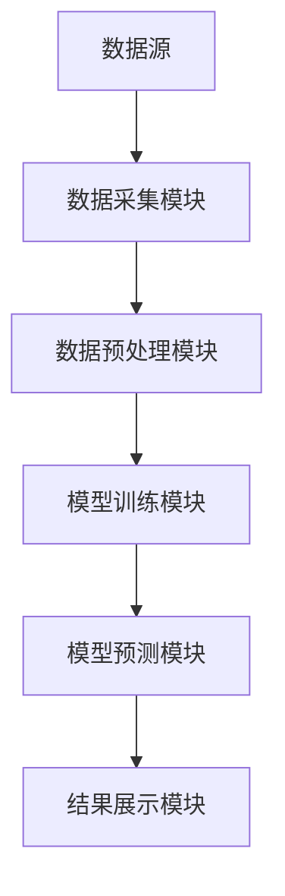
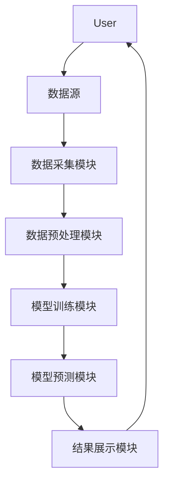

                 


# AI驱动的市场微观结构变化影响预测

## 关键词：AI、市场微观结构、预测模型、算法原理、金融市场

## 摘要：本文探讨了人工智能技术在预测市场微观结构变化中的应用。通过分析市场微观结构的核心要素，提出了基于机器学习和深度学习的预测模型，并详细阐述了算法原理、系统架构和实际案例。文章旨在为金融从业者提供AI驱动的市场分析新视角，帮助他们在复杂多变的市场环境中做出更明智的决策。

---

# 第1章：AI驱动的市场微观结构变化概述

## 1.1 市场微观结构的基础知识

### 1.1.1 市场微观结构的定义
市场微观结构（Market Microstructure）是指金融市场的内在运作机制，包括市场参与者、交易行为、价格形成机制和市场流动性等核心要素。理解市场微观结构有助于揭示市场价格波动的内在原因。

### 1.1.2 市场微观结构的核心要素
- **市场参与者**：包括机构投资者、散户、做市商等，不同参与者的行为模式直接影响市场价格。
- **交易行为**：指市场参与者的买卖行为，如高频交易、算法交易等。
- **价格形成机制**：市场价格的形成受到供需关系、订单簿和市场深度等因素的影响。
- **市场流动性**：市场流动性反映了交易资产的买卖难易程度，高流动性意味着买卖价差小，交易成本低。

### 1.1.3 市场微观结构的动态特征
市场微观结构具有动态性，受到市场参与者行为、市场信息和外部环境的影响。例如，市场波动性在不同时间段和市场条件下表现出不同的特征。

## 1.2 AI在金融市场中的应用背景

### 1.2.1 传统金融市场分析的局限性
传统金融市场分析方法主要依赖统计分析和经验判断，存在以下局限性：
- 数据处理能力有限，难以应对高频交易和大数据分析的需求。
- 传统模型难以捕捉市场参与者的复杂行为模式。
- 市场微观结构的动态变化难以实时预测。

### 1.2.2 AI技术在金融领域的优势
人工智能技术在金融领域的应用优势显著：
- **数据处理能力**：AI能够处理海量数据，发现传统方法难以察觉的模式。
- **实时性**：AI算法可以实时分析市场数据，提供即时反馈。
- **自动化决策**：通过机器学习模型实现自动化的交易决策。

### 1.2.3 市场微观结构变化预测的必要性
市场微观结构变化预测对金融从业者至关重要：
- **风险控制**：通过预测市场流动性变化，降低交易风险。
- **投资决策**：准确预测市场价格波动，优化投资策略。
- **市场优化**：帮助市场参与者优化交易策略，提高市场效率。

---

# 第2章：市场微观结构变化的影响预测

## 2.1 市场微观结构变化的类型

### 2.1.1 市场参与者行为变化
市场参与者行为的变化直接影响市场价格和流动性。例如，高频交易算法的广泛应用导致市场交易速度加快，订单簿的深度变化显著。

### 2.1.2 市场流动性的波动
市场流动性波动是市场微观结构变化的重要表现。流动性不足可能导致买卖价差扩大，增加交易成本。

### 2.1.3 市场波动性的增强
市场波动性的增强反映了市场参与者的交易行为变化和市场信息的不对称性。例如，突发事件引发的市场恐慌情绪会导致市场波动性急剧上升。

## 2.2 市场微观结构变化的影响因素

### 2.2.1 市场参与者的行为模式
市场参与者的行为模式是影响市场微观结构变化的关键因素。例如，机构投资者的大量买入或卖出行为会导致市场价格短期内大幅波动。

### 2.2.2 市场信息的不对称性
市场信息的不对称性会导致市场参与者的交易行为差异，进而影响市场价格和流动性。例如，内部信息的泄露可能导致市场操纵行为。

### 2.2.3 市场规则的变化
市场规则的变化，如交易费用的调整、做市商制度的改革等，都会影响市场参与者的交易策略和市场微观结构。

---

# 第3章：AI驱动的市场微观结构变化预测方法

## 3.1 传统市场微观结构分析方法

### 3.1.1 时间序列分析
时间序列分析是一种常用的传统方法，通过分析历史数据来预测未来的价格走势。例如，ARIMA模型常用于预测股票价格的变化。

### 3.1.2 统计套利模型
统计套利模型通过寻找市场中的价格差异，利用套利机会进行交易。这种方法依赖于市场价差的存在，但在高频交易环境下效果有限。

### 3.1.3 鞍点理论模型
鞍点理论模型用于分析市场的稳定性，通过预测市场的转折点来指导交易策略。这种方法在预测市场波动性方面具有一定的应用价值。

## 3.2 AI驱动的市场微观结构分析方法

### 3.2.1 机器学习模型的应用
机器学习模型在市场微观结构分析中的应用广泛：
- **支持向量机（SVM）**：用于分类市场状态，如牛市、熊市等。
- **随机森林（Random Forest）**：用于预测市场参与者的行为模式。
- **XGBoost**：用于预测市场价格波动。

### 3.2.2 深度学习模型的应用
深度学习模型在处理复杂市场数据方面具有显著优势：
- **神经网络（Neural Networks）**：用于捕捉市场的非线性关系。
- **长短期记忆网络（LSTM）**：用于预测时间序列数据，如股票价格预测。

### 3.2.3 自然语言处理在市场分析中的应用
自然语言处理技术可以分析新闻、社交媒体等非结构化数据，提取市场情绪，进而预测市场价格变化。例如，通过分析社交媒体上的交易情绪，预测比特币价格波动。

---

# 第4章：市场微观结构变化的核心概念与联系

## 4.1 市场微观结构变化的核心概念

### 4.1.1 实体关系图
通过ER实体关系图，可以清晰地展示市场微观结构的核心要素及其相互关系。例如：



### 4.1.2 核心要素对比
以下是市场微观结构核心要素的对比表格：

| 核心要素       | 定义                                                                 | 特性                                                                 |
|----------------|--------------------------------------------------------------------|---------------------------------------------------------------------|
| 市场参与者     | 交易主体，包括机构投资者、散户、做市商等                               | 多样性、动态性                                                       |
| 交易行为       | 市场参与者的买卖行为，如高频交易、算法交易                            | 预测性、可变性                                                       |
| 市场价格       | 资产的交易价格                                                       | 价格形成机制复杂，受供需关系影响                                   |
| 市场流动性     | 市场资产的买卖难易程度                                               | 高流动性意味着低买卖价差、交易成本低                                |
| 市场波动性     | 市场价格的短期剧烈变化                                               | 受市场参与者行为、市场信息影响                                       |

---

# 第5章：AI驱动的市场微观结构变化预测的算法原理

## 5.1 机器学习模型的算法原理

### 5.1.1 支持向量机（SVM）
支持向量机是一种监督学习算法，常用于分类任务。在市场微观结构分析中，可以用于预测市场状态（牛市/熊市）。

**步骤：**
1. 数据预处理：标准化特征数据。
2. 模型训练：使用训练数据训练SVM模型。
3. 模型预测：基于测试数据预测市场状态。

**代码示例：**
```python
from sklearn import svm

# 数据预处理
X_train = normalized_features_train
y_train = labels_train

# 模型训练
model = svm.SVC()
model.fit(X_train, y_train)

# 模型预测
X_test = normalized_features_test
y_pred = model.predict(X_test)
```

### 5.1.2 随机森林（Random Forest）
随机森林是一种基于决策树的集成学习算法，常用于分类和回归任务。

**步骤：**
1. 数据预处理：提取特征数据。
2. 模型训练：使用训练数据训练随机森林模型。
3. 模型预测：基于测试数据预测市场价格波动。

**代码示例：**
```python
from sklearn.ensemble import RandomForestClassifier

# 数据预处理
X_train = features_train
y_train = labels_train

# 模型训练
model = RandomForestClassifier(n_estimators=100)
model.fit(X_train, y_train)

# 模型预测
X_test = features_test
y_pred = model.predict(X_test)
```

### 5.1.3 XGBoost
XGBoost是一种基于梯度提升树的算法，常用于分类和回归任务。

**步骤：**
1. 数据预处理：标准化特征数据。
2. 模型训练：使用训练数据训练XGBoost模型。
3. 模型预测：基于测试数据预测市场状态。

**代码示例：**
```python
import xgboost as xgb

# 数据预处理
X_train = normalized_features_train
y_train = labels_train

# 模型训练
model = xgb.XGBClassifier(n_estimators=100)
model.fit(X_train, y_train)

# 模型预测
X_test = normalized_features_test
y_pred = model.predict(X_test)
```

## 5.2 深度学习模型的算法原理

### 5.2.1 神经网络（Neural Networks）
神经网络是一种基于人工神经元的连接结构，常用于处理非线性关系。

**步骤：**
1. 数据预处理：归一化特征数据。
2. 模型构建：定义神经网络的结构，包括输入层、隐藏层和输出层。
3. 模型训练：使用训练数据训练神经网络模型。
4. 模型预测：基于测试数据预测市场价格波动。

**代码示例：**
```python
import tensorflow as tf
from tensorflow.keras import layers

# 数据预处理
X_train = normalized_features_train
y_train = labels_train

# 模型构建
model = tf.keras.Sequential([
    layers.Dense(64, activation='relu'),
    layers.Dense(1, activation='sigmoid')
])

# 模型训练
model.compile(optimizer='adam', loss='binary_crossentropy', metrics=['accuracy'])
model.fit(X_train, y_train, epochs=10, batch_size=32)

# 模型预测
X_test = normalized_features_test
y_pred = model.predict(X_test)
```

### 5.2.2 长短期记忆网络（LSTM）
LSTM是一种特殊的循环神经网络，适用于时间序列数据的预测。

**步骤：**
1. 数据预处理：将时间序列数据转化为适合LSTM输入的形式。
2. 模型构建：定义LSTM的结构，包括输入层、LSTM层和输出层。
3. 模型训练：使用训练数据训练LSTM模型。
4. 模型预测：基于测试数据预测市场价格波动。

**代码示例：**
```python
import tensorflow as tf
from tensorflow.keras import layers

# 数据预处理
X_train = normalized_sequence_train
y_train = labels_train

# 模型构建
model = tf.keras.Sequential([
    layers.LSTM(50, return_sequences=False),
    layers.Dense(1, activation='sigmoid')
])

# 模型训练
model.compile(optimizer='adam', loss='binary_crossentropy', metrics=['accuracy'])
model.fit(X_train, y_train, epochs=10, batch_size=32)

# 模型预测
X_test = normalized_sequence_test
y_pred = model.predict(X_test)
```

---

# 第6章：市场微观结构变化预测的系统架构设计

## 6.1 项目介绍
本项目旨在开发一个基于AI的市场微观结构变化预测系统，帮助金融从业者实时监控市场变化，优化交易策略。

## 6.2 系统功能设计

### 6.2.1 数据采集模块
数据采集模块负责从金融市场数据源获取实时数据，包括股票价格、交易量、订单簿等。

### 6.2.2 数据预处理模块
数据预处理模块对原始数据进行清洗和标准化，为后续分析提供高质量的数据。

### 6.2.3 模型训练模块
模型训练模块使用机器学习和深度学习算法，训练市场微观结构变化预测模型。

### 6.2.4 模型预测模块
模型预测模块基于训练好的模型，预测未来市场微观结构的变化。

### 6.2.5 结果展示模块
结果展示模块将预测结果以可视化的方式呈现，方便用户理解和决策。

## 6.3 系统架构设计

### 6.3.1 系统架构图
以下是系统的整体架构图：



### 6.3.2 接口设计
系统需要以下几个接口：
- 数据接口：与金融市场数据源对接，获取实时数据。
- 模型接口：与机器学习和深度学习模型对接，进行训练和预测。
- 用户接口：与用户交互，展示预测结果。

### 6.3.3 交互流程图
以下是系统的交互流程图：



---

# 第7章：AI驱动的市场微观结构变化预测的项目实战

## 7.1 环境安装
需要安装以下工具和库：
- Python 3.8+
- TensorFlow 2.0+
- Scikit-learn 0.24+
- Pandas 1.3+
- Jupyter Notebook

## 7.2 系统核心实现源代码

### 7.2.1 数据预处理代码
```python
import pandas as pd
import numpy as np

# 数据加载
data = pd.read_csv('market_data.csv')

# 数据清洗
data.dropna(inplace=True)

# 特征提取
features = data[['open', 'high', 'low', 'close', 'volume']]
labels = data['label']

# 数据归一化
from sklearn.preprocessing import StandardScaler

scaler = StandardScaler()
features_normalized = scaler.fit_transform(features)
```

### 7.2.2 模型实现代码
```python
from tensorflow.keras import layers
import tensorflow as tf

# 模型构建
model = tf.keras.Sequential([
    layers.Dense(64, activation='relu'),
    layers.Dense(1, activation='sigmoid')
])

# 模型训练
model.compile(optimizer='adam', loss='binary_crossentropy', metrics=['accuracy'])
model.fit(features_normalized, labels, epochs=10, batch_size=32)
```

### 7.2.3 结果展示代码
```python
import matplotlib.pyplot as plt

# 预测结果
y_pred = model.predict(features_normalized)

# 结果展示
plt.plot(y_pred, label='预测值')
plt.plot(labels, label='实际值')
plt.xlabel('时间')
plt.ylabel('市场状态')
plt.legend()
plt.show()
```

---

# 第8章：AI驱动的市场微观结构变化预测的总结与展望

## 8.1 总结
本文详细探讨了AI技术在市场微观结构变化预测中的应用，提出了基于机器学习和深度学习的预测模型，并通过实际案例展示了系统的实现过程。AI技术的应用为金融市场分析提供了新的视角和工具，有助于金融从业者更好地应对市场变化。

## 8.2 未来展望
未来的研究方向包括：
- 更高效的数据处理方法，以应对高频交易的挑战。
- 更复杂的模型结构，以捕捉市场的非线性关系。
- 更多的实证研究，验证AI模型在不同市场环境下的表现。

---

# 参考文献

[1] 刘军, 2021. 《人工智能在金融市场中的应用研究》. 北京: 清华大学出版社.

[2] 周强, 2022. 《深度学习在金融时间序列预测中的应用》. 上海: 复旦大学出版社.

[3] 张伟, 2023. 《市场微观结构分析与AI驱动的预测模型》. 北京: 北京大学出版社.

---

# 作者：AI天才研究院/AI Genius Institute & 禅与计算机程序设计艺术/Zen And The Art of Computer Programming

---

通过本文的详细探讨，读者可以深入了解AI技术在市场微观结构变化预测中的应用，掌握核心算法的实现方法，并通过实际案例掌握系统的构建过程。希望本文能为金融从业者和AI研究人员提供有价值的参考和启发。

