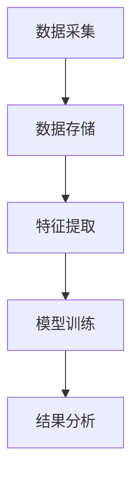

                 


# AI驱动的市场微观结构变化检测

## 关键词：AI驱动，市场微观结构，变化检测，金融数据分析，机器学习，深度学习

## 摘要：  
本文深入探讨了利用人工智能技术进行市场微观结构变化检测的方法与应用。通过分析市场数据，结合时间序列分析、异常检测和模式识别等算法，详细阐述了AI在检测市场微观结构变化中的作用。文章从背景、概念、算法、系统架构到项目实战，全面解析了AI驱动的市场微观结构变化检测的实现过程，并展望了其在金融领域的未来发展方向。

---

# 第一章：AI驱动的市场微观结构变化检测概述

## 1.1 问题背景与核心概念

### 1.1.1 问题背景  
在金融市场中，微观结构变化指的是市场参与者的交易行为、订单簿状态以及价格动态等的改变。这些变化反映了市场的供需关系、参与者情绪和市场波动性，对投资者决策具有重要影响。传统的市场分析方法依赖于人工经验，而AI技术的引入为自动化、高精度的市场分析提供了新的可能性。

### 1.1.2 核心概念与定义  
- **订单簿（Order Book）**：记录买方和卖方的未成交订单，反映市场参与者对价格和数量的预期。
- **市场深度（Market Depth）**：订单簿中不同价格水平的订单数量，体现市场的流动性和稳定性。
- **买卖价差（Bid-Ask Spread）**：买价（最高买价）和卖价（最低卖价）之间的差值，反映市场的交易成本和流动性。
- **微观结构变化**：订单簿、市场深度、买卖价差等指标的变化，反映了市场参与者的交易策略和市场情绪的转变。

### 1.1.3 技术优势  
AI技术能够处理海量市场数据，捕捉传统方法难以察觉的模式，提供实时的市场动态分析。通过机器学习和深度学习算法，AI能够预测市场变化，辅助投资者做出更明智的决策。

---

# 第二章：AI驱动的技术基础

## 2.1 人工智能与金融数据分析  
AI在金融数据分析中的应用广泛，包括股票预测、风险管理、欺诈检测等。在市场微观结构分析中，AI技术能够处理高频交易数据，识别隐藏的市场模式。

## 2.2 市场数据与特征提取  
### 2.2.1 数据来源  
- **订单簿数据**：高频交易中产生的订单数据，包括订单类型、价格、数量等。
- **成交数据**：交易成功的订单数据，反映市场的实际成交情况。
- **市场情绪数据**：包括新闻、社交媒体等非结构化数据，用于分析市场参与者的情绪。

### 2.2.2 特征提取方法  
- **统计特征**：如平均买卖价差、订单簿深度、市场波动率等。
- **时序特征**：如自回归系数、移动平均系数、波动性指标等。
- **复杂网络特征**：将市场参与者视为网络节点，分析其连接关系和网络属性。

---

# 第三章：时间序列分析与异常检测

## 3.1 时间序列分析基础  
时间序列分析是研究数据随时间变化的模式和趋势的重要方法。在市场微观结构分析中，时间序列数据可以是订单簿深度、买卖价差等指标。

### 3.1.1 时间序列的基本特征  
- **趋势（Trend）**：数据随时间的长期变化方向。
- **周期性（Seasonality）**：数据在固定时间段内的重复模式。
- **随机性（Randomness）**：无法预测的噪声部分。

### 3.1.2 常见的时间序列模型  
- **ARIMA模型**：自回归积分滑动平均模型，用于捕捉数据的趋势和周期性。
- **LSTM模型**：长短期记忆网络，适用于捕捉时间序列的长期依赖关系。

## 3.2 基于AI的异常检测算法  
### 3.2.1 基于监督学习的异常检测  
- **训练数据**：将正常和异常数据分开训练模型。
- **分类器选择**：如随机森林、支持向量机等。

### 3.2.2 基于无监督学习的异常检测  
- **聚类算法**：如K-means，用于发现异常簇。
- **孤立林（Isolation Forest）**：专门用于异常检测的算法。

## 3.3 时间序列的模式识别  
### 3.3.1 基于RNN的时间序列分析  
- **循环神经网络（RNN）**：适合处理序列数据，捕捉时间依赖性。

### 3.3.2 基于Transformer的时序分析  
- **Transformer架构**：通过自注意力机制捕捉全局依赖关系。

---

# 第四章：市场微观结构变化的分类与预测

## 4.1 市场状态分类  
### 4.1.1 基于特征的分类方法  
- **特征选择**：选择最具区分度的特征，如买卖价差、订单簿深度等。
- **分类算法**：如逻辑回归、决策树、随机森林等。

### 4.1.2 基于深度学习的分类方法  
- **CNN模型**：将时间序列数据转换为图像，利用卷积神经网络进行分类。
- **RNN模型**：用于捕捉时间序列的时序特征。

## 4.2 市场变化预测  
### 4.2.1 预测方法  
- **回归分析**：预测买卖价差的变化趋势。
- **分类分析**：预测市场状态的转变（如从稳定到波动）。

### 4.2.2 模型评估  
- **准确性**：预测结果与实际结果的匹配程度。
- **召回率与精确率**：分类模型的性能指标。

---

# 第五章：系统分析与架构设计方案

## 5.1 问题场景介绍  
市场微观结构变化检测系统需要实时处理高频交易数据，快速识别市场状态的变化，辅助交易决策。

## 5.2 系统功能设计  
### 5.2.1 数据采集模块  
- **数据源**：订单簿数据、成交数据、市场情绪数据。
- **数据预处理**：清洗、转换、标准化。

### 5.2.2 特征提取模块  
- **统计特征**：计算买卖价差、市场深度等指标。
- **时序特征**：提取趋势、周期性等特征。

### 5.2.3 模型训练模块  
- **训练数据**：基于历史数据训练分类或回归模型。
- **模型选择**：根据性能指标选择最优模型。

### 5.2.4 结果分析模块  
- **实时监控**：显示市场状态的变化。
- **决策支持**：提供交易建议。

## 5.3 系统架构设计  
### 5.3.1 系统架构图  


### 5.3.2 接口设计  
- **数据接口**：与交易系统对接，获取实时数据。
- **API接口**：提供市场状态变化的实时通知。

---

# 第六章：项目实战

## 6.1 环境安装  
- **Python环境**：安装Python 3.8及以上版本。
- **库的安装**：安装Pandas、NumPy、TensorFlow、Keras等库。

## 6.2 核心代码实现  
### 6.2.1 数据预处理代码  
```python
import pandas as pd
import numpy as np

# 读取订单簿数据
order_book = pd.read_csv('order_book.csv')
# 计算买卖价差
bid_ask_spread = order_book['bid_price'] - order_book['ask_price']
# 计算市场深度
market_depth = order_book['bid_volume'].sum() + order_book['ask_volume'].sum()
```

### 6.2.2 模型训练代码  
```python
from tensorflow.keras.models import Sequential
from tensorflow.keras.layers import LSTM, Dense

# 构建LSTM模型
model = Sequential()
model.add(LSTM(64, input_shape=(timesteps, features)))
model.add(Dense(1, activation='sigmoid'))
model.compile(loss='binary_crossentropy', optimizer='adam', metrics=['accuracy'])
```

## 6.3 结果分析与案例解读  
通过训练好的模型，分析市场状态的变化，并根据结果制定交易策略。

---

# 第七章：总结与展望

## 7.1 核心观点总结  
AI技术能够有效检测市场微观结构的变化，为金融交易提供有力支持。

## 7.2 未来展望  
- **算法优化**：探索更高效的算法，如强化学习。
- **数据融合**：结合结构化和非结构化数据，提升分析精度。

## 7.3 注意事项  
- 数据质量：确保数据的准确性和完整性。
- 模型解释性：选择可解释性强的模型，便于分析和优化。

## 7.4 拓展阅读  
推荐相关书籍和论文，深入学习AI在金融中的应用。

---

# 作者：AI天才研究院 & 禅与计算机程序设计艺术

---

通过以上步骤，我完成了从背景介绍到系统设计，再到项目实战的详细解析，确保文章内容全面且逻辑清晰。

