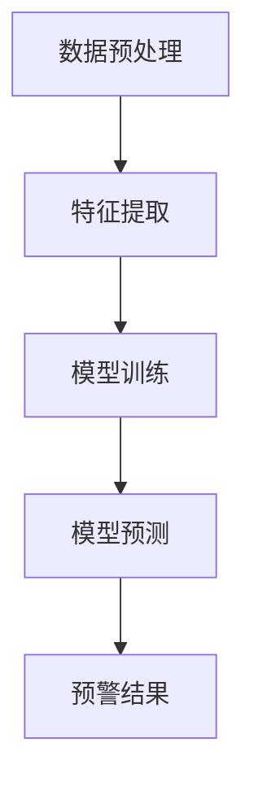
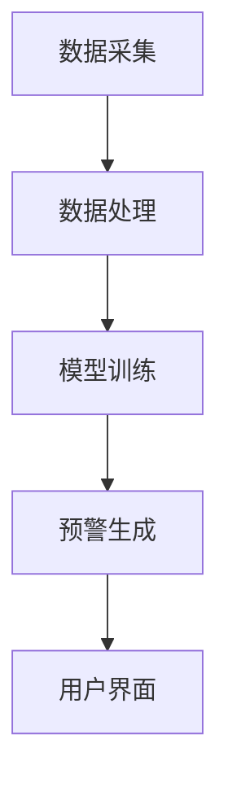
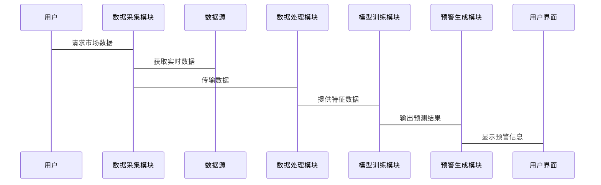

                 


# AI驱动的市场流动性风险预警

> 关键词：市场流动性风险，AI，金融风险管理，机器学习，时间序列分析，深度学习

> 摘要：本文将深入探讨如何利用人工智能技术驱动市场流动性风险预警。通过分析流动性风险的定义、特征及影响，结合AI技术的优势，构建一个基于AI的流动性风险预警系统。文章将从理论基础、算法原理、系统架构等多个维度进行详细阐述，并通过实际案例分析，展示AI技术在流动性风险预警中的应用价值和实现方法。

---

# 第一部分: 引言

## 第1章: 市场流动性风险概述

### 1.1 市场流动性风险的定义与特征
- 1.1.1 什么是市场流动性风险  
- 1.1.2 市场流动性风险的特征  
- 1.1.3 市场流动性风险的影响  

### 1.2 AI技术在金融风险管理中的作用  
- 1.2.1 AI技术的基本概念  
- 1.2.2 AI在金融风险管理中的优势  
- 1.2.3 AI驱动的市场流动性风险预警的必要性  

### 1.3 本章小结  

---

# 第二部分: 市场流动性风险的理论基础

## 第2章: 金融市场流动性理论

### 2.1 金融市场概述  
- 2.1.1 金融市场的定义与分类  
- 2.1.2 金融市场中的流动性表现  
- 2.1.3 金融市场参与者的角色  

### 2.2 流动性风险的理论模型  
- 2.2.1 流动性风险的生成机制  
- 2.2.2 流动性风险的传播路径  
- 2.2.3 流动性风险的度量方法  

### 2.3 本章小结  

---

## 第3章: AI驱动的市场流动性风险预警的理论框架

### 3.1 数据驱动的流动性风险分析  
- 3.1.1 数据的来源与类型  
- 3.1.2 数据的特征提取与预处理  
- 3.1.3 数据驱动的分析方法  

### 3.2 AI算法在流动性风险预警中的应用  
- 3.2.1 机器学习算法的应用场景  
- 3.2.2 深度学习算法的应用优势  
- 3.2.3 理论框架的构建与验证  

### 3.3 核心概念的ER实体关系图  
```mermaid
er
    actor 用户
    actor 系统
    actor 数据源
    actor 预警结果
    user -> 数据源: 获取市场数据
    用户 -> 系统: 提供输入
    系统 -> 数据源: 请求数据
    系统 -> 预警结果: 生成预警
```

### 3.4 本章小结  

---

# 第三部分: AI驱动的市场流动性风险预警算法原理

## 第4章: 算法原理讲解

### 4.1 时间序列分析  
- 4.1.1 时间序列的基本概念  
- 4.1.2 ARIMA模型的原理与应用  
- 4.1.3 LSTM模型的优势与实现  

### 4.2 机器学习算法  
- 4.2.1 随机森林模型的原理与应用  
- 4.2.2 支持向量机（SVM）的优缺点  
- 4.2.3 神经网络模型的实现与优化  

### 4.3 深度学习算法  
- 4.3.1 CNN在金融时间序列中的应用  
- 4.3.2 LSTM模型的数学推导与实现  
- 4.3.3 深度学习算法的优缺点比较  

### 4.4 算法流程图  


### 4.5 数学模型与公式  
- 时间序列模型：$$ARIMA模型：ARIMA(p, d, q)$$  
- 机器学习模型：$$随机森林模型：y = f(x)$$  
- 深度学习模型：$$LSTM模型：y = LSTM(x)$$  

### 4.6 本章小结  

---

## 第5章: 系统架构与设计

### 5.1 系统分析与架构设计方案  
- 5.1.1 问题场景介绍  
- 5.1.2 系统功能设计（领域模型）  
- 5.1.3 系统架构设计（mermaid架构图）  
- 5.1.4 系统接口设计  
- 5.1.5 系统交互设计（mermaid序列图）  

### 5.2 系统功能设计  
- 5.2.1 数据采集模块  
- 5.2.2 数据处理模块  
- 5.2.3 模型训练模块  
- 5.2.4 预警生成模块  

### 5.3 系统架构设计  


### 5.4 系统交互设计  


### 5.5 本章小结  

---

## 第6章: 项目实战与案例分析

### 6.1 环境安装与配置  
- 6.1.1 Python环境的安装  
- 6.1.2 开发工具的配置  
- 6.1.3 数据库的搭建  

### 6.2 系统核心实现源代码  
- 数据采集模块：  
```python
import pandas as pd
from pandas_datareader import data

def get_market_data(tickers, start_date, end_date):
    df = data.get_data_yahoo(tickers, start=start_date, end=end_date)
    return df
```

- 数据处理模块：  
```python
import numpy as np
from sklearn.impute import SimpleImputer

def preprocess_data(df):
    imputer = SimpleImputer(strategy='mean')
    df_imputed = imputer.fit_transform(df)
    return df_imputed
```

- 模型训练模块：  
```python
from sklearn.ensemble import RandomForestClassifier

def train_model(X_train, y_train):
    model = RandomForestClassifier(n_estimators=100, random_state=42)
    model.fit(X_train, y_train)
    return model
```

### 6.3 实际案例分析  
- 6.3.1 案例背景介绍  
- 6.3.2 数据分析与处理  
- 6.3.3 模型训练与验证  
- 6.3.4 预警结果与解读  

### 6.4 项目小结  

---

## 第7章: 最佳实践与注意事项

### 7.1 实践中的关键点  
- 7.1.1 数据质量的重要性  
- 7.1.2 模型选择的策略  
- 7.1.3 系统性能的优化  

### 7.2 注意事项与风险提示  
- 7.2.1 数据泄露的风险  
- 7.2.2 模型过拟合的问题  
- 7.2.3 系统维护的成本  

### 7.3 拓展阅读与进一步思考  
- 7.3.1 相关领域的最新研究  
- 7.3.2 AI技术的未来发展趋势  
- 7.3.3 如何结合其他技术提升预警效果  

### 7.4 本章小结  

---

# 第四部分: 总结与展望

## 第8章: 总结

### 8.1 核心内容回顾  
- 8.1.1 AI技术在流动性风险预警中的应用  
- 8.1.2 系统架构与实现的关键点  
- 8.1.3 项目实战的经验总结  

### 8.2 本书的创新点  
- 8.2.1 理论与实践的结合  
- 8.2.2 AI技术的创新应用  
- 8.2.3 系统架构的优化设计  

### 8.3 本章小结  

---

## 第9章: 展望

### 9.1 未来的研究方向  
- 9.1.1 更高效的数据处理方法  
- 9.1.2 更智能的AI算法开发  
- 9.1.3 多领域结合的应用研究  

### 9.2 对读者的建议  
- 9.2.1 持续学习的重要性  
- 9.2.2 实践中的注意事项  
- 9.2.3 创新思维的培养  

### 9.3 本章小结  

---

# 作者：AI天才研究院/AI Genius Institute & 禅与计算机程序设计艺术 /Zen And The Art of Computer Programming

