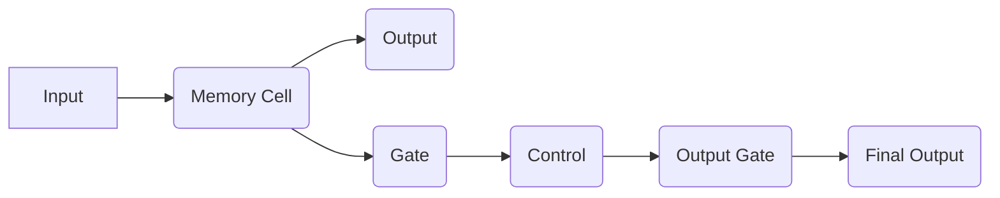

                 


---

# AI驱动的市场流动性风险预警系统

> 关键词：AI技术，市场流动性风险，风险预警，时间序列分析，机器学习模型，深度学习模型

> 摘要：本文将介绍如何利用AI技术构建一个市场流动性风险预警系统。通过分析市场流动性风险的定义、特征以及AI技术在金融领域的应用，探讨系统的核心算法与数学模型，包括时间序列分析和机器学习模型（如ARIMA、LSTM等）。同时，详细阐述系统架构设计、项目实战实现、系统评估与优化等内容，为金融机构提供一种高效、可靠的流动性风险预警解决方案。

---

## 引言

### 1.1 市场流动性风险的定义与特征

市场流动性风险是指在特定市场条件下，资产无法以合理价格迅速变现的风险。这种风险可能由市场波动、交易量减少或价格剧烈波动等多种因素引起。流动性风险的特征包括：

1. **突发性**：流动性风险可能在短时间内迅速恶化。
2. **隐蔽性**：在正常市场条件下，流动性风险可能不易察觉。
3. **传染性**：流动性风险可能通过市场传导影响其他资产或机构。
4. **系统性**：流动性风险可能引发系统性金融危机。

### 1.2 AI技术在金融领域的应用

AI技术在金融领域的应用日益广泛，包括交易决策、风险评估、市场预测等多个方面。AI技术的优势在于其强大的数据处理能力和模式识别能力，能够帮助金融机构更准确地预测市场趋势，识别潜在风险。

### 1.3 本文的研究目标

本文旨在探讨如何利用AI技术构建一个市场流动性风险预警系统，通过分析市场数据，识别潜在风险，提前发出预警信号，帮助金融机构采取有效的风险管理措施。

---

## 第二章: AI驱动的市场流动性风险预警系统的核心概念

### 2.1 数据采集与处理

#### 2.1.1 数据源的获取

市场流动性风险预警系统需要收集大量的市场数据，包括股票价格、成交量、订单簿数据、市场情绪等。数据来源可以是公开的市场数据 API、新闻媒体、社交媒体等。

#### 2.1.2 数据清洗与预处理

收集到的原始数据可能存在缺失、噪声或异常值。数据清洗的过程包括：

1. **缺失值处理**：使用均值、中位数或其他方法填充缺失值。
2. **异常值处理**：通过统计方法或机器学习模型识别并处理异常值。
3. **数据标准化**：对数据进行标准化或归一化处理，以便后续模型训练。

#### 2.1.3 数据特征提取

特征提取是将原始数据转化为能够反映市场流动性风险的特征向量。常用的特征包括：

- **波动性指标**：如标准差、波动率。
- **交易量指标**：如成交量、成交额。
- **市场情绪指标**：如新闻情感分析结果。
- **技术指标**：如移动平均线、相对强弱指数（RSI）。

### 2.2 AI算法与模型选择

#### 2.2.1 时间序列分析

时间序列分析是一种常用的方法，用于分析和预测具有时间依赖性的数据。常用的时间序列模型包括：

- **ARIMA模型**：通过自回归和移动平均部分来预测未来的值。
- **LSTM模型**：基于循环神经网络（RNN）的时间序列预测模型，能够捕捉长期依赖关系。
- **Prophet模型**：由Facebook开源的基于时间序列分解的方法。

#### 2.2.2 机器学习模型

机器学习模型可以用于分类或回归任务，帮助识别市场流动性风险的潜在信号。常用的模型包括：

- **随机森林**：基于决策树的集成学习方法，适合特征工程较为复杂的情况。
- **支持向量机（SVM）**：适合小样本数据的分类任务。
- **梯度提升树（如XGBoost、LightGBM）**：适合处理高维特征的数据。

#### 2.2.3 深度学习模型

深度学习模型在处理复杂非线性关系方面具有优势。常用的深度学习模型包括：

- **LSTM网络**：适用于时间序列数据，能够捕捉长期依赖关系。
- **Transformer模型**：通过自注意力机制捕捉全局依赖关系。
- **卷积神经网络（CNN）**：适用于局部特征提取。

### 2.3 系统架构设计

#### 2.3.1 系统整体架构

市场流动性风险预警系统的整体架构包括以下几个模块：

1. **数据采集模块**：负责从多个数据源获取市场数据。
2. **特征提取模块**：对原始数据进行特征提取和工程处理。
3. **模型训练模块**：基于特征数据训练时间序列模型或机器学习模型。
4. **预警模块**：根据模型预测结果发出流动性风险预警信号。
5. **可视化模块**：提供直观的市场风险监控界面。

#### 2.3.2 数据流与信息流

数据流从数据源开始，经过清洗、特征提取、模型训练，最终生成预警信号。信息流则包括各个模块之间的数据传递和结果反馈。

#### 2.3.3 系统模块划分

- **数据采集模块**：使用API接口获取实时市场数据。
- **特征提取模块**：将原始数据转化为特征向量。
- **模型训练模块**：训练时间序列模型或机器学习模型。
- **预警模块**：根据模型输出结果发出预警信号。
- **可视化模块**：提供用户友好的监控界面。

---

## 第三章: 时间序列分析与预测模型

### 3.1 时间序列的基本概念

时间序列是指按照时间顺序排列的数据。时间序列分析的目的是通过历史数据预测未来的趋势或行为。

### 3.2 常见的时间序列预测模型

#### 3.2.1 ARIMA模型

ARIMA（自回归积分滑动平均模型）是一种广泛应用于时间序列预测的模型。ARIMA模型的公式如下：

$$ARIMA(p, d, q) = y_t = \phi_1 y_{t-1} + \phi_2 y_{t-2} + ... + \phi_p y_{t-p} + \theta_1 \epsilon_{t-1} + ... + \theta_q \epsilon_{t-q} + \epsilon_t$$

其中，$p$ 是自回归阶数，$d$ 是差分阶数，$q$ 是滑动平均阶数。

#### 3.2.2 LSTM模型

LSTM（长短期记忆网络）是一种基于RNN的时间序列预测模型。LSTM通过记忆单元（Memory Cell）和控制门（Gate）来捕捉长期依赖关系。LSTM的结构如下图所示：



#### 3.2.3 Prophet模型

Prophet是由Facebook开源的时间序列预测模型，适用于非平稳时间序列数据。Prophet模型的预测公式如下：

$$
y(t) = g(t) + s(t) + \epsilon(t)
$$

其中，$g(t)$ 是趋势部分，$s(t)$ 是周期部分，$\epsilon(t)$ 是误差项。

---

## 第四章: 机器学习模型

### 4.1 机器学习模型的选择与实现

在选择机器学习模型时，需要考虑数据的特征、样本数量以及模型的复杂度。以下是一些常用的机器学习模型及其适用场景：

- **随机森林**：适合特征工程较为复杂的情况。
- **支持向量机（SVM）**：适合小样本数据的分类任务。
- **梯度提升树（如XGBoost、LightGBM）**：适合处理高维特征的数据。

### 4.2 深度学习模型

深度学习模型在处理复杂非线性关系方面具有优势。常用的深度学习模型包括：

- **LSTM网络**：适用于时间序列数据，能够捕捉长期依赖关系。
- **Transformer模型**：通过自注意力机制捕捉全局依赖关系。
- **卷积神经网络（CNN）**：适用于局部特征提取。

### 4.3 模型训练与优化

模型训练的关键在于数据准备、超参数调优和模型评估。常用的评估指标包括：

- **均方误差（MSE）**：衡量预测值与实际值之间的差异。
- **准确率（Accuracy）**：分类任务中的正确预测比例。
- **召回率（Recall）**：模型识别正类样本的能力。

---

## 第五章: 系统架构设计与实现

### 5.1 系统架构设计

系统架构设计需要考虑模块化、可扩展性和可维护性。以下是系统架构的分层设计：

1. **数据采集层**：负责从多个数据源获取市场数据。
2. **数据处理层**：对数据进行清洗、特征提取和工程处理。
3. **模型训练层**：基于特征数据训练时间序列模型或机器学习模型。
4. **预警触发层**：根据模型输出结果发出流动性风险预警信号。
5. **用户界面层**：提供直观的市场风险监控界面。

### 5.2 系统模块实现

#### 5.2.1 数据采集模块

数据采集模块需要通过API接口获取实时市场数据。以下是Python代码示例：

```python
import pandas as pd
import requests

def get_market_data(api_key):
    url = f"https://api.example.com/market_data?api_key={api_key}"
    response = requests.get(url)
    data = response.json()
    df = pd.DataFrame(data)
    return df
```

#### 5.2.2 特征提取模块

特征提取模块将原始数据转化为特征向量。以下是Python代码示例：

```python
from sklearn.preprocessing import StandardScaler

def extract_features(data):
    # 提取特征
    features = data[['volume', 'open', 'high', 'low', 'close']]
    scaler = StandardScaler()
    features_scaled = scaler.fit_transform(features)
    return features_scaled
```

#### 5.2.3 模型训练模块

模型训练模块基于特征数据训练时间序列模型或机器学习模型。以下是Python代码示例：

```python
from sklearn.ensemble import RandomForestClassifier
from sklearn.metrics import accuracy_score

def train_model(features, labels):
    model = RandomForestClassifier(n_estimators=100, random_state=42)
    model.fit(features, labels)
    return model

# 示例
features = extract_features(data)
labels = data['risk_label']
model = train_model(features, labels)
print("模型训练完成，准确率：", accuracy_score(labels, model.predict(features)))
```

---

## 第六章: 项目实战与案例分析

### 6.1 项目实战

#### 6.1.1 环境安装

需要安装以下Python库：

- `pandas`：数据处理
- `numpy`：数值计算
- `scikit-learn`：机器学习算法
- `tensorflow`：深度学习框架
- `mermaid`：图表绘制工具

#### 6.1.2 核心实现

以下是系统核心实现的Python代码示例：

```python
import pandas as pd
import numpy as np
from sklearn.ensemble import RandomForestClassifier
from sklearn.metrics import accuracy_score
from keras.layers import LSTM, Dense, Dropout
from keras.models import Sequential

def build_lstm_model(input_shape):
    model = Sequential()
    model.add(LSTM(units=64, return_sequences=True, input_shape=input_shape))
    model.add(Dropout(0.5))
    model.add(LSTM(units=32, return_sequences=False))
    model.add(Dropout(0.5))
    model.add(Dense(1, activation='sigmoid'))
    model.compile(loss='binary_crossentropy', optimizer='adam', metrics=['accuracy'])
    return model

# 示例
data = pd.read_csv('market_data.csv')
features = data[['volume', 'open', 'high', 'low', 'close']]
labels = data['risk_label']

# 划分训练集和测试集
train_features = features[:-100]
train_labels = labels[:-100]
test_features = features[-100:]
test_labels = labels[-100:]

# 构建LSTM模型
input_shape = (train_features.shape[1], 1)
model = build_lstm_model(input_shape)
model.fit(train_features.reshape((train_features.shape[0], train_features.shape[1], 1)), 
          train_labels, 
          epochs=10, 
          batch_size=32)

# 预测与评估
predictions = model.predict(test_features.reshape((test_features.shape[0], test_features.shape[1], 1)))
accuracy = accuracy_score(test_labels, predictions.round())
print("模型准确率：", accuracy)
```

---

## 第七章: 系统评估与优化

### 7.1 系统评估

系统评估包括模型的准确率、召回率、F1分数等指标。同时，还需要考虑系统的运行效率和可扩展性。

### 7.2 系统优化

系统优化可以从以下几个方面入手：

- **特征工程优化**：增加更多有效的特征。
- **模型优化**：尝试不同的模型组合或超参数调优。
- **系统架构优化**：采用分布式架构提高处理效率。

---

## 结论

AI驱动的市场流动性风险预警系统通过结合时间序列分析和机器学习模型，能够有效识别市场流动性风险的潜在信号，并提前发出预警。本文详细介绍了系统的各个模块实现，包括数据采集、特征提取、模型训练和预警触发等。通过实际案例分析，展示了系统的预警能力。未来，随着AI技术的不断发展，市场流动性风险预警系统将更加智能化和高效化。

---

## 作者

作者：AI天才研究院/AI Genius Institute  
& 禅与计算机程序设计艺术 /Zen And The Art of Computer Programming

