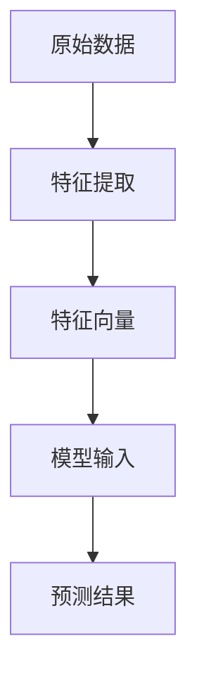
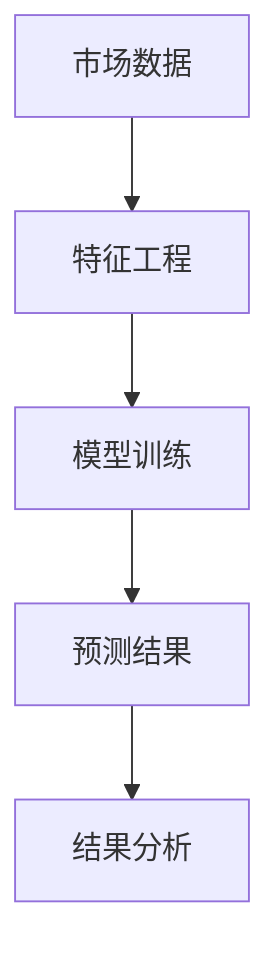
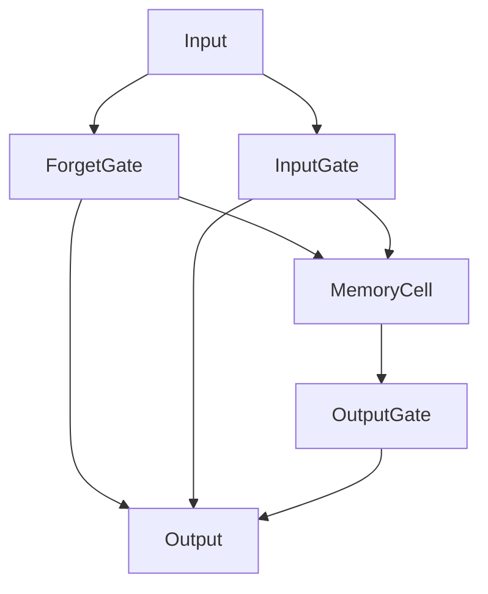
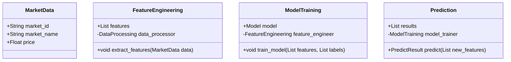
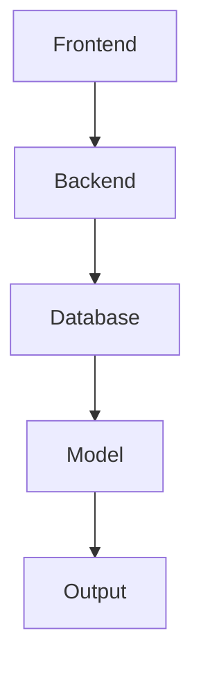
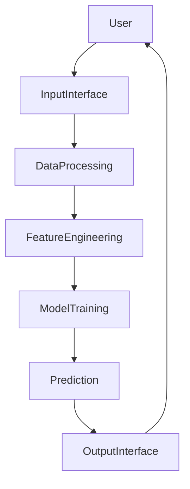

                 


# AI驱动的市场趋势预测模型开发

## 关键词：AI, 市场趋势预测, 机器学习, 深度学习, 时间序列分析

## 摘要：  
本文将从背景、核心概念、算法原理、系统架构到项目实战，全面解析AI在市场趋势预测中的应用。通过详细阐述AI驱动模型的开发流程，帮助读者理解市场趋势预测的关键技术与实际应用。本文将结合具体案例，深入探讨如何利用AI技术构建高效、准确的市场趋势预测模型。

---

# 第1章: 市场趋势预测与AI驱动模型概述

## 1.1 市场趋势预测的背景与意义

### 1.1.1 市场趋势预测的定义与作用  
市场趋势预测是指通过分析历史数据和当前市场信息，预测未来市场走势的过程。它在商业决策、投资策略、供应链管理等领域具有重要作用。传统的市场趋势预测方法依赖于人工分析，存在效率低、准确性差的问题。而AI技术的引入，极大地提高了预测的准确性和效率。

### 1.1.2 AI技术在市场趋势预测中的应用价值  
AI技术通过大数据分析和机器学习算法，能够捕捉市场数据中的复杂模式和潜在规律。与传统方法相比，AI驱动的市场趋势预测模型具有以下优势：  
1. 高效性：AI能够快速处理海量数据，提供实时预测。  
2. 准确性：通过复杂的算法，AI能够发现数据中的非线性关系，提高预测精度。  
3. 自适应性：AI模型能够动态调整，适应市场的变化。  

### 1.1.3 当前市场趋势预测的主要挑战  
尽管AI技术在市场趋势预测中表现出巨大潜力，但仍面临以下挑战：  
1. 数据质量问题：数据的不完整性和噪声会影响预测结果。  
2. 模型选择：不同场景下需要选择合适的算法，这对模型调优提出了较高要求。  
3. 市场不确定性：市场受多种因素影响，预测结果存在不确定性。  

## 1.2 AI驱动模型的核心概念

### 1.2.1 AI驱动模型的基本原理  
AI驱动的市场趋势预测模型通常包括以下步骤：  
1. 数据收集：获取市场相关数据，如价格、成交量、市场情绪等。  
2. 特征提取：从原始数据中提取有用的特征。  
3. 模型训练：利用机器学习或深度学习算法训练模型。  
4. 预测推理：基于训练好的模型，预测未来的市场趋势。  
5. 结果分析：对预测结果进行评估和优化。  

### 1.2.2 数据驱动与模型驱动的对比分析  
数据驱动方法依赖于大量数据，通过算法直接学习数据中的模式；模型驱动方法则基于领域知识，构建数学模型。AI驱动的市场趋势预测模型通常结合两者的优势，既利用数据驱动的灵活性，又结合模型驱动的可解释性。

### 1.2.3 市场趋势预测的关键要素  
市场趋势预测的关键要素包括：  
- 数据质量：数据的完整性和准确性直接影响预测结果。  
- 模型选择：选择适合场景的算法是预测成功的关键。  
- 参数调优：模型性能依赖于参数的优化。  

## 1.3 本章小结  
本章介绍了市场趋势预测的背景、AI驱动模型的核心概念以及当前面临的主要挑战。AI技术的应用为市场趋势预测带来了新的可能性，但同时也需要克服数据质量、模型选择和市场不确定性等挑战。

---

# 第2章: AI驱动市场趋势预测的核心概念与联系

## 2.1 AI驱动模型的核心原理

### 2.1.1 数据流与特征工程  
数据流是指从数据收集、处理到模型输入的整个流程。特征工程是将原始数据转换为适合模型输入的特征，包括特征提取、特征选择和特征变换。  

#### 数据流示意图  


### 2.1.2 模型训练与预测推理  
模型训练是通过优化算法调整模型参数，使其能够准确预测。预测推理是基于训练好的模型，对新数据进行预测的过程。  

### 2.1.3 结果分析与优化调整  
结果分析是对预测结果的准确性和可靠性进行评估，优化调整是根据分析结果进一步优化模型。  

## 2.2 核心概念对比分析

### 2.2.1 数据特征与模型参数对比  
| 特征 | 数据特征 | 模型参数 |
|------|----------|----------|
| 定义 | 数据的属性或特征 | 模型的权重或超参数 |
| 作用 | 描述数据的特性 | 影响模型的预测能力 |
| 示例 | 时间、价格、成交量 | 学习率、正则化系数 |

### 2.2.2 不同模型算法的优劣势分析  
| 算法 | 优势 | 劣势 |
|------|------|------|
| LSTM | 能捕捉时间序列中的长期依赖关系 | 对计算资源要求较高 |
| XGBoost | 鲁棒性强，适合处理缺失值 | � prone to overfitting |
| ARIMA | 适合线性时间序列 | 不适合非线性时间序列 |

### 2.2.3 模型性能评估指标对比  
| 指标 | 定义 | 应用场景 |
|------|------|----------|
| MAE | 平均绝对误差 | 评估模型预测的平均误差 |
| RMSE | 根均方误差 | 评估模型预测的平均误差，考虑误差的平方 |
| R² | 决定系数 | 评估模型的拟合优度 |

## 2.3 实体关系图与数据流图

### 2.3.1 ER实体关系图  


## 2.4 本章小结  
本章详细介绍了AI驱动市场趋势预测的核心概念，包括数据流、特征工程、模型训练和结果分析。通过对比分析，帮助读者理解不同模型算法的优劣势以及性能评估指标的差异。

---

# 第3章: 市场趋势预测模型的算法原理

## 3.1 常见算法原理概述

### 3.1.1 时间序列分析  
时间序列分析是一种通过分析历史数据来预测未来趋势的方法。常用的方法包括ARIMA、LSTM等。

### 3.1.2 机器学习算法  
机器学习算法包括监督学习、无监督学习和强化学习。监督学习常用于分类和回归任务。

### 3.1.3 深度学习算法  
深度学习算法通过多层神经网络提取数据特征，常用于复杂模式识别任务。

## 3.2 LSTM算法原理

### 3.2.1 LSTM的基本结构  
LSTM由遗忘门、输入门和输出门组成，能够捕捉长期依赖关系。

#### LSTM结构示意图  


### 3.2.2 LSTM的遗忘门、输入门与输出门  
- 遗忘门：决定哪些信息需要遗忘。  
- 输入门：决定哪些新信息需要存储。  
- 输出门：决定输出哪些信息。  

### 3.2.3 LSTM在时间序列预测中的应用  
LSTM特别适合处理时间序列数据，能够捕捉数据中的长期依赖关系，常用于股票价格预测和销售预测。

## 3.3 XGBoost算法原理

### 3.3.1 XGBoost的基本原理  
XGBoost是一种基于树的优化算法，通过集成学习提升模型性能。

### 3.3.2 XGBoost的优化策略  
XGBoost通过正则化、学习率和树的深度等参数优化模型，防止过拟合。

### 3.3.3 XGBoost的应用场景  
XGBoost适用于分类、回归和推荐系统等任务。

## 3.4 本章小结  
本章详细介绍了LSTM和XGBoost算法的原理及其在市场趋势预测中的应用。通过对比分析，帮助读者理解不同算法的优劣势。

---

# 第4章: 系统分析与架构设计方案

## 4.1 项目背景介绍  
本项目旨在利用AI技术构建市场趋势预测模型，帮助企业和投资者做出更明智的决策。

## 4.2 项目介绍  
项目目标是开发一个高效、准确的市场趋势预测系统，适用于股票、商品和外汇市场。

## 4.3 系统功能设计  
### 4.3.1 领域模型类图  


## 4.4 系统架构设计  
### 4.4.1 系统架构图  


## 4.5 系统接口设计  
系统接口包括数据输入接口、模型训练接口和预测结果接口。

## 4.6 系统交互流程图  


## 4.7 本章小结  
本章详细介绍了市场趋势预测系统的架构设计，包括功能模块、接口设计和系统交互流程。

---

# 第5章: 项目实战

## 5.1 环境搭建  
### 5.1.1 安装Python和相关库  
安装Python 3.8以上版本，安装numpy、pandas、xgboost和keras库。

## 5.2 系统核心实现源代码  

### 5.2.1 数据收集与预处理  
```python
import pandas as pd
import numpy as np

# 数据收集
data = pd.read_csv('market_data.csv')

# 数据预处理
data['date'] = pd.to_datetime(data['date'])
data.set_index('date', inplace=True)
```

### 5.2.2 特征工程  
```python
from sklearn.preprocessing import StandardScaler

# 特征提取
features = data[['open', 'high', 'low', 'close']]
scaler = StandardScaler()
scaled_features = scaler.fit_transform(features)
```

### 5.2.3 模型训练  
```python
import xgboost as xgb

# 模型训练
model = xgb.XGBRegressor()
model.fit(scaled_features, labels)
```

### 5.2.4 模型评估  
```python
from sklearn.metrics import mean_absolute_error

# 模型评估
y_pred = model.predict(test_features)
mae = mean_absolute_error(test_labels, y_pred)
print(f'MAE: {mae}')
```

## 5.3 代码应用解读与分析  
本节详细解读代码实现，包括数据预处理、特征工程、模型训练和模型评估。

## 5.4 实际案例分析与详细讲解剖析  
通过实际案例，详细分析市场趋势预测模型的开发过程。

## 5.5 项目小结  
本章通过实际案例展示了AI驱动市场趋势预测模型的开发过程，包括环境搭建、数据处理、模型训练和评估。

---

# 第6章: 最佳实践、小结与展望

## 6.1 最佳实践  
### 6.1.1 数据质量的重要性  
确保数据的完整性和准确性是提高模型性能的关键。  

### 6.1.2 模型选择的策略  
根据具体场景选择合适的算法，避免盲目追求复杂模型。  

### 6.1.3 结果验证与优化  
通过交叉验证和网格搜索优化模型参数，提高预测精度。  

## 6.2 小结  
本文从背景、核心概念、算法原理到系统架构和项目实战，全面介绍了AI驱动的市场趋势预测模型开发过程。

## 6.3 展望  
未来，随着AI技术的不断发展，市场趋势预测模型将更加智能化和精准化，为商业决策提供更有力的支持。

---

# 作者：AI天才研究院/AI Genius Institute & 禅与计算机程序设计艺术 /Zen And The Art of Computer Programming

---

通过以上内容，本文详细阐述了AI驱动的市场趋势预测模型开发的全过程，从理论到实践，帮助读者全面掌握相关技术。

