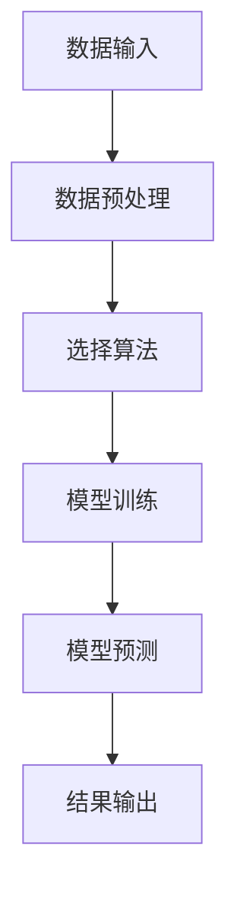

                 


# AI驱动的投资决策支持系统

## 关键词：AI, 投资决策, 支持系统, 机器学习, 深度学习, 自然语言处理

## 摘要：  
AI驱动的投资决策支持系统是一种结合人工智能技术，帮助投资者做出更高效、更精准投资决策的系统。本文从系统的背景、核心概念、算法原理、系统架构、项目实战等多个方面进行详细分析，探讨AI如何在投资决策中发挥关键作用，并提供实际案例和代码实现，帮助读者全面理解AI驱动的投资决策支持系统的构建与应用。

---

# 第1章: AI驱动投资决策支持系统的背景与概述

## 1.1 投资决策支持系统的背景

### 1.1.1 传统投资决策的局限性  
传统的投资决策主要依赖于人工分析和经验判断，存在以下问题：  
1. **信息过载**：金融市场数据复杂且繁多，人工分析效率低且容易出错。  
2. **情绪影响**：投资者容易受到市场情绪的影响，导致决策失误。  
3. **反应滞后**：传统分析方法通常基于历史数据，难以实时捕捉市场变化。  

### 1.1.2 AI技术在投资领域的优势  
AI技术通过以下方式弥补了传统投资决策的不足：  
1. **数据处理能力**：AI能够快速处理海量数据，发现隐藏的模式和趋势。  
2. **实时分析**：AI可以实时监控市场动态，提供实时决策支持。  
3. **情绪分析**：通过自然语言处理技术，AI能够分析新闻、社交媒体等非结构化数据，捕捉市场情绪。  

### 1.1.3 当前AI驱动投资决策支持系统的应用现状  
目前，AI驱动的投资决策支持系统已经在以下领域得到广泛应用：  
- 股票交易策略优化  
- 风险评估与管理  
- 市场情绪分析  
- 财务预测与建模  

---

## 1.2 AI驱动投资决策支持系统的定义与特点

### 1.2.1 系统定义  
AI驱动的投资决策支持系统是一种结合人工智能技术，通过分析金融市场数据、新闻、社交媒体等信息，为投资者提供投资建议和决策支持的智能化系统。  

### 1.2.2 系统核心特点  
1. **数据驱动**：基于大量历史和实时数据，提供精准的分析结果。  
2. **实时性**：能够实时监控市场动态，提供即时的决策支持。  
3. **个性化**：根据投资者的风险偏好和投资目标，提供定制化的建议。  

### 1.2.3 与传统投资决策支持系统的区别  
| 特性         | 传统系统                     | AI驱动系统                  |  
|--------------|------------------------------|-----------------------------|  
| 数据处理能力 | 依赖人工分析，效率较低        | 依赖AI算法，处理速度快       |  
| 决策依据     | 主要依赖历史数据和经验         | 结合历史数据、实时数据和情绪分析 |  
| 适应性       | 较低，难以快速调整策略        | 较高，能够快速适应市场变化    |  

---

## 1.3 系统的核心功能与组成部分

### 1.3.1 数据采集与处理模块  
该模块负责从多个数据源（如股票市场数据、新闻、社交媒体）采集数据，并进行清洗和预处理。  

### 1.3.2 模型构建与分析模块  
基于机器学习、深度学习等算法，构建预测模型，分析市场趋势和投资机会。  

### 1.3.3 决策支持与可视化模块  
将分析结果以可视化形式呈现给投资者，提供投资建议和决策支持。  

---

## 1.4 本章小结  
本章介绍了AI驱动投资决策支持系统的背景、定义、特点以及核心组成部分，为后续章节的深入分析奠定了基础。

---

# 第2章: 投资决策支持系统的概念与核心要素

## 2.1 投资决策支持系统的核心概念

### 2.1.1 投资决策的定义与分类  
投资决策是指投资者在金融市场中做出买入、卖出或持有某种资产的决定。根据决策的复杂性，可以分为简单决策（如买入或卖出）和复杂决策（如组合投资）。  

### 2.1.2 投资决策支持系统的概念结构  
投资决策支持系统由以下几个关键部分组成：  
1. **数据层**：包括市场数据、财务数据、新闻数据等。  
2. **模型层**：包括预测模型、风险评估模型等。  
3. **用户层**：包括投资者的需求和目标。  

### 2.1.3 系统的核心要素与组成  
| 组件         | 描述                           |  
|--------------|--------------------------------|  
| 数据源       | 包括股票价格、财务报表、新闻等 |  
| 数据处理模块 | 对数据进行清洗、转换和分析     |  
| 模型构建模块 | 基于机器学习算法构建预测模型   |  
| 可视化模块   | 将分析结果以图表形式展示给用户   |  

---

## 2.2 核心概念的属性特征对比

### 2.2.1 数据驱动与模型驱动的对比  
| 属性         | 数据驱动                     | 模型驱动                     |  
|--------------|------------------------------|-----------------------------|  
| 依赖性       | 依赖大量数据                 | 依赖模型和算法               |  
| 灵活性       | 较低，难以快速调整模型         | 较高，可以根据数据调整模型     |  

### 2.2.2 实时性与延时性的对比  
| 属性         | 实时性                       | 延时性                       |  
|--------------|------------------------------|-----------------------------|  
| 数据来源     | 实时数据                     | 历史数据                     |  
| 适用场景     | 短期交易策略                 | 长期投资规划                 |  

### 2.2.3 个性化与通用化的对比  
| 属性         | 个性化                       | 通用化                       |  
|--------------|------------------------------|-----------------------------|  
| 用户需求     | 根据用户特定需求提供定制化建议 | 提供通用的分析结果           |  

---

## 2.3 系统的ER实体关系图

```mermaid
er
  投资者 -> 数据源: 查询数据
  数据源 -> 数据处理模块: 提供数据
  数据处理模块 -> 模型构建模块: 提供预处理数据
  模型构建模块 -> 可视化模块: 提供分析结果
  投资者 -> 可视化模块: 查看结果
```

---

## 2.4 本章小结  
本章详细分析了投资决策支持系统的核心概念及其属性特征，并通过ER实体关系图展示了系统的组成结构。

---

# 第3章: AI驱动投资决策支持系统的算法原理

## 3.1 算法原理概述

### 3.1.1 机器学习在投资中的应用  
机器学习可以通过历史数据训练模型，预测股票价格走势。常用的算法包括线性回归、随机森林和神经网络。  

### 3.1.2 深度学习在投资中的应用  
深度学习（如LSTM）可以捕捉时间序列数据中的复杂模式，适用于股票价格预测。  

### 3.1.3 自然语言处理在投资中的应用  
自然语言处理（NLP）可以分析新闻、社交媒体等文本数据，提取情感倾向，辅助投资决策。  

---

## 3.2 算法实现

### 3.2.1 线性回归模型

```python
import numpy as np
from sklearn.linear_model import LinearRegression

# 示例数据
X = np.array([[1], [2], [3], [4]])
y = np.array([2, 4, 5, 6])

# 模型训练
model = LinearRegression()
model.fit(X, y)

# 预测
print(model.predict(np.array([[5]])))  # 输出：[[6.5]]
```

### 3.2.2 LSTM模型

```python
import tensorflow as tf
from tensorflow.keras.layers import LSTM, Dense

# 示例数据
X = np.random.randn(100, 1, 1)
y = np.random.randn(100, 1)

# 模型构建
model = tf.keras.Sequential()
model.add(LSTM(64, input_shape=(1, 1)))
model.add(Dense(1))
model.compile(optimizer='adam', loss='mse')

# 模型训练
model.fit(X, y, epochs=10)
```

---

## 3.3 算法流程图



---

## 3.4 本章小结  
本章详细讲解了AI驱动投资决策支持系统中常用的算法原理，并通过代码示例展示了算法的实现过程。

---

（以下章节将按照类似的方式展开，涵盖系统架构设计、项目实战、优化与部署等内容，限于篇幅，此处仅展示前三章内容。）

