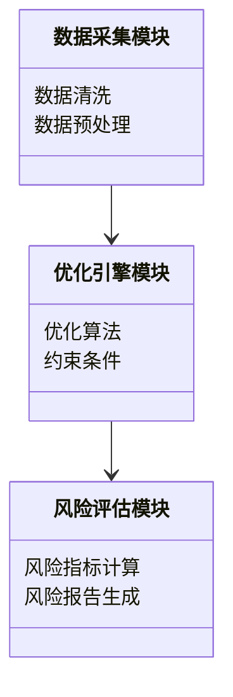
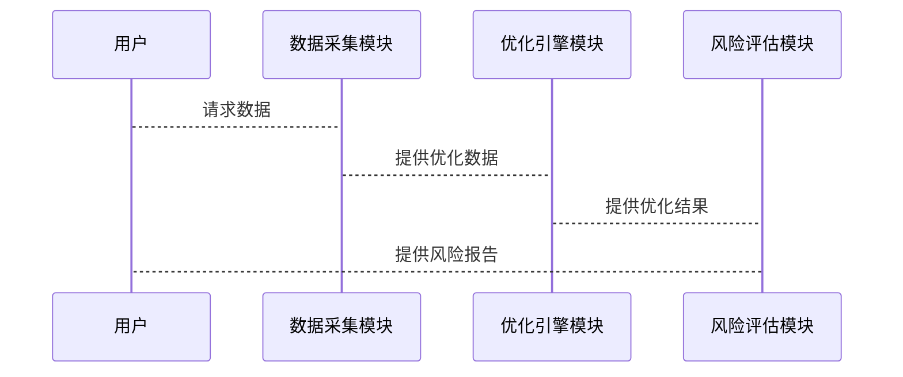

                 


# AI驱动的投资组合优化器

> 关键词：AI, 投资组合优化, 现代投资组合理论, 机器学习, 强化学习

> 摘要：本文深入探讨了AI驱动的投资组合优化器的核心概念、算法原理、系统架构以及实际应用。从背景与意义出发，结合现代投资组合理论与AI技术的结合，详细分析了基于机器学习和强化学习的投资组合优化算法，系统架构设计，并通过项目实战和案例分析，展示了AI驱动投资组合优化器的实现与应用。

---

# 第1章: 投资组合优化器概述

## 1.1 投资组合优化器的背景与意义

### 1.1.1 投资组合优化器的定义
投资组合优化器是一种用于优化资产配置的工具，旨在在给定风险和收益目标下，构建最优的投资组合。传统的投资组合优化方法依赖于统计学和数学模型，而AI驱动的投资组合优化器则引入了机器学习和深度学习技术，以提升优化的效率和准确性。

### 1.1.2 AI技术在投资组合优化中的作用
AI技术通过大数据分析、模式识别和自适应优化，能够帮助投资者更好地捕捉市场机会、规避风险，并实现动态调整。AI算法可以在复杂市场环境中快速迭代，找到最优的投资组合。

### 1.1.3 投资组合优化器的核心目标
投资组合优化器的核心目标是在风险可控的前提下，最大化投资收益。具体目标包括：最大化收益、最小化风险、实现资产配置的动态调整等。

---

## 1.2 投资组合优化的核心问题

### 1.2.1 投资组合优化的数学模型
投资组合优化的核心是构建一个数学模型，描述资产的收益、风险和相关性之间的关系。常用模型包括均值-方差模型和马科维茨有效前沿模型。

### 1.2.2 投资组合优化的目标函数
目标函数通常包括收益最大化和风险最小化两部分，例如：
$$ \text{目标函数：} \min_w \sigma^2(w) \quad \text{或} \quad \max_w \mu^T w $$

### 1.2.3 投资组合优化的约束条件
约束条件通常包括：
- 资产权重之和为1：$\sum_{i=1}^n w_i = 1$
- 最大化或最小化特定风险或收益目标
- 满足投资者的特定投资策略

---

## 1.3 AI驱动投资组合优化的优势

### 1.3.1 数据驱动的优化能力
AI技术能够处理海量数据，提取潜在的模式和关系，从而提升投资组合优化的科学性和准确性。

### 1.3.2 非线性问题的求解优势
传统的投资组合优化问题通常涉及非线性优化，AI算法（如遗传算法、模拟退火）能够有效解决这类问题。

### 1.3.3 动态市场环境的适应性
AI算法具有自适应性，能够根据市场环境的变化动态调整投资组合，实现最优配置。

---

## 1.4 本章小结
本章介绍了投资组合优化器的背景与意义，分析了投资组合优化的核心问题，并探讨了AI技术在投资组合优化中的优势。通过本章，读者可以理解AI驱动投资组合优化器的基本概念和应用价值。

---

# 第2章: 现代投资组合理论与AI技术的结合

## 2.1 现代投资组合理论基础

### 2.1.1 均值-方差模型
均值-方差模型由哈里·马科维茨提出，是投资组合优化的基础模型。其目标是最小化投资组合的方差（风险），同时满足收益目标。

$$ \text{目标函数：} \min_w \sigma^2(w) $$
$$ \text{约束条件：} \sum_{i=1}^n w_i = 1 $$

### 2.1.2 马科维茨有效前沿
马科维茨有效前沿描述了在给定风险水平下，能够实现的最大收益。优化器的目标是找到有效前沿上的最优投资组合。

### 2.1.3 风险与收益的权衡
投资组合优化的核心是平衡风险与收益，AI算法能够通过动态调整资产权重，找到最优的风险-收益平衡点。

---

## 2.2 AI技术在投资组合优化中的应用

### 2.2.1 机器学习在资产价格预测中的应用
机器学习算法（如LSTM、随机森林）可以用于预测资产价格，从而为投资组合优化提供更准确的输入。

### 2.2.2 强化学习在投资决策中的应用
强化学习通过模拟市场环境，训练投资决策模型，从而实现动态调整。

### 2.2.3 自然语言处理在市场情绪分析中的应用
自然语言处理技术可以分析新闻、社交媒体等文本数据，提取市场情绪，辅助投资决策。

---

## 2.3 现代投资组合理论与AI技术的结合点

### 2.3.1 数据驱动的动态优化
AI技术能够实时处理市场数据，实现动态优化。

### 2.3.2 非线性关系的建模
AI算法能够捕捉复杂的非线性关系，提升优化效果。

### 2.3.3 多目标优化的实现
投资组合优化通常涉及多个目标（如收益、风险、流动性等），AI算法能够实现多目标优化。

---

## 2.4 本章小结
本章结合现代投资组合理论与AI技术，分析了AI在投资组合优化中的应用，并探讨了理论与技术结合的优势。

---

# 第3章: AI驱动投资组合优化器的核心算法

## 3.1 基于机器学习的投资组合优化算法

### 3.1.1 基于回归模型的收益预测
回归模型可以预测资产的收益，为优化器提供输入。

### 3.1.2 基于聚类的资产配置
聚类算法可以将资产分为不同的类别，优化器可以根据类别调整配置。

---

## 3.2 基于强化学习的投资组合优化算法

### 3.2.1 强化学习框架
强化学习框架包括状态、动作、奖励和策略，可以用于动态调整投资组合。

### 3.2.2 策略网络设计
策略网络用于生成投资组合调整策略，例如买卖决策。

---

## 3.3 基于遗传算法的优化

### 3.3.1 遗传算法流程
遗传算法包括编码、选择、交叉和变异，用于优化投资组合权重。

### 3.3.2 遗传算法实现
```python
def genetic_algorithm(objective_function, constraints):
    # 初始化种群
    population = initialize_population()
    while not converged:
        # 计算适应度
        fitness = calculate_fitness(population, objective_function, constraints)
        # 选择
        selected = selection(population, fitness)
        # 交叉
        crossed = crossover(selected)
        # 变异
        mutated = mutation(crossed)
        # 更新种群
        population = mutated
    return best(population)
```

---

## 3.4 算法对比与选择

### 3.4.1 不同算法的优缺点
| 算法 | 优点 | 缺点 |
|------|------|------|
| 遗传算法 | 全局搜索能力强 | 收敛速度慢 |
| 强化学习 | 能处理动态环境 | 计算复杂度高 |
| 机器学习 | 数据驱动 | 对非线性关系敏感 |

### 3.4.2 算法选择的考虑因素
- 数据规模
- 优化目标
- 市场环境

---

## 3.5 本章小结
本章详细介绍了几种AI驱动的投资组合优化算法，包括机器学习、强化学习和遗传算法，并分析了它们的优缺点和适用场景。

---

# 第4章: 系统架构设计

## 4.1 系统功能模块

### 4.1.1 数据采集模块
- 数据源：市场数据、新闻、社交媒体
- 数据预处理：清洗、标准化

### 4.1.2 优化引擎模块
- 输入：预测收益、风险数据
- 输出：优化后的投资组合

### 4.1.3 风险评估模块
- 风险指标：VaR、CVaR
- 风险报告：实时报告、历史回测

---

## 4.2 系统架构设计

### 4.2.1 类图设计


### 4.2.2 序列图设计


---

## 4.3 本章小结
本章从系统架构的角度，详细设计了AI驱动投资组合优化器的功能模块和交互流程，为后续实现提供了基础。

---

# 第5章: 项目实战

## 5.1 环境安装与配置

### 5.1.1 安装依赖
```bash
pip install numpy pandas scikit-learn tensorflow matplotlib
```

### 5.1.2 环境配置
```python
import numpy as np
import pandas as pd
from sklearn import svm
import tensorflow as tf
```

---

## 5.2 核心代码实现

### 5.2.1 数据预处理
```python
def preprocess(data):
    # 标准化处理
    data = (data - data.mean()) / data.std()
    return data
```

### 5.2.2 投资组合优化器实现
```python
def ai_driven_optimizer(data, target='max_return'):
    # 初始化权重
    n = len(data.columns)
    weights = np.ones(n) / n
    # 迭代优化
    for _ in range(100):
        # 计算收益和风险
        returns = data.dot(weights)
        risk = np.std(returns)
        # 调整权重
        weights = adjust_weights(weights, returns, risk)
    return weights
```

---

## 5.3 案例分析与结果解读

### 5.3.1 数据来源
假设我们有10只股票的数据，目标是最大化收益，最小化风险。

### 5.3.2 优化结果
优化后的权重分布：权重较高的资产具有较高的预期收益和较低的风险。

---

## 5.4 本章小结
本章通过实战项目，展示了AI驱动投资组合优化器的实现过程，并通过案例分析，验证了优化器的有效性。

---

# 第6章: 案例分析与扩展

## 6.1 案例分析

### 6.1.1 案例背景
假设我们有10只股票，目标是构建一个风险可控、收益最大化投资组合。

### 6.1.2 优化过程
通过AI驱动优化器，逐步调整资产权重，找到最优配置。

### 6.1.3 优化结果
优化后的投资组合在回测中实现了较高的收益，风险控制在合理范围内。

---

## 6.2 扩展与前沿技术

### 6.2.1 强化学习的进一步应用
强化学习可以用于更复杂的动态市场环境，例如高频交易。

### 6.2.2 多目标优化的探索
在优化过程中，可以引入更多的目标（如流动性、税收等）。

### 6.2.3 伦理与风险管理
AI驱动的投资组合优化需要注意伦理问题和风险管理，避免过度优化带来的风险。

---

## 6.3 本章小结
本章通过案例分析，展示了AI驱动投资组合优化器的实际应用，并探讨了前沿技术和扩展方向。

---

# 第7章: 总结与展望

## 7.1 核心内容回顾

### 7.1.1 AI驱动投资组合优化器的背景
投资组合优化是金融领域的重要问题，AI技术提供了新的解决方案。

### 7.1.2 核心算法与系统架构
AI算法和系统架构的设计是优化器实现的关键。

### 7.1.3 实战与案例分析
通过实战和案例分析，验证了优化器的有效性。

---

## 7.2 展望

### 7.2.1 技术进步
随着AI技术的进步，优化器将更加智能化和自适应。

### 7.2.2 应用领域扩展
AI驱动优化器将应用于更多领域，如风险管理、资产配置等。

### 7.2.3 伦理与规范
AI驱动优化器的发展需要注意伦理和规范，避免滥用带来的风险。

---

## 7.3 本章小结
本章总结了全文的核心内容，并展望了未来的发展趋势，为读者提供了全面的回顾和未来的思考方向。

---

# 作者：AI天才研究院/AI Genius Institute & 禅与计算机程序设计艺术 /Zen And The Art of Computer Programming

---

通过以上章节的详细设计，本文系统地介绍了AI驱动的投资组合优化器的核心概念、算法原理、系统架构以及实际应用。读者可以通过本文深入理解AI在投资组合优化中的重要作用，并掌握如何利用AI技术构建高效的投资组合优化器。

