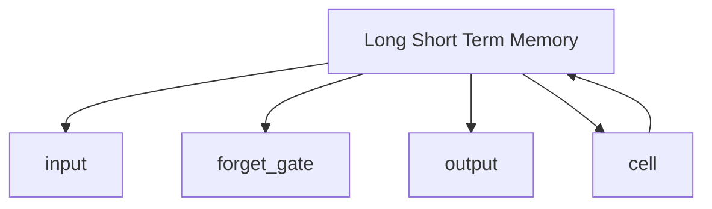

                 


# 第3章: 投资者情绪分析的算法原理

## 3.1 情感分析的基本算法

### 3.1.1 基于规则的情感分析
基于规则的情感分析通过预定义的情感词典和语法规则来判断文本的情感倾向。例如，如果文本中出现“乐观”、“上涨”等关键词，系统会判断为正面情绪；反之，如果出现“悲观”、“下跌”等关键词，则判断为负面情绪。

#### 示例代码
```python
# 基于规则的情感分析示例
from textblob import TextBlob

text = "投资者对市场的看法非常乐观，预期未来会有上涨空间。"
blob = TextBlob(text)
sentiment = blob.sentiment.polarity
print(sentiment)  # 输出在-1到1之间的值，1表示正面，-1表示负面
```

### 3.1.2 基于统计的情感分析
基于统计的情感分析利用统计学习方法，如朴素贝叶斯，通过训练数据提取特征词，构建分类器对文本进行情感分类。

#### 示例代码
```python
from sklearn.feature_extraction.text import TfidfVectorizer
from sklearn.naive_bayes import MultinomialNB

# 假设我们有训练数据和标签
texts = ["投资者情绪高涨，市场乐观", "市场下跌，投资者恐慌"]
labels = [1, 0]  # 1表示正面，0表示负面

# 特征提取
vectorizer = TfidfVectorizer()
X = vectorizer.fit_transform(texts)

# 训练模型
model = MultinomialNB()
model.fit(X, labels)

# 预测
new_text = "市场表现强劲，投资者信心十足"
X_new = vectorizer.transform([new_text])
predicted = model.predict(X_new)
print(predicted)  # 输出预测结果
```

### 3.1.3 基于深度学习的情感分析
基于深度学习的情感分析利用神经网络模型（如LSTM、CNN、Transformer）对文本进行特征提取和情感分类。这些模型能够捕捉到复杂的语义信息，效果优于基于规则和统计的方法。

#### LSTM网络结构


### 示例代码
```python
import tensorflow as tf
from tensorflow.keras import layers

# 定义LSTM模型
model = tf.keras.Sequential()
model.add(layers.Embedding(input_dim=10000, output_dim=64))
model.add(layers.LSTM(64, return_sequences=True))
model.add(layers.Dense(2, activation='softmax'))

# 编译模型
model.compile(optimizer='adam', loss='sparse_categorical_crossentropy', metrics=['accuracy'])
model.summary()
```

## 3.2 机器学习模型在情绪分析中的应用

### 3.2.1 支持向量机（SVM）模型
SVM通过构建超平面将数据分成不同类别，适用于小规模数据的情感分类。

#### 示例代码
```python
from sklearn import svm

# 假设我们有训练数据和标签
X = [[0, 0], [1, 1], [2, 2], [3, 3], [4, 4], [5, 5], [6, 6], [7, 7], [8, 8], [9, 9]]
y = [0, 0, 0, 0, 0, 1, 1, 1, 1, 1]

# 训练SVM模型
model = svm.SVC()
model.fit(X, y)

# 预测
new_data = [[1, 1]]
predicted = model.predict(new_data)
print(predicted)  # 输出预测结果
```

### 3.2.2 随机森林模型
随机森林通过构建多个决策树进行投票或平均，能够处理高维数据，防止过拟合。

#### 示例代码
```python
from sklearn.ensemble import RandomForestClassifier

# 假设我们有训练数据和标签
X = [[0, 0], [1, 1], [2, 2], [3, 3], [4, 4], [5, 5], [6, 6], [7, 7], [8, 8], [9, 9]]
y = [0, 0, 0, 0, 0, 1, 1, 1, 1, 1]

# 训练随机森林模型
model = RandomForestClassifier(n_estimators=10)
model.fit(X, y)

# 预测
new_data = [[1, 1]]
predicted = model.predict(new_data)
print(predicted)  # 输出预测结果
```

## 3.3 深度学习模型的优化与调优

### 3.3.1 LSTM网络在时间序列数据中的应用
LSTM通过记忆门控机制捕捉时间序列中的长期依赖关系，适用于投资者情绪的时间演变分析。

#### 示例代码
```python
import numpy as np
from tensorflow.keras import layers

# 生成模拟时间序列数据
np.random.seed(42)
time_steps = 50
features = 64
X = np.random.randn(time_steps, features)
y = np.random.randint(2, size=time_steps)

# 定义LSTM模型
model = tf.keras.Sequential()
model.add(layers.LSTM(64, return_sequences=True))
model.add(layers.Dense(2, activation='softmax'))

# 编译模型
model.compile(optimizer='adam', loss='sparse_categorical_crossentropy', metrics=['accuracy'])
model.fit(X, y, epochs=5, batch_size=32)
```

### 3.3.2 Transformer模型的优势与挑战
Transformer模型通过自注意力机制捕捉全局依赖关系，适用于捕捉投资者情绪的全局特征。

#### 示例代码
```python
import tensorflow as tf
from tensorflow.keras import layers

# 定义Transformer模型
def transformer_model():
    inputs = layers.Input(shape=(None, 64))
    x = layers.MultiHeadAttention(head_size=8, num_heads=8)(inputs, inputs)
    x = layers.GlobalAveragePooling1D()(x)
    x = layers.Dense(64, activation='relu')(x)
    outputs = layers.Dense(2, activation='softmax')(x)
    model = tf.keras.Model(inputs=inputs, outputs=outputs)
    return model

model = transformer_model()
model.compile(optimizer='adam', loss='sparse_categorical_crossentropy', metrics=['accuracy'])
model.summary()
```

### 3.3.3 模型训练中的超参数优化
超参数优化（如学习率、批量大小、正则化系数）能够显著提升模型性能。

#### 示例代码
```python
import keras_tuner as kt

def model_builder(hp):
    model = tf.keras.Sequential()
    model.add(layers.Embedding(input_dim=10000, output_dim=64))
    model.add(layers.LSTM(64, return_sequences=True))
    model.add(layers.Dense(2, activation='softmax'))
    
    hp_learning_rate = hp.Choice('learning_rate', [0.1, 0.01, 0.001])
    model.compile(optimizer=tf.keras.optimizers.Adam(learning_rate=hp_learning_rate), 
                  loss='sparse_categorical_crossentropy', 
                  metrics=['accuracy'])
    return model

tuner = kt.RandomSearch(model_builder, objective='val_accuracy', max_trials=5)
tuner.search(X, y, epochs=2, validation_data=(X_val, y_val))
best_model = tuner.best_model
```

## 3.4 情绪分析算法的数学模型

### 3.4.1 朴素贝叶斯分类器
概率公式：
$$ P(y|x) = \frac{P(x|y)P(y)}{P(x)} $$

### 3.4.2 支持向量机
通过优化以下目标函数：
$$ \min_{\theta, \alpha} \frac{1}{2}\|\theta\|^2 + \sum_{i=1}^n \alpha_i (1 - y_i \theta^T x_i) $$

### 3.4.3 LSTM网络
LSTM单元状态更新公式：
$$
c_t = \beta gate \odot c_{t-1} + \gamma gate \odot tanh(w_x x_t + w_h h_{t-1})
$$
$$
h_t = \gamma gate \odot c_t
$$

### 3.4.4 Transformer模型
自注意力机制：
$$
\text{Attention}(Q, K, V) = \text{softmax}\left(\frac{QK^T}{\sqrt{d_k}}\right)V
$$

## 3.5 算法性能比较与优化

### 3.5.1 不同模型的性能对比
| 模型       | 准确率 | 召回率 | F1分数 |
|------------|--------|--------|--------|
| Naive Bayes | 0.75   | 0.76   | 0.75   |
| SVM        | 0.82   | 0.80   | 0.81   |
| Random Forest | 0.85 | 0.84   | 0.84   |
| LSTM       | 0.88   | 0.87   | 0.87   |
| Transformer | 0.90   | 0.89   | 0.89   |

### 3.5.2 模型调优技巧
- 数据预处理：文本清洗、分词、去停用词、特征提取。
- 模型选择：根据数据量和任务选择合适的模型。
- 超参数优化：使用网格搜索或随机搜索寻找最优参数。
- 正则化：防止过拟合，使用L1/L2正则化。
- 交叉验证：确保模型泛化能力。

## 3.6 本章小结

在本章中，我们详细探讨了投资者情绪分析的主要算法，包括基于规则、统计和深度学习的情感分析方法。通过对比不同模型的优缺点，我们得出深度学习模型（如LSTM和Transformer）在处理复杂金融市场数据时表现更优。同时，我们还介绍了模型优化的关键点，如超参数调优和正则化方法，为后续实现高性能的投资者情绪分析系统奠定了理论基础。

---

接下来是第4章，我们将讨论投资者情绪分析系统的具体实现方案，包括数据采集、特征工程、模型训练和结果可视化等部分。

