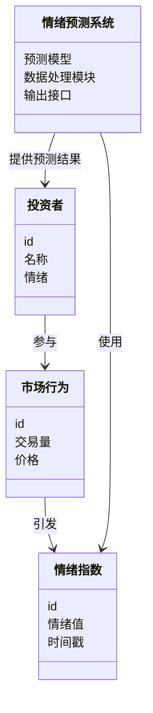

                 


# AI驱动的投资者情绪指数预测系统

---

## 关键词：AI, 投资者情绪, 情绪指数, 金融预测, 机器学习

---

## 摘要：本文详细探讨了利用人工智能技术预测投资者情绪指数的系统设计与实现。从背景、核心概念、算法原理到系统架构和项目实战，文章全面解析了AI在投资者情绪预测中的应用，并通过具体案例展示了系统的实际效果。文章内容涵盖了情感分析模型、时间序列预测、系统架构设计等多个方面，为读者提供了从理论到实践的完整指南。

---

## 第1章: 投资者情绪指数与AI预测的背景

### 1.1 投资者情绪的基本概念

#### 1.1.1 投资者情绪的定义与特征

投资者情绪（Investor Sentiment）是指市场参与者（包括个人投资者和机构投资者）对市场未来走势的心理预期和态度。情绪指数是对这种情绪的量化表示，通常通过调查、市场数据或自然语言处理技术来获取。

- **定义**：投资者情绪指数反映了市场参与者的乐观或悲观情绪，是影响市场价格波动的重要因素。
- **特征**：
  - 时间依赖性：情绪会随市场波动而变化。
  - 主观性：情绪基于个体或集体的感知，而非事实。
  - 波动性：情绪在短时间内可能剧烈波动。

#### 1.1.2 投资者情绪对市场的影响

投资者情绪是市场行为的重要驱动力，情绪高涨可能导致市场上涨，而情绪低落则可能导致市场下跌。情绪指数可以帮助预测市场的短期波动，但不能完全决定市场的长期走势。

#### 1.1.3 情绪指数在金融分析中的作用

情绪指数在金融分析中主要用于以下方面：
1. **短期预测**：帮助投资者预测市场的短期波动。
2. **风险控制**：通过情绪指数识别市场风险，制定相应的投资策略。
3. **信号生成**：将情绪指数与其他指标结合，生成交易信号。

#### 1.1.4 情绪指数的局限性

尽管情绪指数在金融分析中有重要作用，但也存在一些局限性：
- 情绪指数无法预测市场的长期趋势。
- 情绪数据可能存在延迟，影响实时交易的决策。
- 情绪指数受数据来源和采集方法的影响，可能导致偏差。

#### 1.1.5 情绪指数的应用场景

投资者情绪指数在以下场景中具有重要作用：
1. **高频交易**：通过实时情绪数据捕捉市场波动。
2. **投资组合管理**：根据情绪指数调整投资策略。
3. **市场研究**：分析市场情绪的变化趋势。

### 1.2 AI技术在金融领域的应用背景

#### 1.2.1 金融数据分析的复杂性

金融市场数据具有高度的复杂性和不确定性，传统的统计方法难以有效捕捉市场的动态变化。AI技术的引入为金融数据分析提供了新的可能性。

#### 1.2.2 AI技术在金融预测中的优势

AI技术在金融预测中的优势主要体现在以下几个方面：
- **数据处理能力**：AI可以处理海量的非结构化数据，如新闻、社交媒体评论等。
- **模式识别**：AI能够识别数据中的复杂模式，发现潜在的市场信号。
- **实时性**：AI技术可以实时处理数据，提供实时预测。

#### 1.2.3 情绪预测的AI驱动需求

随着金融市场对实时数据的需求增加，AI驱动的情绪预测技术能够快速捕捉市场情绪变化，为投资者提供及时的决策支持。

### 1.3 问题背景与目标

#### 1.3.1 投资者情绪指数预测的必要性

投资者情绪指数是金融市场的重要指标，但传统的情绪指数采集方法存在效率低、成本高的问题。AI技术的应用可以提高情绪指数的采集效率和准确性。

#### 1.3.2 当前情绪分析的挑战

当前情绪分析面临以下挑战：
- 数据质量：非结构化数据可能存在噪声。
- 情绪极性判断：复杂的情感表达难以准确分类。
- 数据实时性：需要实时处理大量数据。

#### 1.3.3 AI驱动预测的目标与边界

AI驱动的投资者情绪指数预测系统的目标是通过自然语言处理和机器学习技术，实时捕捉市场情绪变化，提供准确的情绪指数预测。系统的边界包括数据采集范围、预测时间范围以及预测精度。

---

## 第2章: 核心概念与联系

### 2.1 投资者情绪指数的定义与属性

#### 2.1.1 情绪指数的核心要素

投资者情绪指数的核心要素包括：
1. **数据来源**：新闻、社交媒体、市场评论等。
2. **情绪分类**：通常分为积极、消极和中性三种。
3. **时间维度**：包括实时情绪、短期情绪和长期情绪。

#### 2.1.2 不同情绪指数的对比分析

常见的投资者情绪指数包括：
1. **恐慌指数（VIX）**：反映市场波动性的指数。
2. **投资者信心指数（CCI）**：衡量投资者对未来市场的信心。
3. **市场情绪指数（MCSI）**：综合反映市场参与者的乐观或悲观情绪。

| 指数名称 | 数据来源 | 计算方法 | 主要用途 |
|----------|----------|----------|----------|
| VIX      | 期权市场波动率 | 基于期权价格计算 | 衡量市场波动性 |
| CCI      | 投资者调查 | 调查结果加权平均 | 衡量投资者信心 |
| MCSI     | 社交媒体分析 | 自然语言处理 + 统计分析 | 综合反映市场情绪 |

#### 2.1.3 情绪指数与市场行为的关系

市场行为是投资者情绪的外在表现，情绪指数可以通过市场行为数据进行推断。例如，市场的成交量、股价波动率等都可以反映投资者情绪的变化。

### 2.2 AI驱动情绪预测的核心原理

#### 2.2.1 自然语言处理在情绪分析中的应用

自然语言处理（NLP）技术在情绪分析中的应用包括：
1. **文本分类**：将文本分为积极、消极或中性。
2. **情感强度分析**：量化文本中情绪的强度。
3. **实体识别**：识别文本中的相关实体，如公司名称、行业等。

#### 2.2.2 机器学习模型的特征提取

机器学习模型需要从文本中提取有用的特征，常见的特征提取方法包括：
1. **词袋模型（Bag of Words）**：将文本表示为词汇的集合。
2. **TF-IDF**：计算词汇的重要性。
3. **词嵌入（Word Embedding）**：将词汇表示为低维向量。

#### 2.2.3 情绪预测的数学模型框架

情绪预测的数学模型通常包括以下几个步骤：
1. **数据预处理**：清洗数据，提取特征。
2. **模型训练**：使用训练数据训练模型。
3. **模型预测**：对新的数据进行情绪分类。

### 2.3 实体关系与系统架构

#### 2.3.1 投资者、市场行为、情绪指数的ER图

以下是一个简单的实体关系图：

```mermaid
erDiagram
    投资者 {
        id
        名称
        情绪
    }
    市场行为 {
        id
        交易量
        价格
    }
    情绪指数 {
        id
        情绪值
        时间戳
    }
    投资者 --> 市场行为 : 参与
    市场行为 --> 情绪指数 : 引发
```

#### 2.3.2 系统实体关系的Mermaid图

以下是一个系统的类图：



---

## 第3章: 情绪分析算法原理

### 3.1 情感分析模型概述

#### 3.1.1 基于规则的情感分析

基于规则的情感分析通过预定义的规则对文本进行分类。例如，如果文本中包含“上涨”、“利好”等词汇，则判断为积极情绪。

#### 3.1.2 统计学习模型（如SVM、Naive Bayes）

统计学习模型通过训练数据学习特征的概率分布，常见的模型包括支持向量机（SVM）和朴素贝叶斯（Naive Bayes）。

#### 3.1.3 深度学习模型（如BERT、GPT）

深度学习模型通过多层神经网络结构自动学习特征，常见的模型包括BERT和GPT。

### 3.2 基于Transformer的文本编码

#### 3.2.1 Transformer模型的基本结构

Transformer模型由编码器和解码器组成，每个编码器由多头自注意力机制和前馈网络组成。

#### 3.2.2 自注意力机制的数学公式

自注意力机制的计算公式如下：

$$
\text{Attention}(Q, K, V) = \text{softmax}\left(\frac{QK^T}{\sqrt{d_k}}\right)V
$$

其中，$Q$、$K$、$V$分别为查询、键和值向量，$d_k$为键的维度。

#### 3.2.3 编码器-解码器结构的应用

编码器-解码器结构用于将输入文本映射到情绪类别。编码器将输入文本编码为向量，解码器根据编码向量生成情绪类别。

### 3.3 情绪预测的分类算法

#### 3.3.1 二分类与多分类任务

情绪预测通常是一个多分类任务，包括积极、消极和中性三种情绪。

#### 3.3.2 基于CNN的情感分类

卷积神经网络（CNN）通过卷积操作提取局部特征，适用于短文本的情感分类。

#### 3.3.3 基于RNN的时间序列分析

循环神经网络（RNN）适用于长文本的情感分类，能够捕捉文本的时序信息。

---

## 第4章: 数学模型与公式解析

### 4.1 特征工程与数据预处理

#### 4.1.1 文本数据的向量化表示

文本数据可以通过词袋模型、TF-IDF和词嵌入进行向量化表示。

#### 4.1.2 基于TF-IDF的特征提取

TF-IDF公式如下：

$$
\text{TF-IDF}(i,j) = \text{TF}(i,j) \times \text{IDF}(i,j)
$$

其中，$\text{TF}(i,j)$是词$w_i$在文本$j$中的词频，$\text{IDF}(i,j)$是词$w_i$的逆文档频率。

#### 4.1.3 词嵌入模型（如Word2Vec、GloVe）

Word2Vec的训练目标是通过_skip-gram_模型或_CBOW_模型优化词向量。

### 4.2 机器学习模型的数学基础

#### 4.2.1 线性回归模型

线性回归模型的损失函数为均方误差：

$$
\text{MSE} = \frac{1}{n}\sum_{i=1}^n (y_i - \hat{y}_i)^2
$$

#### 4.2.2 支持向量机（SVM）的优化目标

SVM的优化目标为：

$$
\text{min} \frac{1}{2}||w||^2 + C\sum_{i=1}^n \xi_i
$$

受约束于：

$$
y_i(w \cdot x_i + b) \geq 1 - \xi_i
$$

#### 4.2.3 随机森林的集成学习原理

随机森林通过构建多棵决策树，对结果进行投票或平均，降低模型过拟合的风险。

### 4.3 深度学习模型的数学公式

#### 4.3.1 Transformer模型的自注意力机制

自注意力机制的计算公式如下：

$$
\text{Attention}(Q, K, V) = \text{softmax}\left(\frac{QK^T}{\sqrt{d_k}}\right)V
$$

其中，$Q$、$K$、$V$分别为查询、键和值向量，$d_k$为键的维度。

#### 4.3.2 LSTM的门控机制

LSTM的门控机制包括输入门、遗忘门和输出门：

1. 遗忘门：

$$
f_t = \sigma(W_f x_t + U_f h_{t-1} + b_f)
$$

2. 输入门：

$$
i_t = \sigma(W_i x_t + U_i h_{t-1} + b_i)
$$

3. 输出门：

$$
o_t = \sigma(W_o x_t + U_o h_{t-1} + b_o)
$$

4. 单元状态更新：

$$
c_t = f_t c_{t-1} + i_t \tilde{h}_t
$$

5. 输出状态：

$$
h_t = o_t \tanh(c_t)
$$

---

## 第5章: 系统分析与架构设计

### 5.1 问题场景介绍

投资者情绪指数预测系统需要实时处理大量文本数据，准确预测市场情绪，为投资者提供决策支持。

### 5.2 系统功能设计

系统功能模块包括：
1. 数据采集模块：从社交媒体、新闻网站等渠道采集文本数据。
2. 特征提取模块：对文本数据进行预处理和特征提取。
3. 模型训练模块：训练情感分类模型。
4. 情绪预测模块：实时预测市场情绪。
5. 输出接口：提供API接口供其他系统调用。

### 5.3 系统架构设计

系统架构包括：
1. 数据源：社交媒体、新闻网站等。
2. 数据处理模块：文本清洗、特征提取。
3. 模型训练模块：训练情感分类模型。
4. 情绪预测模块：实时预测市场情绪。
5. 输出接口：提供API接口。

### 5.4 系统接口设计

系统接口设计包括：
1. 数据采集接口：从社交媒体和新闻网站获取文本数据。
2. 模型训练接口：训练情感分类模型。
3. 情绪预测接口：实时预测市场情绪。

### 5.5 系统交互设计

系统交互流程如下：

1. 投资者通过API调用情绪预测系统。
2. 系统从数据源获取文本数据。
3. 数据处理模块对文本数据进行清洗和特征提取。
4. 模型训练模块训练情感分类模型。
5. 情绪预测模块实时预测市场情绪。
6. 系统返回情绪指数预测结果。

---

## 第6章: 项目实战

### 6.1 环境安装

需要安装以下工具和库：
- Python 3.8+
- Jupyter Notebook
- NumPy、Pandas
- Scikit-learn
- TensorFlow
- Keras
- NLTK

### 6.2 核心代码实现

#### 6.2.1 数据预处理代码

```python
import numpy as np
import pandas as pd
from sklearn.feature_extraction.text import TfidfVectorizer
from sklearn.model_selection import train_test_split
from sklearn.svm import SVC
from sklearn.metrics import accuracy_score

# 加载数据
data = pd.read_csv('market_comments.csv')
X = data['text'].values
y = data['label'].values

# 特征提取
vectorizer = TfidfVectorizer(max_features=1000)
X_vec = vectorizer.fit_transform(X)

# 划分训练集和测试集
X_train, X_test, y_train, y_test = train_test_split(X_vec, y, test_size=0.2)

# 训练模型
model = SVC(C=1.0, gamma='auto')
model.fit(X_train, y_train)

# 模型预测
y_pred = model.predict(X_test)
print('Accuracy:', accuracy_score(y_test, y_pred))
```

#### 6.2.2 情感分类模型代码

```python
import tensorflow as tf
from tensorflow.keras import layers

# 定义模型
model = tf.keras.Sequential()
model.add(layers.Embedding(input_dim=10000, output_dim=64))
model.add(layers.Conv1D(filters=64, kernel_size=5, padding='same', activation='relu'))
model.add(layers.MaxPooling1D(pool_size=4))
model.add(layers.LSTM(64, return_sequences=False))
model.add(layers.Dense(3, activation='softmax'))

# 编译模型
model.compile(optimizer='adam', loss='sparse_categorical_crossentropy', metrics=['accuracy'])

# 训练模型
model.fit(X_train, y_train, epochs=10, batch_size=32, validation_data=(X_test, y_test))
```

### 6.3 代码应用解读与分析

上述代码展示了如何使用TF-IDF和深度学习模型进行情感分类。首先，使用TF-IDF提取特征，然后使用支持向量机（SVM）和卷积神经网络（CNN）进行分类。

### 6.4 实际案例分析

通过实际案例分析，展示系统的应用和效果。例如，分析社交媒体上的市场评论，预测市场情绪，并验证预测结果。

### 6.5 项目小结

总结项目的实现过程，分析优缺点，提出改进建议。

---

## 第7章: 最佳实践

### 7.1 小结

AI驱动的投资者情绪指数预测系统通过自然语言处理和机器学习技术，实时捕捉市场情绪变化，为投资者提供决策支持。

### 7.2 注意事项

- 数据质量：确保数据来源可靠，减少噪声。
- 模型选择：根据实际需求选择合适的模型。
- 实时性：确保系统的实时处理能力。

### 7.3 拓展阅读

建议读者进一步阅读以下内容：
1. 《自然语言处理实战：基于Python的机器学习和深度学习》
2. 《深度学习》
3. 《金融数据分析与预测》

---

## 作者：AI天才研究院 & 禅与计算机程序设计艺术

--- 

**本文由AI天才研究院（AI Genius Institute）撰写，转载请注明出处。**

