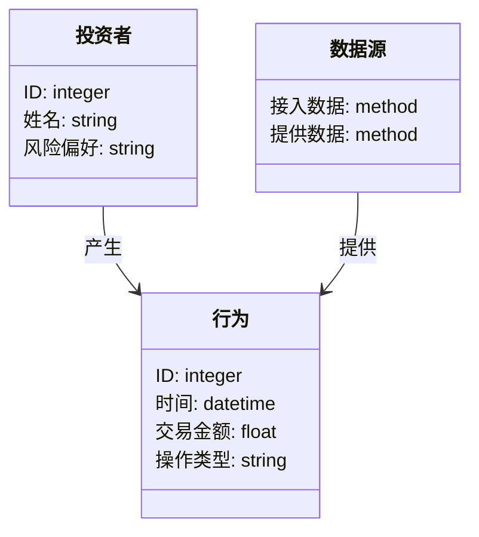
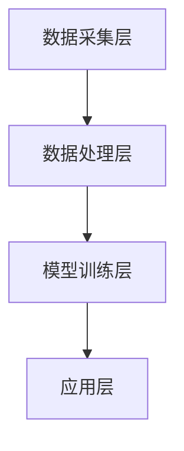
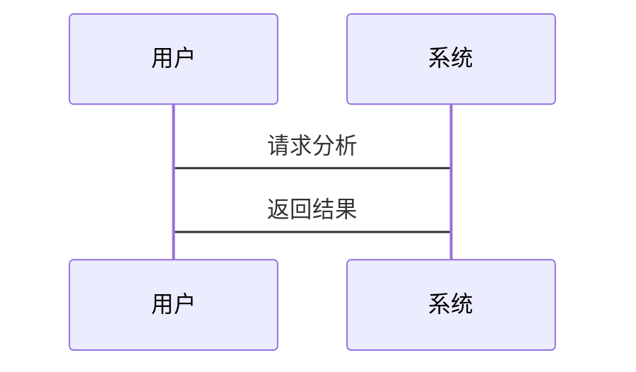

                 


# AI驱动的投资者行为分析平台

> 关键词：投资者行为分析、人工智能、深度学习、时间序列预测、LSTM网络、系统架构设计

> 摘要：本文将详细介绍AI驱动的投资者行为分析平台的构建与实现。首先，我们将从投资者行为分析的基本概念出发，探讨传统分析方法的局限性以及AI技术的应用价值。接着，我们将深入分析基于AI的投资者行为分析模型的核心概念与算法原理，包括LSTM网络和注意力机制在时间序列预测中的应用。随后，我们将从系统架构设计、接口设计等多个维度详细阐述平台的构建过程。最后，通过一个完整的项目实战，我们将展示如何利用Python和深度学习技术实现投资者行为预测，并提供一些实用的开发建议和最佳实践。

---

# 第1章: 投资者行为分析的背景与挑战

## 1.1 投资者行为分析的基本概念

### 1.1.1 投资者行为分析的定义
投资者行为分析是通过对投资者的交易记录、市场反应和心理特征等数据进行建模和分析，以揭示投资者的决策模式和行为特征。这种分析可以帮助投资者、机构和市场研究人员更好地理解市场动态，优化投资策略。

### 1.1.2 投资者行为分析的核心要素
- **交易数据**：包括投资者的买卖时间、交易金额、持仓情况等。
- **市场数据**：如股票价格、指数走势、市场波动性等。
- **投资者特征**：如风险偏好、投资经验、心理特征等。

### 1.1.3 投资者行为分析的边界与外延
投资者行为分析的边界在于其应用场景，既包括个体投资者的行为分析，也包括机构投资者的行为分析。外延则扩展到市场情绪分析、投资策略优化等领域。

---

## 1.2 AI驱动投资者行为分析的背景

### 1.2.1 传统投资者行为分析的局限性
传统的投资者行为分析方法依赖于统计学和经济学模型，但在处理复杂、动态的市场数据时显得力不从心。例如，传统方法难以捕捉非线性关系和复杂的时间序列模式。

### 1.2.2 AI技术在投资者行为分析中的优势
AI技术，尤其是深度学习，能够处理海量的非结构化数据（如新闻、社交媒体数据）和结构化数据（如交易记录），并提取复杂的特征。

### 1.2.3 当前市场对AI驱动投资者行为分析的需求
随着金融市场数据的爆炸式增长，投资者行为分析需要更加高效、智能的工具来应对复杂多变的市场环境。

---

## 1.3 本书的核心目标与价值

### 1.3.1 本书的核心目标
通过结合AI技术与投资者行为分析，构建一个高效、智能的投资者行为分析平台。

### 1.3.2 本书的核心价值
为读者提供一套完整的投资者行为分析解决方案，包括数据采集、模型构建、系统设计和实际应用。

### 1.3.3 本书的结构安排
文章将从理论到实践，逐步讲解投资者行为分析平台的构建过程，包括算法原理、系统架构设计和项目实战。

---

## 1.4 本章小结
本章介绍了投资者行为分析的基本概念、AI技术的应用价值以及本书的核心目标。接下来，我们将深入探讨投资者行为分析模型的核心概念与算法原理。

---

# 第2章: 投资者行为分析模型的核心概念

## 2.1 投资者行为分析模型的分类

### 2.1.1 基于传统统计学的投资者行为分析模型
- **线性回归模型**：用于分析变量之间的线性关系。
- **聚类分析模型**：用于将投资者分成不同的群体。

### 2.1.2 基于机器学习的投资者行为分析模型
- **随机森林模型**：用于分类和回归任务。
- **支持向量机模型**：用于分类任务。

### 2.1.3 基于深度学习的投资者行为分析模型
- **LSTM网络**：用于时间序列预测。
- **Transformer模型**：用于捕捉长距离依赖关系。

---

## 2.2 基于AI的投资者行为分析模型的特点

### 2.2.1 数据驱动的特征
AI模型能够处理海量数据，并从中提取有用的特征。

### 2.2.2 高度个性化的特点
AI模型可以根据投资者的个性化需求进行定制化分析。

### 2.2.3 实时性与动态调整能力
AI模型能够实时更新，以适应市场的动态变化。

---

## 2.3 投资者行为分析模型的核心要素

### 2.3.1 数据来源与特征提取
- **数据来源**：交易数据、市场数据、社交媒体数据等。
- **特征提取**：如情绪特征、交易频率特征等。

### 2.3.2 模型训练与优化
- **训练数据**：用于训练投资者行为分析模型。
- **优化方法**：如交叉验证、超参数调优等。

### 2.3.3 结果解释与应用
- **结果解释**：将模型输出的结果转化为可理解的解释。
- **实际应用**：如投资决策支持、风险预警等。

---

## 2.4 本章小结
本章详细介绍了投资者行为分析模型的分类、特点和核心要素。接下来，我们将深入探讨基于深度学习的投资者行为分析算法。

---

# 第3章: 基于深度学习的投资者行为预测算法

## 3.1 LSTM网络在投资者行为预测中的应用

### 3.1.1 LSTM网络的基本原理
LSTM（长短期记忆网络）是一种特殊的RNN（循环神经网络），能够有效捕捉时间序列中的长期依赖关系。

### 3.1.2 LSTM网络在时间序列预测中的优势
- **长期记忆能力**：能够记住长期的信息。
- **捕捉复杂模式**：适用于非线性时间序列预测。

### 3.1.3 LSTM网络在投资者行为预测中的具体应用
- **股票价格预测**：基于历史交易数据预测股票价格走势。
- **交易行为预测**：预测投资者在特定市场条件下的交易行为。

---

## 3.2 基于注意力机制的投资者行为分析算法

### 3.2.1 注意力机制的基本原理
注意力机制是一种在序列数据中捕捉重要特征的方法，常用于机器翻译和自然语言处理领域。

### 3.2.2 注意力机制在投资者行为分析中的应用
- **序列对齐**：在时间序列数据中对齐重要的事件。
- **特征选择**：自动选择对预测最重要的特征。

### 3.2.3 基于Transformer的投资者行为分析模型
Transformer模型通过自注意力机制，能够捕捉全局特征，适用于复杂的时间序列预测任务。

---

## 3.3 算法实现与优化

### 3.3.1 LSTM网络的实现
使用Python和Keras框架实现LSTM网络，具体代码如下：

```python
from tensorflow.keras.layers import LSTM, Dense, Dropout
from tensorflow.keras.models import Sequential

model = Sequential()
model.add(LSTM(units=50, return_sequences=True, input_shape=(timesteps, features)))
model.add(LSTM(units=50, return_sequences=False))
model.add(Dense(1))
model.compile(optimizer='adam', loss='mean_squared_error')
```

### 3.3.2 Transformer模型的实现
使用PyTorch实现Transformer模型，具体代码如下：

```python
import torch
import torch.nn as nn
import torch.nn.functional as F

class Transformer(nn.Module):
    def __init__(self, d_model, nhead, d_output):
        super(Transformer, self).__init__()
        self.encoder_layer = nn.TransformerEncoderLayer(d_model=d_model, nhead=nhead)
        self.decoder_layer = nn.TransformerDecoderLayer(d_model=d_model, nhead=nhead)
        self.fc = nn.Linear(d_model, d_output)

    def forward(self, x):
        x = self.encoder_layer(x)
        x = self.decoder_layer(x)
        x = self.fc(x)
        return x
```

### 3.3.3 算法优化技巧
- **超参数调优**：如学习率、批量大小的调整。
- **正则化技术**：如L2正则化、Dropout技术。

---

## 3.4 本章小结
本章详细介绍了LSTM网络和Transformer模型在投资者行为预测中的应用，并提供了具体的实现代码和优化技巧。接下来，我们将从系统架构设计的角度，详细介绍投资者行为分析平台的构建过程。

---

# 第4章: 投资者行为分析平台的系统架构设计

## 4.1 问题场景介绍
投资者行为分析平台需要支持多种数据源的接入，包括交易数据、市场数据和社交媒体数据。

## 4.2 系统功能设计

### 4.2.1 领域模型类图


### 4.2.2 系统架构图


### 4.2.3 接口设计
- **数据接口**：用于数据的输入和输出。
- **模型接口**：用于模型的训练和预测。

### 4.2.4 交互流程图


---

## 4.3 本章小结
本章从系统架构设计的角度，详细介绍了投资者行为分析平台的构建过程，包括数据采集、模型训练和系统交互设计。

---

# 第5章: 项目实战与最佳实践

## 5.1 环境搭建与数据采集

### 5.1.1 环境搭建
安装必要的Python库：
```bash
pip install numpy pandas tensorflow keras matplotlib
```

### 5.1.2 数据采集
使用Yahoo Finance API获取股票数据：
```python
import pandas_datareader as pdr
df = pdr.get_data_yahoo("AAPL", start="2020-01-01", end="2023-12-31")
```

---

## 5.2 模型实现与优化

### 5.2.1 数据预处理
将股票数据标准化：
```python
from sklearn.preprocessing import MinMaxScaler

scaler = MinMaxScaler()
data = scaler.fit_transform(df['Close'].values.reshape(-1, 1))
```

### 5.2.2 模型训练
使用LSTM网络训练股票价格预测模型：
```python
from tensorflow.keras.models import Sequential
from tensorflow.keras.layers import LSTM, Dense

model = Sequential()
model.add(LSTM(50, return_sequences=True, input_shape=(timesteps, features)))
model.add(LSTM(50, return_sequences=False))
model.add(Dense(1))
model.compile(optimizer='adam', loss='mean_squared_error')
model.fit(X_train, y_train, epochs=10, batch_size=32)
```

### 5.2.3 模型评估与优化
使用均方误差（MSE）评估模型性能，并通过超参数调优优化模型。

---

## 5.3 项目小结
本章通过一个完整的项目实战，详细讲解了投资者行为分析平台的构建过程。接下来，我们将总结一些开发建议和最佳实践。

---

# 第6章: 最佳实践与总结

## 6.1 开发建议

### 6.1.1 数据质量的重要性
确保数据的完整性和准确性是模型性能的关键。

### 6.1.2 模型调优的必要性
通过交叉验证和超参数调优，可以显著提升模型性能。

### 6.1.3 可扩展性与安全性
确保系统具有良好的可扩展性，并注重数据安全和隐私保护。

---

## 6.2 本章小结
本文详细介绍了AI驱动的投资者行为分析平台的构建与实现，从理论到实践，为读者提供了一套完整的解决方案。

---

# 作者

作者：AI天才研究院 & 禅与计算机程序设计艺术

---

希望这篇文章能满足您的需求！如果需要进一步调整或补充，请随时告诉我。

