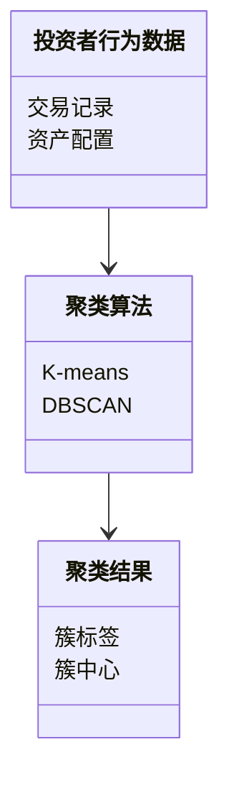

                 


# AI驱动的投资者行为模式聚类

> **关键词**：投资者行为分析、聚类分析、机器学习、投资者画像、AI技术  
> **摘要**：本文通过AI技术，详细探讨了投资者行为模式的聚类分析方法，旨在帮助投资者和金融机构更好地理解和分类投资者行为，优化投资策略和风险管理。

---

## 第一部分：AI驱动的投资者行为模式聚类背景介绍

### 第1章：投资者行为分析的重要性

#### 1.1 问题背景
投资者行为分析是理解市场动态、优化投资策略和风险控制的关键。传统的投资者行为分析依赖于人工观察和统计分析，但随着市场数据的爆炸性增长和投资者行为的复杂性增加，传统方法已难以满足需求。

#### 1.2 问题描述
投资者行为模式多样，包括交易频率、资产选择、风险偏好等。传统方法在处理大规模、高维数据时效率低下，且难以捕捉复杂的行为模式。

#### 1.3 问题解决
AI技术，尤其是聚类分析，能够高效处理海量数据，发现隐藏的行为模式，为投资者和机构提供精准的画像和策略支持。

---

### 第2章：AI驱动的投资者行为模式聚类的核心概念

#### 2.1 聚类分析的基本原理
聚类分析是将数据点分成若干组的过程，使组内数据点相似度高，组间相似度低。常用算法包括K-means和DBSCAN。

#### 2.2 投资者行为模式的特征
投资者行为数据包括交易记录、资产配置、市场反应等。特征提取和处理是聚类分析的基础。

#### 2.3 聚类算法的选择与优化
选择合适的算法取决于数据特性和计算资源。K-means适合球形簇，DBSCAN适合任意形状的簇。

---

### 第3章：投资者行为数据的预处理与特征工程

#### 3.1 数据清洗与预处理
数据清洗包括去重、填充缺失值和异常值处理。预处理如标准化和归一化为后续分析提供基础。

#### 3.2 特征工程
特征工程是提取和选择关键特征，如交易频率、资产波动性等，以提高聚类效果。

---

## 第二部分：算法原理讲解

### 第4章：K-means聚类算法原理

#### 4.1 算法步骤
1. 初始化质心。
2. 计算数据点到质心的距离。
3. 重新计算质心，直到收敛。

#### 4.2 数学模型
目标函数为：
$$
J = \sum_{i=1}^{k} \sum_{x_i \in C_j} (x_i - c_j)^2
$$

#### 4.3 Python实现
```python
from sklearn.cluster import KMeans
# 初始化模型
kmeans = KMeans(n_clusters=3, random_state=0)
# 模型训练
kmeans.fit(X)
# 获取聚类结果
labels = kmeans.labels_
```

### 第5章：DBSCAN聚类算法原理

#### 5.1 算法步骤
1. 寻找ε-邻域内的点。
2. 扩展核心点，形成簇。

#### 5.2 数学模型
使用距离度量，如曼哈顿距离：
$$
d(x,y) = \sum_{i=1}^{n} |x_i - y_i|
$$

#### 5.3 Python实现
```python
from sklearn.cluster import DBSCAN
# 初始化模型
dbscan = DBSCAN(eps=0.5, min_samples=5)
# 模型训练
dbscan.fit(X)
# 获取聚类结果
labels = dbscan.labels_
```

---

## 第三部分：系统分析与架构设计方案

### 第6章：系统功能设计

#### 6.1 领域模型
使用mermaid类图展示投资者行为数据和算法的关系。



### 第7章：系统架构设计

#### 7.1 架构图
```mermaid
archi
    title 投资者行为模式聚类系统架构
    participant 用户
    participant 数据存储
    participant 聚类服务
    participant 结果展示
    用户 --> 聚类服务: 提交数据
    聚类服务 --> 数据存储: 获取数据
    聚类服务 --> 结果展示: 返回结果
```

---

## 第四部分：项目实战

### 第8章：环境安装与代码实现

#### 8.1 环境安装
安装必要的库：
```bash
pip install scikit-learn pandas numpy
```

#### 8.2 代码实现
```python
import pandas as pd
from sklearn.cluster import KMeans
from sklearn.metrics import silhouette_score

# 加载数据
data = pd.read_csv('investor_data.csv')

# 数据预处理
data_processed = data.dropna().iloc[:, 1:-1]

# K-means聚类
kmeans = KMeans(n_clusters=3, random_state=0)
kmeans.fit(data_processed)

# 评估结果
print(silhouette_score(data_processed, kmeans.labels_))
```

### 第9章：案例分析与小结

#### 9.1 案例分析
以某金融平台的交易数据为例，应用K-means和DBSCAN进行聚类，识别出三种交易行为模式：保守型、积极型和激进型投资者。

#### 9.2 小结
通过AI技术实现投资者行为模式聚类，能够帮助企业精准画像投资者，优化服务策略。

---

## 第五部分：总结与展望

### 第10章：最佳实践与注意事项

#### 10.1 最佳实践
选择合适的算法，确保数据质量，定期更新模型。

#### 10.2 注意事项
数据隐私保护，模型调优，避免过拟合。

### 第11章：小结与拓展阅读

总结文章内容，推荐进一步学习深度学习和强化学习在投资行为分析中的应用。

---

## 作者信息

作者：AI天才研究院/AI Genius Institute & 禅与计算机程序设计艺术 /Zen And The Art of Computer Programming

---

通过以上详细结构，本文系统地介绍了AI驱动的投资者行为模式聚类的方法和应用，帮助读者从理论到实践全面掌握相关技术。

