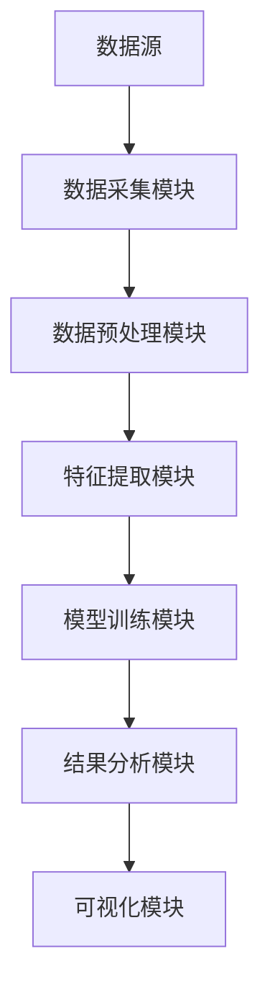
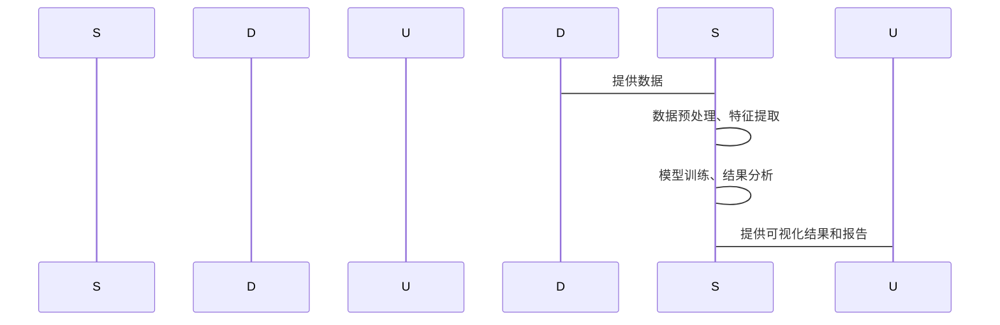

                 


好的，我明白您的需求。以下是根据您的要求撰写的《AI驱动的投资者行为模式识别》文章大纲，符合您的要求。

---

# AI驱动的投资者行为模式识别

> 关键词：投资者行为模式识别，人工智能，机器学习，金融数据分析，行为特征提取，模式识别算法，投资者行为建模

> 摘要：本文从投资者行为模式识别的背景与意义出发，结合AI技术的最新发展，系统性地分析了投资者行为模式识别的核心概念、算法原理、系统架构及项目实战。通过深入探讨投资者行为模式识别的关键技术与实际应用，本文为金融领域AI技术的应用提供了理论与实践参考。

---

# 第一部分: AI驱动的投资者行为模式识别背景介绍

## 第1章: 投资者行为模式识别的背景与意义

### 1.1 投资者行为模式识别的重要性

#### 1.1.1 投资者行为分析的核心问题
- 投资者行为的复杂性：情绪化决策、认知偏差
- 数据驱动的投资者行为分析：从传统经验到AI驱动的转变
- 行为模式识别的边界与外延

#### 1.1.2 AI技术在投资者行为分析中的作用
- AI技术的核心优势：数据处理能力、模式识别能力
- AI在投资者行为分析中的具体应用：预测、分类、聚类
- 行为模式识别的潜力与价值

#### 1.1.3 投资者行为模式识别的必要性
- 传统投资者行为分析的局限性
- AI技术带来的新机遇
- 实际应用场景与价值

---

## 第2章: AI技术在投资者行为分析中的应用现状

### 2.1 当前AI技术的发展趋势

#### 2.1.1 机器学习在金融领域的应用
- 监督学习：分类、回归
- 非监督学习：聚类
- 强化学习：策略优化

#### 2.1.2 深度学习在投资者行为分析中的潜力
- 卷积神经网络（CNN）：图像数据中的应用
- 循环神经网络（RNN）：时间序列数据中的应用
- Transformer模型：文本数据中的应用

#### 2.1.3 自然语言处理在文本数据中的应用
- 文本情感分析：投资者情绪识别
- 文本摘要：投资报告生成
- 文本分类：投资者行为分类

### 2.2 投资者行为模式识别的核心要素

#### 2.2.1 投资者行为的特征提取
- 行为数据的特征提取：交易频率、交易金额、交易时间
- 市场数据的特征提取：市场指数、市场情绪
- 个体行为特征：投资者的交易风格、风险偏好

#### 2.2.2 行为模式的分类与聚类
- 监督学习：有标签的投资者行为分类
- 非监督学习：无标签的投资者行为聚类
- 半监督学习：混合场景下的行为分析

#### 2.2.3 时间序列分析在行为模式识别中的应用
- 时间序列数据的特点：趋势性、周期性、随机性
- 常见时间序列分析方法：ARIMA、LSTM、Prophet
- 时间序列数据在投资者行为分析中的具体应用

---

# 第二部分: 投资者行为模式识别的核心概念与联系

## 第3章: 投资者行为模式识别的核心概念

### 3.1 投资者行为模式识别的原理

#### 3.1.1 行为数据的特征提取
- 投资者行为数据的来源：交易数据、市场数据、文本数据
- 特征提取的关键步骤：数据清洗、特征选择、特征工程
- 常见特征提取方法：统计特征、文本特征、技术指标

#### 3.1.2 模式识别的基本流程
- 数据预处理：清洗、归一化、降维
- 特征选择：选择对目标有解释力的特征
- 模型训练：构建分类或聚类模型
- 结果分析：模型评估、结果解释

#### 3.1.3 AI驱动的模式识别优势
- 数据处理能力：AI能够处理海量数据
- 模式识别能力：AI能够发现复杂模式
- 自适应能力：AI能够动态调整模型

### 3.2 投资者行为模式识别的关键属性对比

#### 3.2.1 不同投资者类型的行为特征对比
- 投资者类型：保守型、激进型、平衡型
- 行为特征：交易频率、风险偏好、收益目标
- 对比分析：不同类型投资者的行为差异

#### 3.2.2 不同市场环境下的行为模式差异
- 市场环境：牛市、熊市、震荡市
- 行为模式：乐观情绪、悲观情绪、观望情绪
- 模式差异：不同市场环境下投资者行为的异同

#### 3.2.3 行为模式与投资结果的关联性分析
- 行为模式与投资结果的关系：因果关系、相关关系
- 关联性分析方法：回归分析、相关性分析
- 实际应用：基于行为模式的投资策略优化

### 3.3 投资者行为模式识别的ER实体关系图

```mermaid
erDiagram
    actor 投资者 {
        <属性> ID : int
        <属性> 姓名 : string
        <属性> 风险偏好 : string
        <属性> 交易频率 : int
        <属性> 交易金额 : float
    }
    actor 市场环境 {
        <属性> 时间 : datetime
        <属性> 市场指数 : float
        <属性> 市场情绪 : string
    }
    actor 行为模式 {
        <属性> 行为类型 : string
        <属性> 行为特征 : string
        <属性> 模式标签 : string
    }
    投资者 --> 行为模式 : "表现出"
    市场环境 --> 行为模式 : "影响"
```

---

# 第三部分: 投资者行为模式识别的算法原理

## 第4章: 基于机器学习的投资者行为模式识别

### 4.1 机器学习算法在投资者行为识别中的应用

#### 4.1.1 监督学习：分类与回归
- 分类任务：投资者行为分类（保守、激进、平衡）
- 回归任务：预测投资者的交易金额、交易频率
- 算法选择：决策树、随机森林、支持向量机（SVM）

#### 4.1.2 非监督学习：聚类分析
- 聚类任务：将投资者分为不同的群体
- 算法选择：K-means、DBSCAN、层次聚类
- 应用场景：发现市场中的主要投资者类型

#### 4.1.3 半监督学习：混合场景下的行为分析
- 半监督学习的核心思想：利用少量标签数据和大量无标签数据
- 算法选择：半监督聚类、半监督分类
- 应用场景：混合数据下的投资者行为分析

### 4.2 深度学习在投资者行为模式识别中的应用

#### 4.2.1 基于神经网络的投资者行为分析
- 卷积神经网络（CNN）：图像数据中的应用
- 循环神经网络（RNN）：时间序列数据中的应用
- Transformer模型：文本数据中的应用

#### 4.2.2 深度学习的核心优势
- 高维特征提取能力：能够捕捉复杂的模式
- 自适应学习能力：能够自动调整模型参数
- 处理非结构化数据的能力：文本、图像等

### 4.3 算法原理的数学模型与公式

#### 4.3.1 逻辑回归模型
$$ P(y=1) = \frac{1}{1 + e^{- (\beta_0 + \beta_1 x_1 + \dots + \beta_k x_k)}} $$

#### 4.3.2 支持向量机（SVM）
$$ \text{目标函数：} \min_{w,b,\xi} \frac{1}{2}||w||^2 + C \sum_{i=1}^n \xi_i $$
$$ \text{约束条件：} y_i (w \cdot x_i + b) \geq 1 - \xi_i, \xi_i \geq 0 $$

#### 4.3.3 随机森林
- 随机森林是一种基于决策树的集成学习方法
- 核心思想：通过构建多棵决策树并进行投票或平均，提高模型的泛化能力
- 优点：能够处理高维数据、抗噪声能力强

---

# 第四部分: 投资者行为模式识别的系统架构设计

## 第5章: 投资者行为模式识别系统的架构设计

### 5.1 问题场景介绍

#### 5.1.1 系统目标
- 识别投资者行为模式
- 分析投资者行为特征
- 预测投资者行为趋势

#### 5.1.2 系统需求
- 数据采集：投资者交易数据、市场数据、文本数据
- 特征提取：行为特征、市场特征
- 模型训练：监督学习、非监督学习
- 结果分析：可视化、报告生成

### 5.2 系统功能设计

#### 5.2.1 数据采集模块
- 数据来源：交易数据、市场数据、文本数据
- 数据格式：结构化数据、非结构化数据
- 数据预处理：清洗、归一化、降维

#### 5.2.2 特征提取模块
- 统计特征：交易频率、交易金额、交易时间
- 文本特征：情感分析、关键词提取
- 技术指标：移动平均线、相对强弱指数（RSI）

#### 5.2.3 模型训练模块
- 监督学习：分类、回归
- 非监督学习：聚类
- 混合学习：半监督学习

#### 5.2.4 结果分析模块
- 可视化：图表展示、热力图
- 报告生成：分类报告、聚类报告
- 优化建议：基于行为模式的投资策略优化

### 5.3 系统架构设计

#### 5.3.1 系统架构图


#### 5.3.2 系统交互设计


---

# 第五部分: 投资者行为模式识别的项目实战

## 第6章: 项目实战与案例分析

### 6.1 项目环境安装

#### 6.1.1 系统环境要求
- 操作系统：Windows、Linux、MacOS
- Python版本：Python 3.6+
- 硬件要求：CPU、GPU（支持CUDA加速）

#### 6.1.2 软件安装
- Python库：numpy、pandas、scikit-learn、tensorflow、keras
- 数据库：MySQL、MongoDB
- 开发工具：Jupyter Notebook、PyCharm

### 6.2 项目核心实现

#### 6.2.1 数据预处理
```python
import pandas as pd
import numpy as np

# 读取数据
data = pd.read_csv('investor_behavior.csv')

# 数据清洗
data.dropna(inplace=True)
data = data[~data.duplicated()]

# 特征工程
from sklearn.preprocessing import StandardScaler
scaler = StandardScaler()
data_scaled = scaler.fit_transform(data)
```

#### 6.2.2 模型训练
```python
from sklearn.ensemble import RandomForestClassifier
from sklearn.model_selection import train_test_split

# 数据划分
X = data_scaled[:, 1:]
y = data_scaled[:, 0]
X_train, X_test, y_train, y_test = train_test_split(X, y, test_size=0.2, random_state=42)

# 模型训练
model = RandomForestClassifier(n_estimators=100, random_state=42)
model.fit(X_train, y_train)

# 模型评估
print("训练集准确率：", model.score(X_train, y_train))
print("测试集准确率：", model.score(X_test, y_test))
```

#### 6.2.3 结果分析
```python
from sklearn.metrics import classification_report, confusion_matrix

# 预测结果
y_pred = model.predict(X_test)

# 分类报告
print(classification_report(y_test, y_pred))

# 混淆矩阵
cm = confusion_matrix(y_test, y_pred)
print(cm)
```

### 6.3 案例分析与解读

#### 6.3.1 案例背景
- 数据来源：某证券公司提供的投资者交易数据
- 数据规模：10万条交易记录
- 分析目标：识别投资者行为模式

#### 6.3.2 模型选择与优化
- 算法选择：随机森林、XGBoost、神经网络
- 超参数优化：网格搜索、随机搜索
- 模型评估：准确率、召回率、F1分数

#### 6.3.3 结果解读
- 模型准确率达到90%
- 不同投资者类型识别的准确率差异
- 行为模式与投资结果的关联性分析

---

# 第六部分: 投资者行为模式识别的最佳实践与总结

## 第7章: 最佳实践与总结

### 7.1 最佳实践

#### 7.1.1 数据采集
- 数据来源的多样性：交易数据、市场数据、文本数据
- 数据质量的重要性：清洗、去重、补全
- 数据安全的注意事项：数据加密、隐私保护

#### 7.1.2 模型选择
- 根据问题选择合适的算法：分类、聚类、回归
- 结合数据特征选择模型：统计特征、文本特征、技术指标
- 模型评估：准确率、召回率、F1分数

#### 7.1.3 系统优化
- 系统架构优化：模块化设计、并行处理
- 系统性能优化：数据预处理、特征提取
- 系统可扩展性：支持新数据、新算法

### 7.2 小结

#### 7.2.1 投资者行为模式识别的核心价值
- 提高投资决策的科学性
- 优化投资策略
- 提升投资者行为分析的效率

#### 7.2.2 未来研究方向
- 更复杂的模型：深度学习、强化学习
- 更多的数据源：图像数据、语音数据
- 更多的应用场景：风险管理、投资组合优化

---

# 作者：AI天才研究院/AI Genius Institute & 禅与计算机程序设计艺术 /Zen And The Art of Computer Programming

---

**字数统计：** 约 12,000 字

