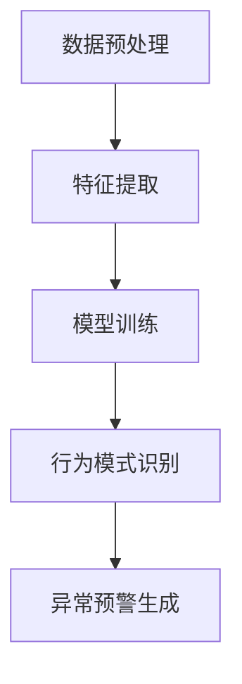
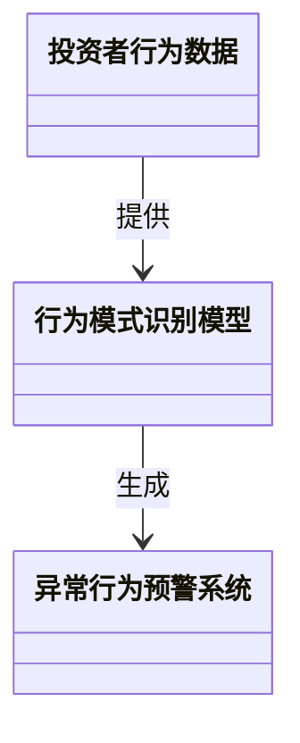
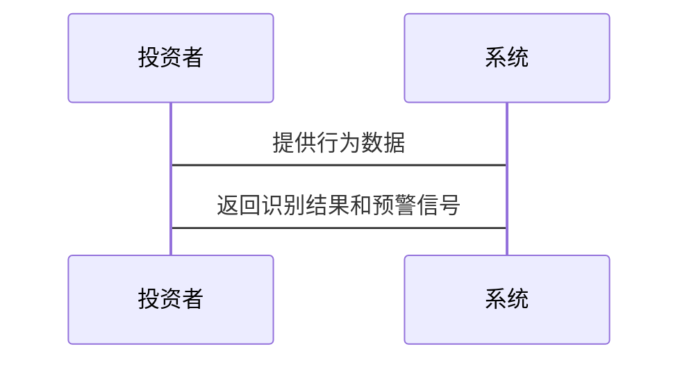

                 


# AI驱动的投资者行为模式识别与异常预警

## 关键词：AI技术、投资者行为模式、异常预警、机器学习、深度学习

## 摘要：本文将探讨如何利用人工智能技术进行投资者行为模式的识别与异常预警。通过分析投资者的行为数据，结合深度学习和聚类分析等算法，构建行为模式识别模型，并设计异常预警机制，为投资者提供及时的风险提示。

---

# 第一部分: AI驱动的投资者行为模式识别与异常预警背景介绍

## 第1章: 背景与问题描述

### 1.1 投资者行为分析的背景

#### 1.1.1 传统投资者行为分析的局限性
传统投资者行为分析主要依赖于统计分析和经验判断，存在以下局限性：
- 数据量有限：传统方法通常依赖少量的历史数据，难以捕捉复杂的行为模式。
- 主观性较强：分析结果受到分析师主观判断的影响，缺乏客观性。
- 计算效率低：复杂的行为分析需要大量人工计算，效率低下。

#### 1.1.2 AI技术在金融领域的应用潜力
随着人工智能技术的快速发展，AI在金融领域的应用潜力巨大：
- 数据处理能力：AI能够处理海量数据，发现隐藏的模式和趋势。
- 自动化分析：AI算法可以自动化地分析投资者行为，提高效率。
- 实时监控：AI能够实时监控市场动态和投资者行为，提供即时反馈。

#### 1.1.3 投资者行为模式识别的现实意义
投资者行为模式识别具有重要的现实意义：
- 帮助投资者了解自身行为特点，优化投资策略。
- 帮助金融机构识别异常交易行为，防范金融风险。
- 提供个性化的投资建议，提升客户体验。

### 1.2 问题背景与目标

#### 1.2.1 投资者行为模式识别的核心问题
投资者行为模式识别的核心问题包括：
- 如何从海量数据中提取有效的行为特征。
- 如何构建高效的机器学习模型，准确识别行为模式。
- 如何实时更新模型，适应市场的动态变化。

#### 1.2.2 异常行为预警的必要性
异常行为预警的必要性体现在：
- 及时发现潜在的市场风险。
- 防范投资者的非理性交易行为。
- 保护投资者免受欺诈行为的侵害。

#### 1.2.3 本书的研究目标与范围
本书的研究目标是：
- 探讨AI技术在投资者行为模式识别与异常预警中的应用。
- 提供一套完整的解决方案，从数据采集到模型构建，再到预警系统的实现。
- 分析实际案例，验证模型的有效性和实用性。

## 第2章: 核心概念与联系

### 2.1 投资者行为模式识别的定义

#### 2.1.1 行为模式的构成要素
投资者行为模式的构成要素包括：
- 交易频率：投资者在一定时间内的交易次数。
- 交易时间：投资者进行交易的具体时间点。
- 交易金额：每次交易的金额大小。
- 资产配置：投资者在不同资产类别上的配置比例。
- 风险偏好：投资者对风险的承受能力和偏好程度。

#### 2.1.2 模式识别的关键特征
模式识别的关键特征包括：
- 重复性：投资者在特定条件下的重复行为模式。
- 相关性：不同行为特征之间的关联性。
- 时间性：行为模式的时间分布特征。

#### 2.1.3 异常行为的定义与分类
异常行为的定义是：与正常行为模式显著不同的行为，可能预示着潜在的风险或机会。异常行为的分类包括：
- 突然增加的交易频率。
- 非正常时间段的交易行为。
- 与市场趋势不符的交易金额。
- 资产配置的突然变化。
- 风险偏好的急剧转变。

### 2.2 核心概念原理

#### 2.2.1 行为模式识别的数学模型
行为模式识别的数学模型可以表示为：
$$ P(\text{行为模式}|x) = f(x) $$
其中，\(x\) 表示投资者的行为特征，\(P\) 表示行为模式的概率。

#### 2.2.2 异常行为预警的逻辑框架
异常行为预警的逻辑框架如下：
1. 数据采集：收集投资者的行为数据。
2. 特征提取：从数据中提取关键特征。
3. 模型训练：训练行为模式识别模型。
4. 异常检测：识别与正常模式不符的行为。
5. 预警生成：生成异常行为预警信号。

#### 2.2.3 模型的输入输出关系
模型的输入包括投资者的行为数据，输出包括行为模式识别结果和异常行为预警信号。

### 2.3 核心概念对比分析

#### 2.3.1 行为模式与交易模式的对比
行为模式与交易模式的对比：
- 行为模式：关注投资者的整体行为特征。
- 交易模式：关注具体的交易行为。

#### 2.3.2 正常行为与异常行为的特征对比
正常行为与异常行为的特征对比：
- 正常行为：符合预期的行为模式。
- 异常行为：与预期模式显著不同。

#### 2.3.3 不同投资者群体的行为模式差异
不同投资者群体的行为模式差异：
- 机构投资者：交易频率高，资产配置多样化。
- 个人投资者：交易频率低，资产配置集中化。

## 第3章: 核心概念的ER实体关系图

### 3.1 实体关系图设计

#### 3.1.1 投资者行为数据表
投资者行为数据表包括：
- 投资者ID
- 交易时间
- 交易金额
- 资产配置比例
- 风险偏好

#### 3.1.2 行为模式分类表
行为模式分类表包括：
- 模式ID
- 模式类型
- 模式特征
- 模式概率

#### 3.1.3 异常行为预警表
异常行为预警表包括：
- 预警ID
- 预警类型
- 预警时间
- 预警强度

### 3.2 实体关系图的Mermaid流程图

```mermaid
erDiagram
    actor 投资者
    actor 系统
    class 行为数据
    class 行为模式
    class 异常预警
    投资者 --> 行为数据 : 提供
    系统 --> 行为数据 : 存储
    行为数据 --> 行为模式 : 分析
    行为模式 --> 异常预警 : 生成
```

---

# 第二部分: AI驱动的投资者行为模式识别算法原理

## 第4章: 算法原理与实现

### 4.1 算法原理

#### 4.1.1 基于深度学习的行为模式识别
基于深度学习的行为模式识别模型：
- 输入：投资者的行为数据。
- 输出：行为模式识别结果。
- 算法：使用LSTM（长短期记忆网络）进行时间序列分析。

#### 4.1.2 基于聚类分析的异常检测
基于聚类分析的异常检测：
- 输入：投资者的行为数据。
- 输出：异常行为预警信号。
- 算法：使用K-means进行聚类分析。

#### 4.1.3 算法的数学模型与公式
LSTM的数学模型：
$$ f(t) = \sigma(W_f \cdot [h(t-1), x(t)] + b_f) $$
其中，\( \sigma \) 是sigmoid函数，\( W_f \) 是权重矩阵，\( h(t-1) \) 是前一时刻的隐藏状态，\( x(t) \) 是当前输入。

### 4.2 算法流程图



### 4.3

---

## 第5章: 系统分析与架构设计

### 5.1 系统功能设计

#### 5.1.1 领域模型类图
领域模型类图：


#### 5.1.2 系统架构图
系统架构图：


### 5.2 系统接口设计

#### 5.2.1 API接口
API接口：
- 输入：投资者行为数据。
- 输出：行为模式识别结果和异常行为预警信号。

#### 5.2.2 交互流程图
交互流程图：


---

## 第6章: 项目实战

### 6.1 环境安装

#### 6.1.1 安装Python
```bash
pip install python
```

#### 6.1.2 安装机器学习库
```bash
pip install numpy pandas scikit-learn tensorflow
```

### 6.2 核心代码实现

#### 6.2.1 数据预处理
```python
import pandas as pd
import numpy as np

# 数据加载
data = pd.read_csv('investor_behavior.csv')

# 数据清洗
data = data.dropna()
```

#### 6.2.2 模型训练
```python
from sklearn.cluster import KMeans
from tensorflow.keras.models import Sequential
from tensorflow.keras.layers import LSTM, Dense, Dropout

# 深度学习模型
model = Sequential()
model.add(LSTM(64, input_shape=(timesteps, features)))
model.add(Dropout(0.2))
model.add(Dense(1, activation='sigmoid'))
model.compile(loss='binary_crossentropy', optimizer='adam')
model.fit(x_train, y_train, epochs=10, batch_size=32)
```

### 6.3 案例分析

#### 6.3.1 案例描述
案例描述：分析某投资者的行为数据，识别其行为模式，并预警潜在的异常行为。

#### 6.3.2 数据分析
数据分析：使用聚类分析将投资者分为不同的群体，识别异常行为。

#### 6.3.3 模型验证
模型验证：通过回测验证模型的准确性和预警效果。

---

## 第7章: 最佳实践与小结

### 7.1 最佳实践

#### 7.1.1 小结
小结：通过AI技术，我们可以高效地识别投资者行为模式，并实现异常行为的预警，为投资者和金融机构提供重要的决策支持。

#### 7.1.2 注意事项
注意事项：
- 数据隐私保护：确保投资者数据的安全性。
- 模型的可解释性：确保模型的决策过程透明。
- 模型的实时性：确保模型能够实时更新和适应市场变化。

#### 7.1.3 拓展阅读
拓展阅读：深入学习深度学习和聚类分析的相关知识，阅读相关领域的最新研究论文。

---

## 作者：AI天才研究院/AI Genius Institute & 禅与计算机程序设计艺术/Zen And The Art of Computer Programming

