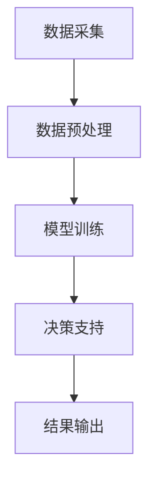
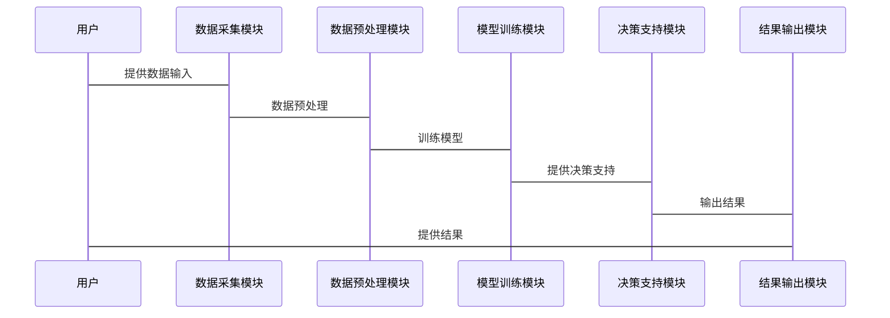

                 


# AI驱动的政策影响预测：价值投资中的多智能体应用

## 关键词：AI, 政策影响预测, 多智能体, 价值投资, 系统架构, 项目实战

## 摘要：  
本文深入探讨了人工智能在政策影响预测中的应用，特别是通过多智能体系统在价值投资中的实际应用。从背景介绍、核心概念到系统架构设计和项目实战，全面解析了如何利用AI技术进行政策影响预测，并在价值投资中实现多智能体协作。文章结合了丰富的理论知识和实际案例，详细分析了多智能体系统的通信与协作机制、数学模型构建以及系统架构设计，为读者提供了从理论到实践的完整指南。

---

## 第1章: 政策影响预测的背景与挑战

### 1.1 政策影响预测的定义与重要性  
政策影响预测是指通过分析政策的实施背景、目标和潜在效果，预测政策对社会、经济或其他领域可能产生的影响。其重要性体现在以下几个方面：  
1. **辅助决策**：帮助政府和企业在制定政策时考虑其可能的后果，降低风险。  
2. **优化资源配置**：通过预测政策效果，合理分配资源，提升效率。  
3. **提升透明度**：政策影响预测可以帮助公众更好地理解政策，增强政策的透明性和公信力。  

#### 1.1.3 政策影响预测的边界与外延  
政策影响预测的边界包括政策实施的具体领域（如经济、社会）和时间范围（短期、中期、长期）。其外延则涉及政策与其他因素（如市场波动、国际环境）的交互作用。

### 1.2 政策影响预测的核心要素  
政策影响预测的核心要素包括政策背景分析、政策目标与实施路径，以及政策效果的评估指标。  

#### 1.2.1 政策背景分析  
政策背景分析需要考虑政策的实施背景，包括经济环境、社会环境和技术环境等因素。例如，当前全球经济的不确定性增加了政策预测的复杂性。  

#### 1.2.2 政策目标与实施路径  
政策目标是政策的核心，而实施路径则决定了政策的执行方式。例如，一项环保政策的目标可能是减少碳排放，实施路径可能包括税收优惠、技术补贴等。  

#### 1.2.3 政策效果的评估指标  
政策效果的评估指标通常包括经济效益、社会效益和环境效益。例如，政策对GDP增长的影响、就业率的变化等都是重要的评估指标。  

---

## 第2章: 多智能体系统的核心原理  

### 2.1 多智能体系统的基本概念  
多智能体系统（Multi-Agent System, MAS）是指由多个智能体组成的系统，这些智能体能够通过交互和协作完成特定任务。  

#### 2.1.1 多智能体系统的定义  
多智能体系统由多个具有自主性、反应性和协作性的智能体组成，这些智能体能够通过通信和协作完成复杂任务。  

#### 2.1.2 多智能体系统的组成要素  
1. **智能体**：具有感知环境、做出决策和执行动作的能力。  
2. **通信机制**：智能体之间通过通信机制交换信息。  
3. **协作协议**：智能体之间的协作规则。  

#### 2.1.3 多智能体系统与单智能体系统的区别  
多智能体系统的复杂性更高，但能够通过协作实现更强大的功能。例如，单智能体系统可能只能完成简单的任务，而多智能体系统可以完成复杂的群体任务。  

### 2.2 多智能体系统的通信与协作  

#### 2.2.1 多智能体系统中的通信机制  
通信机制是多智能体系统的核心，包括消息传递、广播和点对点通信等方式。  

#### 2.2.2 多智能体系统中的协作算法  
协作算法包括基于规则的协作、基于博弈论的协作和基于机器学习的协作。  

#### 2.2.3 多智能体系统的同步与协调  
同步与协调是确保智能体协作的关键，通常通过时间同步、状态同步和任务同步实现。  

---

## 第3章: 政策影响预测的数学模型  

### 3.1 政策影响预测的统计模型  

#### 3.1.1 线性回归模型  
线性回归模型是政策影响预测中常用的统计模型，用于分析变量之间的线性关系。例如，可以使用线性回归模型预测政策对GDP的影响。  

$$ y = \beta_0 + \beta_1x_1 + \beta_2x_2 + \dots + \beta_nx_n $$  

#### 3.1.2 贝叶斯网络模型  
贝叶斯网络模型是一种概率图模型，能够表示变量之间的概率关系。例如，可以使用贝叶斯网络模型预测政策对某一行业的影响。  

#### 3.1.3 时间序列分析模型  
时间序列分析模型用于分析数据的时间依赖性。例如，可以使用ARIMA模型预测政策对经济的影响。  

### 3.2 多智能体系统的数学建模  

#### 3.2.1 多智能体系统的行为模型  
行为模型描述了智能体的行为方式，例如基于规则的行为模型和基于目标的行为模型。  

#### 3.2.2 多智能体系统的状态空间模型  
状态空间模型描述了智能体的状态和动作之间的关系。例如，可以使用马尔可夫决策过程（MDP）建模智能体的决策过程。  

$$ V(s) = \max_{a} [ r(s,a) + \gamma V(s') ] $$  

#### 3.2.3 多智能体系统的决策模型  
决策模型描述了智能体如何在多智能体环境中做出决策。例如，可以使用纳什均衡模型分析多智能体的博弈过程。  

---

## 第4章: 价值投资中的多智能体应用  

### 4.1 价值投资的基本原理  

#### 4.1.1 价值投资的定义  
价值投资是一种投资策略，通过分析公司的基本面，寻找被市场低估的投资标的。  

#### 4.1.2 价值投资的核心策略  
价值投资的核心策略包括基本面分析、估值分析和风险控制。  

#### 4.1.3 价值投资的市场分析方法  
市场分析方法包括行业分析、公司分析和宏观经济分析。  

### 4.2 多智能体在价值投资中的应用  

#### 4.2.1 多智能体系统的市场分析  
多智能体系统可以对市场进行实时监控和分析，识别市场趋势和潜在风险。  

#### 4.2.2 多智能体系统的投资决策  
多智能体系统可以通过协作实现投资决策的优化。例如，一个智能体可以负责市场分析，另一个智能体可以负责风险评估。  

#### 4.2.3 多智能体系统的风险管理  
多智能体系统可以通过协作实现风险管理的优化。例如，可以通过分布式风险评估和实时监控降低投资风险。  

---

## 第5章: 系统分析与架构设计  

### 5.1 系统分析  

#### 5.1.1 问题场景介绍  
系统需要解决的问题包括政策影响预测的不确定性、多智能体协作的复杂性以及价值投资的风险控制。  

#### 5.1.2 项目介绍  
本项目旨在通过多智能体系统实现政策影响预测，并在价值投资中进行应用。  

#### 5.1.3 系统功能设计  
系统功能包括数据采集、模型训练、决策支持和结果输出。  

### 5.2 系统架构设计  

#### 5.2.1 系统架构图（Mermaid）  



#### 5.2.2 系统接口设计  
系统接口包括数据接口、模型接口和用户接口。  

#### 5.2.3 系统交互流程  



---

## 第6章: 项目实战  

### 6.1 环境安装与配置  

#### 6.1.1 开发环境选择  
推荐使用Python和相关框架（如TensorFlow、Keras）进行开发。  

#### 6.1.2 依赖库安装  
需要安装的依赖库包括numpy、pandas、scikit-learn、tensorflow等。  

#### 6.1.3 系统配置  
配置运行环境，包括硬件配置和软件配置。  

### 6.2 核心算法实现  

#### 6.2.1 数据预处理代码  
```python
import pandas as pd
import numpy as np

# 数据加载
data = pd.read_csv('policy_data.csv')

# 数据清洗
data.dropna(inplace=True)
data = data.drop_duplicates()

# 特征工程
data['target'] = data['target'].astype(int)
```

#### 6.2.2 模型训练代码  
```python
from tensorflow.keras import layers

# 模型定义
model = tf.keras.Sequential([
    layers.Dense(64, activation='relu'),
    layers.Dense(1, activation='sigmoid')
])

# 模型训练
model.compile(optimizer='adam', loss='binary_crossentropy', metrics=['accuracy'])
model.fit(data, labels, epochs=10, batch_size=32)
```

#### 6.2.3 结果输出代码  
```python
# 结果输出
predictions = model.predict(test_data)
print(predictions)
```

### 6.3 案例分析与解读  

#### 6.3.1 实际案例分析  
以某项环保政策为例，分析政策对某一行业的影响。  

#### 6.3.2 代码应用解读  
解读上述代码的运行过程和结果。  

---

## 第7章: 总结与展望  

### 7.1 总结  
本文详细介绍了AI驱动的政策影响预测，特别是多智能体系统在价值投资中的应用。通过理论分析和实践案例，展示了多智能体系统在政策影响预测中的优势和潜力。  

### 7.2 展望  
未来，随着AI技术的不断发展，政策影响预测和价值投资的多智能体应用将更加智能化和精准化。  

---

## 作者：AI天才研究院/AI Genius Institute & 禅与计算机程序设计艺术 /Zen And The Art of Computer Programming  

---

以上是文章的完整目录和部分正文内容，涵盖了从背景介绍到系统架构设计，再到项目实战的完整流程。希望这篇文章能够为读者提供清晰的思路和实用的知识。

